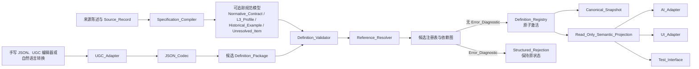
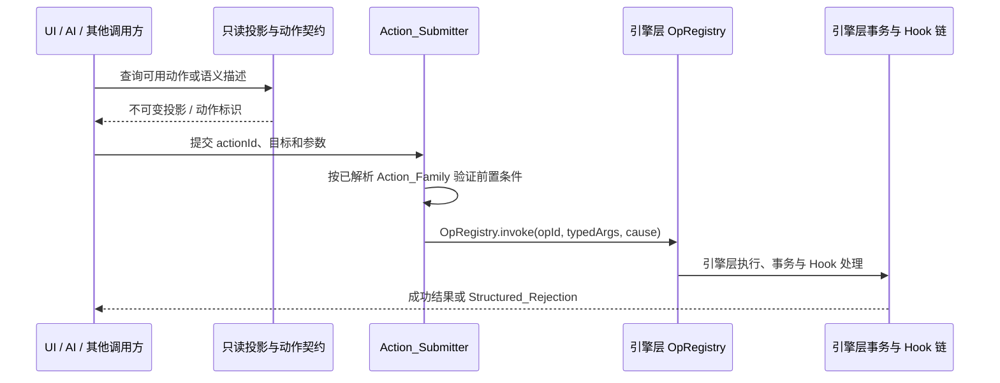
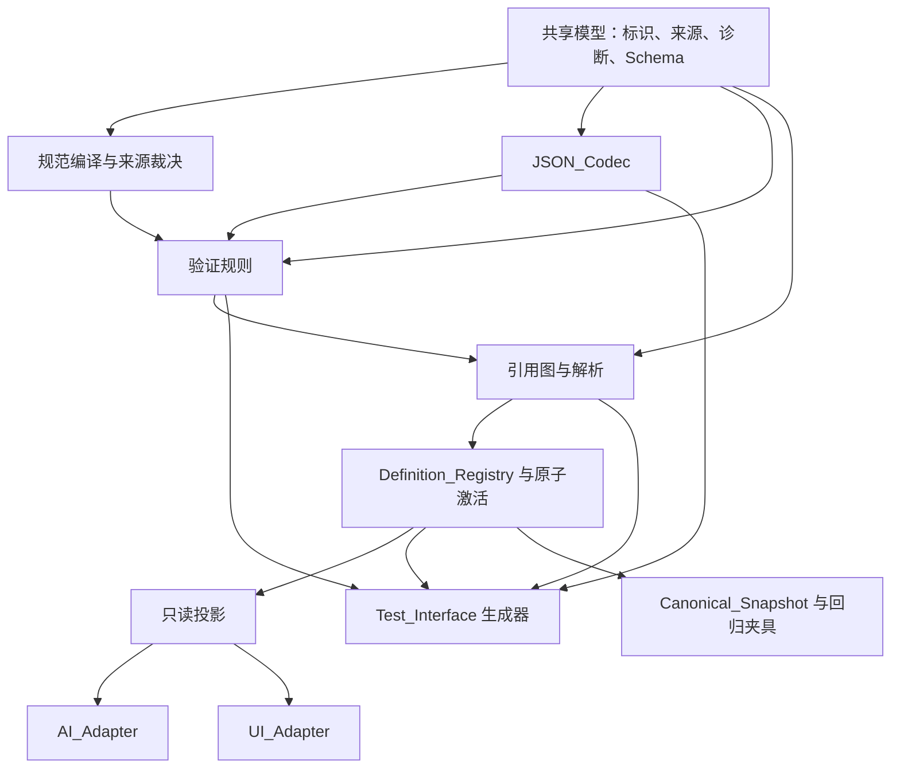

# 基类层规范设计

## Overview

本设计实现 `requirements.md` 所定义的基类层规范：将引擎层的通用原语约束为可枚举、可组合且不含具体玩法语义的语义最小单元，并登记可复用、无玩法数值和具体玩法规则的实例。基类层只负责语义类型、继承和组合契约、参数 Schema、声明式定义、验证、引用完整性、包的原子激活以及只读适配接口；具体玩法规则、胜负条件、地图排布、生成分布和玩家可见具体数值均归玩法层。

基类判定必须同时满足：**可枚举**、**可组合**、**不含具体玩法语义**。满足三判据的新概念可作为可扩展注册的语义族，并须记录分类理由与来源；不满足者由验证器拒绝为基类层定义并指出其玩法层归属。已知语义族只是初始登记项，不构成封闭枚举。`霰弹枪`属于“枪械类型 + 散射谱型 + 枪械伤害接口”等基类的组合实例，而非基类；其伤害等具体赋值必须由玩法层提供。

设计以 `requirements.md` 为唯一需求基线。来源裁决实现该文档规定的优先级与保留冲突机制；不会添加来源未支持的字符长度、容量、文件大小、测试次数或其他实现常量。下列 L0 约束通过类型和验证入口保留：玩家可见的具体数值属于玩法层且必须在 1–5；内部度量使用独立分类；微型场景附属于天然场景；天然场景节点连接数不超过 5。

### 范围与非目标

- 基类层**不**重新实现 Ref 前缀、事务、表达式求值、持久化、随机流、Hook 调度或运行时状态机；这些是引擎层职责。
- 基类层**不**自行派发写操作。任何经语义定义允许的运行时写请求最终只能调用引擎层 `OpRegistry.invoke`。
- AI 与 UI 只能使用受授权范围限制的只读语义投影；它们没有语义状态写权限。
- 基类层不选择渲染、动画、传输或搜索算法，也不把具名武器、地图、NPC 或历史示例提升为默认定义。
- D-006（三种网关）和 D-019（纯声明式 JSON）为基类层契约。D-007 的体力上限、D-008 的同分顺序、D-030 的乘员交互、访谈记录中的 D-009 与 D-010 玩法条目均通过接口供玩法层配置，而不是本层默认规则。

### 已知待确认事项

以下事项仅被来源追踪系统记录为 `Unresolved_Item` 或等待确认项；本设计不推导其机制、具体参数或默认行为：

| 编号 | 等待确认项 | 当前设计处理 |
|---|---|---|
| Q-01 | 武器谱型中“特殊”档的机制框架 | 只保留可扩展谱型引用与验证接口 |
| Q-02 | 远程武器两步与枪械一步的并列表述 | 只保留动作序列与动作类别 Schema |
| Q-03 | 枪械伤害表与 AP 经济学的平衡验证 | 伤害、成本与平衡赋值归玩法层 |
| Q-04 | 载具内部微型场景与外部交互点边界 | 只保留车辆邻接、门引用和微型场景父级契约 |
| Q-05 | 盾牌标配范围 | 只保留防具、动作和能力组合接口 |

## Architecture

### 边界与总体拓扑



编译、候选验证、解析和注册表激活是不同责任：编译器裁决来源地位但不创建运行时机制；编码器保持声明式数据并规范化；验证器判定层级、类型、参数和不变量；解析器建立类型化引用图；注册表在完整通过后才替换活动集。任何失败均不能泄漏候选定义到活动注册表。

### 运行时写入边界



`Action_Submitter` 只将已验证的语义动作映射为其定义所引用的结构化 Op 请求；它不解释 Op、不开启事务、不计算 Expr，也不拥有备用写通道。适配器、描述符、投影和测试观察器均不可取得写能力。引擎层 Hook 接线缺口是接入真实动作链的前置条件：当某一动作的引擎层契约需要 Hook 时，相关包或运行时请求必须在接线未可用时被拒绝并保持原语义状态；基类层不得用本地分发器代替该能力。

### 模块依赖 DAG 与并行实施批次



| 批次 | 可并行模块 | 交付契约 | 串行门禁 |
|---|---|---|---|
| A | 共享模型；来源编译；JSON 编码器 | 冻结的数据模型、错误结果形状、规范化输入输出 | 三者以共享模型接口编译并完成契约测试 |
| B | 验证规则；引用解析；测试生成器骨架 | `Validation_Result`、类型化引用图、生成与观察接口 | 必须消费批次 A 的 Schema，不能自行定义语义字段 |
| C | 注册表原子激活；快照；只读投影 | 候选到活动状态的单一提交边界、不可变投影 | 解析、诊断排序和回滚契约全部通过 |
| D | AI 适配；UI 适配；端到端与故障注入测试 | 只读消费与同一动作提交契约 | 引擎层 `OpRegistry.invoke` 可用，且依赖 Hook 的路径完成接线验证 |

不同执行者可在每一批内独立推进，但不得跨越前一批的接口门禁。所有批次共享同一 Schema、诊断目录、确定性排序规则和 Canonical_Snapshot 格式；集成时先执行跨模块契约测试，再允许端到端装载。任何门禁失败阻止后续批次宣称集成完成。

## Components and Interfaces

以下签名为语言无关的实现契约；其中 `Result<T>` 要么返回值，要么返回带至少一个 `Error_Diagnostic` 的 `Structured_Rejection`。所有集合的外部可观察顺序使用规范化排序，排序键来自语义标识、路径和来源定位，而非宿主语言的散列表迭代顺序。

### Specification_Compiler

```text
compile(records: readonly Source_Record[]): Result<Compiled_Specification>
classify(statement: Source_Statement, evidence: readonly Source_Record[]): Source_Classification
resolveConflict(statements: readonly Source_Statement[]): Normative_Contract | Unresolved_Item
```

编译器按已定义优先级选择跨优先级冲突中的高优先级陈述，为被替代项产生诊断；同优先级实质冲突保留所有陈述为一个 `Unresolved_Item` 并阻断受影响契约。D-009 与 D-010 的编号复用保持独立 `Source_Record` 并产生追踪诊断，不能按编号合并。每个规范性契约必须可回溯到至少一个权威来源或明确冲突裁决记录。

### JSON_Codec 与 UGC_Adapter

```text
parse(input: string, source: Source_Location): Result<Candidate_Definition>
canonicalize(definition: Candidate_Definition): Result<Canonical_JSON>
parseCanonical(json: Canonical_JSON): Result<Equivalent_Definition>
fromUGC(input: UGC_Input): Result<Candidate_Declarative_JSON>
```

编码器只接受带显式版本的纯声明式 JSON，拒绝可执行代码、动态求值、命令式循环和变量赋值。语法有效的输入必须原样保留语义字段供验证器审查；语义字段缺失或损坏不能补造。表现字段可在类型兼容前提下显式降级，并附带 Warning_Diagnostic。UGC 适配器只输出候选声明式 JSON，并无条件复用手写 JSON 的同一解析和验证路径。

### Definition_Validator

```text
validatePackage(candidate: Definition_Package, context: Validation_Context): Validation_Result
validateClassification(definition: Candidate_Definition): readonly Diagnostic[]
validateSchema(definition: Candidate_Definition, schema: Parameter_Schema): readonly Diagnostic[]
validateRuntime(request: Action_Request, state: Read_Only_Semantic_Projection): Result<Validated_Op_Request>
```

验证器检查唯一标识、合法 Def kind、抽象状态、语义族、继承类型差异、组合、参数分类、层级边界、来源支撑、数值归属、术语、引用和引擎层不变量。它收集可确定发现的全部错误，并稳定排序输出；不能进行静默语义修复。具体玩法数值只能由玩法层配置：玩家可见值检查 1–5；内部度量改用其声明 Schema；没有 `Gameplay_Value`、`Structural_Bound`、`Constitutional_Constant` 或 `Internal_Metric` 分类的数值字段一律拒绝。

### Reference_Resolver

```text
buildGraph(candidate: Definition_Package, active: Active_Registry): Result<Reference_Graph>
resolve(definitionId: Definition_Id, graph: Reference_Graph): Result<Resolved_Definition>
revalidateDependents(changed: readonly Definition_Id[], graph: Reference_Graph): Validation_Result
```

解析器在激活前解析每个基类、动作、规则、表达式、策略、空间、物品、附件、容器与槽位引用，并验证预期 Def kind 或语义族。它在图上报告循环、悬空和不兼容引用以及每个参与者；嵌套组合先于容器定义完成解析。覆盖和删除先纳入候选图，重新验证全部入边依赖，然后才能交给注册表。

### Definition_Registry 与运行时提交接口

```text
activate(candidate: Definition_Package, active: Active_Registry): Result<Activation_Result>
query(id: Definition_Id): Result<Read_Only_Resolved_Definition>
snapshot(): Canonical_Snapshot
submit(request: Action_Request, actor: Caller_Context): Result<Op_Result>
```

`activate` 以候选图为工作副本：只有全部验证与解析通过，才作为一个原子变更发布新的活动注册表；任一 Error_Diagnostic 都发布零个候选变更。删除必须在同一候选变更中消除或重定向全部入边。`submit` 将调用方、动作和目标解析为已验证的 `Validated_Op_Request`，随后仅调用 `OpRegistry.invoke`；前置条件、网关条件或引擎层不变量不满足时返回 Structured_Rejection 并保留请求前或事务前语义状态。

### Read_Only_Semantic_Projection、AI_Adapter 与 UI_Adapter

```text
project(scope: Authorization_Scope): Read_Only_Semantic_Projection
aiView(policy: AI_Policy_Id, scope: Authorization_Scope): Result<AI_Semantic_View>
uiDescriptor(query: UI_Query, scope: Authorization_Scope): Result<Presentation_Descriptor>
```

投影从已验证定义和运行时状态派生，按授权的认知与可见范围裁剪，并以深度不可变值返回。AI 使用引擎层的 policy、query、belief-slice、visibility、evaluation-guard 和确定性随机接口，但不重定义它们；玩家辅助和 NPC 行为策略类别不兼容。UI 描述符暴露资源语义角色、交互意图、姿态、成本类别、可用性、不可用原因、无障碍标签和素材引用；HP、体力、AP，及移动、精确交互、敌对交互、可执行目标均为独立语义值。二者提交动作时都复用 `submit`，从而走相同验证和 `OpRegistry.invoke` 通道。

> **2026-08-08 权威变更（本次会话裁决，已获项目所有者授权）**：本段原描述包含"攻击形状"，已删除。
> 攻击形状（含 single-target/spread/area 三选一形状轴）判定为冗余设计，其功能已被武器属性
> （散射/扫射/连发）完全覆盖。详见 `docs/L0_规范宪法.md`、`docs/L2_基类层/基类层定义.md` §4.3
> 最新权威内容。

### Test_Interface

```text
generate(family: Semantic_Family_Id, validity: Validity): Arbitrary<Candidate_Definition>
observe(operation: Observable_Operation, input: unknown): Observable_Result
withFault(fault: Fault_Specification, operation: () => Result<unknown>): Result<unknown>
```

测试接口为每个已登记语义族提供有效与无效定义生成、独立操作观察、活动注册表与快照观察及受控故障注入。它只能观察或经统一入口提交候选与动作，不能绕过验证、解析或写入通道。

## Data Models

```text
Source_Record {
  sourceFile: Source_File_Id
  sourceLocation: Source_Location
  precedence: Source_Precedence
  decisionId?: Decision_Id
  classification: Normative_Contract | L3_Profile | Historical_Example | Unresolved_Item
  owningLayer: 引擎层 | 基类层 | 玩法层
  statementFingerprint: Stable_Fingerprint
}

Diagnostic {
  code: Stable_Diagnostic_Code
  severity: Error | Warning
  definitionId?: Definition_Id
  jsonPath?: Json_Path
  sourcePackage?: Package_Id
  sourceLocation?: Source_Location
  reason: Human_Readable_Text
  correctionSuggestion: Human_Readable_Text
  relatedSources: readonly Source_Record[]
}

Definition_Package {
  packageId: Package_Id
  dependencies: readonly Package_Dependency[]
  sourceRecords: readonly Source_Record[]
  definitions: readonly Candidate_Definition[]
  overrideIntent?: readonly Override_Intent[]
}

Base_Definition {
  id: Definition_Id
  defKind: L1_Def_Kind
  abstract: boolean
  semanticFamily: Semantic_Family_Registration
  typeIdentity: Type_Identity
  extends?: readonly Definition_Reference[]
  composition: readonly Composition_Component[]
  parameterSchema: Parameter_Schema
  tags: readonly Tag_Id[]
  actionRefs: readonly Typed_Reference[]
  ruleRefs: readonly Typed_Reference[]
  sourceRecords: readonly Source_Record[]
  presentation?: Presentation_Metadata
}

Reusable_Instance extends Base_Definition {
  abstract: false
  gameplayValues: absent
  gameplaySpecificRules: absent
}

Parameter_Schema {
  fields: readonly Parameter_Field[]
  crossFieldConstraints: readonly Constraint_Reference[]
}

Parameter_Field {
  name: Field_Name
  dataType: Declared_Type
  unit?: Unit_Id
  required: boolean
  referenceTarget?: Expected_Reference_Type
  classification: Gameplay_Value | Structural_Bound | Constitutional_Constant | Internal_Metric
  range?: Declared_Range
  authoritativeSource?: Source_Record
  structuralRationale?: Human_Readable_Text
}

Canonical_Snapshot {
  activatedPackages: readonly Package_Snapshot[]
  resolvedDefinitions: readonly Resolved_Definition_Snapshot[]
  referenceGraph: Canonical_Reference_Graph
  sourceRecords: readonly Source_Record[]
}
```

`Type_Identity` 只能由必需能力、合法关系、不变量或替换兼容性差异细化；`extends` 表达这种类型与契约关系。`Composition_Component` 用于参数值、攻击谱型、伤害接口、槽位、标签、附件和可选能力。可选能力移除后保持宿主类型身份，除非其 Schema 明示为类型决定项。

`Semantic_Family_Registration` 以可扩展登记表表示动作、网关、天然场景、过渡、物品、武器、载具、伤害、状态、技能、移动、附件和 AI 行为等已知语义族。新族必须保存三判据的分类理由和 `Source_Record`；登记表不以固定集合拒绝合格的新族。抽象定义允许被继承与被引用，但禁止成为实例目标。

空间数据使用 `Micro_Scene.parent: Typed_Reference<Natural_Scene>` 表达唯一附属关系；`props.creator` 是不可变溯源数据，不能承担归属或生命周期。微型场景生命周期由有效父级与当前占用契约共同决定。车辆是 Entity，使用座位、货舱、门、锁、移动、碰撞和销毁处置的参数 Schema；门标识稳定，车辆邻接与门特定目标是不同的组合输入。天然场景的连接数限制只有在权威来源作为 `Structural_Bound` 登记时生效。

`Read_Only_Semantic_Projection`、`Read_Only_Resolved_Definition` 和 `Presentation_Descriptor` 是不可变投影类型，而非活动注册表对象的可写别名。`Structured_Rejection` 必须包含至少一个 Error_Diagnostic；否则调用方将其视为无效验证结果并保留适用的前状态。


## 核心流程与伪代码

### 来源裁决与三判据分类

```text
function compileSource(records):
  indexed = groupBy(records, semanticClaimKey)
  output = empty Compiled_Specification

  for claims in indexed in canonicalClaimOrder:
    highest = recordsAtHighestPrecedence(claims)
    if materiallyConflicts(highest):
      unresolved = Unresolved_Item(allStatements = highest, sources = allSourceRecords(highest))
      output.add(unresolved)
      output.addDiagnostic(trackingDiagnostic(unresolved))
      continue

    selected = theOnlyStatement(highest)
    output.add(Normative_Contract(selected, selected.sourceRecord))
    for displaced in claims except selected:
      output.addDiagnostic(displacementDiagnostic(displaced, selected.sourceRecord))

  for reusedDecisionId in decisionIdsWithDistinctSourceStatements(records):
    output.addDiagnostic(decisionIdentifierReuseDiagnostic(reusedDecisionId))
  return output

function classifyProposedFamily(concept, evidence):
  enumerable = evidence.demonstratesFiniteEnumerationInCurrentScope
  composable = evidence.demonstratesCompositionWithOtherBaseTypes
  gameplayIndependent = not evidence.dependsOnSpecificGameplayProfile
  if enumerable and composable and gameplayIndependent:
    return accept(Semantic_Family_Registration(concept, classificationReason = evidence, sourceRecords = evidence.sources))
  return reject(layerOwnershipDiagnostic(concept, failedCriteria = { enumerable, composable, gameplayIndependent }))
```

来源记录不能因决策编号相同而合并。来源冲突先依据优先级裁决；同级的实质冲突保留为未决项，受影响条目没有默认输出。三判据判定是登记新语义族的唯一分类入口，不能把具名示例或玩法耦合误判为基类层语义族。

### 继承、组合与引用图

```text
function resolveDefinition(id, graph):
  lineage = topologicalLineage(id, graph.extendsEdges)
  if lineage.hasCycle:
    return reject(cycleDiagnostics(lineage.cycleMembers))

  resolved = emptyResolvedDefinition()
  for ancestor in lineage from root to id:
    for field in ancestor.inheritedFields in canonicalFieldOrder:
      if resolved.has(field.name):
        rule = explicitMergeOrPrecedence(id, field.name)
        if rule is absent or not compatible(rule, resolved[field.name], field):
          return reject(incompatibleInheritanceDiagnostic(id, field))
        resolved[field.name] = apply(rule, resolved[field.name], field)
      else:
        resolved[field.name] = field

  components = resolveNestedComponentsBeforeHost(id, graph)
  if components is rejection:
    return components
  return equivalentDefinition(applyComposition(resolved, components))

function buildReferenceGraph(candidate, active):
  graph = graphAfterApplyingCandidateChanges(active, candidate)
  for reference in allTypedReferences(graph) in canonicalReferenceOrder:
    target = graph.lookup(reference.id)
    if target is absent: addError(missingReferenceDiagnostic(reference))
    else if not reference.accepts(target.defKind, target.semanticFamily): addError(kindMismatchDiagnostic(reference, target))
  addErrorsForUnsupportedDependencyCycles(graph)
  return errors.isEmpty ? graph : reject(sorted(errors))
```

继承只解析类型身份和契约细化；参数、攻击谱型、伤害接口、槽位、标签、附件及可选能力进入组合。独立的兼容组件按规范化顺序产生等价结果；存在顺序语义时定义必须显式声明依赖和合并规则。循环、悬空引用或类型不匹配阻止包激活。

### 包验证、覆盖、删除与原子激活

```text
function activate(candidatePackage, activeRegistry):
  working = activeRegistry.copyAsCandidate()
  applyDeclaredAdditionsOverridesAndRemovals(working, candidatePackage)

  diagnostics = []
  diagnostics += validatePackageMetadata(candidatePackage)
  diagnostics += validateAllDefinitions(working)
  graphResult = buildReferenceGraph(candidatePackage, activeRegistry)
  diagnostics += graphResult.diagnostics
  diagnostics += revalidateDependentsOfOverridesAndRemovals(working, graphResult.graph)

  if diagnostics.containsError:
    return Structured_Rejection(sortDiagnostics(diagnostics), activeRegistry.canonicalSnapshot())

  resolved = resolveAllDefinitions(graphResult.graph)
  if resolved.containsError:
    return Structured_Rejection(sortDiagnostics(resolved.diagnostics), activeRegistry.canonicalSnapshot())

  nextRegistry = activeRegistry.replaceAtomically(working, resolved.definitions)
  return Activation_Result(nextRegistry.snapshot(), warningsOnly(diagnostics))
```

覆盖先在工作副本中应用，然后重验所有入边依赖。删除只有在同一候选变更中移除或重定向全部入边时才能继续。候选中的任何 Error_Diagnostic 都使活动注册表、依赖图和 Canonical_Snapshot 保持原样；仅 Warning_Diagnostic 可随成功激活返回，且不得改变任何语义字段含义。

### 运行时拒绝与唯一写入通道

```text
function submit(request, caller):
  action = registry.requireResolvedAction(request.actionId)
  validation = validator.validateRuntime(request, readOnlyProjectionFor(caller))
  if validation.isRejection: return validation

  opRequest = action.mapToTypedOp(validation.value)
  if action.requiresHookIntegration and not kernel.hookIntegrationAvailable():
    return Structured_Rejection(preconditionDiagnostic(), currentSemanticState())

  // 唯一语义写入通道：不存在其他写入分支。
  return kernel.OpRegistry.invoke(opRequest.opId, opRequest.args, opRequest.cause)
```

动作与网关的运行时前置条件失败时，不调用任何效果 Op。AI、UI 与其他调用方使用同一 `submit` 入口；未满足的引擎层不变量由引擎层中止包含事务并返回 Structured_Rejection。依赖 Hook 的动作须等待引擎层接线能力可用，基类层不提供补偿性分发。

### JSON 规范化与只读投影

```text
function parseAndCanonicalize(input, sourceLocation):
  ast = parseJson(input) or reject(parseDiagnostic(sourceLocation))
  rejectIfExecutableConstruct(ast)
  candidate = decodeSchemaVersionedDeclarativeJson(ast)
  preserveAllSemanticFields(candidate)
  validation = validator.validateShape(candidate)
  if validation.hasError: return Structured_Rejection(validation.diagnostics)
  return canonicalJson(emitRecursivelyInCanonicalKeyAndCollectionOrder(candidate))

function createProjection(scope):
  visible = filterAuthorizedBeliefAndVisibility(activeRegistry, runtimeState, scope)
  return deepImmutable(visible)
```

规范化只消除非语义表示差异，不能补造、删除或重解释语义字段。表现字段缺损可经显式类型兼容回退形成 Warning_Diagnostic。投影过滤完成后深度不可变；任何经投影或描述符的写入尝试都被统一运行时入口拒绝。

## Correctness Properties

*性质是指在所有有效执行中都应成立的特征或行为，即系统应做什么的形式化陈述。性质连接人类可读的需求与可由机器验证的正确性保证。*

### 性质反思与去重

预分析识别出的往返、重复解析、规范化、独立组合、循环与悬空引用、包激活、拒绝状态不变、数值归属及投影不可变等性质彼此存在部分覆盖。本设计作如下合并：JSON 的“语法有效输出”和“语义字段保留”并入 JSON 往返；各种候选拒绝后的旧状态保留并入原子激活/回滚；多种非法引用合并为引用图完备拒绝；AI 与 UI 写入尝试合并为只读投影不可变。下列每项保留独立的失效模式，避免重复但不遗漏需求追踪。

### Property 1: 来源裁决不产生隐式结论

For any set of source statements representing one语义主张，跨优先级冲突必须选择最高优先级陈述并诊断每个被替代项；同优先级实质冲突必须完整保留为一个 `Unresolved_Item`、产生追踪诊断且不生成受影响的默认契约。相同决策编号的不同来源陈述仍必须保留为不同 `Source_Record`。

**Validates: Requirements 1.1**

**Additional coverage:** Requirements 1.2–1.5, 1.10–1.12, 15.12, 16.1, 16.9–16.11

### Property 2: 语义族三判据与层级边界

For any proposed semantic family and definition, 当且仅当概念可枚举、可组合且独立于具体玩法时可登记为基类层语义族，并保存分类理由与来源；任何引擎层机制重定义、具体玩法耦合、无授权玩法数值或无效 Def kind 都必须产生结构化拒绝。

**Validates: Requirements 2.1**

**Additional coverage:** Requirements 2.2–2.6, 4.1–4.4, 5.2, 5.8, 16.3–16.5, 16.7–16.8

### Property 3: 数值分类、归属与范围

For any declared numeric field and value, 字段必须且只能具备玩法数值、结构边界、宪法常量或内部度量之一的有效分类；玩家可见玩法数值仅在玩法层且落于 1–5，结构边界和宪法常量必须带所需来源元数据，内部度量仅按自身 Schema 验证，其他所有情形都被拒绝。

**Validates: Requirements 2.5**

**Additional coverage:** Requirements 5.1, 5.3–5.8, 5.11–5.12, 8.4, 9.1, 9.6, 15.8

### Property 4: 继承与解析幂等

For any valid acyclic inheritance lineage and nested composition graph, 重复解析同一输入始终产生 Equivalent_Definition；解析只沿声明谱系继承类型契约，且每个嵌套组件在宿主定义可用前已完成解析。没有显式兼容合并规则的字段冲突、类型不匹配或循环必须被拒绝。

**Validates: Requirements 3.1**

**Additional coverage:** Requirements 3.2–3.10, 4.5–4.7, 15.4, 15.9

### Property 5: 独立组合的交换性与类型保持

For any pair of compatible, independent composition components, 以任意顺序应用它们都必须产生 Equivalent_Definition；如组合声明顺序依赖，解析结果必须仅遵循该显式依赖。移除非类型决定的可选能力不得改变宿主 Type_Identity，车辆邻接与门特定目标的独立变动亦不得相互改写。

**Validates: Requirements 3.2**

**Additional coverage:** Requirements 3.11, 8.3, 8.8–8.9, 15.5

### Property 6: JSON 语义往返

For any valid versioned Declarative_JSON definition, `parse → canonicalize → parse` 必须产生 Equivalent_Definition，并保持全部 Semantic_Field；编码器输出必须是语法有效的纯声明式 JSON，而可执行构造、缺失语义字段和损坏语义字段必须被拒绝而不被补造。

**Validates: Requirements 11.1**

**Additional coverage:** Requirements 11.2–11.6, 11.10, 15.3, 15.10

### Property 7: 规范化幂等与统一 UGC 验证

For any Equivalent_Definition, 首次规范化后的再次及后续规范化必须生成完全相同的 canonical JSON；同一候选声明经 UGC 与手写入口进入时，必须经过同一验证路径并得到等价的验证结果。表现字段损坏只能生成类型兼容回退及 Warning_Diagnostic，绝不改变语义字段。

**Validates: Requirements 11.7**

**Additional coverage:** Requirements 11.8–11.9, 11.11–11.12, 13.5, 13.11, 14.9, 15.11

### Property 8: 引用图完整性与确定性拒绝

For any candidate package graph, 只有全部类型化引用可解析且匹配预期 Def kind 或语义族、且无不受支持循环时才可构建可激活图；循环、缺失、不兼容、抽象实例化、重复标识或删除留下的入边必须定位全部受影响者并给出确定、稳定排序的 Structured_Rejection。

**Validates: Requirements 3.5**

**Additional coverage:** Requirements 4.6–4.8, 7.8–7.9, 8.13, 10.11–10.12, 12.1–12.5, 12.10–12.12, 15.6

### Property 9: 诊断完整性与确定性

For any candidate with one或多个相互独立、可确定发现的错误，验证结果必须包含每项发现的稳定代码、严重级别、定义标识、JSON 路径、包和来源定位、原因及修正建议；等价输入的重新排序不得改变诊断集合、顺序或人类可读含义。任何拒绝若不含 Error_Diagnostic，则调用方必须保持前状态。

**Validates: Requirements 1.3**

**Additional coverage:** Requirements 1.12, 13.1–13.3, 13.8–13.12

### Property 10: 包激活、覆盖、删除的原子性与回滚

For any active registry and candidate package change, 若候选、其覆盖或删除后的任何定义、依赖或引用存在 Error_Diagnostic，则活动注册表、依赖图和 Canonical_Snapshot 必须与操作前等价且候选零变更可见；若全部通过，则完整候选集作为一次原子变更激活，并产生确定性 Canonical_Snapshot。

**Validates: Requirements 2.7**

**Additional coverage:** Requirements 7.12–7.13, 11.12, 12.6–12.11, 13.4, 15.7, 15.17

### Property 11: 只读投影不可变且受作用域限制

For any authorization scope and any attempt by AI、UI 或测试消费方经 `Read_Only_Semantic_Projection` 或 `Presentation_Descriptor` 改写 Semantic_State，投影必须只包含授权的认知与可见信息，写入必须返回 Structured_Rejection，且请求前 Semantic_State 保持等价。替换 UI 渲染实现不得改变语义动作标识或验证结果。

**Validates: Requirements 10.7**

**Additional coverage:** Requirements 10.8–10.9, 14.1, 14.7–14.10

### Property 12: 统一动作提交与单一写入通道

For any valid action request from AI、UI 或其他调用方，按已解析 Action_Family 验证后产生的写请求必须映射到该动作引用的结构化 Op，并且仅由 `OpRegistry.invoke` 执行；任一动作或网关前置条件失败、不可用请求或未满足的 Hook 接线前置条件都不得调用效果 Op，并保持适用的操作前状态。

**Validates: Requirements 6.1**

**Additional coverage:** Requirements 6.2–6.10, 10.9, 13.6–13.7, 14.6–14.7, 15.13

### Property 13: 空间附属关系与生命周期

For any Micro_Scene and candidate parent-scene transaction, 微型场景必须恰有一个可解析天然场景父级，其生命周期资格只由该有效父级与占用契约决定，且 `props.creator` 的变化不得影响该结论；若父级删除未在同一候选事务中通过引擎层支持的生命周期操作处理所有子引用，则整个事务必须回滚。

**Validates: Requirements 7.3**

**Additional coverage:** Requirements 7.4–7.6, 7.9, 7.12–7.13

### Property 14: 动作与效果类的无玩法值组合

For any registered weapon、伤害、状态、技能、移动、附件或 AI 行为定义，类型身份必须来自所声明的语义契约，而攻击谱型、效果、槽位、标签、成本、冷却、范围和附件等配置必须经组合与参数 Schema 表达；只因名称或具体玩法值产生的伪子类型、运行时状态伪装或未声明状态交互必须被拒绝。

**Validates: Requirements 8.1**

**Additional coverage:** Requirements 8.2–8.7, 9.1–9.10, 10.1, 10.4–10.6

## Error Handling

| 情况 | 处理 | 状态保证 |
|---|---|---|
| JSON 语法错误或出现非声明式构造 | 返回含来源位置和原因的 Error_Diagnostic | 不创建候选定义，不改活动注册表 |
| 语义字段缺失、损坏或需要猜测 | 返回 Structured_Rejection；禁止补造或静默强制转换 | 保持最后有效定义或请求前状态 |
| 表现字段缺失或损坏 | 仅在类型兼容时生成显式回退与 Warning_Diagnostic | 回退不得改变语义字段或规则结果 |
| 来源优先级冲突 | 高优先级陈述成为契约；被替代项获得诊断 | 追踪记录保留 |
| 同优先级实质冲突 | 保存 `Unresolved_Item`，阻断受影响默认契约 | 不隐式选择其一 |
| 类型、层级、数值、继承或引用错误 | 收集全部可确定发现的 Error_Diagnostic 后统一拒绝 | 包和运行时操作均不部分生效 |
| 覆盖、删除、包激活失败 | 在工作副本中失败，返回拒绝 | 活动注册表、依赖图、快照均维持最后有效状态 |
| 动作或网关前置条件失败 | 不映射或不调用效果 Op，返回拒绝 | 请求前 Semantic_State 不变 |
| 引擎层不变量或事务失败 | 由引擎层中止包含事务；基类层传递其结构化结果 | 事务前 Semantic_State 不变 |
| Hook 接线不可用 | 对依赖该能力的路径拒绝，不提供替代派发 | 不执行写入，保持操作前状态 |
| AI 评估为 null、非数值或非有限值 | 输出评估诊断和策略声明的中性回退 | 不改变语义状态 |
| 不可变投影写入尝试 | 统一入口拒绝并生成 Error_Diagnostic | 请求前 Semantic_State 不变 |

诊断排序必须确定：首先按受影响定义标识、随后 JSON 路径、稳定代码和来源定位排序；该排序是可观察结果的一部分。错误处理不能把语义不确定性伪装为警告，不能以表现回退修补语义缺陷。

## Testing Strategy

### 测试层次与职责边界

| 测试类型 | 覆盖对象 | 主要职责 | 不替代的测试 |
|---|---|---|---|
| 性质测试 | Codec、来源裁决、分类、Schema、继承/组合解析、引用图、诊断、原子激活、不可变投影 | 验证上列 Property 1–14 在广泛有效与无效输入上均成立 | 特定来源分类和跨引擎接线 |
| 单元测试 | 固定决策归属、三种网关契约、类别字段、诊断展示、UI 语义标签、历史示例标签 | 锁定代表性示例、错误定位和明确边界 | 随机大输入空间的普遍规律 |
| 集成测试 | 引擎注册表、`OpRegistry.invoke`、Hook 接线、事务回滚、持久化、AI 消费、UI 渲染替换 | 验证跨层真实接口、权限、接线与提交路径 | 纯逻辑的多输入覆盖 |
| 契约测试 | 模块 DAG 相邻接口、共享 Schema、诊断排序、快照格式、适配器动作提交 | 阻止并行实现分叉或绕过统一入口 | 端到端环境行为 |
| 回归快照 | Canonical_Snapshot、规范化 JSON、已批准诊断集合 | 发现非语义表示以外的意外变更 | 原子性和随机生成边界 |
| 故障注入 | 解析失败、图构建失败、覆盖失效、事务失败、Hook 不可用、无效评估 | 验证失败路径没有部分激活或写入 | 正常路径的领域分类 |

实现语言为 TypeScript 时，性质测试使用 `fast-check` 并由 Vitest 执行；每个性质使用一个独立性质测试，配置至少 100 次生成运行。该次数是测试过程配置，不是可被来源编译为基类层规范的数值常量。每项测试以如下注释追踪：`Feature: l2-base-layer-spec, Property N: <性质标题>`。

生成器按已登记语义族构造有效定义、缺失字段、错误 kind、继承/包循环、悬空引用、数值分类、来源冲突、表现字段损坏、授权范围和候选覆盖/删除。收缩后的反例必须保留最小 JSON 路径、来源记录和诊断，以便重建回归夹具。外部服务、设施配置、真实持久化、真实渲染与引擎层 Hook/事务接线不运行性质测试，而使用少量代表性集成或冒烟测试。

### 集成契约与串行质量门禁

1. 编码器、编译器、验证器和解析器完成其单元与性质测试后，才能接入注册表。
2. 注册表必须通过原子激活、覆盖、删除和 Canonical_Snapshot 契约测试后，才能向适配器暴露投影。
3. AI/UI 适配器必须证明没有可写对象引用，且动作经同一 `submit → OpRegistry.invoke` 路径后，才可接入真实调用方。
4. 依赖 Hook 的真实动作链只有在引擎层接线集成测试通过后才能启用；失败时维持拒绝路径。
5. 每一批合并前运行性质、单元、契约、快照和适用集成测试；任一失败阻止继续集成，禁止以更新快照或放宽诊断绕过。

## 需求追踪矩阵

| 需求 | 组件 | 接口 | 关键数据模型 | 正确性性质 |
|---|---|---|---|---|
| 1 权威来源与冲突 | Specification_Compiler、Definition_Validator | `compile`、`resolveConflict` | Source_Record、Unresolved_Item、Diagnostic | P1、P9 |
| 2 职责边界 | Definition_Validator、Definition_Registry | `validatePackage`、`submit` | Base_Definition、Parameter_Field、Validated_Op_Request | P2、P3、P10、P12 |
| 3 继承与组合 | Definition_Registry、Reference_Resolver | `resolve`、`buildGraph` | Type_Identity、Composition_Component、Equivalent_Definition | P4、P5、P8 |
| 4 登记与公共契约 | Definition_Registry、Definition_Validator | `query`、`validateClassification` | Semantic_Family_Registration、Base_Definition | P2、P4、P8 |
| 5 参数与常量 | Definition_Validator、Specification_Compiler | `validateSchema`、`classify` | Parameter_Schema、Parameter_Field、Source_Record | P3 |
| 6 动作与网关 | Definition_Validator、Definition_Registry | `validateRuntime`、`submit` | Action_Family、Gateway_Family、Validated_Op_Request | P12 |
| 7 空间与过渡 | Definition_Validator、Reference_Resolver、Definition_Registry | `buildGraph`、`activate` | Natural_Scene、Micro_Scene、Transition | P8、P10、P13 |
| 8 物品、装备与载具 | Definition_Validator、Reference_Resolver | `validatePackage`、`resolve` | Item_Family、Weapon_Family、Vehicle_Family | P3、P5、P8、P14 |
| 9 效果类契约 | Definition_Validator、Definition_Registry | `validateSchema`、`resolve` | Damage_Family、Status_Family、Skill_Family、Movement_Family、Attachment_Family | P3、P14 |
| 10 AI 接口 | AI_Adapter、Definition_Validator、Definition_Registry | `aiView`、`submit` | AI_Behavior_Family、Read_Only_Semantic_Projection | P11、P12、P14 |
| 11 JSON 与 UGC | JSON_Codec、UGC_Adapter、Definition_Validator | `parse`、`canonicalize`、`fromUGC` | Candidate_Declarative_JSON、Canonical_JSON、Diagnostic | P6、P7 |
| 12 引用与原子装载 | Reference_Resolver、Definition_Registry | `buildGraph`、`revalidateDependents`、`activate` | Definition_Package、Reference_Graph、Canonical_Snapshot | P8、P10 |
| 13 拒绝与状态不变 | Definition_Validator、Definition_Registry、运行时提交接口 | `validatePackage`、`activate`、`submit` | Diagnostic、Structured_Rejection、Semantic_State | P9、P10、P12 |
| 14 UI 只读投影 | UI_Adapter、Definition_Registry | `project`、`uiDescriptor`、`submit` | Presentation_Descriptor、Read_Only_Semantic_Projection | P7、P11、P12 |
| 15 测试接口 | Test_Interface 与全部核心组件 | `generate`、`observe`、`withFault` | Observable_Result、Canonical_Snapshot | P1–P14 |
| 16 历史示例与追踪 | Specification_Compiler、UI_Adapter、Definition_Validator | `classify`、`uiDescriptor` | Source_Record、Unresolved_Item、Presentation_Descriptor | P1、P2、P3、P9 |

所有追踪关系均以 `requirements.md` 为准；当未来权威决策解决待定项或改变来源状态时，应先更新需求，再重新运行来源分类、性质测试、契约测试与快照审查。Q-01 至 Q-05 在获得权威决定前始终保持等待确认状态，不能由本设计或实现自行补全。
