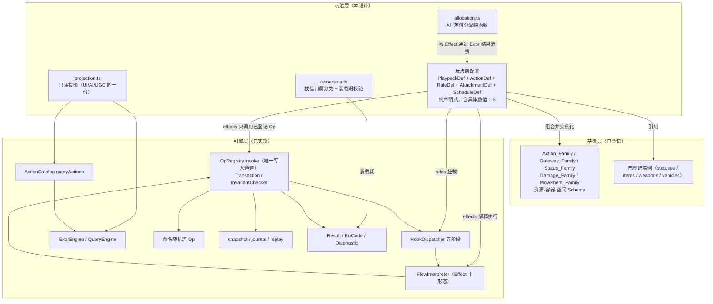

# Design Document

## Overview

### 1.1 玩法层定位

本设计文档定义 WakeUp **玩法层（Play）**核心机制的实现结构。它把 `requirements.md` 中 19 项需求转成可实施、可机械验证的组件、接口、Op 映射、事务边界与数值归属。

玩法层在三层架构中的位置是**组合者**，不是定义者：

- 它**消费**引擎层（Kernel）已登记的原语，不重新定义、复制或旁路它们。
- 它**消费**基类层（Class）已登记的语义族与实例，不把玩法数值反向固化为基类层默认值。
- 它**拥有**具体数值、行动经济、阶段顺序、状态约束与规则选择。

一句话判据：本设计里任何一处若可以被改写成"给引擎层加一个 Op"或"给基类层加一个默认数值"，就是越层，必须回退为组合。

### 1.2 消费清单（不得重新定义）

**引擎层原语（来源：`.kiro/specs/meta-mechanism-kernel/design.md`、`src/core/kernel/`）**

| 原语 | 本设计的使用方式 | 禁止的使用方式 |
|---|---|---|
| `OpRegistry.invoke` | 唯一写入入口。玩法层每一次状态变化都由一次顶层 `invoke` 发起 | 新增第二写入函数、私有 mutation helper、直接改 `WorldState` |
| `OpRegistry.invokeInline` | 声明式 Effect / Hook effects 内的嵌套 Op 调用形态（同一注册表、同一事务、同一 Hook 分发） | 把它当作"绕过事务的快路径" |
| `Result<T>` / `ErrCode` / `Diagnostic` | 唯一失败模型 | 定义玩法层异常类、玩法层错误码枚举、字符串失败原因 |
| `Transaction`（保存点语义） | 一次玩法行为 = 一个顶层事务；内部多步用保存点 | 跨事务拼接"半个动作" |
| `InvariantChecker` | 由顶层 `invoke` 在提交前统一执行 | 玩法层自建不变量检查后跳过引擎层检查 |
| `ExprEngine` / `QueryEngine` | 全部纯读判定（前置条件、可见性、目标筛选、投影） | 在 Expr 里调用随机或写入 |
| `FlowInterpreter`（Effect 十形态） | 玩法行为的声明式过程表达 | 引入任意代码、递归、闭包 |
| `HookDispatcher`（before/modify/instead/default/after） | 被动效果、减伤、免疫、到期结算的唯一挂载点 | 玩法层自建监听器或分发器 |
| `ActionDef` / `queryActions(actor, mode)` | 唯一合法动作枚举来源，UI/AI/UGC/网络共用 | 玩法层维护第二份动作表或第二份 AP 价格表 |
| `CostSpec` + `intent.submit/resolve/void`（冻结→结算→退还） | AP 与体力的成本三态 | 玩法层自行扣减资源后再"补记" |
| `Decision` / `Intent` | 提交与解算分离、隐藏提交 | 在 Hook 内等待玩家回答 |
| `AttachmentDef` / `attach.add` / `attach.del` | 状态、中间状态、离散标记的唯一承载结构 | 用 `props` 布尔字段私自表达状态 |
| `random.roll/pick/shuffle/weightedPick`（命名流） | 全部随机 | 玩法层生成随机值或维护随机状态 |
| `ScheduleDef` / `PhaseDef` / `schedule.advance` | 五阶段回合表 | 玩法层自建相位推进器 |
| `snapshot` / `journal` / `replay` / `checkpoint` / `restore` | 可重放性与 AI 试探 | 玩法层自建存档格式 |
| `PlaypackDef` / `PlaypackLoader` / `Linter` | 玩法层配置的装载与装载期校验 | 运行期热插规则集 |

**基类层族（来源：`.kiro/specs/l2-base-layer-spec/requirements.md`、`src/class/`）**

| 族 | 本设计消费的内容 |
|---|---|
| `Action_Family` | 动作前置、成本类别、效果引用、中断条件、完成状态 |
| `Gateway_Family` | 资源转换 / 检定 / 条件三类网关的类型契约 |
| `Status_Family` | 持续模式、叠加模式、触发/打断/效果引用 |
| `Damage_Family` | 伤害类别身份、来源/目标要求、结算管道引用（不含数值） |
| `Movement_Family` | 地面 / 载具 / 传送移动的合法性与成本参数接口 |
| `Item_Family` / `Weapon_Family` / `Vehicle_Family` | 容器资格、槽位、装备要求、门引用、死亡容器能力 |
| 资源 / 容器 / 空间 Schema | 资源语义角色、容器与槽位结构、天然场景与微型场景关系 |
| `AI_Behavior_Family` | NPC 行为声明结构（本设计只声明其消费点，不填 NPC 参数） |

### 1.3 拥有清单（本设计的产出）

1. **AP 经济**：AP 作为唯一回合内时间货币，付费动作恰好 1 AP，附着动作无独立 AP 成本与独立决策分支。
2. **投点结算**：最终投点等级 → AP 分配 → 强力骰退还 → 玩家行动顺序，一个事务内完成。
3. **体力与强力骰承诺**：上限 5、两档承诺、不可撤销、退还与结算互斥。
4. **五回合阶段**：投点 → 结算 → 玩家行动 → NPC 行动 → 清理。
5. **成本类别契约**：付费动作 / 附着动作的登记形式、校验规则、投影分组。
6. **精密交互**：两步付费动作 + 显式可中断中间状态。
7. **三种网关的玩法层绑定**：全成或全不成、失败不留半态。
8. **生命与零血倒地**：原子转换、动作集不扩大、观战/退出的单向性。
9. **普通倒地**：显式触发、爬行、站起。
10. **令其长眠与死亡背包**：三件事原子完成、物品守恒、只出不进。
11. **状态生命周期**：持续、叠加、清理推进、无可见 0。
12. **格挡 / 隐蔽**：生命周期与解除条件。
13. **恢复边界**：自然恢复、退还、长眠、睡眠流程、已声明消耗品，以及"无隐式恢复"。
14. **结构化拒绝与投影**：UI / AI / UGC / 网络共用同一合法性判定与同一拒绝原因。
15. **过载（D-055）**：触发条件为"任一合法效果尝试使体力超过上限 5"；体力封顶为 5、永不为 6；过载者若本回合尚未行动则失去本回合行动权；跳过一次投点并在下下回合归队；过载期间仍被动参与他人回合并保持可被交互/可被攻击资格，其主动动作请求一律结构化拒绝；清理阶段的自然恢复**不是**过载触发来源。
16. **行动轮与窗口期（D-035、D-036、D-053、D-055）**：每名参与玩家的唯一排名（无并列）、排名交换制（不插入、不复制、不改变列表长度）、变化后同一事务内即时重排、扫描定位第一个尚未行动者推进、逆转/超逆转的成本与窗口期时序、以及与同回合强力骰承诺的互斥。

### 1.4 明确不拥有（不得在本设计中出现结论）

具体枪械伤害数值、掩体减伤数值、出生规则、胜负条件、缩圈流程、地图布局、NPC 个体行为参数、具体物品实例配置、具体网关门槛、UI 布局与动画、网络传输格式。以及 `requirements.md` Requirement 17 列出的仍未冻结项 **T-001、T-002（仅数值）** —— 本设计只为它们留出接口与阻塞点，见第 9 章。

> **已裁决关闭（不再是阻塞点）**：U-002（D-037 单人得 2 AP）、**U-003（D-055 过载取得规范位阶）**、U-004（D-053 六项机制批准）、U-005（D-052 NPC 默认 1 AP / SP 上限 3）、**U-001（D-054 原始骰点为内部瞬时量，2026-08-13 项目所有者确认）**、T-002 的结构部分（D-040 二维正交模型）。第 9 章对应小节保留为**裁决记录**，不再是留白。

### 1.5 术语纪律

- 合法术语：**引擎层 / 基类层 / 玩法层 / 实例 / 基类**。
- 禁用术语（不得作为规范概念出现）：**模板**、**内容层**、以及脱离具体架构图单独使用的 Layer 1/2/3。
- 本设计中"定义"一词一律指 `Def`（引擎层结构）或基类层的语义定义，不作为"模板"的同义替换使用。
- 引擎层源码注释中出现的"子图模板"等历史措辞属于引擎层既有文本，本设计不引用其措辞，只引用其结构（`PrefabDef`）。

### 1.6 与现有代码的关系（实现落点）

现状（已核对 `src/`）：

- 引擎层 13 层已实现于 `src/core/kernel/`，`OpRegistry`、`Transaction`、`InvariantChecker`、`HookDispatcher`、`FlowInterpreter`、`ActionCatalog`、成本三态、`Intent`、`Attachment`、`ScheduleDef`、命名随机流、持久化、诊断均可用。
- Hook 链路组合根 `src/core/kernel/wire-hooks.ts`（`wireHooksIntoRegistry`）已实现，并由 `__tests__/wire-hooks.test.ts`、`__tests__/wire-hooks-exhaustive.test.ts` 与 `testing/full-harness.ts` 使用。
- 基类层已登记语义类与能力目录于 `src/class/`：`items/index.json`（物品类 + 七种能力形状及其参数槽位）、`statuses/index.json` 与 19 个语义状态文件（只声明 `capabilities` 与 `configurableParameters`，**不含任何玩法数值**）、`weapons/`、`vehicles/`、`npcs/`、`damage-types/`、`vulnerability-types/` 的 `index.json`，以及 `catalog-loader.ts` 与两个架构测试。（注：伤害↔弱点克制矩阵为玩法层数值，实现于 `src/play/action-turn/playpack.json` 的 `rule:weakness-hit`（10 种伤害→弱点 1:1 映射，D-053 已裁决批准），基类层不设 `weakness-matrix/`。关于 `src/play/action-round/`：本次核对在工作区中**未找到**该目录或其任何文件；但 `src/play/action-turn/决策与风险记录.md` 第 5.1 节仍把它记为一份与 `playpack.json` 并行、命令式、状态落在 `world.props.play.actionRound` 的同机制实现，并明确写着"我没有删除任何一方：这是架构路线选择，应由你决定"。工作区未初始化 Git（`git status` 返回 `not a git repository`），因此**无法**验证它是被删除、被改名，还是从未落在该路径。本设计因此**不宣称** `playpack.json` 是唯一权威实现——该裁决属于 RECON-001，见 11.7。）
- **不存在** `src/core/kernel/index.ts` 生产入口。
- **玩法层目录已存在且非空**（本次核对结果，逐项列出，不概括）：`src/play/` 下现有四个子目录 —— `action-turn/`（`playpack.json` + `__tests__/action-turn-playpack.test.ts` + `决策与风险记录.md`）、`profiles/`（`items/`、`npcs/`、`statuses/`、`vehicles/`、`weapons/`、`__tests__/`）、`types/`（`vehicle-profile.ts`、`vehicle-runtime-state.ts`）、`__tests__/`（`profile-field-ownership.test.ts`）。因此**不能**把玩法层当作空白落点：`src/play/core-mechanics/` 是在一个已有玩法层代码的目录里新增同层模块，不是从零建立玩法层。
- `src/play/core-mechanics/` 尚未创建；`allocation.ts`（AP 差值分配纯函数）与 `ownership.ts`（数值归属装载期校验）尚未创建。
- **与现有 `src/play/action-turn/` 存在语义重叠，需人工裁决**：该玩法包已经实现了行动轮排名、AP/SP 资源池、投点/行动/清理三相推进、强力骰、逆转/超逆转、弱点、招架、失衡等机制，与本设计第 3.2 节（AP 经济）、3.3 节（投点结算）、3.5 节（五回合阶段）覆盖的是**同一批玩法语义**，且两者的状态落点不同（`action-turn` 用 `world.props.actionTurn` 与 `world.props.pools`，本设计的五阶段与顺序表落在 `world.props.play.turnOrder` 与同名池上）。本设计**不裁决**该重叠：既不假定 `action-turn/` 正确，也不假定它已过时，更不决定删除、合并或取代。该项登记为 RECON-001，见 11.7。

> 该目录在本设计撰写期间被并行修改过（原先按实例逐文件、含 `duration`/`apCost` 等具体数值的形态，已改为"语义类 + 能力形状 + 可配置参数槽位"的去数值化形态）。本设计以**当前**形态为准：基类层提供参数槽位，玩法层提供具体值。这一变化与本设计的分工完全一致，不需要调整任何组件结构。

本设计的实现落点：新增 `src/play/core-mechanics/`，只包含**声明式定义 + 装载器 + 只读投影**，不包含任何写状态的运行时类。

```
src/play/core-mechanics/
  playpack.ts          # CoreMechanicsPlaypack：PlaypackDef 组装（pools / schedule / outcomes 留空）
  defs/
    actions.paid.ts    # 付费动作 ActionDef 集合（每个 cost 恰好 1 AP）
    actions.attached.ts# 附着动作 ActionDef 集合（无 AP 成本、声明父动作）
    rules.damage.ts    # play.damage.* 五阶段 RuleDef
    rules.status.ts    # play.status.* 施加/刷新/清理 RuleDef
    rules.phase.ts     # 五阶段 onEnter/onExit Effect 与阶段推进守卫
    rules.gateway.ts   # 三种网关的 RuleDef 绑定
    attachments.ts     # 离散状态 AttachmentDef（零血倒地/普通倒地/格挡/隐蔽/中间状态…）
    schedule.ts        # 五 PhaseDef 的 ScheduleDef
  allocation.ts        # AP 差值分配纯函数（可脱离随机独立验证）
  ownership.ts         # 数值归属分类表与装载期校验
  projection.ts        # 只读投影（UI/AI/UGC 共用），不含写能力
  load.ts              # 装载入口：组合根 + PlaypackLoader.load + 玩法层 Linter
  __tests__/           # 全部测试与本源码同址（详见 8.2：仓库的发现/类型检查/lint 都只覆盖 src/）
    property/          # 53 个属性测试文件
    unit/              # 具体示例与边界
    contract/          # 与引擎层的契约
    integration/       # 依赖真实 Hook 链路的端到端（受 2.8 门禁约束）
    gate/              # 门禁测试
```

测试同址而非独立 `test/` 根目录是**强制约束**，不是风格偏好：`src/` 是仓库中唯一被"测试发现 + 类型检查 + lint"三者**同时且以通配方式**覆盖的路径，把测试放在 `src/` 之外会落进至少一个工具的盲区。三者的当前配置、已观测到的盲区、以及本次核对期间该配置被并行会话改动的经过，全部记录在 8.2，不在此重复。

`allocation.ts` 与 `ownership.ts` 是纯函数模块（无 `WorldState` 写权限），其余文件导出的都是数据（`Def` 对象）或只读函数。玩法层不导出任何持有写权限的类。

## Architecture

### 2.1 组合关系



关键读法：玩法层的箭头**只指向下层**。没有任何一条箭头从玩法层指向"新增引擎层能力"。

### 2.2 唯一写入通道与三条只读通道

**写入（一条）**

```
玩家 / AI / UI / UGC / 网络输入
        │  提交语义动作请求
        ▼
CoreMechanicsFacade.submit()          ← 只做参数整形与来源无关校验，不写状态
        │
        ▼
OpRegistry.invoke('intent.submit' | 'intent.resolve' | 'schedule.advance' | …)
        │  一次顶层调用 = 一个事务
        ├─ 结构性 Op → HookDispatcher(before) → veto 则整体回滚
        ├─ Op 实现 / ActionDef.effects（FlowInterpreter）
        │      └─ 嵌套 Op → OpRegistry.invokeInline（同一事务的保存点）
        ├─ Flow emit → HookDispatcher(before/modify/instead/default/after)
        ├─ InvariantChecker.checkAll（仅在顶层提交前执行一次）
        └─ commit 或 rollback（全成或全不成）
```

`invokeInline` 不是第二写入通道：它是同一个 `OpRegistry` 上的嵌套调用形态，改动只落在调用方已经开启的 `Transaction` draft 里，随外层事务一起提交或回滚，并且同样经过结构性 Op 的 before/after 分发。玩法层**不允许**直接持有 `OpContext` 去调用 `invokeInline`——玩法层只写声明式 `Effect`，由 `FlowInterpreter` 代为调用。

**只读（三条，全部来自引擎层）**

| 通道 | 引擎层来源 | 玩法层用途 |
|---|---|---|
| 事件订阅 | `after:*` Hook / `PresentationGateway.subscribe` | 表现层演出增量 |
| 状态查询 | `QueryEngine.run` / `ExprEngine.eval` | 全量渲染、AI 感知、规则判定 |
| 合法动作枚举 | `ActionCatalog.queryActions(actor, mode)` | 动作菜单、AI 着法、网络校验、拒绝原因 |

`projection.ts` 只转发这三条通道，不缓存派生状态、不导出 `OpRegistry` 或 `Transaction` 类型。

### 2.3 玩法层不注册新 Op：行为表达三件套

玩法层可用且仅可用以下三种声明表达行为：

| 声明 | 引擎层结构 | 表达什么 |
|---|---|---|
| **动作** | `ActionDef`（`kind:'action'`） | 玩家/NPC 可提交的语义动作：前置条件、成本、目标、效果、灰显原因 |
| **规则** | `RuleDef`（`kind:'rule'`） | 被动效果、减伤、免疫、到期、阶段边界结算，挂在事件的五个阶段之一 |
| **状态** | `AttachmentDef`（`kind:'attachment'`） | 一切离散状态与中间状态的承载体 |

三者的效果体一律是 `Effect[]`（引擎层 Flow 的十种形态），其中 `{op, args}` 形态**只能引用下表已登记 Op**（引擎层 Op 全集，玩法层不新增一个）：

```
属性类  prop.set / prop.del / prop.add / list.insert / list.remove / list.move / tag.add / tag.del
结构类  entity.create / entity.destroy / entity.setDef / entity.place / entity.demote
        item.create / item.destroy / item.move / item.promote
        stack.split / stack.merge
        node.create / node.destroy / node.merge / node.split
        link.create / link.destroy / slot.add / slot.del
        prefab.spawn / prefab.despawn
关系类  relation.set / relation.del
认知类  agent.create / agent.bind / agent.unbind
附着类  attach.add / attach.del
决策类  decision.open / decision.answer / decision.close
意图类  intent.submit / intent.resolve / intent.void / intent.reveal
结局类  outcome.reach
相位类  schedule.advance
随机类  random.roll / random.pick / random.shuffle / random.weightedPick
```

### 2.4 玩法事件命名空间与五阶段管道

需要被拦截、减伤、免疫或替换的玩法语义（伤害、治疗、体力授予、状态施加、状态到期、阶段结算、网关判定）不映射为新 Op，而映射为**玩法层事件 + 五阶段 RuleDef**。事件由 `Effect` 的 `{emit, data}` 形态产生，经引擎层 `wireHooksIntoRegistry` 的 `onEmit` 接线进入同一个 `HookDispatcher`。

命名空间：`play.<域>.<语义>`（标识符本身属于未冻结契约，见 Requirement 18，此处仅为结构示意）。

```
play.damage.request     before  : 目标资格 / 免疫（veto → 整个动作回滚）
                        modify  : 护甲、盾牌减伤（改写 payload.amount）
                        instead : 完全免疫型格挡（排他执行，替代默认结算）
                        default : 应用最终数值（读生命 → 分支 → prop.set 或 零血倒地转换）
                        after   : 只读演出增量（引擎层机械回滚其写入）
play.heal.request       同上五阶段；default 阶段执行 prop.add + clamp 上限 5
play.stamina.grant      default : 体力恢复（clamp 上限 5）；当某次增加尝试使体力超过 5 时按 D-055 施加过载（见 3.17），清理阶段的自然恢复在体力已为 5 时是无操作、明确不触发过载（Requirement 6.22）
play.status.apply       modify  : 持续时间/叠加策略裁决；default : attach.add
play.status.tick        default : 清理阶段推进剩余回合；剩余将为 0 时改为 attach.del
play.gateway.evaluate   default : 三种网关的成功/失败效果（同一事务内）
play.phase.settle       default : 结算阶段（AP 分配 / 退还 / 顺序固定）
play.attach.invoke      default : 附着动作效果的唯一执行入口（见 3.6）
```

为什么必须走事件而不是 `before:prop.set`：引擎层只对**结构性 Op** 分发 before/after（`src/core/kernel/ops/registry.ts` 的 `structural` 标记），而 `prop.set` / `prop.add` / `prop.del` / `list.*` / `tag.*` 均未标记为结构性，`before:prop.add` 不会被分发。因此"受击时盾牌自动格挡"这类被动效果若挂在 `before:prop.add` 上会静默不生效。把伤害表达为玩法层事件是引擎层设计原文即声明的做法（"伤害不是内核原语，是玩法包 emit + Hook"），不是对引擎层缺口的绕过。**本设计不因此要求引擎层把属性类 Op 改为结构性**，也不新建分发器。

### 2.5 组合根与装载顺序

```
1. new WorldStateHolder(createEmptyWorldState(scheduleId))
2. wireHooksIntoRegistry({ holder, onDiagnostic })      ← 引擎层组合根，玩法层不复制
3. registerPropOps / registerStructuralOps / registerTransformOps / registerStackOps /
   registerPrefabOps / registerRelationOps / registerAgentOps / registerAttachOps /
   registerDecisionOps / registerIntentOps / registerScheduleOps / registerRandomOps /
   registerOutcomeOps                                    ← 引擎层既有注册函数，顺序不变
4. ruleProvider.load(玩法层 RuleDef 集合)                 ← 规则进入同一 Hook 管道
5. defRegistry.register(玩法层全部 Def)（装载期例外）
6. PlaypackLoader.load(CoreMechanicsPlaypack)            ← 引擎层 Linter + 玩法层 Linter
7. 玩法层 Linter 校验：数值归属、1-5 值域、五并列上限、成本类别、网关完整性、未冻结项引用
8. 装载成功后才允许任何 OpRegistry.invoke
```

第 6-7 步任一诊断为 `error`/`fatal` → 整包不激活，保留最后有效注册表状态（Requirement 16.2）。

### 2.6 数值归属治理

四种归属（术语取自基类层 Spec，玩法层沿用同一分类，不新造第五类）：

| 归属 | 判据 | 值域约束 | 可否展示给玩家 |
|---|---|---|---|
| **Gameplay_Value** | 影响玩法平衡的具体赋值 | 必须是 1-5 的整数 | 是 |
| **Internal_Metric** | 回合编号、计数、索引、预算、结算镜像 | 不受 1-5 限制 | **否**（投影层禁止展示） |
| **Structural_Bound** | 保证类型结构或认知上限的限制 | 由结构理由决定 | 通常否 |
| **Constitutional_Constant** | 由 L0 宪法固定并带来源编号 | 由宪法给出 | 视字段而定 |

落地机制（不修改引擎层接口）：`Def` 允许携带额外字段（其索引签名 `[key: string]: unknown`），玩法层在每个 `Def` 上写一个命名空间字段：

```typescript
/** 玩法层在 Def 上的扩展命名空间。引擎层忽略未知字段，因此这不改变任何引擎层接口。 */
export interface PlayDefExtension {
  readonly numericOwnership: Record<string, NumericOwnership>; // 字段路径 → 归属
  readonly costClass?: 'paid' | 'attached';
  readonly parentActions?: readonly string[];   // 仅 costClass:'attached' 时必填
  readonly sourceTrace: readonly string[];      // 来源追踪（S0/S1/…/S9 + 条款号）
  readonly unresolvedGuards?: readonly UnresolvedId[]; // 引用了哪些未冻结项
}

export type NumericOwnership =
  | { readonly kind: 'gameplay'; readonly min: 1; readonly max: 5; readonly int: true }
  | { readonly kind: 'internal'; readonly note: string }        // 必须写明为何玩家不可见
  | { readonly kind: 'structural'; readonly rationale: string }
  | { readonly kind: 'constitutional'; readonly sourceId: string };

/**
 * 仍未冻结的项。U-002（D-037）、**U-003（D-055）**、U-004（D-053）、U-005（D-052）、**U-001（D-054，
 * 2026-08-13 项目所有者确认）** 已裁决关闭并移出；T-002 收窄为仅"掩体数值"未冻结，其结构已由 D-040 冻结。
 * 原始骰点按 D-054 归为内部瞬时量（不受宪法 1-5 约束），强力骰等级修正是结算阶段的独立玩法数值、
 * 作用于行动轮排名与 AP 分配，因此 U-001 的"骰面越界"停留位不成立。
 * 因此本联合类型恰好剩两个成员：T-001、T-002（仅数值）。
 */
export type UnresolvedId = 'T-001' | 'T-002';
```

装载期规则（`ownership.ts`）：

1. 遍历每个玩法层 `Def` 的全部数值字段（含 `props`、`cost.amount` 字面量、`clamp`）。
2. 任一数值字段在 `numericOwnership` 中无分类 → `E_LOAD_NUMERIC_OWNERSHIP`，整包拒绝（Requirement 3.9）。
3. 分类为 `gameplay` 但值不在 1-5 整数范围 → `E_LOAD_GAMEPLAY_VALUE_RANGE`。
4. 分类为 `internal` 但出现在投影白名单中 → `E_LOAD_NUMERIC_OWNERSHIP`。
5. `unresolvedGuards` 非空且该项未冻结 → `E_LOAD_UNRESOLVED_CONTRACT`（Requirement 16.8、17.2）。

### 2.7 五并列约束落点

五并列是**投影层 + 装载期**双重约束，不是运行期规则判定：

- **装载期**：任一动作分组（同一父动作下的附着动作集合、同一网关的分支集合、同一界面的固定选项集合）声明的静态选项数 > 5 → 拒绝装载。
- **投影层**：`projection.ts` 对 `queryActions` 的结果按 `group` 分组后，每组同时呈现的独立选项数不得超过 5；超过时必须分页（分页是呈现行为，不改变合法动作集合）。死亡背包取出清单按 5 分页即属此类（Requirement 12.10）。
- **例外**：仅当满足宪法第十二条（公共、同步、非私有）时才允许超过 5，例如伤害类型/弱点类型这类全局共用的机制类型枚举。玩法层配置必须显式声明例外理由，未声明则按上限校验。

### 2.8 Hook 链路门禁（Requirement 2.8）

Requirement 2.8 要求：在 D-002 所述 Hook 接线缺口"完成并通过引擎层验收"前，依赖真实 Hook 链路的核心机制集成必须标记为阻塞，不得宣称端到端可用。

**已核对的事实（不做推断）**

| 事实 | 证据 |
|---|---|
| 接线实现存在 | `src/core/kernel/wire-hooks.ts` 的 `wireHooksIntoRegistry`：`OpRegistry.InvokeHooks.dispatchBefore/After` → `HookDispatcher.dispatch`，事件类型 `before:/after:${opName}`；`HookDispatcher.EffectRunner` → `FlowInterpreter.run`；`resetDepth` 在顶层 invoke 后调用 |
| 有端到端测试 | `__tests__/wire-hooks.test.ts`、`__tests__/wire-hooks-exhaustive.test.ts` |
| 模糊测试已接真实链路 | `testing/full-harness.ts` 经 `wireHooksIntoRegistry` 构造 |
| 结构性 Op 已标记 | 28 处 `{ structural: true }`（entity/item/node/link/slot/prefab/stack/attach/decision/intent/transform 类） |
| 属性类 Op 未标记结构性 | `prop.*` / `list.*` / `tag.*` / `relation.*` / `agent.*` / `decision.open` / `intent.submit` / `random.*` / `schedule.advance` 均未标 `structural` |
| 无生产组合根 | 不存在 `src/core/kernel/index.ts`；`wireHooksIntoRegistry` 目前只被测试与模糊测试用例使用 |
| 文档侧状态不一致 | `docs/AI完备性与文档对齐分析.md` 称 D-002 已完成；`docs/L_归档/审查状态综合报告_历史.md` 的剩余待决表未列 D-002，也未记录"引擎层验收通过"的验收记录 |

**门禁裁决（本设计的立场）**

1. 玩法层**不**新建任何 Hook 分发器，也不以 `before:prop.*` 作为设计前提（该分发本就不存在）。
2. 依赖真实 Hook 链路的集成范围 = 第 2.4 节全部 `play.*` 事件管道 + 结构性 Op 的 `before:` 否决（负重、容量、禁止进入、死亡背包只出不进）。这部分在**下列两个条件同时满足前**保持"集成阻塞"状态：
   - (a) 存在一个生产组合根（非测试代码）导出经 `wireHooksIntoRegistry` 接线的注册表，并被玩法层装载入口使用；
   - (b) 引擎层出具明确的验收记录（决策编号或审查报告条目）确认 D-002 关闭。
3. 阻塞期内允许推进且不受影响的部分：`allocation.ts` 纯函数、`ownership.ts` 装载期校验、`projection.ts` 只读投影、全部 `Def` 声明本身、以及不依赖 `play.*` 事件的单 Op 行为（例如仅调用 `attach.add` / `item.move` 的动作，其 `before:` 否决由引擎层已标记的结构性 Op 提供）。
4. 阻塞状态必须在测试层面显式表达（见第 8 章：门禁测试用 `describe.skip` 之外的显式失败标记，不允许用"测试不存在"来掩盖阻塞）。

> **人工复核项 A**：条件 (b) 的验收记录目前无法在工作区中定位。这是"待关闭的门禁"，不是本设计可自行判定关闭的事项。

## Components and Interfaces

以下接口以 TypeScript 形态表达设计意图。所有接口遵守两条硬约束：**（1）没有任何方法能改写状态，写入一律表现为"产出 `Effect[]` 或 `Def`，由引擎层执行"；（2）失败一律是引擎层 `Result<T>` / `Diagnostic`。**

### 3.1 装载入口与组合根

```typescript
// 导入路径纪律：`tsconfig.json` 的 compilerOptions 中**没有** `paths` 字段，
// `vitest.config.ts` 也**没有** `resolve.alias`；因此 `@kernel/*` 这类路径别名在本仓库不存在，
// 写成别名会在 `npm run typecheck` 与 `npm test` 两处一起解析失败。
// 玩法层一律使用相对路径导入引擎层（本文件位于 `src/play/core-mechanics/`，
// 向上两级到 `src/`，再进入 `core/kernel/`）。
import type { Result } from '../../core/kernel/ops/result';
import type { Diagnostic } from '../../core/kernel/state/diagnostic';
import type { WiredHooks } from '../../core/kernel/wire-hooks';

export interface CoreMechanicsLoadOptions {
  /** 引擎层组合根产物。玩法层不自行构造 HookDispatcher / FlowInterpreter。 */
  readonly wired: WiredHooks;
  /** 玩法层配置：本 Spec 拥有的具体数值与规则选择。 */
  readonly config: CoreMechanicsConfig;
}

export interface CoreMechanicsConfig {
  /** 投点策略引用；U-001 冻结前必须为 null，且 enableRandomRoll 必须为 false。 */
  readonly rollPolicy: RollPolicyBinding;
  /** NPC 资源配置（D-052 已冻结默认值：AP 1 / SP 上限 3 / 开局 SP 0）；null 表示该玩法包不启用 NPC。 */
  readonly npcBudget: NpcBudgetBinding | null;
  /** 体力上限：Constitutional_Constant（D-007，值 5）。 */
  readonly staminaMax: 5;
  /** 生命上限：Constitutional_Constant（S0 第四条，值 5）。 */
  readonly vitalityMax: 5;
  /** 已启用的付费动作标识符集合（标识符属未冻结契约，此处只约束集合语义）。 */
  readonly enabledPaidActions: readonly string[];
  /** 已启用的附着动作及其父动作绑定。 */
  readonly enabledAttachedActions: readonly AttachedActionBinding[];
  /** 三种网关的具体绑定（门槛值由下游配置提供，本 Spec 不给默认值）。 */
  readonly gateways: readonly GatewayBinding[];
  /** 状态生命周期绑定（引用基类层已登记状态实例）。 */
  readonly statuses: readonly StatusBinding[];
  /** 恢复来源白名单（Requirement 15.6：必须显式声明，未声明即不存在）。 */
  readonly recoverySources: readonly RecoverySourceBinding[];
  /** 五并列例外声明（宪法第十二条）。未声明的分组一律按 ≤5 校验。 */
  readonly parallelismExceptions: readonly ParallelismException[];
}

export interface CoreMechanicsLoadResult {
  readonly ok: boolean;
  readonly diagnostics: readonly Diagnostic[];
  /** 装载成功后可用的只读投影；失败时为 null（不返回半可用对象）。 */
  readonly projection: CoreMechanicsProjection | null;
  /** 因未冻结项而处于阻塞状态的能力清单（Requirement 17.3 的显式阻塞声明）。 */
  readonly blocked: readonly BlockedCapability[];
}

export interface BlockedCapability {
  readonly capability: string;
  readonly blockedBy: readonly UnresolvedId[] | 'HOOK_WIRING_GATE';
  readonly rejectionCode: 'E_LOAD_UNRESOLVED_CONTRACT';
}

export declare function loadCoreMechanics(opts: CoreMechanicsLoadOptions): CoreMechanicsLoadResult;
```

`loadCoreMechanics` 只做三件事：把玩法层 `Def` 交给 `DefRegistry.register`、把 `RuleDef` 交给 `RuleProvider`、调用 `PlaypackLoader.load`。它自己不写 `WorldState`（`Def` 注册属于引擎层已声明的装载期例外）。

### 3.2 AP 经济（Requirement 4）

AP 是引擎层 `PoolDef`（`per:'actor'`）的一个实例，不是引擎层内置概念。玩法层只声明它，并把每个付费动作的 `CostSpec` 固定为一条 `{ pool: AP, amount: 1 }`。

```typescript
/** 玩法层声明的资源池。名称是未冻结标识符，此处以常量表达"恰好一个 AP 池"这一结构约束。 */
export const AP_POOL = 'ap' as const;
export const STAMINA_POOL = 'stamina' as const;

export interface ApEconomyContract {
  /** AP 是本规则集回合内执行动作的唯一时间货币（Requirement 4.1）。 */
  readonly timeCurrency: typeof AP_POOL;
  /** 付费动作的成本恒等式：cost 数组恰好一项，pool 为 AP，amount 字面量为 1。 */
  readonly paidActionCost: readonly [{ readonly pool: typeof AP_POOL; readonly amount: 1 }];
  /** 附着动作的成本：空数组。不得写成 amount: 0（Requirement 3.6）。 */
  readonly attachedActionCost: readonly [];
}

/** 装载期校验：任何声明为 paid 的 ActionDef 必须满足这一形状，否则拒绝装载。 */
export declare function validatePaidActionCost(action: ActionDefLike): Result<void>;
/** 装载期校验：拒绝任何 amount 求值可能 >1 或 <1 的付费动作（含 Expr 形态）。 */
export declare function rejectMultiApAtomicAction(action: ActionDefLike): Result<void>;
```

设计要点：

1. **`amount` 必须是字面量 `1`，不接受 Expr**。原因：Expr 可以求值出 2，而 Requirement 4.3 禁止任何单次 2 AP 原子动作；把它收窄为字面量使这条铁律在装载期即可机械判定，不依赖运行期抽样。这是本设计的自主判断（需求只要求"恰好 1 AP"，未规定实现手段），标记为 **人工复核项 B**。
2. **AP 的两个字段视图**沿用引擎层成本三态在 `world.props.pools.ap.<actorId>.{available, real}` 的既有布局：`available` 在 `intent.submit` 时冻结扣减，`real` 在 `intent.resolve` 成功时结算扣减，`intent.void` 把 `available` 加回。玩法层不改这个布局，也不新增第三个字段。
3. **未分配 AP 表达为字段缺失**：结算阶段对未分配 AP 的玩家执行 `prop.del` 删除该玩家的 `available` 与 `real` 两个路径，而不是写 0。任何付费动作的 `intent.submit` 会因 `freezeCost` 读到"无数值"而返回 `E_COST_INSUFFICIENT`，投影层把"字段缺失"映射为离散状态"未分配 AP"（Requirement 3.4、5.7）。
4. **NPC 复用同一成本类别，但不复用玩家投点分配**：NPC 的 AP 池写入来源是 `npcBudget` 配置（D-052 默认 1 AP）；`npcBudget === null` 表示该玩法包不启用 NPC，此时 NPC 行动阶段无参与者。NPC 的 AP 数值**不得取自玩家投点分配表**，违反仍按 U-005 拒绝装载。
5. **不存在第二份 AP 价格表**：AI、UI、规则验证读到的成本一律来自 `queryActions` 返回的 `LegalAction.cost`。

付费动作最小启用集（Requirement 4.7）与附着动作最小启用集（Requirement 4.8）：

| 类别 | 动作 | 备注 |
|---|---|---|
| 付费（各 1 AP） | 移动到相邻合法位置、拾取、攻击、整理背包、上车、下车、举盾格挡、睡下、起床、站起、令其长眠 | 启用与否由 `enabledPaidActions` 决定；启用即必须是付费类别 |
| 付费（各 1 AP，多步） | 精密交互的"开始"与"完成"、重型负重大范围移动的两步、需要额外时间的过渡两步、爬行（普通倒地） | 见 3.7 |
| 附着（无独立 AP） | 丢弃物品、使用已声明的随动作消耗品、取消格挡、医疗物品、体力消耗品 | 必须声明父付费动作 |

### 3.3 投点结算（Requirement 5）

投点结算拆成**两个彼此独立的部分**：一个是未冻结的随机生成与边界处理（U-001），一个是已冻结的差值分配算法（Requirement 5.4-5.8）。后者必须能在前者阻塞时独立验证（Requirement 5.12）。

```typescript
/** 玩家可见的投点等级：Gameplay_Value，值域 1-5 的整数。 */
export type RollTier = 1 | 2 | 3 | 4 | 5;

/** AP 分配结果：离散并列结果，"未分配"不是数值 0。 */
export type ApAllocation =
  | { readonly kind: 'allocated'; readonly ap: 1 | 2 | 3 }
  | { readonly kind: 'unallocated' };

export interface RollParticipant {
  /** 投点参与者标识（内部标识，非玩家可见数值）。 */
  readonly actorId: string;
  /** 最终投点等级（含强力骰修正后的合法结果）。 */
  readonly finalTier: RollTier;
  /** 本回合为强力骰实际冻结的体力（0 表示未承诺；这是内部结算量，不作为玩家可见数值展示）。 */
  readonly committedStamina: 0 | 1 | 2;
}

export interface RollOutcome {
  readonly actorId: string;
  readonly allocation: ApAllocation;
  /** 未分配 AP 时必须为 true（Requirement 6.8）。 */
  readonly staminaRefunded: boolean;
}

/**
 * AP 差值分配：纯函数，不触碰随机、不触碰状态。
 * 输入是"外部提供的合法最终投点等级"，因此 U-001 阻塞不影响本函数的可验证性
 * （Requirement 5.12）。
 */
export declare function allocateAp(participants: readonly RollParticipant[]): Result<readonly RollOutcome[]>;

/** 玩家行动顺序：结算阶段确定后即固定（Requirement 7.6）。 */
export interface TurnOrderEntry {
  readonly actorId: string;
  /** 排序键 1：分配 AP 多者优先。 */
  readonly ap: 1 | 2 | 3;
  /** 排序键 2：最终投点等级高者优先。 */
  readonly finalTier: RollTier;
  /** 排序键 3：仍相同时由命名随机流产生的定序值（Internal_Metric，不展示）。 */
  readonly tieBreak: number;
}
```

`allocateAp` 的判定顺序（严格对应验收标准，不引入额外分支）：

1. 参与者数量为 1 → **该玩家得 2 AP**（D-037：屏蔽 3 AP 档后自然落到 2 AP，不是特例分支，Requirement 5.11）。
2. 参与者数量恰好 2 → 最终等级不低于对方者得 2 AP；较低者差 1 得 1 AP、差 ≥2 未分配；**不产生 3 AP**（Requirement 5.8）。
3. 参与者 >2：
   - 唯一最高且领先第二高 ≥2 → 3 AP（Requirement 5.4）。
   - 并列最高，或唯一最高但领先不足 2 → 每名最高者 2 AP（Requirement 5.5）。
   - 与最高相差 1 → 1 AP（Requirement 5.6）。
   - 与最高相差 ≥2 → 未分配（Requirement 5.7）。
4. `staminaRefunded = (allocation.kind === 'unallocated')`，且只在 `committedStamina > 0` 时产生实际退还写入。

未冻结部分的接口留白：

```typescript
export interface RollPolicyBinding {
  /** 是否启用随机投点。U-001 冻结前必须为 false。 */
  readonly enableRandomRoll: boolean;
  /** 基础等级生成策略引用（已审批的玩法层策略定义 Id）。U-001 冻结前必须为 null。 */
  readonly baseTierPolicyRef: string | null;
  /** 强力骰修正后边界策略引用。U-001 冻结前必须为 null。 */
  readonly boostBoundaryPolicyRef: string | null;
}
```

**未冻结时的行为（不得有默认值）**：

- 装载期：`enableRandomRoll === true` 且任一策略引用为 `null` → `E_LOAD_UNRESOLVED_CONTRACT`，整包拒绝。
- 装载期：`enableRandomRoll === false` → 装载通过，但把"标准随机投点"与"强力骰结算"登记为 `BlockedCapability`。
- 运行期：投点阶段 `onEnter` 的第一条 `Effect` 是守卫 `{ if: <策略齐备>, then: [...], else: [{ abort: '<未冻结项 U-001>' }] }`。`abort` 使整个 `schedule.advance` 事务回滚，**在任何 `random.*` Op 被调用之前、在任何体力被扣减之前**（Requirement 5.9、6.7）。

### 3.4 体力与强力骰承诺（Requirement 6）

```typescript
/** 玩家可见体力：Gameplay_Value，1-5；耗尽表示为字段缺失或离散"无可用体力"，不显示 0。 */
export type StaminaValue = 1 | 2 | 3 | 4 | 5;

/** 强力骰只有两档，没有第三档（Requirement 6.3-6.4）。 */
export type BoostCommitment =
  | { readonly kind: 'none' }
  | { readonly kind: 'boost'; readonly staminaCost: 1; readonly tierModifier: 1 }
  | { readonly kind: 'boost'; readonly staminaCost: 2; readonly tierModifier: 2 };

export interface BoostCommitmentRequest {
  readonly actorId: string;
  readonly commitment: BoostCommitment;
}

export interface StaminaContract {
  /** 上限 5（D-007，Constitutional_Constant）。 */
  readonly max: 5;
  /** 清理阶段每个活体恢复 1，结果最高为 5（Requirement 6.2）。 */
  readonly naturalRecoveryPerCleanup: 1;
  /**
   * 达到上限时保持为 5；**尝试超过 5 时保持 5 并施加过载**（D-055，Requirement 6.14、6.16）。
   * 清理阶段的自然恢复在体力已为 5 时是无操作，**不计入过载触发**（Requirement 6.22）。
   * 完整定义见 3.17。
   */
  readonly overloadOnAttemptToExceed: 'apply-overload';
  /** 清理阶段自然恢复被显式排除在过载触发之外（Requirement 6.22）。 */
  readonly cleanupNaturalRecoveryTriggersOverload: false;
}
```

承诺时序与失败语义：

| 场景 | 处理 | 需求 |
|---|---|---|
| 投点前提交承诺 | 记录为承诺状态并冻结体力（`intent.submit` 的成本冻结形态） | 6.5 |
| 进入随机投点后再提交/变更 | 结构化拒绝 `E_OP_NOT_ACCEPTED`，状态不变 | 6.5 |
| 体力不足 | `freezeCost` 返回 `E_COST_INSUFFICIENT`，**不冻结部分体力**（冻结是单次事务内的全成或全不成） | 6.6 |
| 提交 3 点或以上 | 装载期即无此档位；运行期请求被拒 `E_OP_NOT_ACCEPTED` | 6.4 |
| U-001 未冻结 | 承诺请求在扣除体力前被拒（守卫先于冻结） | 6.7 |
| 结算后未分配 AP | 同一结算事务内全额退还（引擎层 `intent.void` → `refundCost`，产出 `cost.refunded` 诊断，无静默退回） | 6.8 |
| 结算后获得 ≥1 AP | `intent.resolve` → `settleCost` 结算一次，不重复扣减 | 6.9 |

体力增加的七个合法来源（Requirement 6.13：白名单之外一律不存在）。前五项是**自我恢复**，后两项是 D-053 批准的**施加于他方的体力增加**：

1. 清理阶段自然恢复 1（上限 5）。
2. 未分配 AP 的强力骰全额退还。
3. 令其长眠成功 → 执行者恢复至 5。
4. 合法睡眠流程：`睡下`（1 AP）+ `起床`（1 AP），**起床动作完成时**恢复至 5。
5. 已声明的体力消耗品（附着动作，恢复 1 或 2）。
6. **弱点命中 → 被命中方体力 +1**（D-053）。目标是被命中方，不是效果发起者。
7. **招架成功 → 攻击方体力 +1**（D-053）。目标是攻击方，不是效果发起者（招架者）。

第 6、7 项的三条硬约束（Requirement 6.15、15.9，详见 3.15）：目标是另一活体；不得因发起者体力已满而被跳过、抑制或转移给发起者；它们是**过载的合法触发来源**。

> 冲突裁决落地：`docs/_术语表与废案清单.md` 的"睡眠每回合恢复 1"低于 `docs/L2_基类层/02_游戏机制.md` 的"睡下+起床后回满"，本设计只实现后者；两者不叠加（Requirement 15.4）。

**过载（原 U-003，现已由 D-055 裁决关闭）**：过载已取得规范位阶，进入标准默认规则。本设计对"任一合法效果尝试使体力超过 5"的行为是：体力保持为 5，并在同一事务内施加过载状态；对"清理阶段自然恢复且体力已为 5"的行为是：无操作，不施加过载。基类层已登记的 `status_overloaded` 实例现**可被本玩法层配置引用**，引用不再返回 `E_LOAD_UNRESOLVED_CONTRACT`。完整的组件形状、触发判定、状态承载、归队计数、行动权剥夺与被动参与语义见 **3.17**；装载期校验清单见 3.17 末尾（Requirement 16.9）。

### 3.5 五回合阶段（Requirement 7）

```typescript
/** 五阶段回合表。玩法层只声明 PhaseDef 数据，推进由引擎层 schedule.advance 执行。 */
export type CorePhaseName = 'roll' | 'settle' | 'playerAction' | 'npcAction' | 'cleanup';

export interface CorePhaseSpec {
  readonly name: CorePhaseName;
  /** 引擎层 PhaseDef.input：投点/结算为 'all'/'none'，玩家行动为 'actor'。 */
  readonly input: 'none' | 'actor' | 'all';
  /** 本阶段允许的写入语义摘要（文档性字段，装载期用于交叉校验 RuleDef 挂载点）。 */
  readonly settles: readonly string[];
}

export const CORE_PHASES: readonly CorePhaseSpec[] = [
  { name: 'roll',         input: 'all',   settles: ['强力骰承诺收集', '投点等级生成（U-001 门禁）'] },
  { name: 'settle',       input: 'none',  settles: ['最终等级确认', 'AP 分配', '强力骰退还', '行动顺序固定'] },
  { name: 'playerAction', input: 'actor', settles: ['按固定顺序执行付费动作与其附着动作'] },
  { name: 'npcAction',    input: 'none',  settles: ['按稳定 NPC 编号顺序执行（预算见 D-052，默认 1 AP）'] },
  { name: 'cleanup',      input: 'none',  settles: ['自然体力恢复', '显式状态到期', '已声明持续效果'] },
];
```

阶段推进的守卫（Requirement 7.10）：`schedule.advance` 的 `onExit` 首条 `Effect` 是守卫表达式，条件不满足时 `abort`，使推进失败并回滚（引擎层对"推进未成立"返回显式 `Result.ok=false`，可被 journal 记录）。守卫条件：

- `roll → settle`：全部投点参与者的承诺已收集齐（或该玩法层配置声明本阶段无需承诺）。
- `settle → playerAction`：AP 分配、退还、顺序三项写入均已完成，且 `turnOrder` 长度等于应行动玩家数。
- `playerAction → npcAction`：执行队列已空（每名玩家 AP 耗尽或显式弃权）。
- `npcAction → cleanup`：NPC 队列已空。
- `cleanup → roll`：无未完成的到期结算，且无处于打开状态且未到期的 `Decision`（引擎层需求 31.4 已保证该项，玩法层不重复实现）。

**行动顺序固定性（含 D-053 例外）**（Requirement 7.6）：`world.props.play.turnOrder` 是一个有序表，在结算阶段一次性写入后，玩家行动阶段内默认不应被改写，**除非改写来自 D-053 已裁决批准的六项机制之一**：逆转（`action:reverse`）、超逆转（`action:super-reverse`）、处决后提升（`rule:execution-rank-up`）、弱点命中降低（`rule:weakness-hit`）、招架反制降低（`rule:parry-intercept`）。`docs/L3_玩法层/01_行动轮与体力博弈系统.md` 中这部分陈述此前被判定为"被更高优先级来源置换的非规范候选"，该裁决已由项目所有者通过 D-053 正式撤销并重新裁决为批准。装载期校验相应调整为：任何写入 `turnOrder` 路径的 `RuleDef`/`ActionDef` 必须要么挂载在结算阶段的挂载点上，要么是 D-053 明确列出的六项机制对应的 Def 标识符之一；两者皆非 → 拒绝装载。

**NPC 顺序**：按稳定 NPC 编号（Internal_Metric）排序，不使用玩家的同分随机规则（Requirement 7.7）。

### 3.6 成本类别：付费动作与附着动作（Requirement 4、8）

```typescript
export interface AttachedActionBinding {
  readonly actionId: string;
  /** 必须非空：附着动作必须声明其父付费动作（Requirement 8.5）。 */
  readonly parentActions: readonly string[];
  /** 触发时点：父动作效果序列中的命名位置。 */
  readonly triggerPoint: 'beforeParentEffects' | 'afterParentEffects';
  /** 前置条件（纯读 Expr 引用）。 */
  readonly requireRef: string;
  /** 失败行为：拒绝并保持状态不变，还是仅跳过附着效果而父动作继续。 */
  readonly onFailure: 'rejectWholeAction' | 'skipAttachedOnly';
}
```

**附着动作绝不成为顶层分支的三重机械保证**（Requirement 8.4、8.8）：

1. **提交形态**：附着动作**不产生独立 `Intent`**。它作为父付费动作 `intent.submit` 的一个绑定项提交：`bindings.attached = [{ actionId, targets }]`。因此在引擎层的 `Intent` 集合中永远看不到独立的附着动作意图。
2. **枚举形态**：附着动作的 `ActionDef.require` 中包含守卫"存在一个正在解算的、声明了本动作为附着项的父意图"。在顶层枚举时该守卫为假，且 `visible` 未声明 → 依引擎层 `queryActions` 的默认规则（require 不满足且 visible 不满足即不出现）它不进入结果集。AI 的搜索分支因此不含附着动作。
3. **执行形态**：附着动作的效果由父动作效果序列在声明的触发点 `emit play.attach.invoke`，由装载期从该附着 `ActionDef` 自动派生的一条 `RuleDef`（`on: 'play.attach.invoke'`、`phase: 'default'`、`when: payload.actionId === <id>`、`effects: <该 ActionDef 的 effects>`）执行。**同一份效果只声明一次**，派生发生在装载期（引擎层允许的装载期例外），不产生第二份定义。

父动作回滚时附着动作自动不生效（Requirement 8.6）：两者在同一事务内，父动作失败 → 整体回滚。父动作不合法 → 根本不会 `emit`。

**投影分组**（Requirement 3.6、8.7）：投影层把动作分成两组呈现：付费动作组（显示 `1 AP`）与附着动作组（显示"无独立 AP 成本"）。**禁止**把附着动作显示为"0 AP"。同一父动作下的附着动作数 + 其他并列选择合计 ≤5。

**与基类层能力参数槽位的绑定**（按 `src/class/items/index.json` 当前形态）：基类层只声明能力形状与必填参数槽位，玩法层负责把每个槽位绑定为具体值或引用。本设计涉及的槽位绑定如下。

| 基类层能力 | 参数槽位 | 玩法层绑定（本设计） |
|---|---|---|
| `item.capability.recover` | `targetSelector` / `targetProperty` / `amount` / `applicationTiming` / `operation` | 目标资格 Expr / `vitality` 或 `stamina` / 1-2 的 Gameplay_Value / 附着动作触发时点 / `prop.add` |
| `item.capability.cure` | `targetSelector` / `statusSelector` / `applicationTiming` / `operation` | 目标资格 Expr / 状态引用 / 附着动作触发时点 / `attach.del` |
| `item.capability.armor` | `damageSelector` / `mitigationRule` / `resultBoundary` / `breakCondition` / `operation` | `play.damage.request` 的 `modify` 规则引用 / **受 T-001、T-002 阻塞，本设计不填减免数值** / 结果边界 1-5 / 破损条件引用 / `prop.set` |
| `item.capability.shield` | `activationRule` / `blockRule` / `resourcePool` / `depletionBehavior` / `operation` | 举盾格挡付费动作 / `modify` 或 `instead` 规则引用 / 由 space-items 声明 / 由 space-items 声明 / `attach.add` + `attach.del` |
| `item.capability.lock_interaction` | `lockSelector` / `interactionMode` / `prerequisite` / `completionRule` / `operation` | 精密交互两步动作 / 撬锁或破锁 / 工具与前置引用（下游提供）/ 完成动作 require / `link.create` 或 `prop.set` |
| `item.capability.status_grant` | `targetSelector` / `statusSelector` / `lifecycle` / `operation` | 目标资格 Expr / 状态引用 / `StatusBinding`（3.12）/ `attach.add` |
| `item.capability.durability` | `resourceProperty` / `changeTrigger` / `depletionBehavior` / `operation` | **本设计不引用该能力**（见下方复核项 C） |

> **人工复核项 C**：基类层能力槽位名（`targetSelector`、`applicationTiming`、`blockRule` 等）与本设计接口字段名（`targetEligibilityRef`、`triggerPoint`、`shieldConfigRef` 等）是两套命名。装载期需要一张显式映射表把两者对齐，映射表本身属于玩法层实现细节，但**命名是否统一**需要基类层与玩法层共同确认。本设计不擅自重命名基类层槽位。另：`item.capability.durability` 对应的耐久系统在废案清单中被否决过（"耐久系统：如无必要，勿增属性"），而它现在作为基类层能力形状存在——本设计不引用它，是否构成废案复活需要基类层评审判定，不由本设计裁决。

### 3.7 精密交互与多步移动（Requirement 9）

```typescript
export interface PreciseInteractionSpec {
  /** 开始动作与完成动作各 1 AP。 */
  readonly beginActionId: string;
  readonly completeActionId: string;
  /** 中间状态：以 AttachmentDef 承载，绑定发起者、目标与交互种类。 */
  readonly intermediateAttachmentDef: string;
  /** 中断来源（Requirement 9.3），全部为显式声明，不含"其他"兜底。 */
  readonly interruptions: readonly PreciseInterruption[];
}

export type PreciseInterruption =
  | 'actorMoved'          // 发起者移动
  | 'actorTookValidHit'   // 受到有效攻击
  | 'actorCancelled'      // 主动取消
  | 'targetInvalidated'   // 目标失效
  | 'preconditionLost';   // 前置条件不再满足
```

中间状态的结构（Requirement 9.2）：`attach.add` 一个 `AttachmentDef`，`target` 指向发起者，`props` 携带 `{ kind, targetRef, beganAtPhase }`。`targetRef` 使"另一目标的完成动作复用同一中间状态"在前置条件层面不可能成立：完成动作的 `require` 要求 `中间状态.props.targetRef === bindings.target`。

中断的写入路径：中断来源本身都是已有的合法 Op / 事件（移动是 `entity.place`，受击是 `play.damage.request` 的 default 阶段，取消是附着动作，目标失效由完成动作的 `require` 重检发现）。对应的 `RuleDef` 在这些事件的 `after`/`default` 阶段调用 `attach.del` 清除中间状态并 `emit play.precise.interrupted`。中断后不产生完成效果；已合法完成的第一步 AP 不因普通中断自动退还（Requirement 9.4）——即：不存在任何把已 `settleCost` 的 AP 加回的玩法层规则。

多步移动（Requirement 9.6-9.7）：重型负重的大范围移动与需要额外时间的过渡（楼梯、窗户）表达为"开始移动（1 AP，获得可观察的过渡中间状态）+ 完成移动（1 AP）"。第二步执行前重检空间、负重与过渡前置条件；失效则拒绝第二步并按显式中断规则清理中间状态。**不存在任何一次消耗 2 AP 的移动动作。**

撬锁 / 破锁（Requirement 9.5）：作为精密交互的玩法层动作选择登记，但具体锁、门、工具、检定门槛与破坏效果引用 space-items 配置，本设计不填默认值。

### 3.8 三种网关（Requirement 10）

```typescript
export type GatewayKind = 'resourceConversion' | 'check' | 'condition';

export interface GatewayBinding {
  readonly gatewayId: string;
  readonly kind: GatewayKind;
  /** 触发者与目标要求（纯读 Expr 引用）。 */
  readonly actorRequireRef: string;
  readonly targetRequireRef: string;
  /** 成本类别：付费动作（1 AP）或附着动作（无独立 AP）。具体选择由下游配置声明。 */
  readonly costClass: 'paid' | 'attached';
  /** 成功效果与失败语义。失败语义只有两种：显式失败效果，或无效果。 */
  readonly onSuccessEffectsRef: string;
  readonly onFailure: { readonly kind: 'effects'; readonly ref: string } | { readonly kind: 'noEffect' };
  /** UI 可用的失败原因（投影用，映射到 Diagnostic.reason，不新建错误模型）。 */
  readonly failureReasonKey: string;
  /** 三种网关各自的判定输入。 */
  readonly judgement: GatewayJudgement;
}

export type GatewayJudgement =
  /** 资源转换：输入资源引用 + 确定性成功语义，无随机。 */
  | { readonly kind: 'resourceConversion'; readonly inputResourceRefs: readonly string[] }
  /** 检定：引用引擎层合法随机 Op 与玩法层显式标准；不自行实现随机函数。 */
  | { readonly kind: 'check'; readonly randomOp: 'random.roll' | 'random.pick' | 'random.weightedPick'; readonly streamName: string; readonly criterionRef: string }
  /** 条件：纯读 Expr 引用。 */
  | { readonly kind: 'condition'; readonly predicateRef: string };
```

三种网关共用同一执行骨架（全成或全不成，Requirement 10.6-10.7）：

```
OpRegistry.invoke('intent.resolve', { id })          ← 一个事务
  └─ ActionDef.effects
       ├─ 前置重检（Expr）失败 → abort → 整体回滚，无任何效果
       ├─ emit play.gateway.evaluate { gatewayId, actorRef, targetRef }
       │    ├─ before  : 触发者/目标资格；不满足则 veto → 整体回滚
       │    ├─ modify  : 判定输入的玩法层修正（如已声明的加成来源）
       │    ├─ instead : 特殊替代判定（排他执行）
       │    └─ default : 按 kind 分派
       │         ├─ resourceConversion: 检查输入资源 → 不足则 abort（无成功效果）；足额则同一事务内扣减 + 应用成功效果
       │         ├─ check: 调用声明的 random.* Op（命名流）→ 比对 criterion → 成功效果 或 失败语义
       │         └─ condition: 求值 predicate → 成功效果 或 失败语义
       └─ InvariantChecker.checkAll → commit
```

失败不留半态的机械保证：网关的全部写入（资源扣减、物品移动、状态变化、通路变化）都发生在同一次顶层 `invoke` 的事务内；任何一步返回 `ok:false` 或 `abort` 都使该事务整体回滚。玩法层没有任何"先扣资源、后判定"的分步提交路径。

本设计不为商店、锁门、合成台、检定难度、资源数量或网关 AP 成本提供默认值（Requirement 10.8）。`gateways` 为空数组是合法配置。

### 3.9 生命、伤害、治疗与零血倒地（Requirement 11）

```typescript
/** 玩家可见生命：Gameplay_Value，1-5。生命耗尽后该字段不存在（不保留 0）。 */
export type VitalityValue = 1 | 2 | 3 | 4 | 5;

export interface VitalityContract {
  readonly max: 5;
  /** 单次伤害与治疗量：Gameplay_Value 1-5。具体枪械伤害在 T-001 冻结前无默认值。 */
  readonly damageRange: { readonly min: 1; readonly max: 5 };
  readonly healRange: { readonly min: 1; readonly max: 5 };
  /** 生命字段路径（Gameplay_Value）。 */
  readonly vitalityPath: 'entities.{id}.props.vitality';
  /** 零血倒地的承载结构：AttachmentDef + tag，不是生命=0。 */
  readonly downedZeroAttachmentDef: string;
  readonly downedZeroTag: string;
}
```

**零血倒地的原子转换**（Requirement 11.3、3.5），由 `play.damage.request` 的 `default` 阶段规则在同一事务内完成：

```
let current   = <读 entities.{target}.props.vitality>      // 不存在 → 目标已是零血倒地，直接 abort（重复致死无效）
let remaining = current - payload.amount
if remaining >= 1:
    prop.set entities.{target}.props.vitality = remaining
else:
    prop.del entities.{target}.props.vitality                // 玩家可见生命字段消失，"0" 在数据层不可能出现
    attach.add { def: <零血倒地>, target: {$: target} }
    tag.add   { ref: {collection:'entities', id: target}, tag: <零血倒地标记> }
    emit play.downed.entered { target }
```

设计判断：用 `prop.del` 移除可见生命字段（而不是保留一个内部数值 0 或负数）使"UI 显示 0"在数据层不可能发生。需求只要求"不得把玩家可见生命保留为数值 0"，未规定实现手段 → 标记为 **人工复核项 D**。

治疗上限（Requirement 11.8）：治疗走 `prop.add`，并依赖活体 `Def.clamp.vitality = { min: 1, max: 5, int: true }`（引擎层 `prop.add` 尊重 `clamp`）。`min: 1` 是防御性 Structural_Bound——**致死判定不依赖 clamp**，而由上面的显式分支决定；`clamp` 的作用只是保证任何路径都不可能写出 0 或 6。

治疗不得复活零血倒地目标：医疗效果的 `require` 与 `default` 阶段重检都要求目标**不带**零血倒地标记。若不加这条，`prop.add` 会把"字段缺失"当作 0 处理并写出 1，等于静默复活（Requirement 11.6/11.7 明确禁止自行恢复）。

零血倒地的动作集（Requirement 11.4-11.7）：

| 允许 | 禁止 | 说明 |
|---|---|---|
| 继续参与投点并按正常规则获得 AP | 移动、站起、攻击、拾取、使用背包物品、整理、开关门、上车、驾驶、精密交互、睡下、起床、主动令自己长眠 | 全部付费动作的 `require` 统一带一条"不带零血倒地标记"守卫 |
| 观战、退出游戏 | 从观战/退出恢复为参战 | 两者成功后写入永久退出标记；投点参与者查询排除该标记 |

> 冲突裁决落地：`docs/_术语表与废案清单.md` 允许零血倒地爬行，`docs/L2_基类层/02_游戏机制.md`（定稿、优先级更高）明确"不能移动"。本设计采用后者：**爬行只属于普通倒地**（见 3.10）。

环境淘汰、毒区死亡、NPC 是否可复活或可令其长眠（Requirement 11.9）由相应玩法层配置显式声明；本设计不把僵尸历史示例泛化为所有 NPC 默认规则。

### 3.10 普通倒地（Requirement 12.1-12.4）

```typescript
export interface KnockdownContract {
  /** 只由显式声明的玩法效果触发，不得由生命耗尽隐式触发。 */
  readonly triggers: readonly KnockdownTrigger[];
  readonly attachmentDef: string;
  /** 爬行：付费动作 1 AP，可进出微型场景，不可离开所属天然场景。 */
  readonly crawlActionId: string;
  /** 站起：付费动作 1 AP，成功后离开普通倒地状态。 */
  readonly standUpActionId: string;
}

export interface KnockdownTrigger {
  /** 触发来源必须是显式登记的玩法效果引用，不接受 'any' 或通配。 */
  readonly effectRef: string;
  readonly sourceTrace: readonly string[];
}
```

`triggers` 允许为空数组：格斗系统已按 D-010 降级为可选内容，普通倒地的默认触发源不得从历史格斗招式推断（Requirement 12.4）。空数组意味着"该状态框架存在但当前配置无触发源"，这是合法且诚实的状态，不是缺陷。

爬行的空间约束（Requirement 12.2）：爬行动作的 `require` 要求目标位置与当前位置的**天然场景归属相同**（通过空间契约的父场景引用比较，不重新实现空间语义）；跨天然场景的目标不出现在合法目标集合中。

### 3.11 令其长眠与死亡背包（Requirement 12.5-12.11）

```typescript
export interface EternalSleepContract {
  readonly actionId: string;
  readonly cost: readonly [{ readonly pool: typeof AP_POOL; readonly amount: 1 }];
  /** 合法性三条件，全部为纯读 Expr。 */
  readonly requires: {
    readonly targetIsDownedZero: string;
    readonly sameMicroScene: string;
    readonly targetEligible: string;   // 目标资格由下游配置声明（如僵尸毒死例外）
  };
}

export interface DeathBagContract {
  /** 独立新建的容器语义实体，不复用尸体系统、不复用死者原背包实体。 */
  readonly entityDefRef: string;
  readonly containerName: string;
  /** 只出不进：由 before:item.move 的 veto 规则实现，条件为宿主携带该标记。 */
  readonly depositDisabledTag: string;
  /** 容量 = 创建时实际内容数量（Internal_Metric）。 */
  readonly capacityOwnership: 'internal';
}
```

**令其长眠的单事务效果序列**（Requirement 12.6，任一步失败整体回滚）：

```
OpRegistry.invoke('intent.resolve', { id })            ← 一个事务
  1. 重检三条件（require）；失败 → intent 置 void + 退还冻结 AP，不产生任何效果
  2. emit play.eternalSleep.request { actor, target }
     └─ default 阶段规则：
        a. entity.create  → 死亡背包实体（Def 声明一个 insert:'fixed' 的空容器）
        b. entity.place   → 放置于目标所在节点
        c. forEach 可转移物品（手持 + 背包 + 装备，由查询现取）:
              slot.add   → 在死亡背包容器上追加一个槽位
              item.move  → 把该物品移入该槽位
        d. tag.add        → 给死亡背包实体加"只出不进"标记（在灌注完成之后）
        e. prop.set       → 执行者体力 = 5
        f. entity.destroy → 目标死亡（引擎层级联清理其关系与容器）
        g. emit play.death.settled { target, deathBag }
  3. InvariantChecker.checkAll（含堆叠守恒、引用完整性）→ commit
```

**为什么"只出不进"用 `before:item.move` 的 veto + 后加标记**：`Slot.accepts` 是结构区字段，没有任何已登记 Op 可以在创建后修改它；若在 `slot.add` 时就写 `accepts: false`，第 c 步自己的 `item.move` 也会被拒。把禁止存入表达为"宿主携带标记时 veto"并在灌注完成后再加标记，使灌注与禁止存入不需要任何特例参数或标记透传（Requirement 12.7 的"只允许取出"由此在提交后永久成立）。这是本设计的自主判断 → **人工复核项 E**。

**物品守恒**（Requirement 12.8）：全部转移使用 `item.move`，不使用 `item.create`/`item.destroy`。因此同一 DefId 的物品总量在整个死亡结算前后不变，这一点直接由引擎层的堆叠守恒不变量与 `item.move` 语义保证，玩法层不复制检查。

**容量语义**（Requirement 12.9）：槽位数 = 灌注物品数，是 Internal_Metric。投影层不得把它作为玩家可见玩法数值展示；即使它超过 5 也不违反 1-5 约束，但**取出选择的同屏并列数必须 ≤5**（Requirement 12.10，投影层分页）。

**查看清单**（Requirement 12.10）：只读 `Query`，不消耗 AP，不产生 `Intent`。

**非法目标**（Requirement 12.11）：结构化拒绝，且不恢复执行者体力、不创建死亡背包——由于三条件重检发生在任何写入之前，且全部写入在同一事务内，这一条无需额外补偿逻辑。

### 3.12 状态持续、叠加与清理（Requirement 13）

```typescript
export type StatusDurationMode =
  | { readonly kind: 'turns'; readonly turns: 1 | 2 | 3 | 4 | 5 }   // Gameplay_Value
  | { readonly kind: 'condition'; readonly untilRef: string };       // 条件持续

export type StatusStackMode =
  /** 本 Spec 的"刷新"：保留较长剩余时间，不叠加强度（Requirement 13.2）。 */
  | { readonly kind: 'refreshKeepLonger' }
  | { readonly kind: 'count'; readonly maxStack: 1 | 2 | 3 | 4 | 5 }
  | { readonly kind: 'independent' };

export interface StatusBinding {
  readonly statusDefRef: string;          // 基类层已登记状态实例
  readonly duration: StatusDurationMode;
  readonly stack: StatusStackMode;
  readonly effectRefs: readonly string[];
  readonly interruptionRefs: readonly string[];
  /** 与其他状态的显式交互；未声明即不存在（Requirement 13.5）。 */
  readonly interactions: readonly StatusInteraction[];
}
```

**"刷新"语义到引擎层的映射（关键，涉及一处术语错位）**

引擎层 `AttachmentDef.stackStrategy` 的 `'refresh'` 实现（`src/core/kernel/attachment/attach-ops.ts`）在命中已有同 `(def, target)` 的附着时，做的是 `stack = stack + 1` 且 `expiresAt = args.expiresAt`（直接覆盖）。这与本 Spec 的"刷新策略保留较长剩余时间，不得默认叠加强度"（Requirement 13.2）**不一致**：它既叠加了强度，又可能把剩余时间覆盖成更短的值。

本设计的处理（不修改引擎层接口）：

1. 玩法层的 `refreshKeepLonger` 映射到引擎层 `stackStrategy: 'unique'`（该策略把 `stack` 固定为 1，即不叠加强度）。
2. 剩余时间不交给引擎层裁决：`play.status.apply` 的 `modify` 阶段规则先用 `Expr` 读出既有附着的 `props.remainingTurns`，与候选值取较大者，写入 `payload.remainingTurns`；`default` 阶段再以该值调用 `attach.add`。
3. 装载期禁止玩法层声明的任何 `AttachmentDef` 使用引擎层 `'refresh'` 策略：命中即返回 `E_LOAD_COMPOSITION_CONFLICT`，要求改用 `unique`（对应本 Spec 的刷新）、`count` 或 `independent`。基类层当前的语义状态定义**不声明**叠加策略（只声明 `capabilities` 与 `configurableParameters`），因此该策略选择完全由玩法层负责，不存在从基类层继承到 `'refresh'` 的路径。

> **人工复核项 F**：引擎层 `'refresh'` 与本 Spec"刷新"是同名异义。本设计不改引擎层（Requirement 19.3 禁止修改引擎层接口定义），只在玩法层禁止使用它。是否为引擎层策略更名属于引擎层评审范围。

**清理阶段的到期推进**（Requirement 13.4，无可见 0）：

```
cleanup 阶段 onEnter 效果：
  forEach <查询：全部带 duration.kind==='turns' 的玩法层状态附着>
    let next = attachment.props.remainingTurns - 1
    if next >= 1: prop.set  attachment.props.remainingTurns = next
    else:         attach.del { id }            // 剩余 1 的状态在本次推进后被移除，不写 0
```

`remainingTurns` 是 Gameplay_Value（1-5），永不写入 0。引擎层没有自动到期推进器（`Attachment.expiresAt` 无运行期 ticker，`PoolDef.reset` 无运行期执行者）——到期与重设由玩法层在清理/结算阶段显式完成，这是玩法层职责（引擎层不内置数值池与回合语义），不是引擎层缺口。

**已移除机制**（Requirement 13.6）：D-016 已移除的"淋湿"状态及其与"重装"的组合效果不得作为默认状态交互出现。装载期对已否决机制清单（`docs/_术语表与废案清单.md`）做名单校验，命中即 `E_LOAD_DEPRECATED_MECHANIC`。

**配置完整性**（Requirement 13.8）：`duration`、`stack`、`effectRefs`、`interruptionRefs` 四项缺任一必需项 → 拒绝装载，不补全默认语义。

### 3.13 格挡（Requirement 14.1-14.4）

```typescript
export interface BlockContract {
  /** 举盾格挡：付费动作 1 AP。 */
  readonly raiseActionId: string;
  /** 格挡状态：条件持续（直到受击或主动取消），不因回合结束自动移除。 */
  readonly attachmentDef: string;
  /** 取消格挡：附着动作，必须依附合法父付费动作。 */
  readonly cancelAttachedActionId: string;
  /** 具体减免、盾牌类型、破损规则、可格挡范围：由 space-items 配置提供，本设计不给默认值。 */
  readonly shieldConfigRef: string | null;
}
```

结算路径（Requirement 14.3，不得向防守者发起回合外选择）：`play.damage.request` 的 `modify` 阶段（按盾牌配置减伤）或 `instead` 阶段（完全免疫型）由被动 `RuleDef` 处理，随后同一次分发的 `after` 阶段规则调用 `attach.del` 自动取消格挡。整个过程没有任何 `decision.open`，防守者不做选择。

生命周期（Requirement 14.2）：清理阶段的到期推进只处理 `duration.kind === 'turns'` 的状态；格挡是条件持续，因此回合结束不会被移除。装载期校验：格挡状态的 `duration.kind` 必须是 `'condition'`，否则拒绝装载。

D-053 已批准的机制（Requirement 14.8）：`docs/L3_玩法层/01_行动轮与体力博弈系统.md` 的招架、失衡、弱点破防已由 D-053 裁决批准，进入标准默认动作/状态集，与本章格挡规则并存（不冲突，见 Requirement 14.8 的叠加说明）。"受击后到回合结束才放下盾牌"这一与 D-009 冲突的具体陈述仍不采用——举盾本身依然是受击或主动取消，回合结束不自动取消。基类层已登记的 `status_staggered` 实例现由 `src/play/action-turn/playpack.json` 的 `attachment:staggered` 引用；U-004 已裁决关闭，引用不再返回 `E_LOAD_UNRESOLVED_CONTRACT`。

### 3.14 隐蔽（Requirement 14.5-14.7）

```typescript
export interface ConcealmentContract {
  readonly attachmentDef: string;
  /** 仅在大场景语义中生效；场景类型判定引用空间契约，不重新实现空间语义。 */
  readonly validSceneKindRef: string;
  /** 移动后移除：挂在 after:entity.place 上的规则。 */
  readonly removeOnMove: true;
  /** 隐蔽有效时其他活体不得执行的交互（"找到"），以及不受影响的查询范围。 */
  readonly blockedInteractionRefs: readonly string[];
  readonly unaffectedQueryScopeRef: string;
}
```

`entity.place` 是引擎层已标记的结构性 Op，因此 `after:entity.place` 的分发真实存在（不依赖属性类 Op 的分发）。移动后移除通过该阶段的 `RuleDef` 调用 `attach.del` 完成（Requirement 14.6）。

"找到"交互的阻止（Requirement 14.7）：由目标的 `require` 守卫实现——目标带隐蔽标记时不出现在"找到"动作的合法目标集合中。不受影响的查询范围必须由空间与可见性契约显式声明；未声明则该查询默认受影响（不推断豁免）。

### 3.15 生命与体力恢复边界（Requirement 15）

```typescript
export interface RecoverySourceBinding {
  readonly sourceId: string;
  /** 目标资格（纯读 Expr 引用）。 */
  readonly targetEligibilityRef: string;
  readonly actionClass: 'paid' | 'attached';
  readonly resource: 'vitality' | 'stamina';
  /** 恢复量：1-5 的 Gameplay_Value，或"恢复至上限"语义。 */
  readonly amount: { readonly kind: 'fixed'; readonly value: 1 | 2 | 3 | 4 | 5 } | { readonly kind: 'toMax' };
  readonly triggerPoint: 'onAttachedInvoke' | 'onCleanup' | 'onActionComplete';
  readonly onFailure: 'rejectWholeAction' | 'skipAttachedOnly';
}
```

规则：

- 医疗物品：附着动作，单次恢复量只能是 1 或 2，不得超过 5，不得对不满足目标资格者生效（Requirement 15.1-15.2）。
- 自然体力恢复、强力骰退还、令其长眠恢复各自遵守 Requirement 6，同一事件不得重复结算（Requirement 15.3）。装载期校验：同一 `triggerPoint` + 同一 `resource` + 同一目标的恢复来源不得重复登记。
- 睡眠恢复只走"睡下 → 起床"两个付费动作，起床成功时恢复至 5，且不叠加已被置换的"睡眠每回合恢复 1"（Requirement 15.4）。
- 新增恢复来源必须完整声明上表七项字段（Requirement 15.6）；缺任一项拒绝装载。
- 未声明的自然恢复、隐式回血、隐式体力恢复不存在（Requirement 15.7）：装载期校验 `recoverySources` 之外的任何效果不得写入 `vitality`/`stamina` 路径，命中即拒绝装载。这是"无隐式来源、显式扩展"的机械落地。
- 全部恢复写入经 `OpRegistry.invoke` 的合法 Op，且与物品消耗、状态清理或动作成本处于同一事务（Requirement 15.8）。

### 3.16 统一提交入口与只读投影（Requirement 16、18）

```typescript
/** 唯一提交入口。UI / AI / UGC / 网络输入全部经过它，得到同一合法性判定与同一拒绝原因。 */
export interface CoreMechanicsFacade {
  /**
   * 提交一个语义动作。内部只做两件事：
   * 1) 把请求整形为 intent.submit 参数；2) 调用 OpRegistry.invoke。
   * 不做来源相关分支（没有 isFromUI / isFromAI 判断）。
   */
  submit(req: ActionRequest): Result<SubmitAck>;
  /** 解算一个已提交意图（由阶段推进或同一提交流程串联调用）。 */
  resolve(intentId: string): Result<void>;
  /** 推进相位。守卫不满足时返回 Result.ok=false，不阻塞等待。 */
  advancePhase(): Result<void>;
}

export interface ActionRequest {
  readonly actorRef: { readonly $: string };
  readonly actionId: string;
  readonly bindings: Record<string, unknown>;
  /** 附着动作只能作为父动作请求的一部分出现，不能作为独立请求的 actionId。 */
  readonly attached?: readonly { readonly actionId: string; readonly bindings: Record<string, unknown> }[];
}

/** 只读投影：三条通道的转发，不含任何写能力。 */
export interface CoreMechanicsProjection {
  /** 分组后的合法动作（付费组 / 附着组），每组同屏并列 ≤5。 */
  legalActions(actorRef: { readonly $: string }, mode: 'ui' | 'ai'): ProjectedActionGroups;
  /** 资源投影：AP / 生命 / 体力是三种不同语义角色，耗尽为离散状态而非 0。 */
  resources(actorRef: { readonly $: string }): ProjectedResources;
  /** 本回合固定的行动顺序（有序表，不暴露可能 >5 的序号作为玩法数值）。 */
  turnOrder(): readonly { readonly actorRef: { readonly $: string } }[];
  /** 拒绝原因投影：直接来自 Diagnostic，不重写文案语义。 */
  explainRejection(result: Extract<Result<unknown>, { ok: false }>): ProjectedRejection;
}

export interface ProjectedResources {
  readonly ap: { readonly kind: 'value'; readonly value: 1 | 2 | 3 } | { readonly kind: 'unallocated' };
  readonly vitality: { readonly kind: 'value'; readonly value: VitalityValue } | { readonly kind: 'downedZero' };
  readonly stamina: { readonly kind: 'value'; readonly value: StaminaValue } | { readonly kind: 'depleted' };
}

export interface ProjectedRejection {
  readonly code: string;        // 引擎层 ErrCode，原样透出
  readonly reasonKey: string;   // Diagnostic.messageKey / reason
  readonly subject?: string;    // 可定位主体
}
```

关键约束：

- `submit` **没有来源参数**。这在类型层面保证 UI / AI / UGC 无法走不同校验路径（Requirement 16.7、18.2）。
- 投影层的 `ProjectedResources` 三个字段都是可辨识联合，**不存在数值 0 这个取值**（Requirement 3.3-3.4）。
- `explainRejection` 只做 `Diagnostic` → 展示结构的字段搬运，不合成新的失败语义（Requirement 16.4）。
- 投影层不导出 `OpRegistry`、`Transaction`、`OpContext` 类型（与引擎层"渲染层禁止 import kernel/ops"的边界同构）。

### 3.17 过载（Requirement 6.14、6.16-6.22）

过载已由 D-055 取得规范位阶（原 U-003），进入标准默认规则。本节给出其组件形状、触发判定、状态承载、归队计数、行动权剥夺与被动参与语义。全部写入只映射到既有 Op：过载态用 `attach.add` / `attach.del`，归队计数用 `prop.set` / `prop.del`，不新增任何 Op、不新增任何 ErrCode。

**触发判定（trigger predicate）**：过载的唯一触发条件是"某一次合法体力增加效果**尝试**使某活体体力超过上限 5"。判定发生在 `play.stamina.grant` 的 `default` 阶段：读出目标当前体力 `cur` 与本次增加量 `inc`，若 `cur + inc > 5` 则本次写入把体力钳到 5 并在同一事务内施加过载；若 `cur + inc <= 5` 则只做常规恢复、不施加过载。**清理阶段的自然恢复被显式排除在触发之外**：当活体体力已为 5 时，清理阶段的 `+1` 自然恢复是无操作（`min(5+1,5)=5`，无实际写入），不得据此判定为"尝试超过 5"（Requirement 6.22）。这条排除是机制成立的必要边界——若清理自然恢复也计入触发，任何满体力活体每回合必然过载，机制自毁。

```typescript
/** 过载触发谓词：纯读判定，只在 play.stamina.grant 的 default 阶段求值。 */
export interface OverloadTrigger {
  /** 触发当且仅当一次合法增加尝试使体力越过 5。 */
  readonly predicate: 'cur + inc > 5';
  /**
   * 清理阶段自然恢复被显式排除：体力已为 5 时的自然 +1 是无操作，不触发过载。
   * 这不是"未冻结"，而是 D-055 裁决的组成部分（Requirement 6.22）。
   */
  readonly cleanupNaturalRecoveryExcluded: true;
  /** D-053 施加于他方的两项体力增加（弱点命中 +1、招架成功 +1）是过载的合法触发来源（Requirement 6.16）。 */
  readonly inflictedIncreasesAreValidTriggers: true;
}
```

**状态承载（overload state carrier）**：过载态是一个 `AttachmentDef`，通过 `attach.add` 施加、`attach.del` 解除。它引用基类层已登记的 `status_overloaded` 实例（该引用现为合法，不再返回 `E_LOAD_UNRESOLVED_CONTRACT`）。

```typescript
/** 过载态承载：AttachmentDef，绑定被过载活体，条件持续（跳过一次投点后于下下回合归队时解除）。 */
export interface OverloadAttachment {
  /** 引用基类层已登记的过载状态实例。 */
  readonly attachmentDefRef: 'status_overloaded';
  /** 施加：attach.add；解除：attach.del。不使用任何其他 Op。 */
  readonly applyOp: 'attach.add';
  readonly clearOp: 'attach.del';
  /** 过载态不是回合型（turns）持续，不参与清理阶段的 remainingTurns 推进；其解除由归队计数驱动。 */
  readonly durationKind: 'condition';
}

/**
 * 归队计数：记录"还需跳过几次投点"。它是 Internal_Metric，不是玩家可见玩法数值，
 * 投影层禁止展示（Requirement 6.18）。用 prop.set 写入、prop.del 删除，落在活体 props 上。
 */
export interface OverloadRejoinCounter {
  readonly path: 'entities.{id}.props.overloadRejoinPending';
  readonly ownership: 'internal';
  /** 施加过载时置 1（跳过下一次投点），该次投点被跳过后于其后那次投点归队并 prop.del 清除。 */
  readonly setOp: 'prop.set';
  readonly clearOp: 'prop.del';
  /** 归队发生在"下下回合"的投点：跳过的是紧邻的一次投点，其后那一次投点重新加入（Requirement 6.18）。 */
  readonly rejoinAt: 'the roll after the skipped roll (round-after-next)';
}
```

**行动权剥夺与跳过/归队（lose-current-round-action-right、skip-next-投点、rejoin-on-round-after-next）**：

```typescript
export interface OverloadRoundEffect {
  /**
   * 若过载施加时该活体本回合尚未行动，则失去本回合行动权（Requirement 6.17）。
   * 表达方式：不改写 turnOrder 列表本身（保持交换制不变），而是给该活体加一个"本回合已失权"标记，
   * 玩家行动阶段的"扫描第一个尚未行动者"推进逻辑（见 3.18）把带该标记者视同已行动、跳过之。
   */
  readonly loseCurrentRoundActionRight: {
    readonly onlyIfNotYetActedThisRound: true;
    readonly mechanism: 'attach.add 一个本回合失权标记；推进扫描视其为已行动而跳过';
  };
  /** 跳过下一次投点：施加过载时置归队计数为"跳过 1 次"（Requirement 6.18）。 */
  readonly skipNextRoll: { readonly counterInit: 1; readonly via: 'prop.set' };
  /** 下下回合归队：被跳过的那次投点结束后，其后那一次投点前 prop.del 清除计数并 attach.del 解除过载态。 */
  readonly rejoinOnRoundAfterNext: { readonly via: 'prop.del + attach.del' };
}
```

若过载施加时该活体本回合**已经行动**，则本回合行动权已消耗，无需额外剥夺；跳过下一次投点与下下回合归队仍照常生效。

**被动参与与主动请求的结构化拒绝（passive participation + structural rejection with zero state change）**：过载期间活体继续被动参与他人回合——其位置、状态、被交互与被攻击资格不变，可被作为攻击/交互目标，可观察局势（Requirement 6.19）。但其**主动动作请求一律结构化拒绝**：拒绝走 `E_OP_NOT_ACCEPTED`，且拒绝**不改变**其体力、归队计数与行动轮排名（Requirement 6.20）。

```typescript
export interface OverloadParticipation {
  /** 被动参与：仍是合法的被攻击/被交互目标，位置与状态不变，可观察（Requirement 6.19）。 */
  readonly remainsTargetable: true;
  readonly positionAndStatusUnchanged: true;
  /** 主动请求：结构化拒绝且零状态变化（Requirement 6.20）。 */
  readonly activeRequestRejection: {
    readonly code: 'E_OP_NOT_ACCEPTED';
    readonly staminaUnchanged: true;
    readonly rejoinCounterUnchanged: true;
    readonly rankUnchanged: true;
  };
}
```

**无回合外交互（Requirement 6.21、8.11）**：过载的施加、行动权剥夺、跳过投点、归队计数递减与解除全部沿合法 Op 事件链自动结算（`play.stamina.grant` 的 default 施加、清理/投点阶段推进解除），**不为过载向任何玩家发起回合外或他人行动中的即时选择**，也不表现为回合外反击式交互。

**装载期校验清单（Requirement 16.9）**：`ownership.ts` 的过载相关校验逐条为——(1) 过载触发条件必须是"尝试使体力超过 5"，任何把触发条件写成其他谓词的配置 → 拒绝装载；(2) 体力封顶必须为 5（`clamp.stamina.max === 5`），永不为 6；(3) 必须声明"未行动者失去本回合行动权"；(4) 必须声明"跳过一次投点后在下下回合归队"；(5) 归队计数必须标注为 `internal`（不在投影白名单）；(6) 清理阶段自然恢复必须被排除在触发之外。任一项缺失或与 Requirement 6 第 14-22 条不一致 → 拒绝装载，不补全默认语义。

> **人工复核项 M**：需求规定了过载的可观察行为（触发条件、封顶 5、失权、跳过/归队、计数不可见），但未规定实现承载。本设计的自主判断是：过载态用 `AttachmentDef`（`attach.add`/`attach.del`）承载，归队计数用活体 `props` 上的 Internal_Metric（`prop.set`/`prop.del`）承载，"失去本回合行动权"表达为一个本回合失权标记 + 3.18 推进扫描的跳过，而不改写行动轮列表本身。全部只用既有 Op。若该承载方式被否决（例如要求把归队计数并入 `AttachmentDef.props` 或要求以专用状态位表达失权），则 3.17 的存储路径与 3.18 的推进扫描需相应调整，但可观察语义不变。

### 3.18 行动轮与窗口期（Requirement 7.11-7.18）

行动轮是回合内所有参与玩家的执行顺序排名；NPC 不进入行动轮（Requirement 7.7）。本节给出排名结构、交换操作、即时重排、推进扫描、变化幅度表、逆转/超逆转的窗口期成本时序，以及与同回合强力骰承诺的互斥。排名交换只用既有列表 Op（`list.move`），**不新增任何 Op**。

**排名结构（unique rank, no ties）**：行动轮落在 `world.props.play.turnOrder`，是一个有序列表；每名参与玩家占据唯一排名位，**不产生并列排名**（Requirement 7.11）。排名即列表下标（Internal_Metric，不作为玩家可见数值展示，投影只输出"谁在前/在后"的有序列表）。

```typescript
/** 行动轮条目。rank 由列表位置隐式给出，唯一、无并列。 */
export interface TurnRoundEntry {
  readonly actorRef: { readonly $: string };
  /** 本回合是否已行动：已行动者保留在列表中，仅标记并按 D-035 做低显著性降饱和（Requirement 7.14）。 */
  readonly hasActed: boolean;
}

/** 行动轮列表：长度在回合内恒定（排名交换不改变长度，Requirement 7.12）。 */
export type TurnRound = readonly TurnRoundEntry[];
```

**交换操作（never insert/duplicate/change list length）**：排名变化一律以**排名交换**实现——变化双方互换排名位。实现为对 `world.props.play.turnOrder` 的一次 `list.move`（把某条目移动到目标位，等价于两位互换的有序结果），**绝不** `list.insert`（不插入新位）、不复制条目、不改变列表长度（Requirement 7.12）。列表成员的多重集在交换前后逐元素相等。

```typescript
export interface RankExchange {
  /** 只用既有列表 Op：list.move。不新增 Op，不 list.insert，不复制。 */
  readonly op: 'list.move';
  /** 交换保持列表长度与成员多重集不变。 */
  readonly preservesLength: true;
  readonly preservesMembership: true;
}
```

**即时重排与推进扫描（immediate re-sort + scan-for-first-not-yet-acted）**：每次排名变化后，系统在**同一事务内**立即重排行动轮，随后从排名最高的**尚未行动者**继续执行（Requirement 7.13）。已行动玩家**保留在列表中**，只标记为已行动并按 D-035 低显著性降饱和；推进通过**扫描列表定位第一个尚未行动者**实现，**不以出队方式移除**已行动者（Requirement 7.14）。3.17 的"本回合失权"标记在此处被推进扫描视同"已行动"而跳过。

```typescript
export interface TurnAdvancement {
  /** 排名变化与重排在同一事务内完成。 */
  readonly reSortInSameTransaction: true;
  /** 推进 = 扫描列表找第一个 hasActed === false（且未被本回合失权标记）的条目。 */
  readonly advanceBy: 'scan-first-not-yet-acted';
  /** 已行动者不出队，保留在列表并降饱和（D-035）。 */
  readonly actedActorsRemainListed: true;
}
```

**变化幅度表（rank-change magnitude table）**（Requirement 7.15，表外幅度一律拒绝）：

| 触发 | 作用对象 | 幅度 |
|---|---|---|
| 逆转（`action:reverse`） | 自身 | 排名 +1 位 |
| 超逆转（`action:super-reverse`） | 自身 | 排名 +2 位 |
| 处决（令其长眠）成功（`rule:execution-rank-up`） | 执行者 | 排名 +1 位 |
| 弱点命中（`rule:weakness-hit`） | 被命中方 | 排名 -1 位 |
| 招架成功（`rule:parry-intercept`） | 攻击方 | 排名 -1 位 |

装载期校验：任何写入 `turnOrder` 的排名变化 Def 若声明表外幅度 → 拒绝装载。

**窗口期成本时序与互斥（window cost timing + mutual exclusion）**：

```typescript
/** 窗口期：上一回合行动开始之后、下一回合投点开始之前的提交时段（Requirement 7.16）。 */
export interface WindowSubmission {
  /** 逆转成本恰为 1 AP，只能在窗口期提交（Requirement 7.16）。 */
  readonly reverse: { readonly cost: readonly [{ readonly pool: typeof AP_POOL; readonly amount: 1 }]; readonly windowOnly: true };
  /** 超逆转成本恰为 2 体力，只能在窗口期提交（Requirement 7.16）。 */
  readonly superReverse: { readonly cost: readonly [{ readonly pool: typeof STAMINA_POOL; readonly amount: 2 }]; readonly windowOnly: true };
  /**
   * 逆转/超逆转与同一回合的强力骰承诺互斥：该回合已提交其中任一项后，另一项被结构化拒绝，
   * 且被拒的一项不扣 AP 也不扣体力（Requirement 7.17）。
   */
  readonly mutualExclusionWithBoost: { readonly rejectedCode: 'E_OP_NOT_ACCEPTED'; readonly rejectedCostsNothing: true };
  /**
   * 窗口期提交在提交时立即结算成本（intent.submit → freezeCost → 提交即 settle），
   * 其排名与投点等级修正在下一次投点阶段兑现；提交过程不向任何其他玩家发起他人行动中的即时选择
   * （Requirement 7.18、8.10、8.11）。
   */
  readonly settlement: { readonly costSettledAtSubmit: true; readonly modifiersRealizeAtNextRoll: true; readonly opensNoInTurnChoiceForOthers: true };
}
```

窗口期提交的兑现与"即时选择"的区别（时序纯洁性）：成本在提交时结算（该玩家自己的一次 `intent.submit`/`resolve`），排名与等级修正只在**下一次投点**统一兑现——因此不存在"某玩家在他人行动过程中被要求即时作答"的路径（Requirement 8.11）。

> **人工复核项 N**：需求规定排名以交换制变化（Requirement 7.12）且窗口期提交在提交时结算成本、修正延迟到下次投点兑现（Requirement 7.18），但未规定承载与延迟兑现的实现手段。本设计的自主判断是：排名列表落在 `world.props.play.turnOrder`，交换以既有 `list.move` 表达；窗口期成本用引擎层成本三态在提交时结算，排名/等级修正记为待兑现量并在下一次投点阶段的 `onEnter` 效果里应用，从而不打开任何面向他人的回合内 `decision.open`。若该承载或延迟兑现方式被否决，则 3.18 的状态落点与投点阶段兑现步骤需相应调整，但可观察语义不变。

---

## Op 映射与事务边界

本章逐项给出 Requirement 2.1 要求的"合法 Op 映射 + 事务边界"。**不修改任何引擎层接口定义**（Requirement 19.3）：所有 Op 名与参数形状均取自引擎层既有注册。

### 4.1 映射总表

| 玩法行为 | 顶层入口（一次 `OpRegistry.invoke`） | 组合的合法 Op | 事件 / Hook 阶段 | 事务边界 |
|---|---|---|---|---|
| 提交付费动作（冻结 1 AP） | `intent.submit` | `intent.submit`（内部 `freezeCost` 写 `world.props.pools.ap.*.available`） | 无（非结构性 Op） | 一事务：require 重检 + 冻结；失败不冻结 |
| 解算付费动作 | `intent.resolve` | `intent.resolve` → `settleCost` → `ActionDef.effects`（下列各行） | `before:/after:intent.resolve` + 效果内的 `play.*` | 一事务：结算 + 全部效果 + 不变量；任一失败整体回滚 |
| 作废意图（退还） | `intent.void` | `intent.void` → `refundCost` + `cost.refunded` 诊断 | `before:/after:intent.void` | 一事务 |
| 移动 / 爬行 | `intent.resolve` | `entity.place`（+ 中间状态 `attach.add`/`attach.del`） | `before:entity.place`（负重、容量、禁止进入否决）、`after:entity.place`（隐蔽移除） | 与动作同一事务 |
| 拾取 / 丢弃 / 装备 / 取出死亡背包 | `intent.resolve` | `item.move`（唯一转移原语） | `before:item.move`（只出不进否决、槽位资格） | 与动作同一事务 |
| 整理背包 | `intent.resolve` | `list.move` / `item.move` 序列 | 结构性 Op 的 before/after | 一事务（一揽子重排全成或全不成） |
| 攻击 → 伤害结算 | `intent.resolve` | `emit play.damage.request` → `prop.set`（剩余生命）或 `prop.del` + `attach.add` + `tag.add` | `play.damage.request` 五阶段 | 与动作同一事务 |
| 治疗 / 体力恢复 | `intent.resolve`（附着动作随父动作） | `emit play.heal.request` / `play.stamina.grant` → `prop.add`（尊重 `clamp`）+ `item.destroy` 或 `stack.split` | 五阶段 | 与父动作同一事务 |
| 举盾格挡 | `intent.resolve` | `attach.add`（格挡状态） | `before:/after:attach.add` | 一事务 |
| 取消格挡（附着） | 父动作的 `intent.resolve` | `emit play.attach.invoke` → `attach.del` | `play.attach.invoke` default | 与父动作同一事务 |
| 精密交互第一步 | `intent.resolve` | `attach.add`（中间状态，`props` 绑定发起者/目标/种类） | `before:/after:attach.add` | 一事务 |
| 精密交互第二步 | `intent.resolve` | `attach.del`（中间状态）+ 完成效果（`item.move` / `link.create` / `prop.set` 等） | 同上 | 一事务 |
| 精密交互中断 | 触发中断的那次 `invoke` | `attach.del` + `emit play.precise.interrupted` | 中断源事件的 `after`/`default` | 与中断源同一事务 |
| 网关判定 | `intent.resolve` | `emit play.gateway.evaluate` →（资源扣减 `prop.add`/`item.destroy`、通路 `link.create`/`link.destroy`、状态 `attach.add`）+ 检定型的 `random.*` | 五阶段 | 一事务：全成或全不成 |
| 强力骰承诺 | `intent.submit` | `intent.submit`（`freezeCost` 冻结体力） | 无 | 一事务：体力不足即拒，不部分冻结 |
| 投点等级生成 | `schedule.advance`（roll 阶段 `onEnter`） | 守卫 → `random.roll`（命名流）→ `prop.set`（最终等级，Gameplay_Value） | `before:/after:schedule.advance` 不分发（非结构性），效果内 `play.*` 可用 | 一事务：守卫失败在任何随机推进前 `abort` |
| 结算（分配 / 退还 / 定序） | `schedule.advance`（settle 阶段） | `prop.set`/`prop.del`（AP 池两字段）+ `intent.void`（退还）+ `random.shuffle`（同分定序）+ `prop.set`（`turnOrder`） | `emit play.phase.settle` 五阶段 | **一个事务完成四件事**（Requirement 5.9） |
| 令其长眠 | `intent.resolve` | `entity.create` + `entity.place` + `slot.add`* + `item.move`* + `tag.add` + `prop.set`（体力=5）+ `entity.destroy` | `emit play.eternalSleep.request` default；`before:item.move` | 一事务（Requirement 12.6） |
| 状态施加 / 刷新 | `intent.resolve` 或触发源事务 | `emit play.status.apply` → `attach.add`（`unique` 策略 + 取较长剩余） | 五阶段（`modify` 裁决剩余时间） | 与触发源同一事务 |
| 状态到期推进 | `schedule.advance`（cleanup 阶段） | `prop.set`（剩余 ≥1）或 `attach.del`（剩余将为 0） | `emit play.status.tick` default | 一事务 |
| 自然体力恢复 | `schedule.advance`（cleanup 阶段） | `prop.add`（尊重 `clamp` 上限 5） | `emit play.stamina.grant` default | 与清理阶段同一事务 |
| 观战 / 退出 | `intent.resolve` | `tag.add`（永久退出标记）+ `agent.unbind`（如配置声明） | `before:/after` 结构性 Op | 一事务，单向不可逆 |
| 阶段推进 | `schedule.advance` | `schedule.advance`（含 `onExit`/`onEnter` 效果） | 效果内 `play.*` | 一事务：守卫不满足则整体不推进 |

### 4.2 事务边界的三条纪律

1. **一个玩家可感知的行为 = 一次顶层 `invoke`**。付费动作的"提交"与"解算"是两次顶层调用（这是引擎层的成本三态设计，不是玩法层拆分动作）；除此之外玩法层不把任何单个行为拆成多次顶层调用。多步流程（精密交互、多步移动）是**多个动作**，每个动作各自一次提交 + 一次解算，之间由显式中间状态连接——这与"2 AP 原子动作"是不同的东西。
2. **嵌套只用保存点**。效果内的 Op 调用由 `FlowInterpreter` 走 `invokeInline`，落在同一 `Transaction` 的保存点里。玩法层不持有 `OpContext`，因此在结构上不可能自己开一个新的顶层事务。
3. **不变量检查点唯一**。`InvariantChecker.checkAll` 只在顶层 `invoke` 提交前执行一次；玩法层不在效果中间插入自己的不变量检查后就跳过引擎层检查。玩法层的额外约束（1-5 值域、五并列、成本类别）在**装载期**校验，不在运行期重复实现为第二套不变量。

### 4.3 属性类 Op 不分发 Hook 的后果与对策

| 事实 | 后果 | 对策 |
|---|---|---|
| `prop.set` / `prop.add` / `prop.del` / `list.*` / `tag.*` 未标记结构性 | `before:prop.*` / `after:prop.*` 不会被分发；把减伤、免疫、到期挂在这些事件上会静默失效 | 一切需要拦截的玩法语义走 `play.*` 事件（2.4 节），由 `Effect` 的 `emit` 形态进入同一 `HookDispatcher` |
| `intent.submit` 未标记结构性 | 无法用 `before:intent.submit` 否决提交 | 提交合法性全部表达为 `ActionDef.require`（`queryActions` 与 `intent.submit` 共用同一份 require 求值） |
| `schedule.advance` 未标记结构性 | 无法用 `before:schedule.advance` 否决推进 | 推进守卫写在 `PhaseDef.onExit`/`onEnter` 的首条 `Effect`（`if` + `abort`） |
| `random.*` 未标记结构性 | 无法用 `modify:random.roll` 修正骰值 | 强力骰修正不改写随机结果，而是在**最终等级计算**这一步以玩法层数值相加后写入（等价且不依赖未分发的 Hook 阶段）；该做法与 U-001 的边界策略缺口正交 |

> 上表第四行是本设计的自主判断：引擎层设计文档曾以"`modify:random.roll` 是强力骰这类修正机制的挂载点"举例，但实现中 `random.*` 未标记结构性，该挂载点当前不存在。本设计不要求引擎层改标记，改为在效果内显式相加。标记为 **人工复核项 G**。

### 4.4 "未修改引擎层"自检清单

| 检查项 | 结论 |
|---|---|
| 是否新增 Op | 否。第 2.3 节 Op 全集与引擎层现有注册完全一致 |
| 是否修改 Op 参数形状 | 否。全部按现有 `Args` 类型调用 |
| 是否新增 ErrCode | 否。全部复用 `ERR_CODES`（第 7 章给出映射） |
| 是否新增 Hook 阶段 | 否。只用 before/modify/instead/default/after |
| 是否新增 Effect 形态 | 否。只用十形态 |
| 是否新增顶层集合或结构区字段 | 否。玩法层数据全部落在 `props` 自由区、`Attachment`、`Def` 扩展字段 |
| 是否要求引擎层把属性类 Op 改为结构性 | 否（见 4.3 的对策） |
| 是否要求引擎层改 `refresh` 语义 | 否（见 3.12 的映射） |

---

## Data Models

### 5.1 存储路径总表

全部玩法层状态落在引擎层已有结构上，不新增顶层集合（引擎层顶层集合恒为 6 个）。

| 数据 | 存储路径 / 结构 | 承载理由 |
|---|---|---|
| AP 可用额度 | `world.props.pools.ap.<actorId>.available` | 引擎层成本三态既有布局 |
| AP 结算额度 | `world.props.pools.ap.<actorId>.real` | 同上 |
| 体力可用额度 | `world.props.pools.stamina.<actorId>.available` | 同上 |
| 体力结算额度 | `world.props.pools.stamina.<actorId>.real` | 同上 |
| 生命 | `entities.<id>.props.vitality` | 活体属性，`props` 自由区 |
| 最终投点等级 | `entities.<id>.props.rollTier` | 每回合覆写 |
| 本回合行动顺序 | `world.props.play.turnOrder`（有序表） | 全局共用、同步生效 |
| 回合内阶段位置 | `world.turn.phaseIndex` / `phaseEnteredAt` | 引擎层结构区，由 `schedule.advance` 维护 |
| 零血倒地 | `Attachment`（def=零血倒地）+ `entities.<id>.tags` 标记 | 离散状态，不是数值 |
| 普通倒地 | `Attachment`（def=普通倒地） | 同上 |
| 格挡 / 隐蔽 | `Attachment`（条件持续） | 同上 |
| 回合型状态剩余 | `attachments.<id>.props.remainingTurns` | Gameplay_Value 1-5 |
| 精密交互中间状态 | `Attachment`，`props = { kind, targetRef, beganAtPhase }` | 绑定发起者与目标 |
| 强力骰承诺 | `Intent`（`bindings.commitment`）+ 冻结额度 | 提交与解算分离 |
| 死亡背包 | `Entity` + 一个 `Container`（`insert:'fixed'`）+ 只出不进标记 | 独立新建容器语义实体 |
| 永久退出（观战/退出） | `entities.<id>.tags` 标记 | 单向、不可恢复 |
| 命名随机流状态 | `world.rng.<streamName>` | 引擎层结构，保证可重放 |
| 规则熔断状态 | `world.ruleCircuitState` | 引擎层结构，玩法层只读 |

### 5.2 逐字段数值归属

| 字段 | 归属 | 值域 | 玩家可见 | 来源 |
|---|---|---|---|---|
| `pools.ap.*.available` | Gameplay_Value | 1-3（分配上限 3，落在 1-5 内）；字段缺失 = 未分配 | 是 | Req 3.2、5.4-5.8 |
| `pools.ap.*.real` | Internal_Metric（结算镜像，投影层禁止展示） | 与 `available` 同域；仅在冻结期与其不等 | 否 | Req 3.7、引擎层成本三态 |
| `pools.stamina.*.available` | Gameplay_Value | 1-5；字段缺失 = 无可用体力 | 是 | D-007、Req 6.1 |
| `pools.stamina.*.real` | Internal_Metric | 同上 | 否 | Req 3.7 |
| `entities.*.props.vitality` | Gameplay_Value | 1-5；字段缺失 = 零血倒地 | 是 | S0 第四条、Req 11.1 |
| `entities.*.props.rollTier` | Gameplay_Value | 1-5 | 是 | Req 5.1 |
| 强力骰体力消耗（1 或 2） | Gameplay_Value | 1-2 ⊂ 1-5 | 是 | Req 6.3 |
| 强力骰等级修正（+1 或 +2） | Gameplay_Value | 1-2 ⊂ 1-5 | 是 | Req 6.3 |
| 付费动作 AP 成本 | Constitutional_Constant（1 AP 铁律） | 恒为 1 | 是 | Req 4.2、S8 |
| 体力上限 | Constitutional_Constant（D-007） | 5 | 是 | Req 6.1 |
| 生命上限 | Constitutional_Constant（S0 第四条） | 5 | 是 | Req 11.1 |
| 单次伤害 / 治疗量 | Gameplay_Value | 1-5（具体枪械伤害受 T-001 阻塞） | 是 | Req 11.2 |
| 医疗单次恢复量 | Gameplay_Value | 1-2 | 是 | Req 15.1 |
| 体力消耗品恢复量 | Gameplay_Value | 1-2 | 是 | Req 6.12 |
| 状态 `remainingTurns` | Gameplay_Value | 1-5，永不写 0 | 是 | Req 13.1、13.4 |
| 状态 `maxStack`（count 策略） | Gameplay_Value | 1-5 | 是 | Req 13.3 |
| `world.turn.phaseIndex` | Internal_Metric | 0-4 | 否 | Req 3.7 |
| `world.turn.phaseEnteredAt` | Internal_Metric | 单调递增 | 否 | Req 3.7 |
| `turnOrder` 元素下标 | Internal_Metric | 0..n-1 | 否（投影为有序列表，不作为数值展示） | Req 3.7 |
| `turnOrder[].tieBreak` | Internal_Metric | 随机流产出 | 否 | Req 7.4 |
| NPC 编号 | Internal_Metric | 稳定整数 | 否 | Req 7.7 |
| 死亡背包槽位数 | Internal_Metric | = 灌注物品数，可 >5 | 否 | Req 12.9 |
| 死亡背包同屏取出选项数 | Structural_Bound | ≤5 | 是（作为分页上限） | Req 12.10、S0 第五条 |
| 同时并列独立选项数 | Structural_Bound | ≤5 | 是 | Req 3.8 |
| `world.rng.*.counter` | Internal_Metric | 任意 | 否 | Req 3.7、引擎层需求 35 |
| Flow step 预算 | Internal_Metric | 引擎层默认 1e4 | 否 | Req 3.7 |

### 5.3 可见性投影规则

| 底层状态 | 投影结果 | 禁止的投影 |
|---|---|---|
| AP 字段缺失 | 离散状态"未分配 AP" | 数值 `0` |
| 体力字段缺失 | 离散状态"无可用体力" | 数值 `0` |
| 生命字段缺失 + 零血倒地标记 | 离散状态"零血倒地" | 数值 `0` 或负数 |
| 附着动作 | 动作分组"无独立 AP 成本" | 文案 `0 AP` |
| 状态剩余 1 回合 | 剩余 `1` | 剩余 `0`（该状态在推进时已被移除） |
| 死亡背包容量 | 不展示为玩法数值；只展示清单与分页 | 容量数值（可能 >5） |
| 行动顺序 | 有序列表（谁在前/在后） | 可能 >5 的排名序号 |
| `real` 结算镜像 | 不展示 | 任何形式的展示 |

投影层的类型设计（3.16 节 `ProjectedResources`）使"展示 0"不可表达：三个资源字段都是可辨识联合，没有 `0` 这个取值。装载期另有一条校验：投影白名单不得包含任何归属为 `internal` 的字段。

> **人工复核项 H**：当玩家数 > 5 时，"行动顺序"若以序号呈现会产生 >5 的玩家可见数值。本设计的投影只输出有序列表、不输出序号，以避免这一冲突；但"标准配置的玩家数上限"本 Spec 未定义（不属于本 Spec 范围），呈现形式的最终裁决需要 UI 层与玩法范围一并确认。本设计不为此推断任何默认玩家数上限。

---

## Correctness Properties

*正确性属性是"在系统所有合法执行路径上都必须为真"的行为特征——它是人类可读规范与机器可验证保证之间的桥梁。每条属性用"对于任意…"的全称语句表达，可直接转写为 fast-check 属性测试。*

本章属性来自对全部 19 项需求、162 条验收标准的逐条可测性分析，并经去冗余合并（互相蕴含或可被同一生成器覆盖的条目已合并；失败注入点不同的原子性要求保留为独立属性）。

### Property 1: 状态变化只经已登记 Op 与唯一写入通道

*对于任意*玩法层定义（动作、规则、状态）的效果树中的每一个 Op 调用，其 Op 名都应属于引擎层 `OpRegistry` 当前已注册的 Op 名集合；且装载玩法层配置前后，该集合应逐元素相等（玩法层不新增、不移除任何 Op）。

**Validates: Requirements 2.1, 13.7, 15.8, 19.3**

### Property 2: 拒绝保持事务前状态

*对于任意*被拒绝的运行期请求（AP 不足、前置条件失效、成本结算失败、非法目标、越权投影写入），拒绝返回后的 `WorldState` 应与请求前的快照逐字段相等，且返回值应是 `ok:false` 的 `Result`，其 `code` 属于引擎层封闭 `ErrCode` 枚举，并且不抛出任何异常。

**Validates: Requirements 2.3, 2.4, 2.5, 4.9, 16.4**

### Property 3: 玩家可见数值恒在 1-5 且不出现 0

*对于任意*从合法初始状态出发、经任意长度合法动作与阶段推进序列到达的状态，投影层输出的每一个玩家可见玩法数值都应是 1 到 5 之间的整数；不应出现 0、6、小数、NaN 或无穷值。

**Validates: Requirements 3.1, 3.2, 3.3, 11.1**

### Property 4: 资源耗尽与无独立成本投影为离散取值

*对于任意*AP 未分配、体力耗尽或生命耗尽的状态，投影层对应字段应输出离散取值（未分配 / 无可用体力 / 零血倒地），不应输出任何数值；*对于任意*附着动作，其成本投影应为"无独立 AP 成本"类别，不应为数值 0。

**Validates: Requirements 3.4, 3.6, 5.7**

### Property 5: 同时并列独立选项不超过 5

*对于任意*可达状态与任意行动者，投影层给出的每一个同屏并列分组（付费动作组、某父动作下的附着动作组、死亡背包取出清单页）中的独立选项数都应不超过 5；未声明宪法例外的分组不得超过该上限。

**Validates: Requirements 3.8, 8.7, 12.10**

### Property 6: 未分类数值拒绝装载

*对于任意*含有未标注数值归属（Gameplay_Value / Internal_Metric / Structural_Bound / Constitutional_Constant）的数值字段的玩法层配置，装载都应被拒绝，且不得把该字段推断为内部数值；*对于任意*标注为内部数值的字段，它都不应出现在投影白名单中。

**Validates: Requirements 3.7, 3.9**

### Property 7: 付费动作恰好 1 AP，不存在 2 AP 原子动作

*对于任意*已启用的付费动作与任意持有足额 AP 的行动者，提交该动作应恰好冻结 1 点 AP，解算成功应恰好结算 1 点 AP；*对于任意*声明成本大于 1、小于 1 或非字面量 1 的动作定义，装载都应被拒绝。

**Validates: Requirements 4.2, 4.3, 4.7, 9.6**

### Property 8: 附着动作永不成为顶层分支

*对于任意*行动者与任意可达状态，`queryActions` 在 `ui` 与 `ai` 两种模式下返回的结果都不应包含任何附着动作；*对于任意*把附着动作作为独立请求提交的尝试（无论来自 UI、AI、UGC 还是网络输入），都应得到结构化拒绝且状态不变；*对于任意*缺少父动作、触发时点、前置条件、效果或失败行为声明的附着动作定义，装载都应被拒绝。

**Validates: Requirements 4.8, 8.4, 8.5, 8.8**

### Property 9: 父动作失败则附着效果零写入

*对于任意*携带附着动作的父付费动作，若父动作在提交或解算的任一步失败（不合法、被否决、效果失败），则其附着动作的效果不应产生任何状态改动，且最终状态应与提交前逐字段相等。

**Validates: Requirements 8.6**

### Property 10: AP 差值分配表

*对于任意*由合法最终投点等级（1-5 整数）构成的、参与者多于 2 名的多重集，AP 分配结果都应满足：唯一最高且领先第二高至少 2 者得 3 AP；并列最高或领先不足 2 的最高者各得 2 AP；与最高相差 1 者得 1 AP；与最高相差至少 2 者为未分配。该函数不应读取或推进任何随机流，也不应读写 `WorldState`。

**Validates: Requirements 5.4, 5.5, 5.6, 5.7, 5.12**

### Property 11: 双人投点不产生 3 AP

*对于任意*恰有 2 名投点参与者的合法最终等级组合，分配结果应满足：等级不低于对方者得 2 AP；较低者按相差 1 或至少 2 分别得 1 AP 或未分配；结果集合中不应出现 3 AP。

**Validates: Requirements 5.8**

### Property 12: 结算事务四项原子性与策略守卫先于副作用

*对于任意*进入结算的投点局面，最终等级确认、AP 分配、强力骰退还判定与玩家行动顺序确定四项写入应在同一事务内完成：在任一项失败时，四项都不应生效。*对于任意*未提供已审批基础等级生成策略或修正后边界策略的配置，随机投点与强力骰结算都应在任何命名随机流的计数器被推进之前、任何体力被扣减之前被拒绝。

**Validates: Requirements 5.2, 5.3, 5.9, 6.7**

### Property 13: 单一投点参与者的 AP（D-037 维持，2026-08-13 项目所有者裁决已消解）

*对于任意*只有 1 名投点参与者的投点局面，标准投点结算都不应返回结构化拒绝或 abort，而应分配 **2 AP**：单人时该玩家必然是"最高等级"，取消 3 AP 档后 Requirement 5.5"最高者得 2 AP"自然适用——**这是算法自然推导的结果，不是特例分支**（与 9.4 一致）。D-054 中"U-002 未冻结且按 abort 保持阻塞"的相反陈述由项目所有者 2026-08-13 裁决作废。

**Validates: Requirements 5.11**

### Property 14: 相同快照、输入与随机流产生相同结果

*对于任意*初始快照、动作与阶段推进输入序列以及命名随机流状态，两次独立执行应产生逐字段相等的最终状态、相同的 AP 分配、相同的行动顺序与相同的拒绝结果。

**Validates: Requirements 5.10, 16.6**

### Property 15: 体力上限恒为 5 且不触发未冻结过载

*对于任意*恢复序列（自然恢复、退还、长眠、睡眠、已声明消耗品的任意组合），结算后的体力都应不超过 5；已达 5 时再次恢复应保持为 5，且不应施加任何过载状态或剥夺行动权。

**Validates: Requirements 6.1, 6.2, 6.14**

### Property 16: 强力骰体力守恒

*对于任意*强力骰承诺（0、1 或 2 点体力）与任意分配结果，若结果为未分配 AP，则结算事务后该玩家体力应等于承诺前的体力；若结果为至少 1 AP，则体力应恰好减少承诺量一次，不应重复扣减。

**Validates: Requirements 6.8, 6.9**

### Property 17: 强力骰仅两档、承诺不可撤销、不足不部分冻结

*对于任意*强力骰请求，只有"1 体力换 +1 等级"与"2 体力换 +2 等级"两档应被接受；消耗 3 点或以上的请求应被拒绝；进入随机投点后的撤销或变更请求应被拒绝且状态不变；体力不足时应拒绝承诺且体力字段与请求前相等（不存在部分冻结）。

**Validates: Requirements 6.3, 6.4, 6.5, 6.6**

### Property 18: 五阶段顺序与结算后固定的行动顺序

*对于任意*推进次数，阶段序列都应是"投点 → 结算 → 玩家行动 → NPC 行动 → 清理"的循环；*对于任意*在玩家行动阶段执行的动作序列（含令其长眠、受击、状态变化），本回合的行动顺序表都应与结算阶段确定时逐元素相等；顺序键应严格按"分配 AP 较多者优先、最终投点等级较高者次优先、仍相同时使用命名随机流定序"生效。

**Validates: Requirements 7.1, 7.3, 7.6**

### Property 19: 阶段推进守卫与清理阶段原子性

*对于任意*尚有必需输入未收集、尚有未完成合法动作解算或尚有未满足推进条件的状态，阶段推进都应返回失败且阶段索引不变；*对于任意*清理阶段中途失败的情形，该阶段的自然恢复、到期结算与持续效果写入都不应生效。

**Validates: Requirements 7.9, 7.10**

### Property 20: 时序纯洁性

*对于任意*非当前行动者提交的需要即时选择的主动动作请求，都应得到结构化拒绝且状态不变；*对于任意*玩法层规则树，都不应存在在 Hook 阶段内打开决策并等待答复的效果，也不应存在回合外反击类动作定义。

**Validates: Requirements 8.1, 8.2**

### Property 21: 精密交互的两步结构与中断语义

*对于任意*精密交互，开始与完成应各消耗 1 AP，并存在绑定发起者、目标与交互种类的中间状态；*对于任意*针对另一目标的完成请求，都应因中间状态目标不匹配而不合法；*对于任意*中断来源（发起者移动、受到有效攻击、主动取消、目标失效、前置条件失效），中断后中间状态都应被清除、不应产生完成效果，且已合法完成的第一步 AP 不应被自动退还。

**Validates: Requirements 9.1, 9.2, 9.3, 9.4, 9.7**

### Property 22: 网关全成或全不成

*对于任意*网关（资源转换、检定、条件）与任意在其效果序列中注入的失败点，失败后的状态都应与请求前逐字段相等：不应存在部分资源扣减、半生成对象或半开放通路；输入资源足额的资源转换网关应确定性地产生声明效果；条件不满足的条件网关不应产生任何成功效果。

**Validates: Requirements 10.3, 10.5, 10.6, 10.7**

### Property 23: 零血倒地的原子转换且从不暴露 0

*对于任意*生命值（1-5）与任意伤害量（1-5）的组合，若该次合法伤害使剩余生命不再为正，则在同一事务提交后：该活体不应存在可见生命数值字段、应带有零血倒地状态，且在任何可观测的提交状态中都不应出现生命为 0 或负数的取值。

**Validates: Requirements 3.5, 11.3**

### Property 24: 零血倒地动作集不扩大、退出不可逆

*对于任意*零血倒地活体与任意 AP 持有量（含 3 AP），其合法动作集合都应不包含移动、站起、攻击、拾取、使用背包物品、整理、开关门、上车、驾驶、精密交互、睡下、起床与主动令自己长眠；其仍应作为投点参与者获得 AP，除非已选择观战或退出；*对于任意*已选择观战或退出后的动作序列，该玩家都不应重新出现在投点参与者集合中。

**Validates: Requirements 11.4, 11.5, 11.6, 11.7**

### Property 25: 治疗上限与不复活

*对于任意*治疗序列，结算后的生命都应不超过 5；*对于任意*带零血倒地状态的目标，医疗效果都不应生效，也不应重新写出可见生命数值。

**Validates: Requirements 11.8, 15.2**

### Property 26: 令其长眠的三事原子性

*对于任意*合法的令其长眠执行（目标处于零血倒地、执行者与目标同微型场景、目标满足资格），目标死亡、执行者体力恢复至 5 与死亡背包创建三件事应在同一事务内全部完成；*对于任意*在该事务任一子步骤注入的失败或任意非法目标，事务后的状态都应与请求前逐字段相等：执行者体力不变、无死亡背包被创建、目标仍存在。

**Validates: Requirements 6.10, 12.5, 12.6, 12.11**

### Property 27: 死亡背包物品守恒、只出不进、容量派生

*对于任意*死者的可转移物品集合（手持、背包、装备），死亡背包创建完成后：同一 DefId 的物品总量应与死亡结算前相等（不复制、不遗失），死亡背包内容应恰好等于该可转移集合，其槽位数应等于内容数量；*对于任意*向该死亡背包存入物品的尝试，都应被否决且状态不变。

**Validates: Requirements 12.7, 12.8, 12.9**

### Property 28: 状态到期不保留可见 0

*对于任意*声明了 1 到 5 回合正整数持续时间的状态与任意次清理阶段推进，任何可观测的提交状态中该状态的剩余回合数都应在 1 到 5 之间；剩余 1 回合的状态在下一次推进后应被移除，而不是保留为 0。

**Validates: Requirements 13.1, 13.4**

### Property 29: 刷新策略保留较长剩余时间且不叠加强度

*对于任意*采用刷新策略的同名状态与任意"既有剩余回合数、新施加剩余回合数"组合，再次施加后的剩余回合数都应等于两者中的较大值，且该状态的强度层数不应因再次施加而增加。

**Validates: Requirements 13.2**

### Property 30: 状态配置缺必需项即拒绝

*对于任意*缺少持续策略、叠加策略、效果引用或中断规则中任一必需项的状态配置，装载都应被拒绝，且不应补全任何默认语义；采用计数、独立实例或其他叠加策略的状态若未显式声明策略，都不应被推断。

**Validates: Requirements 13.3, 13.8**

### Property 31: 格挡生命周期

*对于任意*成功执行举盾格挡的活体，其应进入格挡状态并恰好消耗 1 AP；*对于任意*次数的清理阶段推进（无受击、无主动取消），格挡状态都应保持存在；*对于任意*受击事件，格挡都应按盾牌配置结算后自动取消，且该过程不应打开任何面向防守者的决策。

**Validates: Requirements 14.1, 14.2, 14.3**

### Property 32: 隐蔽的场景限定、移动移除与不可被找到

*对于任意*场景类型，隐蔽状态都只应在大场景语义中生效；*对于任意*隐蔽活体的移动，移动完成后隐蔽状态都应被移除；*对于任意*查询者，"找到"交互的合法目标集合都不应包含仍处于隐蔽状态的活体。

**Validates: Requirements 14.5, 14.6, 14.7**

### Property 33: 无隐式恢复，增量必可归因

*对于任意*动作与阶段推进序列，生命或体力的每一次增加都应可归因到恢复来源白名单中的一个已声明来源；白名单中的医疗与体力消耗品来源的单次恢复量都应是 1 或 2 且为附着动作类别；同一事件不应对同一资源重复结算恢复。

**Validates: Requirements 6.12, 6.13, 15.1, 15.3, 15.7**

### Property 34: 睡眠两步流程与起床回满

*对于任意*初始体力值，只有在"睡下"与"起床"两个各消耗 1 AP 的付费动作都完成后，体力才应恢复至 5；仅完成"睡下"或流程被中断时，都不应产生任何体力恢复，也不应叠加任何按回合恢复的效果。

**Validates: Requirements 6.11, 15.4**

### Property 35: UI、AI、UGC 与玩家共用同一合法性判定与同一拒绝原因

*对于任意*动作请求，经 UI、AI、UGC 与普通玩家输入四种来源提交时，都应得到相同的合法性判定、相同的 `ErrCode`、相同的拒绝原因标识与相同的成本信息；不应存在任何仅对某一来源可见的动作或仅对某一来源生效的价格。

**Validates: Requirements 4.5, 16.7, 18.2, 19.6**

### Property 36: 装载的原子拒绝与表现字段降级边界

*对于任意*包含至少一个非法定义（层级越权、引用损坏、值域越界、成本类别错误、网关缺项、五并列超限）的候选配置包，装载都应整体拒绝且注册表状态与装载前相等；*对于任意*语义字段的缺失或损坏，都不应发生静默补全；*对于任意*仅表现字段的缺失或损坏，都应产生警告级诊断并使用类型兼容回退，而不改变任何语义字段的含义。

**Validates: Requirements 16.1, 16.2, 16.3**

### Property 37: 引用未冻结项一律拒绝且不产生默认值

*对于任意*引用 **T-001、T-002 的减伤/命中修正数值、U-001** 中任一未冻结内容的配置，装载都应被拒绝或要求显式标记为非规范实验；标准核心机制中都不应出现由这些未冻结项派生的默认数值、默认动作、默认状态、默认接口字段或默认界面文案；装载结果中应可枚举出对应的阻塞声明。*对偶地*，*对于任意*引用已裁决关闭项（U-002/D-037、**U-003/D-055**、U-004/D-053、U-005/D-052、T-002 结构部分/D-040）的合法配置，装载都**不应**因未冻结理由被拒绝——**过载引用 `status_overloaded` 是合法的，不得因 U-003 拒绝**。

**Validates: Requirements 8.9, 11.2, 14.8, 16.8, 17.1, 17.2, 17.3**

### Property 38: 已否决机制不得复活

*对于任意*引用废案清单中已否决机制（尸体系统、回合外反击 / Overwatch、感知衰减表、已移除的淋湿状态及其组合效果等）的配置，装载都应被拒绝，并给出控制性来源记录。

**Validates: Requirements 1.5, 13.6**

### Property 39: 层级归属、来源状态与冲突保留

*对于任意*玩法层定义，其层级归属分类都应唯一；*对于任意*重新定义引擎层 Op、Expr、Query、Hook、Decision、Intent、事务、随机或持久化机制的候选规则，都应被拒绝；*对于任意*标记为示例、候选、待定、未来或需专题讨论的来源条目，都不应成为生效默认值；*对于任意*同优先级实质冲突，都应保留为未决记录并停用受影响的默认规则；*对于任意*缺失来源追踪的定义，装载都应被拒绝。

**Validates: Requirements 1.1, 1.2, 1.3, 1.4, 1.6, 1.7**

### Property 40: 普通倒地的显式触发与场景约束

*对于任意*致死伤害，都不应隐式产生普通倒地状态（只应产生零血倒地）；*对于任意*普通倒地活体的爬行请求，跨越当前所属天然场景的目标都应不合法；*对于任意*普通倒地活体，消耗 1 AP 的站起动作成功后都应离开该状态；普通倒地的触发源集合应恰好等于配置显式声明的集合（可以为空）。

**Validates: Requirements 12.1, 12.2, 12.3, 12.4**

### Property 41: NPC 顺序稳定且预算不从玩家投点推断

*对于任意*NPC 集合与任意命名随机流状态，NPC 行动顺序都应等于稳定编号升序且不随随机流变化；*对于任意*`npcBudget === null` 的局面，NPC 行动阶段都不应有参与者；*对于任意*把 NPC 的 `ap` 绑定到玩家投点分配结果的配置，装载都应被拒绝（`reason = 'U-005'`）——即 D-052 冻结了默认值 1 AP，但"不照搬玩家投点分配表"这条原始约束不变。

**Validates: Requirements 4.6, 7.7, 7.8**（D-052 裁决后语义）

### Property 42: 过载仅由"尝试使体力超过 5"触发，清理阶段自然恢复永不触发

*对于任意*活体、任意初始体力值与任意合法效果序列，过载都应当且仅当某一次合法体力增加效果的目标结算值将超过 5 时被施加；*对于任意*清理阶段的自然恢复，当目标体力已为 5 时该次恢复都应为无操作且不施加过载，当目标体力低于 5 时该次 +1 恢复都应把体力抬至不超过 5 且不施加过载——即清理阶段的自然恢复永远不是过载触发来源。

**Validates: Requirements 6.14, 6.16, 6.22**

### Property 43: 任何恢复或施加于他方的增加后体力封顶为 5，永不为 6

*对于任意*活体与任意一次合法的自我恢复或施加于他方的体力增加，其结算后的体力值都应落在 1 到 5 的整数范围内，永不等于或超过 6；达到上限时都应恰好保持为 5，系统都不应产生或向投影层暴露体力 6。

**Validates: Requirements 6.14**

### Property 44: 尚未行动即过载者失去本回合行动权

*对于任意*在本回合尚未行动时被施加过载的活体，系统都应使其失去本回合行动权，本回合都不应再向其授予任何行动窗口；*对于任意*后续的行动轮推进，该活体在本回合内都不应被选为执行者。

**Validates: Requirements 6.17**

### Property 45: 过载跳过下一次投点并在下下回合归队，归队计数为内部数值

*对于任意*被施加过载的活体，系统都应使其跳过紧接的下一次投点，并在其后的那一次投点（下下回合）重新加入投点集合；*对于任意*观察时点，其归队计数都应作为 Internal_Metric 记录，都不应作为玩家可见的玩法数值出现在投影中。

**Validates: Requirements 6.18**

### Property 46: 过载期间被动在场、主动请求零改动拒绝、自动结算不发起回合外选择

*对于任意*处于过载的活体，其位置、状态、被交互资格与被攻击资格都应保持不变且局势可被其观察；*对于任意*该活体提交的主动动作请求，系统都应结构化拒绝，且拒绝都不应改变其体力、归队计数或行动轮排名（三者在拒绝前后逐项相等）；*对于任意*过载的施加、行动权剥夺、归队计数递减与解除，都应沿合法 Op 事件链自动结算，系统都不应为此向任何玩家发起回合外或他人行动过程中的即时选择。

**Validates: Requirements 6.19, 6.20, 6.21**

### Property 47: D-053 施加于他方的两项体力增加目标正确、不重定向、且为合法过载触发

*对于任意*弱点命中，其体力 +1 的目标都应是被命中方而非效果发起者；*对于任意*招架成功，其体力 +1 的目标都应是攻击方而非招架发起者；*对于任意*上述两项，即使发起者体力已满，该增加都不应被跳过、抑制或转移给发起者，且当目标结算值将超过 5 时该增加都应作为合法过载触发来源施加过载；*对于任意*仅因这两项使目标体力上升的配置，装载都不应因"非法体力来源"被拒绝。

**Validates: Requirements 6.13, 6.15**

### Property 48: 行动轮排名唯一，无并列

*对于任意*回合内的参与玩家集合与任意排名变化序列，行动轮都应为每名参与玩家分配唯一排名，任意两名参与玩家的排名都不应相等——即排名集合的基数始终等于参与玩家数。

**Validates: Requirements 7.11**

### Property 49: 排名变化是位置交换，保持列表长度，不插入不复制

*对于任意*一次行动轮排名变化，变化都应表现为两名参与者互换排名位；变化前后行动轮列表的长度都应相等，参与者多重集都应逐元素相等，都不应新增排名位、复制排名位或移除任一参与者。

**Validates: Requirements 7.12**

### Property 50: 每次排名变化后同一事务内重排并从最高未行动者续推

*对于任意*一次行动轮排名变化，系统都应在同一事务内完成重新排序（提交后行动轮按排名有序），并在此后从排名最高的尚未行动者恢复执行；*对于任意*该事务中途失败的情形，重排与推进都应整体回滚，行动轮状态都应与变化前相等。

**Validates: Requirements 7.13**

### Property 51: 已行动者保留在列表中，推进以扫描第一个未行动者实现而非出队

*对于任意*行动轮推进，已行动的玩家都应仍保留在行动轮列表中并仅被标记为已行动；系统都应通过扫描列表定位第一个尚未行动者来选定下一执行者，都不应以出队方式移除已行动者——即列表长度在推进过程中不因"已行动"而缩短。

**Validates: Requirements 7.14**

### Property 52: 排名变化幅度恰为表列值，无表外幅度

*对于任意*一次行动轮排名变化，其幅度都应恰为下列之一：逆转 +1 位、超逆转 +2 位、处决（令其长眠）成功使执行者 +1 位、弱点命中使被命中方 -1 位、招架成功使攻击方 -1 位；*对于任意*声明了表外幅度的规则，装载都应被拒绝。

**Validates: Requirements 7.15**

### Property 53: 逆转/超逆转的成本、窗口期、互斥与提交即结算且无回合内交互

*对于任意*被接受的逆转提交，其成本都应恰为 1 AP；*对于任意*被接受的超逆转提交，其成本都应恰为 2 体力；两者都应仅在窗口期（上一回合行动开始之后、下一回合投点开始之前）被接受，窗口期之外的提交都应被结构化拒绝且不扣除任何资源；*对于任意*玩家在同一回合，逆转、超逆转与该回合强力骰承诺三者至多接受其一，若已提交其中之一则对另一项的请求都应被结构化拒绝且拒绝都不扣除 AP 或体力；*对于任意*窗口期提交（逆转、超逆转或强力骰承诺），其成本都应在提交时立即结算、排名与投点等级修正在下一次投点阶段兑现，系统都不应为此向任何其他玩家发起其行动过程中的即时交互选择。

**Validates: Requirements 7.16, 7.17, 7.18**

---

## Error Handling

### 7.1 唯一失败模型

玩法层**没有**自己的错误模型：

- 运行期失败 = 引擎层 `Result<T>` 的 `{ ok:false, code: ErrCode, detail: string }`。
- 诊断 = 引擎层 `Diagnostic`（`code` / `severity` / `message` / `at` / `subject` / `path` / `hint` / `reason` / `correctionSuggestion` / `phase`）。
- 严重度沿用引擎层四级：`fatal`（不变量被破坏，回滚 + 落盘 + 停机）、`error`（回滚，对局继续）、`warn`（不回滚）、`info`。
- 玩法层**不定义异常类、不定义新错误码、不返回布尔失败、不返回字符串失败原因**。

玩法层需要表达的"玩法语义"通过 `Diagnostic` 的既有字段承载：`reason` / `messageKey` / `correctionSuggestion` / `subject` / `at`。这不是第二套错误模型，而是引擎层诊断结构的既有字段用法。

### 7.2 玩法层拒绝原因 → 引擎层 ErrCode 映射

| 玩法层拒绝原因 | 复用的 ErrCode | 严重度 | 阶段 |
|---|---|---|---|
| AP 不足 / 未分配 AP 下提交付费动作 | `E_COST_INSUFFICIENT` | error | 运行期 |
| 体力不足以承诺强力骰 | `E_COST_INSUFFICIENT` | error | 运行期 |
| 冻结的成本在解算时已失效 | `E_COST_FROZEN_GONE` | error | 运行期 |
| 动作前置条件不满足（含零血倒地守卫、目标资格、微型场景要求） | `E_OP_NOT_ACCEPTED` | error | 运行期 |
| 附着动作被独立提交 | `E_OP_NOT_ACCEPTED` | error | 运行期 |
| 进入随机投点后变更承诺 | `E_OP_NOT_ACCEPTED` | error | 运行期 |
| 结构性 Op 被 before Hook 否决（负重、容量、禁止进入、死亡背包只出不进） | `E_OP_VETOED` | error | 运行期 |
| 目标 / 中间状态 / 附着引用已不存在 | `E_REF_MISSING` | error | 运行期 |
| 阶段推进守卫不满足 / 未冻结策略守卫触发 | `E_FLOW_ABORT` | error | 运行期 |
| 效果脚本超出 step 预算 | `E_FLOW_BUDGET` | error | 运行期 |
| 决策在解算前失效 | `E_DEC_VOID` | error | 运行期 |
| 引用未冻结项（T-001／T-002 数值／U-001） | `E_LOAD_UNRESOLVED_CONTRACT` | error | 装载期 |
| D-053 施加于他方的两项体力增加（弱点命中使被命中方 +1、招架成功使攻击方 +1） | （合法，不拒绝）——装载校验不得因目标体力上升而判为非法体力来源（Requirement 6.15、15.9） | —（非拒绝项） | 装载期 |
| 过载施加（某次增加尝试使体力超过 5，D-055） | （合法，不拒绝）——走既有 `attach.add`（过载态）+ `prop.set`/`prop.del`（归队计数），不是拒绝路径（Requirement 6.14、6.16、16.9） | —（非拒绝项） | 运行期 |
| 数值字段缺归属分类 | `E_LOAD_NUMERIC_OWNERSHIP` | error | 装载期 |
| Gameplay_Value 越出 1-5 | `E_LOAD_GAMEPLAY_VALUE_RANGE` | error | 装载期 |
| 五并列超限 / 结构上限违反 | `E_LOAD_CROSS_FIELD_CONSTRAINT` | error | 装载期 |
| 引用已否决机制 | `E_LOAD_DEPRECATED_MECHANIC` | error | 装载期 |
| 层级越权（重定义引擎层机制 / 侵入基类层默认值） | `E_LOAD_LAYER_OWNERSHIP` | error | 装载期 |
| 使用废用术语作为规范概念 | `E_LOAD_TERM_NONCANONICAL` | error | 装载期 |
| 状态叠加策略与本 Spec 刷新语义冲突 | `E_LOAD_COMPOSITION_CONFLICT` | error | 装载期 |
| 语义字段缺失 / 损坏 | `E_LOAD_SEMANTIC_FIELD_DAMAGED` | error | 装载期 |
| 引用未登记基类 / 实例 / 动作 / 状态 | `E_LOAD_UNDEFINED_REF` | error | 装载期 |
| 同优先级来源实质冲突未裁决 | `E_LOAD_EQUAL_PRECEDENCE_CONFLICT` | error | 装载期 |
| 缺来源追踪 | `E_LOAD_NORMATIVE_WITHOUT_PROVENANCE` | error | 装载期 |
| 表现字段缺失（图标、文案、素材） | `E_LOAD_PRESENTATION_FALLBACK` | **warn** | 装载期 |
| 不变量被破坏（引用悬空、双位置、堆叠泄漏、代价遗忘…） | `E_INV_*` | **fatal** | 运行期 |

映射表本身是 `errors.ts` 的唯一真相源；玩法层任何拒绝路径都必须在此表中有一行，装载期自检若发现未映射的拒绝路径则拒绝装载（对应引擎层"缺少可行动 hint 文案的错误码不允许存在"的同类纪律）。表中两行标注为"（非拒绝项）"的条目是**显式的非拒绝豁免记录**（D-053 施加于他方的体力增加、D-055 过载施加）：它们不映射任何 `ErrCode`、不新增任何 `ErrCode`，只用于固定"装载校验/运行期不得把这两类合法写入当成拒绝路径"这一结论，装载期自检据此**排除**它们于"未映射拒绝路径"之外。

### 7.3 拒绝保持前态的机械保证

三层叠加，玩法层不写补偿逻辑：

1. **前置重检先于任何写入**：`ActionDef.require` 在 `intent.submit` 与 `intent.resolve` 两处都被求值（引擎层行为），玩法层把全部资格判定放在 `require` 里，而不是放在效果中间。
2. **效果失败即回滚**：`FlowInterpreter` 的任一 `Effect` 返回 `ok:false` 会中止序列，外层 `invoke` 回滚整个事务。
3. **不变量兜底**：提交前 `InvariantChecker.checkAll` 任一条失败 → 回滚并返回该条不变量的具体 `E_INV_*` 码。

因此"网关失败留下半扣资源"、"令其长眠失败留下空死亡背包"、"附着动作在父动作回滚后仍生效"这三类问题在结构上不可能发生，无需玩法层补偿代码。

### 7.4 阶段推进失败不是异常

阶段推进守卫不满足时，`schedule.advance` 返回 `ok:false`（可被 journal 记录的"本次推进未成立"），而不是抛错、不是静默无操作、也不是阻塞等待。宿主循环据此继续等待输入。

### 7.5 诊断降级与去重

玩法层不实现去重与熔断：诊断折叠、`(ruleDefId, code)` 滑动窗口熔断、日志有界丢弃全部由引擎层 L13 负责，且熔断状态在引擎层 `world.ruleCircuitState` 中随快照与重放一起被捕获。玩法层只读该状态用于投影（例如提示"某条玩法规则已被停用"）。

---

## Testing Strategy

### 8.1 工具与硬性要求

- 测试运行器：**Vitest**（`npm test` → `vitest run`；不使用 watch 模式作为验收手段）。
- 属性测试库：**fast-check**（已在 `devDependencies` 中，版本 `^3.19.0`）。**不自行实现属性测试框架。**
- **属性测试是必交付项，不是可选项**：`Correctness Properties` 章节的 53 条属性各对应**恰好一个**属性测试，缺一条即视为该需求未实现。
- 每个属性测试**至少 100 次生成运行**（`fc.assert(..., { numRuns: 100 })` 或更高）。
- **验收命令（仓库中真实存在的三条，不得替换为等价手写命令）**：

  | 命令 | `package.json` 中的实际内容 | 覆盖范围（本次核对时的实际配置） |
  |---|---|---|
  | `npm test` | `vitest run` | `vitest.config.ts` 的 `include: ['src/**/*.test.ts', 'test/**/*.test.ts']` |
  | `npm run typecheck` | `tsc --noEmit` | `tsconfig.json` 的 `include: ["src", "test/properties"]` |
  | `npm run lint` | `eslint src --ext .ts` | 仅 `src` 下的 `.ts`（`.eslintrc.cjs` 未排除测试文件，`src` 内的测试同样受 lint 约束；`test/` 完全不在 lint 路径内） |

  三条命令中，**只有 `src/` 被三者以通配方式同时覆盖**：`typecheck` 对 `test/` 是逐目录白名单（当前只列了 `test/properties`），`lint` 根本不进 `test/`。这是 8.2 测试同址决定的理由。

- **套件必须自证发现并执行了全部 53 条属性测试**（见 8.2 的"53 条自证"）：只报告"全部通过"不构成验收，必须同时报告"发现 53 条、执行 53 条、编号 1..53 无缺口无重复"。缺失或未被执行的属性测试不得表现为一次绿色套件。
- 每个属性测试必须带标注注释，格式固定：

```typescript
// Feature: wakeup-core-mechanics, Property 7: 付费动作恰好 1 AP，不存在 2 AP 原子动作
it('付费动作恰好消耗 1 AP 且拒绝任何 2 AP 原子动作定义', () => {
  fc.assert(
    fc.property(arbPaidAction(), arbReachableState(), (action, state) => {
      // …
    }),
    { numRuns: 100 },
  );
});
```

### 8.2 测试目录与分工

测试**与被测源码同址**，落在 `src/` 内：

```
src/play/core-mechanics/__tests__/
  property/            # 53 个属性测试文件，一文件一属性，文件名含属性编号
                       #   例：p07-paid-action-cost.test.ts … p53-reversal-window-cost.test.ts
  unit/                # 具体示例与边界：分配表的具体等级组合、单个动作的成本形状
  contract/            # 与引擎层的契约：Op 全集不变、导出面不含写能力、ErrCode 映射完备
  integration/         # 依赖真实 Hook 链路的端到端（受 2.8 门禁约束，见 8.5）
  gate/                # 门禁测试：未冻结项、Hook 接线验收、53 条自证
```

全部文件名以 `.test.ts` 结尾，因此被 `vitest.config.ts` 的 `include` 中的 `'src/**/*.test.ts'`（`**` 匹配任意深度）直接命中，同时落入 `tsconfig.json` 的 `include: ["src", ...]` 与 `eslint src --ext .ts` 的范围。**同址是三者中唯一一个不需要新增任何配置项就能同时满足的落点。**

**为什么不放在 `test/play/core-mechanics/`（这是一处必须避开的陷阱）**

本设计的早期形态把测试放在仓库根下的 `test/play/core-mechanics/`。该落点在本次核对到的仓库配置下会落进工具盲区：

| 工具 | 本次核对到的配置 | 对 `test/play/core-mechanics/**` 的实际效果 |
|---|---|---|
| Vitest | `include: ['src/**/*.test.ts', 'test/**/*.test.ts']` | 会收集 —— 但这条 `test/**` 是本次核对期间才出现的（见下方"配置在核对期间被并行改动"），不是本设计可依赖的稳定契约 |
| TypeScript | `include: ["src", "test/properties"]` | **不在编译单元内** —— `test/` 是**逐目录白名单**而非 `test/**`，只列了 `test/properties`；`test/play/...` 不会被 `tsc --noEmit` 检查 |
| ESLint | `eslint src --ext .ts` | **不在检查路径内** —— lint 脚本硬编码 `src`，`test/` 下任何文件都不 lint |

要让 `test/play/core-mechanics/**` 达到与同址等同的覆盖，必须再改两处配置（往 `tsconfig.json` 的 `include` 里加一个目录、把 lint 脚本的路径从 `src` 改宽）。这两处一旦漏改，失效方式是**静默的**：测试文件存在、含真实断言，却不被类型检查、不被 lint，而套件照常输出绿色。"测试未被执行/未被检查"与"测试通过"在输出上无法区分。这与 8.5 的立场（阻塞必须表现为一个会红的门禁测试，而不是"测试不存在"）是同一个原则：**沉默的缺席不得冒充通过。**

**配置在核对期间被并行改动（如实记录，影响上表的时效性）**

本次核对开始时读到的配置是：`vitest.config.ts` 的 `include` **只有** `['src/**/*.test.ts']`，`tsconfig.json` 的 `include` **只有** `["src"]`。核对过程中这两个文件被改为上表所示内容（文件修改时间 `vitest.config.ts` 0:34:58、`tsconfig.json` 0:34:59，均晚于本次核对开始；工作区未初始化 Git，`git status` 返回 `not a git repository`，因此**无法**追溯是谁改的、改动是否已被评审）。`package.json` 的 lint 脚本（修改时间更早）未被一并放宽，仍是 `eslint src --ext .ts`。

由此得到两条结论：

1. **上表第一行的"会收集"是一个刚刚出现且未版本化的事实，不能当作契约。** 本设计不把测试落点建立在一个会被并行会话来回改动、且没有版本历史可追溯的 glob 上。`src/` 被三者覆盖是长期稳定的（`src/` 下现有 77 个 `*.test.ts` 全部依赖它）。
2. **逐目录白名单这种做法本身已经在本仓库造成过实际盲区**，有现成证据：`test/properties/` 下有两个测试文件，其中 `P02-family-criteria-layer-boundary.property.test.ts` 只有 221 行且在表达式中途截断（文件末尾是一个未闭合的函数体），根本无法解析。在核对开始时的 src-only 配置下它不被收集，因此完全不可见；配置被放宽为 `test/**` 之后，它立刻成为一个失败项 —— 本次全量运行的结果是 `Test Files 1 failed | 79 passed (80)`、`Tests 1080 passed (1080)`，唯一的失败正是它（Vitest 报 `No test suite found in file`）。一个**从未能解析的测试文件在配置白名单里静默存在**，正是本节要避开的失效模式。（该文件属于 l2-base-layer 相关的另一份 Spec，不在本设计范围内，本设计不修改它，仅记录为证据。）

改为同址后，测试自动落入现有的发现、类型检查与 lint 三层覆盖，不需要新增任何配置，也不依赖上述两处刚被改动的 glob。

**代价（如实记录）**：

1. 测试与产品代码混在同一目录树里，`src/` 的文件数量与目录层级变多，浏览产品代码时需要跳过 `__tests__/`。
2. 若将来要打包发布 `src/`，需要在打包配置中排除 `__tests__/`（当前仓库没有打包步骤，`package.json` 无 build 脚本，因此现在不构成实际问题）。
3. 测试文件受 `.eslintrc.cjs` 的分层导入规则约束（该规则按 `src/core/kernel/<layer>/**` 匹配，`src/play/**` 不在其 `overrides` 内，因此本设计的测试目前不受分层限制影响，但它确实进入了同一套 lint 规则集）。

这三项代价都低于"测试静默不执行或静默不被检查"的风险，因此采用同址。该取舍与仓库的主流既有约定一致：`src/` 下现有 77 个 `*.test.ts`，全部位于 `__tests__/` 子目录内（`src/core/kernel/*/__tests__/`、`src/class/__tests__/`、`src/play/__tests__/`、`src/play/action-turn/__tests__/`、`src/play/profiles/__tests__/`）。仓库中确实还存在一个 `test/` 根目录，但它只有 `test/properties/` 一个子目录、两个文件（其中一个不可解析，见上），是少数例外而非约定；此外 `kernel-l1l2-test/`、`kernel-l3-test/` ~ `kernel-l13-test/` 共 12 个独立子工程各自带 `test/` 目录与各自的 `package.json` 与 `vitest.config.ts`（已逐个核对，12 个全部齐备），它们不受根 `vitest.config.ts` 管辖，也不是本设计的落点。

**53 条自证（`gate/property-coverage.gate.test.ts`，强制项）**

该门禁测试用于杜绝"缺失或未执行的属性测试冒充绿色套件"：

1. 读取 `__tests__/property/` 目录清单，断言恰好存在 53 个 `*.test.ts` 文件。
2. 解析每个文件的标注注释（8.1 的固定格式 `// Feature: wakeup-core-mechanics, Property N: <属性标题>`），抽出编号集合，断言其等于 `{1..53}`：无缺号、无重号、无越界编号（编号构成连续集合 1..53）。
3. 断言每个抽出的属性标题与本设计 `Correctness Properties` 章节对应编号的标题一致（标题表以常量数组的形式与设计同源维护，不允许只对编号）。
4. 断言每个属性测试文件都出现了 `numRuns` 且取值 ≥ 100。
5. 在 Vitest 的 `globalSetup`/`onFinished` 阶段读取本次运行的实际结果集，断言这 53 个文件**都被收集且都被执行**（既非跳过、也非未收集）；任一文件出现在磁盘上但未出现在本次运行结果中 → 门禁失败。
6. **禁止**用 `it.skip` / `describe.skip` / `it.todo` 标注任何属性测试：第 5 步的实际执行断言会把跳过判定为未执行。

第 1-4 步防止"少写一条属性测试"，第 5-6 步防止"写了但没跑"。两类失败都会让 `npm test` 变红，而不是被静默吞掉。

**单元测试的分量控制**：单元测试只覆盖具体示例、边界与集成点，不重复属性测试已覆盖的输入空间。例如 AP 分配只保留少量代表性等级组合（含双人局、三人并列、领先 2 的边界）作为可读性锚点，覆盖广度交给属性测试。

### 8.3 关键生成器（必须先建，后续属性测试复用）

| 生成器 | 生成内容 | 服务的属性 |
|---|---|---|
| `arbReachableState()` | 由随机合法动作与阶段推进序列驱动引擎层达到的状态（不手工拼装非法状态） | 3, 5, 8, 14, 18, 24, 33 |
| `arbRollTierMultiset()` | 任意规模（1、2、>2）的 1-5 等级多重集 | 10, 11, 13 |
| `arbBoostCommitment()` | 0 / 1 / 2 点体力承诺 | 16, 17 |
| `arbPaidAction()` / `arbAttachedAction()` | 合法与非法成本形状的动作定义 | 7, 8, 9 |
| `arbDamageCase()` | 生命 1-5 × 伤害 1-5 全组合 + 随机序列 | 23, 25 |
| `arbCarriedItems()` | 任意规模的手持/背包/装备物品集合（含 >5 件） | 27 |
| `arbStatusApplyPair()` | (既有剩余, 新剩余) 全组合 | 28, 29 |
| `arbFailureInjection()` | 在效果序列的任意步骤注入失败 | 2, 9, 12, 19, 22, 26 |
| `arbUnresolvedReference()` | 引用七个未冻结项之一的配置 | 37 |
| `arbDeprecatedReference()` | 引用废案清单条目的配置 | 38 |
| `arbCallerSource()` | 把同一请求包装为 UI / AI / UGC / 玩家四种来源 | 35 |

`arbFailureInjection` 是可重放性的关键：注入点由种子决定，因此失败用例可被 fast-check 的 shrink 精确复现。

### 8.4 契约测试（非属性、非集成）

| 契约 | 断言 |
|---|---|
| Op 全集不变 | 装载玩法层前后 `registry.listOpNames()` 排序后逐元素相等 |
| 导出面无写能力 | `projection.ts` / `allocation.ts` / `ownership.ts` 的导出类型不含 `OpRegistry` / `Transaction` / `OpContext` |
| ErrCode 映射完备 | 7.2 表覆盖玩法层全部拒绝路径；表内每个码都在引擎层 `ERR_CODES` 中存在 |
| 追踪表完备 | 每个玩法层 `Def` 的 `sourceTrace` 非空且指向真实来源代号 |
| 五阶段声明一致 | `CORE_PHASES` 与实际 `ScheduleDef.phases` 逐项一致，长度为 5 |

### 8.5 集成测试与 2.8 门禁的关系

依赖真实 Hook 链路的端到端测试（`play.*` 事件五阶段、`before:item.move` 只出不进、`after:entity.place` 隐蔽移除、伤害管道全链路）**必须存在且必须能运行**。在 Requirement 2.8 的门禁关闭前，它们的处理方式是：

1. 用引擎层已有的 `wireHooksIntoRegistry` 在**测试组合根**中接线并真实运行——这部分现在就可以跑，因为引擎层接线实现已存在。
2. 同时保留一个 `src/play/core-mechanics/__tests__/gate/hook-wiring.gate.test.ts`，断言"存在一个非测试的生产组合根导出已接线注册表"。该断言在生产组合根落地前**显式失败**，并在失败信息中给出 Requirement 2.8 的原文与缺口描述。
3. **禁止**用 `describe.skip`、注释掉测试或删除测试来表达阻塞——阻塞必须表现为一个会红的门禁测试，而不是"测试不存在"。

### 8.6 不做属性测试的部分

- 阶段推进的性能、诊断日志容量、快照体积：不属于本 Spec 的正确性范围。
- 引擎层自身的不变量、事务、随机流、持久化：由引擎层自己的属性测试覆盖，玩法层不重复验证（只在集成测试中依赖其行为）。
- 具体 UI 布局、动画、素材：不在本 Spec 范围。
- 玩家体验类陈述（"低心智负担"）：不可计算，不作为测试判据。

---

## 未冻结事项与开放接口

本章逐项给出设计**不得决定**的内容、留出的开放接口形状、以及配置一旦激活时的结构化拒绝行为。所有条目均对应 `requirements.md` Requirement 17 的未冻结表，本设计不新增、不删除、不改写其结论（Requirement 19.2）。

### 9.1 T-001 枪械基础伤害表

- **不得决定**：任何谱型（手枪 / 霰弹枪 / 步枪 / 狙击枪 / 冲锋枪 / 机枪）的基础伤害数值。
- **开放接口**：伤害走通用 `play.damage.request` 管道，`payload.amount` 由攻击动作的配置提供；本设计只约束其为 1-5 的 Gameplay_Value。
  ```typescript
  export interface DamageAmountSource {
    /** 具体数值来源引用。T-001 冻结前，任何枪械实例都不得提供该引用。 */
    readonly amountRef: string | null;
  }
  ```
- **激活时的拒绝**：配置为任何枪械实例提供 `amountRef`（或直接写字面伤害）→ 装载期 `E_LOAD_UNRESOLVED_CONTRACT`，`Diagnostic.reason = 'T-001'`，整包拒绝。
- **不阻塞**：通用伤害契约、近战/非枪械伤害在有权威数值时的配置、伤害管道本身的属性测试。

### 9.2 T-002 掩体机制（结构已由 D-040 冻结，仅数值未冻结）

- **已冻结（D-040 二维正交模型）**：掩体按两个正交维度定义，四个象限均合法。
  - **按作用对象**：对玩家生效（授予给具体玩家）／对场景生效（作用于空间，进入者均受益）
  - **按赋予者**：实体赋予（动态）／场景固有（静态属性）
  - **D-038 具体实例**：载具半掩体属「实体赋予 + 对玩家生效」象限 —— 乘员受益，**站在车旁者不受益**（因为它不是实体注册给微型场景），载具摧毁则撤销所有乘员的该状态。
- **仍不得决定**：掩体的**减伤量与命中修正的具体数值**（随 T-001 一并处理）；旧"远程伤害 -1"不得复活为默认值。
- **开放接口**：`play.damage.request` 的 `modify` 阶段挂载掩体规则。授予路径与作用对象可以实现，数值来源必须是外部引用。
  ```typescript
  export type CoverGrantor = 'entity' | 'scene';
  export type CoverTarget  = 'player' | 'scene';

  export interface CoverRuleBinding {
    /** 授予者与作用对象：D-040 已冻结，可以实现。 */
    readonly grantor: CoverGrantor;
    readonly target: CoverTarget;
    /** 减伤/命中修正的具体数值来源引用。T-001/T-002 数值冻结前必须为 null。 */
    readonly magnitudeRef: string | null;
  }
  ```
- **激活时的拒绝**：`magnitudeRef` 非 null（或直接写字面减伤值）→ `E_LOAD_UNRESOLVED_CONTRACT`，`reason = 'T-002'`。`grantor`/`target` 的任意合法组合**不再触发拒绝**。
- **不阻塞**：掩体状态的授予与撤销、载具乘员半掩体的生命周期绑定、四象限的结构性属性测试。

### 9.3 U-001 基础投点生成与强力骰越界策略（已由 D-054 裁决关闭，2026-08-13 项目所有者确认）

- **裁决结论（D-054，2026-08-13 项目所有者确认）**：投点固定使用 **1d6**；原始骰点被判定为 **Internal_Metric**（仅作为 `allocateAp` 的内部输入，不作为玩家可见数值持久展示），因此不受宪法 1-5 约束，文档 §9.1 的"所有玩家同时投 d6"成立。强力骰 +1/+2 等级修正不作用于骰面本身：它是在**最终等级/AP 分配结算阶段**以玩法层数值相加的独立修正（作用在行动轮排名与 AP 分配上，是玩家可见的 1-5 数值），不存在"骰面越过 5 如何处理"的停留位。实现侧 `src/play/action-turn/playpack.json` 的 `props.resolutionPolicy.initiativeDie` 即引用此裁决。
- **本小节保留为裁决记录**，不再是留白。`enableRandomRoll` / 双策略引用门的守卫逻辑仍作为既有接口保留，但不代表 U-001 仍阻塞——1d6 + 内部量分类已落定。
- **不阻塞**：AP 差值分配算法（以外部提供的合法最终等级验证，Property 10、11）。

### 9.4 U-002 单一投点参与者的 AP（已由 D-037 裁决关闭，2026-08-13 项目所有者裁决消解 abort 分歧）

- **裁决结论（D-037，2026-08-13 项目所有者再次确认并废止 abort）**：投点 AP 分配**严格按既有算法执行**，不因参与人数少而改用特例。唯一的人数相关处理是**按场上人数裁剪档位**：

  | 场上人数 | 可用档位 | 结果 |
  |---|---|---|
  | 3 人及以上 | 0~3 AP 全档位 | 按 Requirement 5.4-5.7 计算 |
  | 恰好 2 人 | **取消 3 AP 档** | 按 Requirement 5.8 计算 |
  | **仅 1 人** | 同样取消 3 AP 档 | → **该玩家获得 2 AP** |

- **为什么 2 AP 不是特例**：单人时该玩家必然是"最高等级"，取消 3 AP 档后，Requirement 5.5"最高者得 2 AP"这条规则自然适用。**2 AP 是算法的自然推导结果，不是为单人局面新增的分支**。
- **实现要求**：`allocateAp` 增加一个"档位上限"参数，由当前存活投点参与人数导出（`participants >= 3 ? 3 : 2`）。参与者数为 1 **不再返回结构化拒绝**。
- **不再拒绝**：标准配置中可能只剩一名投点参与者的情形，装载结果中**不再登记** U-002 阻塞。D-054 中"U-002 未冻结且按 abort 保持阻塞"的相反陈述已由项目所有者 2026-08-13 裁决**作废**，T-004 相应关闭。

### 9.5 U-003 体力过载

- **不得决定**：过载是否剥夺行动权、何时重新加入投点（来源第 3.4 节与第 9.3 节自相矛盾）。
- **开放接口**：无。体力达上限的唯一行为是保持 5。
  ```typescript
  export interface OverloadBinding { readonly overloadStatusRef: null; }  // 类型层面即禁止提供
  ```
- **激活时的拒绝**：配置引用过载状态实例（含基类层已登记的过载状态）→ `E_LOAD_UNRESOLVED_CONTRACT`，`reason = 'U-003'`。

### 9.6 U-004 弱点、招架、失衡与隐藏动作组合（已由 D-053 裁决批准）

- **裁决结论（D-053）**：六项机制正式列为标准默认玩法层规则 —— 逆转、超逆转、处决后行动轮提升、弱点命中、招架、`[失衡]` 状态。实现于 `src/play/action-turn/playpack.json`，见 3.5 节"行动顺序固定性（含 D-053 例外）"与 3.13 节。
- **信息可见性的三档裁决（D-031 / D-032 / D-033）**，这部分不再是未冻结内容：

  | 档位 | 实例 | 表现 |
  |---|---|---|
  | **完全公开** | 弱点属性 | 头顶图标常驻（D-031） |
  | **低显著性公开** | `[瞄准中]` | 悬停显示紫色点线，**无头顶感叹号**（D-033 可见性，D-066 颜色） |
  | **真隐藏** | 招架 | 对他人零标识；仅被近战攻击时触发全屏动画；被远程伤害或不可招架伤害命中则**静默失效**（D-032） |

- **弱点效果的数值边界（D-049，重要）**：弱点效果为**装备脱落 / 对方 SP+1 / 对方行动轮 -1 / 施加 `[失衡]`**，**不含伤害翻倍**。伤害翻倍只来自"骰点超出 DC 2 点及以上"，与弱点系统正交。装载期校验：任何 `rule:weakness-hit` 派生规则若写入伤害倍率路径 → 拒绝装载。
- **仍不得决定**：Q-12 弱点物品完整清单、Q-13 更多隐藏动作条目 —— 这两项是**内容补充**，不是机制阻塞，不产生 `E_LOAD_UNRESOLVED_CONTRACT`。
- **仍不采用**：S6 的"受击后到回合结束才放下盾牌"这一具体陈述与 D-009 冲突，举盾依然是受击或主动取消，回合结束不自动取消。

### 9.7 U-005 NPC 每回合具体 AP（已由 D-052 裁决关闭）

- **裁决结论（D-052）**：NPC 资源配置如下，全部可由玩法层配置覆盖。

  | 资源 | 默认值 | 可配置 |
  |---|---|---|
  | **AP** | **1** | ✅ |
  | **SP 上限** | **3** | ✅ |
  | **开局 SP** | **0** | ✅ |
  | 是否主动使用体力 | — | ✅ |

- **为什么 NPC 有 SP**：目的**纯粹是让玩家能在 PVE 中打出弱点甚至过载**。若 NPC 无体力，弱点效果的"对方 SP+1"与过载压制在 PVE 中完全失效，玩家既学不到也练不了这套机制。SP 上限 3（低于玩家的 5）意味着 NPC 更容易被压到过载 —— 这正是"去杀僵尸"的收益之一。
- **硬性限制**：NPC 的 SP **不可用于抢轮次**（不可用于逆转/超逆转）—— NPC 本身没有轮次。装载期校验：`action:reverse` / `action:super-reverse` 的 `actorFilter` 不得包含 NPC；违反 → 拒绝装载。
- **开放接口**：
  ```typescript
  export interface NpcBudgetBinding {
    /** NPC 每回合可用 AP。D-052 默认 1，玩法层可覆盖。Gameplay_Value 1-5。 */
    readonly ap: number;
    /** NPC 体力上限。D-052 默认 3。 */
    readonly staminaMax: number;
    /** NPC 开局体力。D-052 默认 0。 */
    readonly staminaInitial: number;
    /** NPC 是否会主动消耗体力。不含抢轮次用途。 */
    readonly usesStamina: boolean;
  }
  ```
- **仍拒绝的情形**：`ap` 的取值来源是**玩家投点分配表**（而非独立配置）→ `E_LOAD_UNRESOLVED_CONTRACT`，`reason = 'U-005'`。这一条原始约束不变：NPC 不照搬玩家投点结果。
- **`npcBudget === null` 的语义变更**：不再是"U-005 未冻结"，而是"该玩法包显式选择不启用 NPC"。此时 NPC 行动阶段无参与者，不产出阻塞声明。

### 9.8 T-003：已裁决的文档债务，不是运行时阻塞

T-003 是"把 D-030（车辆位置优先于门索引）的结论同步回来源文档"这一**文档债务**，已有裁决结论。因此：

- 它**不出现**在 `BlockedCapability` 列表中（Requirement 17.5）。
- 它**不产生**任何运行期拒绝，也不阻塞本设计任何组件。
- 它**不得**被实现为另一套规则：车辆交互规则由 space-items 按 D-030 的既有结论实现，本设计不复制该规则。

---

## 需求追踪表

每一行给出：需求 → 设计组件（章节）→ Op 映射位置 → 覆盖属性 → 来源代号。任何设计组件都可反查到需求与来源（Requirement 19.1）。

| 需求 | 设计组件 | Op / 事务映射 | 覆盖属性 | 来源 |
|---|---|---|---|---|
| **R1** 层级、来源与废案约束 | 1.2 消费清单、1.3 拥有清单、1.5 术语纪律、2.6 归属治理、3.1 装载入口 | 4.4 自检清单 | P38, P39 | S0 一~三/六/九条；S1 需求 1、2、16；S7 D-001/D-003/D-009/D-010/D-019；S8 废案清单 |
| **R2** 唯一写入通道与事务原子性 | 2.2 写入通道、2.3 行为三件套、2.4 事件管道、2.8 门禁、7.3 保持前态 | 第 4 章全表；4.2 三条纪律 | P1, P2, P9, P22, P26 | S0 引擎层铁律；S2 需求 16/19-24/35/37/40/44；S3 写入通道唯一性；S4 `ops/` 边界；S7 D-001/D-002 |
| **R3** 玩家可见数值与五并列 | 2.6 归属治理、2.7 五并列、3.16 投影、5.2 归属表、5.3 投影规则 | 5.1 存储路径 | P3, P4, P5, P6, P23 | S0 四/五/十二条；S1 需求 5；S7 D-023 |
| **R4** AP 与动作成本 | 3.2 AP 经济、3.6 成本类别 | 4.1 提交/解算行 | P7, P8, P35, P41 | S1 需求 6；S5 行动点系统 / AP 消耗类型；S8 "一个动作永远 1 AP"；S2 需求 25/26 |
| **R5** 投点等级与 AP 分配 | 3.3 投点结算、9.3 U-001、9.4 U-002（D-037 已关闭） | 4.1 投点/结算行 | P10, P11, P12, P13, P14 | S5 投点机制 / 回合结构；S7 D-007/D-008/**D-037**；S2 需求 35/37；S0 数值约束 |
| **R6** 体力、强力骰与恢复 | 3.4 体力与承诺、3.15 恢复边界、9.5 U-003 | 4.1 强力骰承诺 / 自然恢复行 | P15, P16, P17, P26, P33, P34 | S7 D-007；S5 体力系统 / 零挫败退还 / 令其长眠；S0 数值约束；S2 需求 20.12/26 |
| **R7** 回合阶段与行动顺序 | 3.5 五阶段（含 D-053 例外）、3.3 顺序键、9.7 U-005（D-052 已关闭） | 4.1 阶段推进 / 结算行 | P12, P18, P19, P41 | S5 完整回合流程 / 行动顺序规则；S7 D-008/**D-052**/**D-053**；S2 需求 31/35 |
| **R8** 时序纯洁性与附着动作 | 3.6 成本类别、2.4 事件管道（无 Hook 内提问）、9.6 U-004（D-053 已批准） | 4.1 附着动作行 | P8, P9, P20, P37 | S5 时序纯洁性原则；S8 废案"回合外反击/Overwatch"；S1 需求 6；S2 需求 27/28；S7 **D-053** |
| **R9** 精密交互与多步移动 | 3.7 精密交互 | 4.1 精密交互三行 | P7, P21 | S5 精密交互 / 成本修正；S1 需求 6、9；S8 "流程" |
| **R10** 三种网关 | 3.8 网关 | 4.1 网关判定行 | P22, P36 | S7 D-006；S1 需求 6；S5 网关机制系统；S2 需求 12/16/21/35 |
| **R11** 生命、伤害、治疗与零血倒地 | 3.9 生命与零血倒地、9.1 T-001 | 4.1 攻击 / 治疗行 | P3, P23, P24, P25, P37 | S5 生命值与倒地系统；S0 数值约束；S8 倒地条目；S9 T-001 |
| **R12** 普通倒地、令其长眠与死亡背包 | 3.10 普通倒地、3.11 长眠与死亡背包 | 4.1 令其长眠行 | P26, P27, P40 | S7 D-010；S5 普通倒地 / 令其长眠；S8 死亡背包 / 废案尸体系统；S1 需求 8；S2 需求 16.7/17/21 |
| **R13** 状态持续、叠加与清理 | 3.12 状态生命周期 | 4.1 状态施加 / 到期行 | P28, P29, P30, P38 | S1 需求 9；S5 状态效果系统；S7 D-016；S2 需求 30 |
| **R14** 格挡与隐蔽 | 3.13 格挡、3.14 隐蔽、9.6 U-004（D-053 已批准） | 4.1 举盾 / 取消格挡 / 移动行 | P31, P32, P37 | S7 D-009/D-015/**D-032**/**D-039**/**D-053**；S5 格挡与隐蔽状态；S8 防具系统；S1 需求 8、9；S2 需求 23 |
| **R15** 生命与体力恢复边界 | 3.15 恢复边界 | 4.1 治疗 / 自然恢复行 | P25, P33, P34 | S5 治疗机制 / 体力恢复途径；S7 D-007；S0 数值约束；S2 需求 16/21/26 |
| **R16** 结构化拒绝、加载验证与可测试性 | 2.6 归属治理、3.16 统一入口、第 7 章、第 8 章 | 4.1 全表 + 7.2 映射表 | P2, P6, P14, P35, P36, P37 | S1 需求 11-16；S2 需求 16/20/21/35/37/39/44；S7 D-019/D-023；S9 未决表 |
| **R17** 未决事项不得默认化 | 第 9 章全章 | 9.x 各项拒绝行为 | P37 | S7 D-005/D-007/D-009/D-012/D-015/D-017/D-018/D-030；S9 第三章；S0 数值约束 |
| **R18** 下游稳定契约与未冻结接口 | 3.16 投影与提交、1.3/1.4 拥有与不拥有、第 9 章开放接口 | 4.4 自检清单 | P1, P5, P8, P35, P37 | S1 需求 6/8/10/11/14；S2 需求 25/31/35/37/40/44；S7 D-001/D-019；S9 T-001/T-002 |
| **R19** 需求覆盖与设计阶段准入 | 本表 + 第 11 章反向检查 | 4.4 自检清单 | P1, P3, P5, P7, P8, P35 | `P01.md`；S0；S1 需求 15、16；S2 需求 42-44 |

### 反向检查执行结果（Requirement 19.7）

| 反向检查项 | 结果 | 依据 |
|---|---|---|
| 越层定义 | 通过 | 4.4 自检清单：无新 Op、无新 ErrCode、无新 Hook 阶段、无新 Effect 形态、无新顶层集合 |
| 废案复活 | 通过 | 未引用尸体系统、回合外反击、感知衰减表、淋湿状态；P38 机械校验 |
| 具体数值偷渡 | 通过 | 全部具体数值集中在 5.2 归属表并逐项标注来源；枪械伤害、掩体、NPC AP 一律留空 |
| 历史示例默认化 | 通过 | S5 三人概率示例、S6 逆转/超逆转/招架/失衡、S8 睡眠每回合恢复 1 均未进入默认规则 |
| 术语漂移 | 通过 | 1.5 术语纪律 + 装载期 `E_LOAD_TERM_NONCANONICAL`；全文未使用"模板"、"内容层" |
| 与引擎层重复建模 | 通过 | 不重建事务、不变量、诊断去重、熔断、随机流、动作枚举；4.3 明确列出不要求引擎层改动 |
| 不可测试陈述 | 通过 | 8.6 明确列出不做属性测试的部分；53 条属性全部可转写为 fast-check |
| 需求重复 | 通过 | 属性经去冗余合并（见 prework 的 Property Reflection） |
| 来源缺失 | 通过 | Requirement 19 的来源 `P01` 已定位为工作区根目录下的 `P01.md`：其"必须完成的审查"小节恰为 10 项，"完成前反向审查"小节列出的正是 Requirement 19.7 的十项检查（越层定义、废案复活、具体数值偷渡、历史示例默认化、术语漂移、与引擎层重复建模、不可测试陈述、需求重复、来源缺失、下游契约不明确）。本表其余各行的来源追踪均指向真实文件或决策编号，见 11.2 |
| 下游契约不明确 | 通过 | 3.16 投影与提交接口 + 第 9 章开放接口清单，稳定与未冻结分离 |

---

## 自主设计判断与人工复核清单

本章按"工作准则"要求，如实标明：哪些是本设计的自主判断（而非需求原文）、哪些地方存在缺口或矛盾、哪些部分尚未完成、哪些需要后续拓展。**不罗列成绩，只列问题与判断。**

### 11.1 自主设计判断（需求未规定实现手段，由本设计判断并需人工确认）

| 编号 | 判断 | 位置 | 需求原文只要求 | 若判断被否决的影响 |
|---|---|---|---|---|
| **A** | Hook 链路门禁的关闭条件定义为"生产组合根 + 引擎层验收记录"两条 | 2.8 | "完成并通过引擎层验收前标记阻塞"（Req 2.8） | 门禁范围需重定，集成测试的红/绿边界随之改变 |
| **B** | 付费动作 `cost.amount` 必须是**字面量 1**，不接受 Expr | 3.2 | "每个付费动作恰好消耗 1 AP"（Req 4.2） | 若允许 Expr，1 AP 铁律只能在运行期抽样验证，装载期无法机械判定 |
| **C** | 基类层能力槽位名与玩法层字段名保持两套 + 装载期映射；不引用 `item.capability.durability` | 3.6 后 | 无 | 若要求统一命名，需基类层或玩法层改名 |
| **D** | 生命耗尽用 `prop.del` 删除可见生命字段（而非保留内部 0/负数） | 3.9 | "不得把玩家可见生命保留为数值 0"（Req 3.5、11.3） | 若改为保留内部数值，需另加投影屏蔽层，且"显示 0"从结构不可能降级为约定不可为 |
| **E** | 死亡背包"只出不进"用 `before:item.move` 否决 + 灌注完成后再加标记 | 3.11 | "只允许取出而不允许存入"（Req 12.7） | 若要求 `Slot.accepts` 静态禁止，则需要引擎层新增修改 `accepts` 的能力（越层） |
| **F** | 本 Spec"刷新"映射到引擎层 `'unique'`，并在 `modify` 阶段自行取较长剩余 | 3.12 | "保留较长剩余时间，不得默认叠加强度"（Req 13.2） | 若要求使用引擎层 `'refresh'`，则该策略的 `stack+1` 与覆盖 `expiresAt` 行为与需求冲突，需引擎层改动 |
| **G** | 强力骰修正不经 `modify:random.roll`，改为在最终等级计算时相加 | 4.3 | 需求未规定修正的实现挂载点 | 若要求走 `modify:random.roll`，需引擎层把 `random.*` 标记为结构性 Op |
| **H** | 行动顺序只投影为有序列表，不投影排名序号 | 5.3 | Req 3.1/3.8 未列举"排名序号" | 若要求展示序号，则玩家数 >5 时与 1-5 值域冲突，需要另行裁决 |
| **I** | 未分配 AP / 体力耗尽表达为"字段缺失"而非任何数值 | 3.2、5.3 | "显示为离散状态、空值或无可用资源"（Req 3.4） | 若改为保留内部 0，则 `freezeCost` 的拒绝路径不变，但投影层需额外屏蔽 |
| **J** | 玩法事件命名空间 `play.<域>.<语义>` 与 9 个事件类型的划分 | 2.4 | 需求未规定事件划分 | 事件粒度变化会改变 RuleDef 的挂载点分布，但不改变任何需求结论 |
| **K** | 附着动作以父动作 `bindings.attached` 提交 + 装载期从 `ActionDef` 派生 `RuleDef` | 3.6 | "不得独立形成决策分支"（Req 8.4） | 若改为独立 Intent + require 守卫，则需额外保证"附着 Intent 不出现在 AI 分支"，实现更脆弱 |
| **L** | 玩法层用 `Def` 的额外字段命名空间承载归属分类与成本类别 | 2.6 | 需求未规定承载位置 | 若要求独立配置文件，则装载期校验需要跨文件关联，可追踪性下降 |

### 11.2 来源记录：P01 已定位（原 SRC-001 缺口撤销）

**本设计此前登记的来源缺口 SRC-001（"Requirement 19 的来源代号 `P01` 无可解析路径"）不成立，现予撤销。** 该缺口条目已删除，不再作为待办事项存在。

已核对的事实（逐条可复核，不做推断）：

| 事实 | 核对结果 |
|---|---|
| `P01` 的可解析路径 | 工作区根目录下的 `d:\coding\WakeUp\P01.md`。它是 Requirement 19 所引用的那份审查清单本身，不是语义相近的替代品 |
| "十项强制审查" | `P01.md` 的**"必须完成的审查"**小节恰为 10 项编号条目，与 Requirement 19 引用的项数一致 |
| "反向审查清单" | `P01.md` 的**"完成前反向审查"**小节列出的十项检查与 Requirement 19.7 的十项逐项对应且顺序一致：越层定义、废案复活、具体数值偷渡、历史示例默认化、术语漂移、与引擎层重复建模、不可测试陈述、需求重复、来源缺失、下游契约不明确 |

由此产生的两处连带更正（已落到文中）：

- 第 10 章"反向检查执行结果"表的**来源缺失**行由"部分失败"改为"通过"，依据即上表第三行的逐项对应关系。
- 需求追踪表 R19 行的来源由"P01（来源不可解析）"改为 `P01.md`。

仍然成立的一点（不因本次更正而改变）：第 10 章的反向检查清单取自 Requirement 19.7 的**验收标准原文**。`P01.md` 的确认作用是补齐 Requirement 19 的权威出处，使其满足 Requirement 1.7 的来源追踪要求；它不改变任何一项反向检查的判据。本设计不引用 `P01.md` 中除上表三项之外的任何内容，也不据此推断其他结论。

### 11.3 Requirement 2.8 门禁的当前状态（未完成）

见 2.8 节的事实表。当前状态是：**引擎层接线实现与测试存在，但缺少生产组合根，且缺少"引擎层验收通过"的可定位记录。** 因此：

- 依赖 `play.*` 事件管道与结构性 Op `before:` 否决的全部集成，按 Requirement 2.8 **仍处于阻塞状态**，本设计不宣称端到端可用。
- 文档侧存在不一致：`docs/AI完备性与文档对齐分析.md` 称 D-002 已完成，`docs/L_归档/审查状态综合报告_历史.md` 的剩余待决表未列 D-002 也未给出验收记录。这两处需要人工对齐后才能关闭门禁。

### 11.4 本设计尚未覆盖、需后续拓展的部分

| 项目 | 现状 | 后续需要 |
|---|---|---|
| 玩法层 `Linter` 的具体规则实现 | 本设计给出了校验清单与拒绝码，未给出逐条规则的实现细节 | 实现阶段需把 2.6、3.x 各节的装载期校验逐条落为 `LintRule` |
| `allocation.ts` 之外的纯函数抽取 | 只抽出了 AP 分配 | 顺序键比较、剩余时间取较长、可见值域校验也宜抽为纯函数以便属性测试 |
| 53 条属性与生成器的实现 | 只给出属性语句与生成器清单 | 需逐条实现并达到 ≥100 runs |
| 与 space-items / AI / UI / UGC 的接口对齐 | 只声明了稳定契约与未冻结契约的分界 | 需在各下游 Spec 的设计阶段交叉验证字段级对齐 |
| 观战 / 退出的 Agent 语义 | 只声明写入永久退出标记，`agent.unbind` 标为"如配置声明" | 需明确观战者是否保留 `Agent` 与其 `knowledgeScope` 的可见性范围（涉及信息不对称，属下游） |
| 微型场景与天然场景的具体判定 | 全部以"引用空间契约"表达，未展开 | 依赖 space-items 的空间契约冻结 |
| 死亡背包取出的下游物品契约 | 只声明经合法 `item.move` 并遵守下游契约 | 需 space-items 明确槽位资格与堆叠行为 |
| NPC 行为与 `AI_Behavior_Family` 的绑定 | 只声明消费点；资源默认值已由 D-052 冻结 | 需 AI Spec 补齐行为范式绑定；`ZombieType.speed` 到整数 AP 的映射尚未裁决 |

### 11.5 已知的规范内矛盾（本设计未自行裁决，按需求指示处置）

| 矛盾 | 处置 | 依据 |
|---|---|---|
| 引擎层 `'refresh'` 语义 vs 本 Spec"刷新"语义 | 玩法层禁用引擎层 `'refresh'`，不改引擎层 | Req 19.3 禁止修改引擎层接口 |
| `random.*` 未标结构性 vs 引擎层文档举例的 `modify:random.roll` | 改为效果内显式相加，不要求引擎层改标记 | Req 2.1、19.3 |
| `PoolDef.reset` / `Attachment.expiresAt` 无运行期执行者 | 由玩法层在结算/清理阶段显式完成 | 引擎层不内置回合与数值池语义（S0 第三条） |
| S6 过载的两处自相矛盾（3.4 节 vs 9.3 节） | **D-055 已裁决关闭 U-003**：过载是标准默认规则；§9.3 第 2 项"行动权保留"为离群陈述，采纳"失去/跳过本回合行动权"。达上限保持 5 并施加过载状态 | Req 6.16-21、16.9；D-055 |
| S8 允许零血倒地爬行 vs S5 定稿"不能移动" | 采用 S5；爬行只属普通倒地 | Req 11.5 的冲突裁决 |
| S8"睡眠每回合恢复 1" vs S5"睡下+起床回满" | 采用 S5，两者不叠加 | Req 15.4 |
| S0 与 S7 的 D-009 / D-010 编号复用 | 保留为两条独立记录，来源追踪各自标注，不合并 | Req 1 的编号复用条款 |
| 基类层存在 `item.capability.durability` 而废案清单否决过耐久系统 | 本设计不引用它；是否构成废案复活由基类层评审判定 | Req 1.5、13.6（本设计只做不引用，不做裁决） |
| 现有 `src/play/action-turn/playpack.json` 与本设计在 AP 语义、相位数、行动轮状态落点、过载立场四处冲突 | 登记为 RECON-001，交人工裁决；本设计不修改该包、不宣称任一方权威、裁决前禁止同时激活。**注**：过载立场已由 D-055 统一（过载是默认规则），`playpack.json` 的过载实现方向正确，不再是"冲突" | 见 11.7；Req 6.16-21；D-055 |

### 11.6 一处实现期需要特别注意的陷阱（避免重蹈）

**"字段缺失被当成 0"是本设计里最容易出错的一处，且它已经在引擎层实现中留有先例。**

引擎层 `prop.add` 与 `freezeCost` 在读到不存在的路径时都会退化为 `0`（`typeof current === 'number' ? current : 0`）。本设计同时又用"字段缺失"表达三种离散状态（未分配 AP、体力耗尽、零血倒地）。两者叠加会产生一类静默错误：

- 对零血倒地目标调用治疗的 `prop.add` → 读到"缺失"当 0 → 写出 1 → **静默复活**，且不触发任何拒绝。
- 对未分配 AP 的玩家调用 `settleCost` → `real` 缺失当 0 → 写出 -1 → **产生负值内部额度**，且因 `real` 不展示而不易被发现。

对策（已写入设计，不可省略）：

1. 所有医疗 / 恢复效果的 `require` **与** `default` 阶段重检都必须显式排除"目标缺失该资源字段"的情形，不能只靠 `clamp`。
2. AP 的 `available` 与 `real` 必须**成对写入、成对删除**，不允许只删其中一个。
3. 上述两条各有对应属性（Property 25、Property 16）覆盖，实现时不得以"clamp 已经兜住了"为理由跳过显式判定——`clamp` 只在 `Def.clamp` 声明存在时生效，而缺失字段的写入路径根本不经过它的下界判断。

### 11.7 与现有玩法层代码的重叠（RECON-001，需人工裁决）

本节记录一项**本设计无权裁决**的既存重叠。它不是缺陷报告，也不是改动建议：本设计既不假定现有代码正确，也不假定它已过时，不决定删除、合并或取代其中任何一方。

**已核对的事实**

| 事实 | 核对结果 |
|---|---|
| `src/play/` 非空 | 现有四个子目录：`action-turn/`、`profiles/`、`types/`、`__tests__/`（逐项内容见 1.6） |
| `src/play/action-turn/` 的形态 | 纯数据玩法包 `playpack.json` + 一个集成测试 `__tests__/action-turn-playpack.test.ts` + 一份 `决策与风险记录.md` |
| 该玩法包覆盖的机制 | 据其 `决策与风险记录.md` 第一节的机制映射表：行动轮排名（`world.props.actionTurn.queue` + `list.move`）、AP/SP 资源池（`PlaypackDef.pools` + `pool.*`）、投点/行动/清理三相（`ScheduleDef.phases` + `onEnter`/`onExit`/`roundEnd`）、强力骰、逆转、超逆转、招架、弱点、失衡、过载 |
| `src/play/action-round/` | 工作区中**未找到**该目录及其任何文件。但 `决策与风险记录.md` 第 5.1 节把它记为一份并行的命令式实现（`action-round.ts` + `action-round-runtime.ts`，状态落在 `world.props.play.actionRound`），并写明"我没有删除任何一方：这是架构路线选择，应由你决定" |
| 能否判定 `action-round/` 的去向 | **不能。** 工作区未初始化 Git（`git status` 返回 `not a git repository`），无历史可查。"已被删除"、"已改名"、"从未落在该路径"三种可能无法区分 |

**重叠的具体位置（与本设计逐节对照）**

| 本设计章节 | 本设计的内容 | `action-turn/playpack.json` 的既有内容 | 重叠性质 |
|---|---|---|---|
| 3.2 AP 经济 | AP 为唯一回合内时间货币，付费动作成本恒为字面量 1，AP 落在 `world.props.pools.ap.<actorId>.{available,real}` | 以 `PlaypackDef.pools` 声明 AP/SP 两个池，AP 由骰点直接换算（其 A-02 记为自主设计，`AP = clamp(骰点 + 强力骰加成, 1, 5)`，最高 5） | **数值语义冲突**：本设计的 AP 分配上限是 3（Requirement 5.4-5.8 的差值分配），而该包的 AP 上限是 5 且来自骰点直取。两者不是同一个 AP 语义 |
| 3.3 投点结算 | 最终投点等级 → AP 差值分配 → 强力骰退还 → 顺序固定，四项同一事务；分配表由 `allocation.ts` 纯函数实现 | 投点阶段用 `random.roll` 命名流产出骰点，直接换算为 AP；排名平局用独立 `initiativeTie` 随机流破法 | **机制冲突**：差值分配（等级差决定 AP）与骰点直取（骰点即 AP）是两套不同的 AP 来源 |
| 3.5 五回合阶段 | 五阶段：投点 → 结算 → 玩家行动 → NPC 行动 → 清理 | 三相：投点 → 行动 → 清理（`ScheduleDef.phases` + `roundEnd`） | **需裁决（RECON-001）**：阶段粒度归属与两实现的状态落点，见 11.7 |
| 3.5 行动顺序固定性 | 顺序表落在 `world.props.play.turnOrder`，结算阶段一次性写入，仅 D-053 六项机制可改写 | 队列落在 `world.props.actionTurn.queue`，行动阶段内由弱点/招架/处决命中即 `list.move` 立即改写 | **需裁决（RECON-001）**：两处状态互不同步，同激活会产生两份行动轮状态 |
| 3.17 过载 | 触发判定、封顶 5、失权、跳过/归队、被动参与、无外交互，归队计数为内部量 | `playpack.json` 用 `rule:overload-on-pool-overflow` + `rule:overload-countdown` 表达，归队计数 `remainingRolls=2` | ~~直接冲突~~ **已消解（D-055）**：两侧方向一致。持续时长数值已由 status_overloaded 改用 `rollsSkipped=1` 对齐，见 L3-DIV-01 |
| 9.3 U-001 投点生成 | 此前的"基础等级分布未冻结、禁止选定分布"陈述**已作废（D-054）**：1d6 + 原始骰点为内部量已冻结 | 现已实现 1d6 投点，`props.resolutionPolicy.initiativeDie` 引用 D-054（先前 A-01 d5 的自主设计已撤销） | **已消解（D-054，2026-08-13 确认）**：两侧一致，1d6 合法，U-001 关闭 |

**需要人工裁决的问题（本设计不代答）**

1. `src/play/action-turn/playpack.json` 与本设计的 `src/play/core-mechanics/` 是否为同一套玩法层机制的两个版本？若是，哪一方是权威？
2. 若两者共存，AP 语义（差值分配上限 3 / 骰点直取上限 5）、相位数（五阶段 / 三相）、行动轮状态落点（`world.props.play.turnOrder` / `world.props.actionTurn.queue`）三处冲突如何收敛？
3. `action-turn/playpack.json` 已实现的过载机制与本设计按 U-003 的拒绝立场如何统一？这需要先关闭 U-003，而 U-003 的关闭不属于本设计的裁决范围（见 9.5）。
4. `action-turn/决策与风险记录.md` 第 5.1 节把"声明式 vs 命令式"记为待裁决的架构路线选择，且明确要求"在你裁决前，不要同时激活两者"。该裁决是否已作出？若已作出，结论记录在哪里？
5. `src/play/action-round/` 的实际去向（已删除 / 已改名 / 从未存在于该路径）。工作区无 Git，需要人工确认。

**在上述裁决作出前，本设计的立场**

- 本设计**不修改、不删除、不迁移** `src/play/action-turn/` 下的任何文件。
- 本设计**不宣称** `playpack.json` 是唯一权威实现（1.6 节中原有的这一表述已改为事实陈述 + 指向本节）。
- `src/play/core-mechanics/` 作为**新增目录**落地，不占用也不改写 `action-turn/` 的任何状态路径；但**在裁决作出前不得与 `action-turn/playpack.json` 同时激活**——同时激活会产生两份互不同步的行动轮与体力状态，这一风险与该包自身记录的风险是同一条。
- 本节不因"裁决未作出"而阻塞本设计其余部分：`allocation.ts`、`ownership.ts`、`projection.ts`、全部 `Def` 声明与 8.2 的测试落点均不依赖该裁决。
