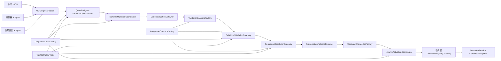
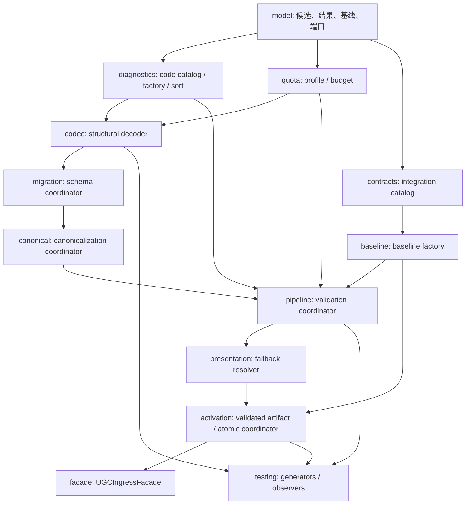

# Design Document: WakeUp UGC Declarative Ingress

## Overview

本设计实现 [requirements.md](requirements.md) 定义的 UGC 声明式定义接入边界。UGC 不是新的运行时语义层，也不是第二套规则引擎；它只把手写 JSON、图形化工具和自然语言适配器产生的候选数据收敛到同一条受限流水线：

```text
不可信来源
  → 有界 JSON 词法/结构解码
  → Schema 版本选择与可信文档迁移
  → 确定性规范化
  → 基类层统一 Definition_Validator
  → 基类层统一 Reference_Resolver
  → 基类层统一 Definition_Registry 原子激活
```

UGC 模块的实现落点为 `src/core/ugc/`。该目录拥有接入编排、技术配额预算、验证基线、跨领域契约目录、诊断投影和提交协调；它不拥有 Def kind、Ref 前缀、Op、Expr、Hook、事务、运行时状态、玩法包生命周期或宿主持久化语义。统一的 `JSON_Codec`、`Definition_Validator`、`Reference_Resolver` 和 `Definition_Registry` 仍由基类层拥有，UGC 通过冻结端口消费它们。

本设计不假定 core mechanics、space-items、AI 的最终字段形状。三者仅以版本化 `IntegrationContract` 提供可引用 Def kind、语义族和约束；契约缺失、冲突或版本变化时失败关闭。所有玩法数值、胜负规则、具体地图与玩法包配置仍属于玩法层。

### Goals

1. 所有创作来源只能产生候选声明式 JSON，并经过完全相同的解码、迁移、验证、引用解析和激活门禁。
2. 在普通 JSON 对象物化前检测重复成员、输入大小和恶意深度，且在每个后续阶段持续执行可信技术配额。
3. 只接受已登记 Schema、Def kind、数值分类、组合规则和类型化引用；任何未知或歧义语义失败关闭。
4. 使规范化 JSON、诊断、依赖图、验证结果和激活快照在相同基线下确定且可重现。
5. 通过不可伪造的 `ValidatedChangeSet` 和提交时基线复检保证候选全成或全败。
6. 语义字段无条件严格拒绝；只有 Schema 明确允许的非语义表现资源可产生可观察警告和类型兼容回退。
7. 为错误码、领域契约和宿主配额保留显式待汇合门禁，不用局部约定或自由字符串绕过上游缺口。

### Non-goals

- 不实现编辑器 UI、自然语言模型对话、发布分发、社区审核、网络、商业系统或宿主持久化。
- 不执行候选中的任何代码、函数、脚本、动态表达式语言、命令式循环或外部命令。
- 不新增 Ref 前缀、Def kind 注册表、Op 分发、Expr 求值、Hook 调度、事务或运行时写入路径。
- 不复制基类层的定义语义、继承/组合求值、引用解析或注册表实现。
- 不为 core mechanics、space-items、AI 推断字段、标识符或语义族。
- 不在本设计中确定部署配额数值、玩法平衡数值或错误类别尚未登记的具体稳定代码。

## Existing System Assessment

当前仓库已经存在部分可复用基础，但尚不存在可满足本 Spec 的 UGC 完整链路：

| 现有能力 | 位置 | 可复用部分 | 不能直接承担的职责 |
|---|---|---|---|
| `DefRegistry` | `src/core/kernel/state/def.ts` | Def kind、继承展开、部分环检测、纯读查询 | `register` 是逐项可变写入，重复 ID 会覆盖，缺少完整 Schema/引用/依赖重验和批量原子激活；UGC 不得直接调用其写入口 |
| `Diagnostic` | `src/core/kernel/state/diagnostic.ts` | 封闭错误码、severity、scope、来源跨度、expected/actual、root-cause 字段 | 现有字段多为可选；UGC 必须经统一工厂按 scope 补齐强制字段并确定排序 |
| `ERR_CODES` / `HINT_TEMPLATES` | `src/core/kernel/state/error-codes.ts`、`src/core/kernel/safety/safety.ts` | 已登记 JSON、Schema、身份、基线、激活、迁移、细粒度配额、层级归属（`E_LOAD_LAYER_OWNERSHIP`）、数值归属（`E_LOAD_NUMERIC_OWNERSHIP`、`E_LOAD_GAMEPLAY_VALUE_RANGE`）、继承环（`E_LOAD_INHERITANCE_CYCLE`）、组合冲突（`E_LOAD_COMPOSITION_CONFLICT`、`E_LOAD_ORDER_UNDECLARED`）、语义损坏（`E_LOAD_SEMANTIC_FIELD_DAMAGED`）和表现回退（`E_LOAD_PRESENTATION_FALLBACK`）代码及对应 hint | 只有 `migrationSteps` 精确配额代码（`E_QUOTA_MIGRATION_STEPS`）确认缺失；共享 `Diagnostic.at`/`path` 仍是可选字段而非可空字段，无法表达结构上适用但为空的显式 null |
| `src/core/kernel/spec-compiler/`、`src/class/specification-compiler/` | 见下方脚注 | 展示了候选校验/原子注册表可能的实现形状，`AtomicDefinitionRegistry` 有真实 prepare/commit CAS 和依赖图重验 | 两者均未被任何 `.kiro/specs` 认领为交付物，零生产代码引用；前者仅有的测试部分失败，后者零测试覆盖；不得作为已冻结基类层端口直接依赖 |
| `DiagnosticSink` / `Linter` | `src/core/kernel/safety/safety.ts` | 诊断收集、fatal 规则、部分引用/循环/Flow/配额检查 | `Linter` 只覆盖部分规则，`DiagnosticSink` 的去重键不足以表达 JSON path；不能代替统一 Definition Validator |
| `QuotaEnforcer` | `src/core/kernel/safety/safety.ts` | 三类运行时/Def 数量配额 | 不覆盖输入字节、深度、成员、AST、引用边、遍历工作、诊断和输出字节预算 |
| `MigrationDef` | `src/core/kernel/persistence/persistence.ts` | 可信运行时状态迁移、版本比较、失败保持旧状态 | `transform` 是可信宿主代码，绝不能由 UGC JSON 提供；文档 Schema 迁移和存档迁移必须分离 |
| 测试设施 | `src/core/kernel/testing`、Vitest、fast-check | 生成、完整 harness、性质测试 | 尚无 UGC 候选生成、阶段故障注入和原子注册表观察接口 |

因此实现必须通过端口适配未来/并行完成的基类层组件。端口不可用时返回 `E_LOAD_UNRESOLVED_CONTRACT`，不能回退到直接调用现有 `DefRegistry.register`、局部 `Linter` 或自行写入 `WorldState`。

## Architecture

### Boundary topology



候选从入口到激活始终是不可变值。每个阶段只返回新值、诊断和消耗后的预算，不共享可写解析树、图或注册表。`ValidatedChangeSet` 只能由内部工厂在全部强制阶段成功后构造，并绑定候选规范化指纹与验证基线；外部调用者不能用类型断言或来源标签跳过门禁。

### Ownership and dependency boundaries

| 能力 | 所有者 | UGC 使用方式 | 缺失时行为 |
|---|---|---|---|
| JSON Schema、字段分类、Def kind、继承/组合契约 | 基类层 | `DefinitionValidationGateway` | 拒绝验证启动 |
| 类型化引用与依赖图 | 基类层 | `ReferenceResolutionGateway` | 拒绝依赖候选 |
| 定义注册与原子激活 | 基类层 | `DefinitionRegistryGateway` | 禁止激活 |
| Ref、Op、Expr、Hook、事务、诊断代码族 | 引擎层 | 只导入类型或转交声明 | 禁止局部替代 |
| 存档/玩法包迁移与对局生命周期 | 引擎层 | `RuntimeCompatibilityGateway` | 保留上游拒绝，不执行迁移 |
| 文档 Schema 迁移 | UGC 接入边界 + 可信宿主注册 | `SchemaMigrationGateway` 对隔离 JSON AST 做纯转换 | 无唯一迁移链则拒绝 |
| core mechanics、space-items、AI 导出能力 | 对应领域 | `IntegrationContractCatalog` | 依赖该能力的候选拒绝 |
| 具体玩法数值、胜负规则和玩法包配置 | 玩法层 | 作为目标层为玩法层的候选进入统一验证 | 越层候选拒绝 |
| 技术配额具体值 | 可信宿主 | 注入 `TrustedQuotaProfile` | 缺少必需项时拒绝验证启动 |

### Module dependency DAG



依赖只能沿箭头方向。`codec` 不知道 Def 语义；`migration` 不知道注册表；`pipeline` 不实现基类层验证规则；`activation` 不解析 JSON；`facade` 不拥有任何旁路。所有模块共享同一诊断工厂、配额预算和稳定排序规则。

## Components and Interfaces

以下 TypeScript 形状描述 UGC 本地契约。`Diagnostic`、`ErrCode`、Def 标识和基类层候选/解析结果均从上游稳定导出导入，不在 UGC 复制。示例中的 `JsonAst` 是保留重复成员和来源跨度的纯 JSON 语法树，不是引擎层 Expr AST。

### 1. Candidate ingress and source envelope

```typescript
type CandidateSourceKind = 'hand-authored' | 'editor' | 'natural-language-adapter' | 'import';
type TargetOwnership = 'base-layer' | 'play-layer';
type ChangeOperation = 'add' | 'replace' | 'remove';

interface CandidateSource {
  readonly kind: CandidateSourceKind;
  readonly documentId: string;
  readonly packageId: string;
  readonly sourceName: string;
  readonly receivedAtSequence: number; // 内部度量，不进入规范化 JSON
}

interface CandidateDocument {
  readonly source: CandidateSource;
  readonly targetOwnership: TargetOwnership;
  readonly utf8: Uint8Array;
}

interface CandidateChangeRequest {
  readonly operation: ChangeOperation;
  readonly document: CandidateDocument;
  readonly expectedTargetId?: string;
}

interface UGCAdapter<Input> {
  toCandidate(input: Input, source: CandidateSource, target: TargetOwnership): CandidateDocument;
}
```

Adapter 只产生字节与来源元数据。接口中没有 `validated`、`trusted`、`activate`、`WorldState`、`OpRegistry` 或注册表写能力。`receivedAtSequence` 只用于宿主审计，不参与规范化、候选身份或诊断稳定排序。

### 2. Trusted quota profile and monotonic budget

```typescript
interface TrustedQuotaProfile {
  readonly profileId: string;
  readonly version: string;
  readonly inputBytes: number;
  readonly nestingDepth: number;
  readonly objectMembers: number;
  readonly arrayElements: number;
  readonly sourceRecords: number;
  readonly astNodes: number;
  readonly definitions: number;
  readonly referenceEdges: number;
  readonly traversalWork: number;
  readonly diagnostics: number;
  readonly migrationSteps: number;
  readonly outputBytes: number;
}

type QuotaKind = Exclude<keyof TrustedQuotaProfile, 'profileId' | 'version'>;

interface QuotaBudget {
  consume(kind: QuotaKind, amount: number, at?: SourceSpan): Result<void>;
  used(kind: QuotaKind): number;
  limit(kind: QuotaKind): number;
  snapshot(): Readonly<Record<QuotaKind, { used: number; limit: number }>>;
}
```

配额值必须是可信宿主提供的有限非负整数；候选字段不能修改它们。预算只增不减，溢出使用无符号安全加法并立即终止受影响遍历。诊断配额耗尽时只追加一个终止性 `E_QUOTA_DIAGNOSTICS`，记录已收集数和至少被抑制数，不继续创建无界诊断。

### 3. Structural JSON decoder

```typescript
interface JsonMember {
  readonly key: string;
  readonly keySpan: SourceSpan;
  readonly value: JsonAst;
}

type JsonAst =
  | { readonly kind: 'null'; readonly span: SourceSpan }
  | { readonly kind: 'boolean'; readonly value: boolean; readonly span: SourceSpan }
  | { readonly kind: 'number'; readonly lexical: string; readonly value: number; readonly span: SourceSpan }
  | { readonly kind: 'string'; readonly value: string; readonly span: SourceSpan }
  | { readonly kind: 'array'; readonly elements: readonly JsonAst[]; readonly span: SourceSpan }
  | { readonly kind: 'object'; readonly members: readonly JsonMember[]; readonly span: SourceSpan };

interface ParsedCandidateDocument {
  readonly source: CandidateSource;
  readonly targetOwnership: TargetOwnership;
  readonly schemaVersion: string;
  readonly ast: JsonAst;
}

interface StructuralJsonDecoder {
  decode(document: CandidateDocument, budget: QuotaBudget): Result<ParsedCandidateDocument>;
}
```

解码器采用单遍、显式栈或有界递归实现，在普通对象物化前检查 UTF-8 字节、语法、深度、节点、对象成员、数组元素、重复成员名和有限数字。重复成员诊断必须同时指向首次和冲突位置。禁止构造不能被 JSON 表示的 `NaN`/Infinity。

“禁止执行构造”不是字符串黑名单：解码器绝不执行字符串；后续 closed Schema 和引擎层效果契约按字段语义拒绝 `eval`、脚本、函数、外部命令、变量赋值、未登记表达式语言和命令式循环。普通描述文本中出现相同单词不能被误判。

### 4. Schema migration and canonicalization

```typescript
interface SchemaVersionCatalog {
  readonly catalogVersion: string;
  supports(version: string): boolean;
  compare(left: string, right: string): number;
}

interface TrustedSchemaMigration {
  readonly id: string;
  readonly from: string;
  readonly to: string;
  transform(ast: JsonAst): Result<JsonAst>;
}

interface SchemaMigrationGateway {
  resolveUniquePath(from: string, to: string, maxSteps: number): Result<readonly TrustedSchemaMigration[]>;
}

interface MigratedCandidateDocument extends ParsedCandidateDocument {
  readonly originalSchemaVersion: string;
  readonly appliedMigrationIds: readonly string[];
}

interface CanonicalizationGateway {
  canonicalize(candidate: MigratedCandidateDocument, budget: QuotaBudget): Result<CanonicalCandidate>;
}

interface CanonicalCandidate {
  readonly source: CandidateSource;
  readonly targetOwnership: TargetOwnership;
  readonly schemaVersion: string;
  readonly canonicalJson: string;
  readonly canonicalFingerprint: string;
  readonly decodedValue: unknown; // 仅传给冻结的基类层端口
  readonly migrationIds: readonly string[];
}

interface ChangeRequestBinding {
  readonly candidateFingerprint: string;
  readonly sourcePackageId: string;
  readonly sourceDocumentId: string;
  readonly targetOwnership: TargetOwnership;
  readonly operation: ChangeOperation;
  readonly expectedTargetId: string | null;
}

interface CanonicalizedChangeRequest {
  readonly candidate: CanonicalCandidate;
  readonly binding: ChangeRequestBinding;
  readonly changeRequestFingerprint: string;
}
```

文档迁移只使用宿主注册的可信、纯、确定性转换；候选不能携带转换函数或注册迁移边。协调器先验证迁移图无重复边、分支歧义和环，再在隔离 AST 上逐步转换；每一步消耗迁移和遍历预算。迁移成功后仍须重新执行当前 Schema 的完整解码约束、规范化、验证和引用解析。

规范化键排序使用按 Unicode code point 的固定总序，不依赖 locale。数组默认保持输入顺序；只有 Schema 明确声明为无序且提供稳定语义身份的集合可排序。输出不注入时间、随机 ID、宿主路径或 Adapter 信息。`canonicalFingerprint` 由注入的稳定指纹器计算，只表示规范化内容，不作为来源真实性签名。

协调器随后以域分隔、长度前缀的稳定编码组合 `candidateFingerprint`、`sourcePackageId`、`sourceDocumentId`、`targetOwnership`、`operation` 和规范化为 `null` 的可选 `expectedTargetId`，计算 `changeRequestFingerprint`。它绑定“哪份来源文档对哪个注册表执行什么变更”，并进入验证报告与内部激活凭据；`source.kind`、`sourceName` 和 `receivedAtSequence` 不参与该指纹，因而审计顺序或 Adapter 展示名不会改变语义身份。

引擎层 `MigrationDef` 继续只处理可信运行时状态迁移。UGC 对玩法包/存档兼容声明只调用 `RuntimeCompatibilityGateway`，绝不把候选 JSON 转成 `MigrationDef.transform`。

### 5. Integration contract catalog

```typescript
type IntegrationDomain = 'core-mechanics' | 'space-items' | 'ai';

interface IntegrationContract {
  readonly domain: IntegrationDomain;
  readonly providerId: string;
  readonly version: string;
  readonly exportedDefKinds: readonly string[];
  readonly exportedSemanticFamilies: readonly string[];
  readonly referenceConstraintsFingerprint: string;
  readonly sourceRecords: readonly SourceRecordHandle[];
}

interface IntegrationContractCatalog {
  snapshot(): IntegrationContractSnapshot;
  resolve(domain: IntegrationDomain): Result<IntegrationContract>;
  resolveExport(domain: IntegrationDomain, identity: string): Result<ResolvedContractExport>;
}

interface IntegrationContractSnapshot {
  readonly catalogVersion: string;
  readonly contracts: readonly IntegrationContract[];
  readonly fingerprint: string;
}
```

目录只保存提供方导出的类型身份和引用约束，不保存领域内部求值逻辑。一个领域缺失、同一身份被多个提供方声明、导出不存在或版本不兼容时使用结构化拒绝。契约更新只使旧验证基线失效，不自动重新激活历史候选。

### 6. Upstream definition ports

```typescript
interface DefinitionValidationGateway {
  validate(
    request: CanonicalizedChangeRequest,
    context: DefinitionValidationContext,
    budget: QuotaBudget,
  ): ValidationStageResult;
}

interface ReferenceResolutionGateway {
  resolve(
    validated: UpstreamValidatedCandidate,
    activeSnapshot: DefinitionRegistryReadSnapshot,
    contracts: IntegrationContractSnapshot,
    budget: QuotaBudget,
  ): ReferenceStageResult;
}

interface DefinitionRegistryGateway {
  readSnapshot(): DefinitionRegistryReadSnapshot;
  activateAtomically(change: ValidatedChangeSet, expected: ValidationBaseline): ActivationResult;
}

interface RuntimeCompatibilityGateway {
  validatePlaypackOrSaveDeclaration(value: unknown): Result<void>;
  rejectActiveMatchReplacement(request: unknown): Result<never>;
}
```

`DefinitionValidationGateway` 是所有来源唯一的 Definition Validator 入口，必须检查 closed Schema、字段类型、Def kind、ID、层级、数值分类、继承/组合、语义/表现字段和完整错误聚合。`ReferenceResolutionGateway` 负责类型化目标、歧义、错型、入边闭包、引用/包环和确定性图；继承环由统一验证器负责，文档迁移环由迁移协调器负责。

UGC 不得在端口不可用时调用 `DefRegistry.register` 或 `Linter.run` 近似代替。实际适配器必须证明基类层注册表提供批量原子激活；当前内核 `DefRegistry` 不满足该契约。

### 7. Validation baseline and pipeline

```typescript
interface ValidationBaseline {
  readonly definitionRegistryVersion: string;
  readonly schemaCatalogVersion: string;
  readonly integrationContractFingerprint: string;
  readonly diagnosticCatalogVersion: string;
  readonly quotaProfileId: string;
  readonly quotaProfileVersion: string;
  readonly fingerprint: string;
}

type ValidationStage =
  | 'ingress'
  | 'decode'
  | 'schema-migration'
  | 'canonicalize'
  | 'definition-validation'
  | 'reference-resolution'
  | 'presentation-resolution'
  | 'activation-precheck';

interface SkippedCheck {
  readonly stage: ValidationStage;
  readonly checkId: string;
  readonly blockedByDiagnosticId: string;
}

interface ValidationReport {
  readonly baseline: ValidationBaseline;
  readonly candidateFingerprint?: string;
  readonly changeRequestFingerprint?: string;
  readonly changeRequestBinding?: ChangeRequestBinding;
  readonly diagnostics: readonly Diagnostic[];
  readonly skippedChecks: readonly SkippedCheck[];
  readonly budget: Readonly<Record<QuotaKind, { used: number; limit: number }>>;
  readonly status: 'rejected' | 'validated';
  readonly validated?: ValidatedChangeSet;
}

interface UGCValidationCoordinator {
  validate(request: CandidateChangeRequest): ValidationReport;
}
```

流水线使用阶段 DAG，而非发现第一个错误就无条件终止。只要输入仍有安全、确定的结构，就继续执行彼此独立的检查；依赖已失败数据的检查记录 `SkippedCheck` 并关联根诊断。语法失败、配额耗尽或迁移图不可用等根错误可以阻断后续阶段。诊断聚合受诊断配额限制并按规范顺序输出。

数值验证完全委托上游 Schema 分类：`Gameplay_Value` 仅允许玩法层且为有限 1–5；`Internal_Metric`、`Structural_Bound`、`Constitutional_Constant`、`Technical_Quota` 使用各自 Schema。单位字符串不能改变分类。基类层候选出现具体玩法数值或具体玩法规则必须拒绝。

### 8. Presentation fallback resolver

```typescript
interface PresentationFallbackDecision {
  readonly definitionId: string;
  readonly jsonPath: string;
  readonly missingAsset: string | null;
  readonly fallbackAsset: string;
  readonly semanticFingerprintBefore: string;
  readonly semanticFingerprintAfter: string;
}

interface PresentationFallbackResolver {
  resolve(
    validated: UpstreamValidatedCandidate,
    schema: UpstreamSchemaView,
  ): Result<{ readonly candidate: UpstreamValidatedCandidate; readonly decisions: readonly PresentationFallbackDecision[] }>;
}
```

只有 Schema 明确标记为 optional、presentation-only 且提供类型兼容回退契约的资源字段可进入该组件。每次回退必须证明语义指纹前后相同并产生 Warning Diagnostic。名称或文本只有在上游 Schema 证明其不参与标识、查询、可见性、决策或规则时才可被视为表现字段。任何语义字段损坏、无回退、回退类型不兼容或语义指纹变化都转为错误。

解析不修改原始 `CandidateDocument` 或 `CanonicalCandidate`；它产生独立的表现解析结果供激活快照记录。

### 9. Validated artifact and atomic activation

```typescript
declare const validatedChangeSetBrand: unique symbol;

interface ValidatedChangeSet {
  readonly [validatedChangeSetBrand]: true;
  readonly candidateFingerprint: string;
  readonly changeRequestFingerprint: string;
  readonly changeRequestBinding: ChangeRequestBinding;
  readonly baselineFingerprint: string;
  readonly targetOwnership: TargetOwnership;
  readonly upstreamValidated: UpstreamValidatedCandidate;
  readonly resolvedReferences: UpstreamResolvedReferenceGraph;
  readonly presentationDecisions: readonly PresentationFallbackDecision[];
  readonly warnings: readonly Diagnostic[];
}

interface ActivationResult {
  readonly status: 'activated' | 'rejected';
  readonly baseline: ValidationBaseline;
  readonly candidateFingerprint: string;
  readonly changeRequestFingerprint: string;
  readonly diagnostics: readonly Diagnostic[];
  readonly previousSnapshotFingerprint: string;
  readonly activeSnapshotFingerprint: string;
  readonly unchanged: boolean;
}

interface AtomicActivationCoordinator {
  activate(validated: ValidatedChangeSet): ActivationResult;
}
```

工厂只在全部错误为空、引用图完成、表现回退语义不变时创建 branded artifact。工厂从内部保存的规范化请求重算 `changeRequestFingerprint`，并逐字段核对绑定中的候选内容、稳定来源文档身份、目标层、操作和预期目标 ID；不能只信任调用方传入的摘要。激活前再次重算该指纹，并重新读取 Schema、契约、错误目录、配额配置和目标定义注册表版本；请求绑定不一致或任何基线变化都返回 `E_LOAD_BASELINE_STALE`，要求从原始候选完整重验。内容相同但来源文档、操作、预期目标或目标注册表不同的验证产物同样不可复用。

提交只调用一次 `DefinitionRegistryGateway.activateAtomically`。注册表必须在内部工作副本完成新增、覆盖、删除、入边重验和快照生成，然后以 compare-and-swap 语义发布；失败时返回与旧快照相同的指纹。UGC 不执行 Op、不写 WorldState、不注册 Hook、不推进迁移、不写宿主持久化，也不向查询暴露半验证定义。

### 10. Diagnostics

```typescript
type UGCDiagnosticCategory =
  | 'JSON_SYNTAX'
  | 'PROHIBITED_CONSTRUCT'
  | 'SCHEMA_CONTRACT'
  | 'IDENTITY_CONFLICT'
  | 'LAYER_L1_OWNERSHIP'
  | 'LAYER_L3_OWNERSHIP'
  | 'VALUE_L3_OWNERSHIP'
  | 'VALUE_CLASSIFICATION_MISSING'
  | 'REFERENCE_CONTRACT'
  | 'COMPOSITION_CONFLICT'
  | 'RESOURCE_LIMIT'
  | 'VERSION_COMPATIBILITY'
  | 'ATOMIC_ACTIVATION'
  | 'PRESENTATION_FALLBACK';

interface DiagnosticCodeCatalog {
  readonly version: string;
  resolve(category: UGCDiagnosticCategory, condition: string): Result<ErrCode>;
  severity(code: ErrCode): Severity;
  hint(code: ErrCode): string | null;
}

interface UGCDiagnosticFactory {
  document(input: DocumentDiagnosticInput): Diagnostic;
  definition(input: DefinitionDiagnosticInput): Diagnostic;
  changeSet(input: ChangeSetDiagnosticInput): Diagnostic;
  registry(input: RegistryDiagnosticInput): Diagnostic;
}
```

具体已有映射如下。`src/core/kernel/state/error-codes.ts` 的封闭 `ERR_CODES` 枚举和 `src/core/kernel/safety/safety.ts` 的 `HINT_TEMPLATES` 已经登记了本设计所需的绝大多数成员并配有 hint；这是与具体消费者实现是否接入无关的共享契约本身。UGC 只消费，不新增枚举成员：

| 条件 | 已有稳定代码 / 状态 |
|---|---|
| JSON 语法 | `E_LOAD_JSON_SYNTAX` |
| 重复成员 | `E_LOAD_DUPLICATE_MEMBER` |
| 禁止执行构造 | `E_LOAD_PROHIBITED_CONSTRUCT` |
| Schema / 未知字段 / 非法 kind | `E_LOAD_SCHEMA_CONTRACT`（细分可用 `E_LOAD_UNKNOWN_FIELD`、`E_LOAD_REQUIRED_FIELD`、`E_LOAD_FIELD_TYPE`、`E_LOAD_DEF_KIND`） |
| 重复或歧义 ID | `E_LOAD_IDENTITY_CONFLICT`（细分可用 `E_LOAD_DUPLICATE_ID`、`E_LOAD_IDENTIFIER_INVALID`、`E_LOAD_OVERRIDE_INVALID`） |
| 未汇合领域契约 | `E_LOAD_UNRESOLVED_CONTRACT` |
| 缺失/歧义/错型引用 | `E_LOAD_UNDEFINED_REF` / 上游精确 `E_REF_MISSING`、`E_REF_KIND`、`E_REF_AMBIGUOUS`、`E_REF_PROVIDER_CONTRACT`、`E_REF_CYCLE` |
| 层级归属（L1 机制越权、基类/玩法层混入） | `E_LOAD_LAYER_OWNERSHIP` |
| 数值归属/分类（未分类、玩法数值出现在错误层级、超出 1–5） | `E_LOAD_NUMERIC_OWNERSHIP`（分类完全缺失同样使用该代码，范围违规使用 `E_LOAD_GAMEPLAY_VALUE_RANGE`） |
| 继承环 | `E_LOAD_INHERITANCE_CYCLE` |
| 组合冲突（非环的不兼容/未声明顺序） | `E_LOAD_COMPOSITION_CONFLICT`（未声明顺序依赖使用 `E_LOAD_ORDER_UNDECLARED`） |
| 语义字段损坏 | `E_LOAD_SEMANTIC_FIELD_DAMAGED` |
| 表现资源回退警告 | `E_LOAD_PRESENTATION_FALLBACK` |
| 基线过期 | `E_LOAD_BASELINE_STALE` |
| 激活失败 | `E_LOAD_ACTIVATION_FAILED` |
| Schema 迁移 | `E_MIG_NO_PATH`、`E_MIG_NEWER_SAVE`、`E_MIG_FAILED`、`E_MIG_AMBIGUOUS_PATH`、`E_MIG_CYCLE` |
| 技术配额 | 输入字节、深度、成员、数组、来源记录、AST、定义、引用边、遍历、诊断和输出分别使用已登记的精确 `E_QUOTA_*` 成员；`migrationSteps` 尚无共享 `E_QUOTA_MIGRATION_STEPS`，登记前该超限路径不可启用 |

任务 1.3 只需核实上述映射的 severity/hint 完整性、把它们的版本纳入 Validation Baseline，并跟踪唯一真正缺失的两项：`migrationSteps` 的精确配额代码，和下面的诊断定位可空性扩展。不得因为大部分代码已存在就跳过核实步骤，也不得因为个别代码未闭合就把已闭合的代码重新标记为待汇合。

诊断公共字段为 code、severity、scope、来源包/文档、reason 和 correction suggestion。definition scope 还要求 definition ID、JSON path、source span；document scope 使用文档与解析位置；change-set scope 使用候选/配额上下文；registry scope 使用 expected/actual baseline。结构上不适用的定位字段显式为 null。

该显式空值要求必须通过扩展共享 `Diagnostic` 形状完成，而不是在 UGC 内创建第二种诊断或平行通道。当前共享 `Diagnostic.at?: { def?: Id; field?: string; playpack?: Id }` 与 `path?: string` 是可选字段（`undefined`），不能表达结构上确定适用但取值为空的显式 `null`；集成前必须将这些字段的类型扩展为允许 `null`，或在同一个共享 `Diagnostic` 上增加等价的规范化可空定位字段，并同步工厂、排序、序列化、去重和消费者契约。已有 `sourcePackage` / `sourceSpan` 已经声明为 `string | null` / `SourceSpan | null`，可作为扩展 `at`/`path` 时的一致性参照。

确定性排序键为：`sourcePackage/document → sourceSpan.start.offset(null last) → definitionId(null last) → jsonPath(null last) → code → rootCauseId`。不同 Adapter 的等价诊断比较忽略合法不同的来源身份值，但比较 code、severity、scope、reason class、JSON path、expected/actual 和相对排序。

## Main Flows

### Hand-authored or adapter candidate validation

```text
receive immutable CandidateDocument
  → require complete TrustedQuotaProfile and DiagnosticCodeCatalog
  → bounded structural decode with duplicate-member preservation
  → select exact Schema version
  → if old: resolve one unique trusted migration path and transform isolated AST
  → if new/unsupported/ambiguous/cyclic: reject
  → validate current Schema shape and canonicalize deterministically
  → derive ChangeRequestBinding and changeRequestFingerprint from canonical content, stable source package/document identity, target ownership, operation and expected target
  → capture ValidationBaseline and IntegrationContractSnapshot
  → invoke the one DefinitionValidationGateway
  → invoke the one ReferenceResolutionGateway
  → resolve eligible presentation resources and prove semantic fingerprint unchanged
  → aggregate/sort diagnostics and skipped checks
  → on any error: return rejected report with no active-state access
  → otherwise mint ValidatedChangeSet bound to candidate and baseline
```

Adapter 和手写入口从 `CandidateDocument` 开始完全共路。来源身份只进入审计和诊断，不改变 Schema、配额、严重级别或验证规则。

### Atomic activation

```text
accept only internally branded ValidatedChangeSet
  → recompute and compare changeRequestFingerprint from the sealed request binding
  → re-read registry/schema/contracts/code-catalog/quota versions
  → compare every version with ValidationBaseline
  → mismatch: E_LOAD_BASELINE_STALE, unchanged snapshot
  → match: call DefinitionRegistryGateway.activateAtomically exactly once
  → gateway rechecks inbound dependents and complete candidate graph
  → failure: old registry/graph/snapshot retained
  → success: complete new registry/graph/snapshot becomes visible together
```

### Presentation resource fallback

```text
locate field through current Schema
  → not optional or not presentation-only: semantic rejection
  → no registered type-compatible fallback: reject if required, otherwise omit without semantic change
  → resolve fallback in isolated presentation result
  → compare semantic fingerprint before/after
  → changed: reject
  → unchanged: emit warning with original and fallback identity
```

### Compatibility forwarding

```text
Schema document version → trusted SchemaMigrationGateway
Playpack/save declaration → RuntimeCompatibilityGateway
active-match replacement → RuntimeCompatibilityGateway rejection
```

三条路径不能互相调用。候选不能把文档迁移升级为运行时状态迁移，也不能通过兼容声明触发宿主持久化。

## Security and Failure-Closed Invariants

1. **Inert input:** Candidate bytes are never executed, imported, evaluated or passed to a shell/process API.
2. **Single validation route:** Every source enters one coordinator and one upstream Definition Validator; no trusted-source exemption exists.
3. **No direct activation:** Only branded `ValidatedChangeSet` reaches atomic activation.
4. **No runtime write capability:** UGC public APIs do not accept or expose `WorldState`, mutable registry values, `OpRegistry`, Hook or persistence writers.
5. **Closed schema:** Unknown fields fail unless the exact object Schema explicitly declares an open property map.
6. **Bounded work:** Every parse, migration, graph walk, diagnostic and output operation consumes a trusted monotonic budget.
7. **Request and baseline binding:** Canonical content, stable source package/document identity, target ownership, operation and expected target ID are bound by `changeRequestFingerprint`; every registry/catalog/profile version is separately rechecked at commit.
8. **Semantic strictness:** Semantic damage never receives fallback, old-value copying, dropping or coercion.
9. **Contract fail-closed:** Missing domain contract or error code mapping rejects affected validation; local substitutes are forbidden.
10. **Deterministic observability:** Canonical JSON, dependency graph, diagnostics, skipped checks and snapshots have documented total order.

## Correctness Properties

Each property is mandatory and maps to one requirements group. Property tests use Vitest and fast-check, while actual upstream integration is verified by contract and integration tests.

### Property 1: UGC boundary closure

For any candidate or adapter output, requesting a new Ref prefix, Def kind registry, Op/Expr/Hook/transaction/persistence mechanism, direct WorldState write or mixed base/play activation must produce the applicable ownership rejection and zero active changes.

**Validates: Requirements 1, 6**

### Property 2: Declarative JSON safety

For any byte sequence, structural decoding either yields a finite, span-preserving JSON AST within quota or a structured rejection; duplicate members, invalid syntax, nonfinite numbers and prohibited semantic execution constructs never reach activation and never execute.

**Validates: Requirement 2**

### Property 3: Source-route equivalence and no bypass

For any equivalent hand-authored, editor and natural-language-adapter candidate under the same baseline, validation produces equivalent semantic diagnostics and canonical output; changing only source kind cannot mark output validated, suppress errors or activate it.

**Validates: Requirement 3**

### Property 4: Strict Schema and identity

For any current-Schema candidate, acceptance is possible only if every field is admitted by its exact Schema, every Def kind is registered, IDs are unique in scope and overrides identify one compatible authorized target. Unknown fields, duplicate members/IDs and invalid kinds are deterministically rejected.

**Validates: Requirement 4**

### Property 5: Numeric classification and ownership

For any numeric field, exactly one admitted classification controls validation. Gameplay values are finite 玩法层 values in 1–5; internal metrics, structural bounds, constitutional constants and technical quotas use their own Schemas. Units and candidate metadata cannot change classification.

**Validates: Requirement 5**

### Property 6: Base/play separation

For any candidate change set, base-layer definitions contain no concrete gameplay values/rules/configuration, play-layer candidates only compose registered base contracts, and one atomic change set never mutates both registries.

**Validates: Requirement 6**

### Property 7: Typed reference completeness

For any candidate plus active graph, validation succeeds only when every reference has one compatible provider, kind and semantic family, every changed definition’s transitive inbound closure remains valid and no unsupported reference/package cycle exists. Equivalent graph permutations yield the same edges and diagnostics.

**Validates: Requirement 7**

### Property 8: Inheritance and composition determinism

For any lineage and composition set, inheritance cycles and incompatible/undeclared conflicts are rejected; independent compatible components commute, while explicit order dependencies alone may preserve order. No host/file/hash iteration order selects a winner.

**Validates: Requirement 8**

### Property 9: Bounded adversarial processing

For any oversized, deeply nested or high-fan-out candidate, the first exhausted trusted quota terminates the affected bounded traversal, returns the matching resource diagnostic, activates nothing and uses memory/work bounded by the configured input/AST/graph/diagnostic/output limits.

**Validates: Requirement 9**

### Property 10: Semantic rejection and presentation-only fallback

For any missing or illegal semantic field, validation rejects without changing the last valid definition. For any eligible missing presentation resource, fallback is accepted only when type-compatible and semantic fingerprints before/after are equal, with a warning identifying both assets.

**Validates: Requirement 10**

### Property 11: Canonical round-trip and idempotence

For any valid current-Schema candidate, parse–canonicalize–parse yields an Equivalent Definition and repeated canonicalization is byte-identical. Whitespace/object-key/unordered-set permutations normalize equally; semantic array order remains observable.

**Validates: Requirement 11**

### Property 12: Version and migration determinism

For any Schema migration graph, an old candidate migrates only through one complete acyclic path; missing, ambiguous, duplicate, cyclic, failing or newer-version paths reject without mutating original input or active state. Same input and registry produce the same migrated canonical output.

**Validates: Requirement 12**

### Property 13: Atomic activation and stale-baseline rejection

For any validated change set, changing canonical content, stable source package/document identity, target ownership, operation, expected target ID or any baseline component before commit rejects the artifact. A result validated for one change request or target registry cannot authorize another even when canonical content is equal. On current request binding and baseline, gateway failure or any candidate/dependent error leaves registry, dependency graph and canonical snapshot byte-equivalent; success publishes the complete change once.

**Validates: Requirement 13**

### Property 14: Diagnostic completeness and determinism

For any candidate with independent discoverable errors, the report contains all errors permitted by the remaining quota, scope-correct fields, stable codes, actionable hints, deterministic ordering and explicit skipped-check root links. Every rejection contains an error; warnings never mask semantic failure.

**Validates: Requirement 14**

### Property 15: Integration contracts fail closed

For any core mechanics、space-items or AI reference, absence, provider conflict, missing export or version change rejects or invalidates validation without guessing provider shape. Registering a contract never auto-activates previously rejected candidates.

**Validates: Requirement 15**

### Property 16: Test and trace reachability

For every registered Schema and Integration Contract family, the Test Interface can generate valid/invalid candidates and observe decode, migration, canonicalization, validation, resolution and activation without a bypass. Every normative requirement maps to source records, a design property, an implementation task and an automated verification.

**Validates: Requirement 16**

## Error Handling

| Failure | Diagnostic scope/category | Pipeline action | State guarantee |
|---|---|---|---|
| Missing quota profile or code mapping | document / unresolved contract | Validation does not start | No candidate/registry access |
| Invalid UTF-8/JSON syntax | document / JSON syntax | Stop decode | No object materialization |
| Duplicate object member | document / duplicate member | Stop affected document | First and duplicate spans retained |
| Input/depth/node/member/array quota | document or change-set / resource limit | Stop bounded traversal | No partial AST exposed |
| Unsupported/new Schema version | document / version compatibility | Stop before validation | Original bytes unchanged |
| Migration gap/ambiguity/cycle/failure | document / version compatibility | Reject migrated candidate | Original AST and active state unchanged |
| Unknown field/illegal kind/duplicate ID | definition / Schema or identity | Aggregate independent errors | No validated artifact |
| Layer/numeric/composition violation | definition / approved shared category | Aggregate independent errors | No semantic coercion |
| Missing/ambiguous/wrong-type/cyclic reference | definition/change-set / reference | Reject graph and record participants | No partial graph exposed as valid |
| Traversal/diagnostic/output quota | change-set / resource limit | Stop affected work; record skipped checks | No activation |
| Semantic field damage | definition / Schema | Reject | Last valid definition retained |
| Eligible presentation resource missing | definition / presentation warning | Resolve isolated fallback | Semantic fingerprint unchanged |
| Domain contract unavailable | change-set / unresolved contract | Reject dependent candidate | No inferred domain semantics |
| Baseline changed | registry / atomic activation | Require complete revalidation | Registry and snapshot unchanged |
| Atomic registry commit failure | registry / activation failed | Propagate structured rejection | Previous registry/graph/snapshot unchanged |
| Playpack/save or active-match request | registry/host / upstream compatibility | Forward to existing gateway | UGC performs no persistence/lifecycle mutation |

## Testing Strategy

### Test layers

| Test type | Scope | Required evidence |
|---|---|---|
| Unit | quota arithmetic, decoder tokens/spans, migration graph, sort, baseline, fallback eligibility | Exact diagnostics and no hidden mutation |
| Property | Properties 1–16 | Generated valid/invalid cases, deterministic seeds and shrinkable counterexamples |
| Contract | UGC ports to JSON Codec, Definition Validator, Reference Resolver, Registry, runtime compatibility | Same shared types, no alternate implementation, failure-closed absent port |
| Integration | Complete candidate validation and atomic activation with real upstream components when available | No direct `DefRegistry.register`, no WorldState/Op access, baseline recheck |
| Fault injection | Every pipeline stage and atomic commit | Zero partial activation, explicit skipped checks, unchanged snapshots |
| Regression | canonical JSON, diagnostics, dependency graph, activation snapshots | Byte stability for equivalent inputs; semantic changes visible |
| Static architecture | import graph and public API | No imports of mutable WorldState/OpRegistry/persistence writers from public UGC modules |

Every property has one independently named test (`Feature: wakeup-ugc, Property N: ...`). fast-check run counts are test configuration, not gameplay values. Adversarial generators must include malformed UTF-8, duplicate keys, deep arrays/objects, wide objects, repeated references, graph fan-out, migration ambiguity, stale baselines, multiple independent errors and presentation/semantic damage.

Tests must run through the production entry points. Helpers cannot mint branded validation artifacts, mutate the registry, bypass quota accounting or replace stable diagnostics with arbitrary strings. Fault injection is dependency injection at documented ports, not source-specific branches in production code.

### Quality gates

1. `npm run typecheck` passes under strict TypeScript.
2. Targeted UGC unit/property/contract tests pass through `npm test -- --run <path-or-pattern>` or the equivalent non-watch Vitest invocation.
3. `npm test` passes for the full repository.
4. `npm run lint` passes.
5. Static scans find no `eval`、`Function` constructor、process execution、direct WorldState mutation、direct `DefRegistry.register` or UGC-owned Op/Expr/Hook/transaction/persistence implementation.
6. Error-code completeness confirms every mandatory category used by an enabled path resolves to an approved `ErrCode` and hint; missing entries keep that path unavailable.
7. Requirements, properties and tasks trace matrices have no uncovered item.

## Requirements Traceability

| Requirement | Design components | Property | Primary verification |
|---|---|---|---|
| 1 UGC boundary | Ownership table, upstream ports, security invariants | P1 | Static architecture + boundary contract tests |
| 2 pure JSON | StructuralJsonDecoder, prohibited-construct semantic validation | P2 | Decoder unit/PBT/adversarial tests |
| 3 unified ingress | UGCAdapter, UGCValidationCoordinator | P3 | Cross-source equivalence contract test |
| 4 strict Schema/identity | DefinitionValidationGateway | P4 | Schema/ID generated tests |
| 5 numeric ownership | Upstream Schema context, validation coordinator | P5 | Classification boundary PBT |
| 6 base/play split | TargetOwnership, validator/registry ports | P6 | Mixed-layer rejection tests |
| 7 typed references | Integration catalog, ReferenceResolutionGateway | P7 | Graph/dependent-revalidation PBT |
| 8 inheritance/composition | DefinitionValidationGateway, deterministic upstream result | P8 | Cycle/conflict/permutation tests |
| 9 quotas/depth | TrustedQuotaProfile, QuotaBudget, bounded decoder/walks | P9 | Resource-bomb PBT and memory/work assertions |
| 10 strict semantics/fallback | PresentationFallbackResolver | P10 | Semantic-damage/fallback tests |
| 11 canonicalization | CanonicalizationGateway, fingerprint | P11 | Round-trip/idempotence PBT |
| 12 versions/migration | SchemaMigrationGateway, RuntimeCompatibilityGateway | P12 | Migration graph/failure tests |
| 13 atomic activation | ValidationBaseline, ValidatedChangeSet, AtomicActivationCoordinator | P13 | Stale baseline/fault-injection tests |
| 14 diagnostics | Code catalog, factory, sort, skipped checks | P14 | Multi-error/scope/determinism PBT |
| 15 cross-domain contracts | IntegrationContractCatalog | P15 | Missing/conflict/version-change contract tests |
| 16 tests/trace | Test Interface and all quality gates | P16 | Coverage and trace audit |

## Unresolved Integration Boundaries

The following items do not block this design document, but they block corresponding implementation paths from being declared complete:

1. **Base-layer implementation:** `src/l2` is not present at design time (confirmed by repository-wide search). Two unclaimed prototypes exist elsewhere — `src/core/kernel/spec-compiler/` (zero production references outside its own test suite, and not referenced by any `.kiro/specs` task as a completed deliverable) and `src/class/specification-compiler/` (a real prepare/commit compare-and-swap `AtomicDefinitionRegistry` with full dependency-graph/inheritance-cycle recheck, but zero test coverage and not referenced by any `.kiro/specs` task as a completed deliverable; its `SpecificationCompiler` targets the different `l2-base-layer-spec` task 2.3 source-conflict-resolution problem, not UGC candidate validation). Neither qualifies as a frozen base-layer contract: qualification requires Spec ownership, test evidence and path/documentation agreement together, not just plausible-looking or passing-locally code. The Codec/Validator/Resolver/Registry ports must still be frozen and implemented by base-layer work before real activation integration; doubles may support local UGC tests but cannot satisfy the integration gate, and neither existing prototype may be imported as a shortcut.
2. **Atomic registry:** current kernel `DefRegistry` is not a batch atomic Definition Registry and cannot be adapted by merely looping over `register` calls. A real working-copy/compare-and-swap contract is required; `src/class/specification-compiler/definition-registry.ts` demonstrates one possible shape but is not itself an accepted base-layer deliverable per point 1.
3. **Shared diagnostic contracts:** `E_LOAD_LAYER_OWNERSHIP`, `E_LOAD_NUMERIC_OWNERSHIP`, `E_LOAD_GAMEPLAY_VALUE_RANGE`, `E_LOAD_INHERITANCE_CYCLE`, `E_LOAD_COMPOSITION_CONFLICT`, `E_LOAD_ORDER_UNDECLARED`, `E_LOAD_SEMANTIC_FIELD_DAMAGED` and `E_LOAD_PRESENTATION_FALLBACK` are already registered in `ERR_CODES` with hints in `HINT_TEMPLATES` (verified by reading both files); task 1.3 only needs to confirm severity/hint completeness and freeze a version token, not wait for new registration. Two items remain genuinely open: `migrationSteps` quota needs a shared exact quota code (`E_QUOTA_MIGRATION_STEPS` or the approved equivalent, confirmed absent from `ERR_CODES.E_QUOTA`), and the shared `Diagnostic` shape must support explicit `null` for structurally inapplicable `at`/`path` locations — both fields are currently optional (`undefined`-only), not nullable, while `sourcePackage`/`sourceSpan` already use `T | null` as the pattern to follow. Until these two land, affected paths fail closed with unresolved-contract handling; no free-form code or second diagnostic channel is allowed.
4. **Domain contracts:** core mechanics、space-items and AI must export versioned Def kind/semantic family/reference constraints. UGC does not consume their internal requirements or duplicate their semantics.
5. **Trusted quota values:** deployment profiles must provide every required quota and version. This design intentionally sets no default limits.
6. **Schema migration registry:** trusted document migration edges and their version policy must be registered independently from runtime `MigrationDef`; candidate JSON can never register executable transforms.
7. **Runtime compatibility adapter:** playpack/save compatibility and active-match replacement remain owned by the kernel lifecycle/persistence contract. UGC only forwards declarations and preserves rejections.

These boundaries use explicit unavailable results and baseline invalidation. They must not be bypassed by direct Def registration, partial Linter acceptance, old-value fallback, hardcoded domain fields or test-only activation branches.
