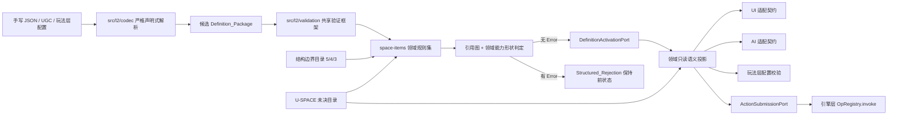
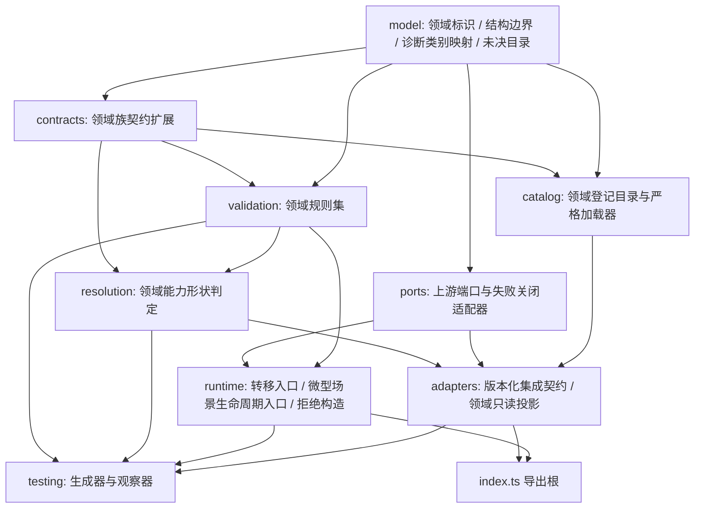
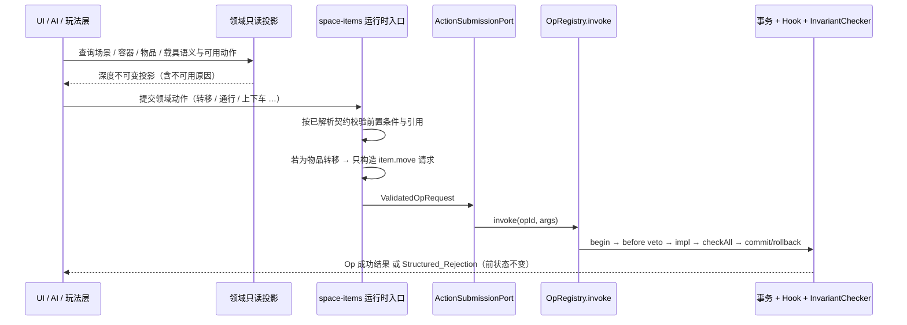

# Design Document: WakeUp 空间与物品基类层

> ## ⚖️ 2026-08-08 裁决落地：R-04 / R-12 / R-14 / R-15 / R-16 / R-06 / R-17 已由项目所有者裁决
>
> 本设计此前把七项冲突登记为"待人工复核、不自行裁决"。项目所有者已在
> `docs/访谈决策记录.md` D-056~D-060 与 `docs/L_审查报告/00_并行产出裁决与整理.md` 中裁决。
> 结论如下（正文相关段落已就地标注，实施以此为准）：
>
> | 复核项 | 原设计取向 | **裁决结论** | 依据 |
> |---|---|---|---|
> | R-14 / R-02（连接数 5 vs 5/4/3） | 保持按档 5/4/3 | **只有 5 是结构边界**；4/3 是玩法层默认平衡值，归玩法层地图 Linter。**代码现状（单一 5）已正确** | D-057 |
> | R-15 / R-16（微型场景父级 / 容纳树） | 不限父级为小场景 | **微型场景可附属大/中/小三档**；三档间的父子关系仅作叙事分组，**不参与距离/生命周期/找到判定**；采图模型不采容纳树 | D-056 |
> | R-12（`interior.isMicroScene` 未决） | 保留为未决参数位 | 按 D-038 **定值 `false`**（载具内部不建模为微型场景）；Q-04 收窄为仅"车内外互攻判定" | D-038 |
> | R-04（死亡容器只出不进机制） | 硬编码 `before-item-move-veto` | 声明层能力组合 + 运行期机制**改为可替换引用** + 灌注时序写进契约。**Hook 接线已就绪**（`wire-hooks.ts` 已存在），R-07 该项非缺口 | D-059 |
> | R-06 / R-17（是否新建 `space-items/`） | 新建含目录的完整领域 | **不新建**：目录数据落 `src/class/<族>/`、规则落已存在的 `src/l2/validation/`、适配落 `src/l2/adapters/`。任务 9 改写为"校验既有目录" | D-058 |
> | U-SPACE-002/005/007 冻结状态 | 按"全未决"实现门禁 | **现行 requirements.md 已同步为部分冻结**；下游门禁需按现行 requirements 收窄，不是保持全未决 | D-040/D-038/D-042 |
>
> **判定原则（D-060）**：玩法层数值不需要宪法逐项授权；文档矛盾应提请裁决而非默认否决；
> S 表不完备不等于无权威。本设计不得再以"文档没写/来源缺失"为由把已批准机制判为违规。

## Overview

本设计实现 [requirements.md](requirements.md) 定义的空间、物品、装备、容器与载具领域契约。它不是第二套运行时，也不是第二套定义系统：本领域只把引擎层已有的 `Node`、`Link`、`Entity`、`Item`、`Container`、`Slot`、`Op`、`Query`、事务与不变量，约束为可复用的语义族、参数 Schema、组合规则与适配接口，并把具体地图、命名实例与全部玩法数值留给玩法层。

```text
玩法层配置（具体地图 / 命名实例 / 全部玩法数值）
  ↓ 只能引用已登记基类与参数 Schema
基类层 · 空间与物品领域（本设计，src/class/space-items/）
  ├─ 领域契约扩展：天然场景 / 微型场景 / 过渡 / 容器 / 物品 / 武器 / 防具 / 移动 / 载具
  ├─ 领域验证规则：层级、数值归属、写入通道、结构边界、未决门禁
  ├─ 领域引用规则：能力形状与语义族兼容性
  └─ 领域适配契约：向 UGC / UI / AI / 玩法层导出的版本化只读契约
  ↓ 只经端口消费，不复制其实现
基类层共享机制（src/l2/）: Definition_Validator 框架、诊断、参数 Schema、族契约、引用图
  ↓ 只经 OpRegistry.invoke 写入，不旁路
引擎层（src/core/kernel/）: Op / 事务 / 不变量 / 拓扑 / 容器 / 查询 / 诊断码
```

### Goals

1. 天然场景、微型场景、过渡、容器、物品、武器、防具、移动与载具的类型身份与能力形状可枚举、可组合、且不含具体玩法语义。
2. 所有运行时语义写入只经 `OpRegistry.invoke`；物品转移只经 `item.move`，不新增任何转移原语。
3. 微型场景的归属与存续只由「有效天然场景父级」与「现查占用关系」决定；`props.creator` 只承担溯源。
4. 大、中、小天然场景连接数上限作为带权威来源的 `Structural_Bound` 固定为 5、4、3，且不因此生成任何具体地图节点。
5. 每个数值字段有唯一归属分类；玩家可见玩法数值只能由玩法层提供且落在 1–5 整数区间；内部度量必须显式标注。
6. `U-SPACE-001` 至 `U-SPACE-007` 保持未决，任何默认化尝试都以可定位的诊断被拒绝。
7. 一切非法输入原子拒绝且保持操作前状态；不存在部分容纳、部分位置、部分转移或部分载具关系。

### Non-goals

- 不定义具体地图布局、出生分布、缩圈顺序、胜负条件、模式序列或命名实例。
- 不填写伤害、命中、成本、容量、耐久、距离、概率、持续时间、阈值等任何玩法数值。
- 不新增 `Def kind`、`Ref` 前缀、Op、Expr 算子、Hook 阶段、事务模型、随机流或持久化机制。
- 不重新实现基类层共享的 `JSON_Codec`、`Definition_Validator` 框架、`Reference_Resolver`、`Definition_Registry`、只读投影或动作提交。
- 不实现 UI 渲染、AI 搜索、UGC 编辑器、网络与持久化。
- 不裁决 `U-SPACE-001`~`U-SPACE-007`，也不为它们提供"临时默认值"。

### 层级定位

本设计位于**基类层**。它在引擎层原语之上组合语义，向玩法层提供可配置接口，三个方向的职责互不侵入：

```text
玩法层  ── 提供具体地图、命名实例与全部玩法数值 ──▶ 只能引用本领域已登记基类与参数 Schema
基类层  ── 本设计所在层：语义族 / 组合规则 / 参数 Schema / 结构边界 / 适配契约
引擎层  ── 提供 Node/Link/Entity/Item/Container/Slot/Op/Query/事务/不变量 ──▶ 本领域只做类型依赖与 Op 引用
```

### 消费清单（依赖但不重新定义）

以下能力由上游拥有。本领域只做类型依赖、接口引用或端口消费；任何重新声明其字段结构、索引策略、执行机制或生命周期实现的候选定义都以层级越界拒绝。

| 来源层 | 消费项 | 拒绝码（若被重定义） |
|---|---|---|
| 引擎层 | `Node`、`Link`、`Entity`、`Item`、`Container`、`Slot`、`Relation` 的结构与索引 | `LAYER_L1_OWNERSHIP` → `E_LOAD_LAYER_OWNERSHIP` |
| 引擎层 | `Query`、`Expr`、`ActionDef`、`Attachment`、`Diagnostic` 的求值与解释规则 | `LAYER_L1_OWNERSHIP` |
| 引擎层 | 事务模型、提交前不变量检查、回滚语义、持久化 | `LAYER_L1_OWNERSHIP` |
| 引擎层 | `OpRegistry.invoke` 作为唯一写入通道 | `OP_BYPASS_FORBIDDEN` |
| 引擎层 | `item.move` 作为**唯一**物品转移原语（拾取/丢弃/装备/卸下/交易/死亡转移均复用它，无独立原语） | `OP_BYPASS_FORBIDDEN` |
| 引擎层 | `ERR_CODES` 错误码目录（本领域**不新增任何成员**） | — |
| 基类层通用 Spec（`src/l2/`） | 定义登记与批量原子激活 | `PENDING_CONVERGENCE`（端口不可用时失败关闭） |
| 基类层通用 Spec | 引用解析与依赖重验证 | 同上 |
| 基类层通用 Spec | 参数 Schema 模型与字段归属分类框架 | 复制实现 → 架构测试失败 |
| 基类层通用 Spec | 来源追踪（`Source_Record`）与诊断模型 | 同上 |
| 基类层通用 Spec | 只读语义投影契约 | 同上 |
| 基类层通用 Spec | 严格声明式 JSON 解析与 UGC 统一入口 | 同上 |

### 拥有清单（本领域自有产物）

| 归属 | 拥有项 |
|---|---|
| 类型身份 | 天然场景三类身份、微型场景语义类型、过渡语义、容器角色、物品族、武器三类身份（近战 / 非枪械远程 / 枪械）、谱型身份、伤害类别语义、防具与盾牌族、移动遍历类型、载具族 |
| 组合规则 | 攻击形状、谱型、距离策略、伤害引用、弹药行为、配件兼容性、动作序列、槽位角色、装备位、附件点、座位角色、货舱、门寻址、邻接与门目标分离 |
| 参数 Schema | 上述各族的可配置参数字段名与其数值归属分类，**不含任何取值** |
| 结构边界 | 大 / 中 / 小天然场景连接数上限 5 / 4 / 3，各带权威来源与结构理由 |
| 领域验证规则 | 层级归属、数值归属、写入通道、结构边界、微型场景附属与生命周期、废案门禁、未决门禁 |
| 领域适配契约 | 向 UGC / UI / AI / 玩法层导出的版本化只读投影与字段来源三态标注 |
| 未决目录 | `U-SPACE-001`~`U-SPACE-007` 的保留接口面、禁止字段面与拒绝码 |

**不属于本领域**：具体地图布局、出生分布、缩圈顺序与范围、胜负条件、模式序列、命名武器 / 防具 / 载具 / 容器实例、以及伤害、命中、成本、容量、耐久、距离、概率、持续时间、阈值的任何取值。

### 实现落点

生产代码与测试同址落在 `src/class/space-items/`。测试必须写为 `src/class/space-items/**/*.test.ts`，因为根 `vitest.config.ts` 只 `include` `src/**/*.test.ts`、根 `tsconfig.json` 只 `include` `src`、lint 为 `eslint src --ext .ts`。本设计不引入独立 `test/` 目录，也不修改这三处配置。

模块导入一律使用相对路径（`../../core/kernel/...`、`../../l2/...`）：`@kernel/*` 别名在本仓库不存在。

## Existing System Assessment

本设计不假设任何尚未存在的能力。下表是核查仓库后的事实基线，全部结论可在所列文件中复现。

### 引擎层（可直接依赖，已实现且有测试）

| 能力 | 位置 | 本设计的使用方式 |
|---|---|---|
| `OpRegistry.invoke<A,T>(name, args): Result<T>` | `src/core/kernel/ops/registry.ts` | 唯一写入通道。**注意其签名没有 `cause` 形参**；因果信息只能经 `src/l2/kernel/op-registry-adapter.ts` 的 `recordCause` 回调交给宿主。 |
| 结构性 Op 全集 | `src/core/kernel/ops/structural-ops.ts` 的 `registerStructuralOps` | 本领域可引用：`entity.create`/`entity.destroy`/`entity.place`/`entity.demote`、`item.create`/`item.destroy`/`item.move`/`item.promote`、`node.create`/`node.destroy`、`link.create`/`link.destroy`、`slot.add`/`slot.del`。全部以 `structural: true` 注册，因此自动套 before/after veto 包装。 |
| `item.move` 语义 | `makeItemMove`（同上） | 参数 `{ itemId, toContainerId, atSlot? }`。缺省槽位线性扫描首个 `accepts` 通过且 `holds` 为空的索引；找不到返回 `E_OP_NO_LEGAL_SLOT` 且**完全不写入**；指定槽位不可用返回 `E_OP_SLOT_FULL`。 |
| 微型场景生命周期 | `src/core/kernel/topology/micro-scene.ts` | `ensureMicroScene` / `onMicroSceneOccupantsChanged` / `checkMicroSceneCapacity` 是**私有纯函数 helper，未注册为 Op**，只在 `entity.place`、`prefab.spawn`/`prefab.despawn` 的 Op 实现内部调用。创建时把触发来源写入 `props.creator`（一次），占用归零时判定卸载。 |
| 微型场景的可操作判据 | `Node.parent !== undefined`（`src/core/kernel/topology/types.ts`、`makeEntityPlace`） | 本领域沿用同一判据，不引入第二个"是否微型场景"的标记字段。 |
| 容器与槽位 | `src/core/kernel/topology/container.ts` | `insertSlot`/`removeSlot`/`findDefaultSlotIndex`/`setSlotHolds`。`insert:'fixed'` 删除留空洞，`insert:'shift'` 用 splice 前移。`Slot.accepts` 为空时接受任意内容。 |
| 拓扑度量 | `src/core/kernel/topology/graph.ts`、`metrics.ts` | `linksTouching` 用于导出连接数（`Internal_Metric`）；`dist`/`shortestPath`/`radius`/`spread` 供玩法层距离策略引用，本领域不重算。 |
| 不变量检查 | `src/core/kernel/ops/invariants.ts` | 每次 `invoke` 提交前运行；`E_INV_*` 为 fatal 且不可被覆盖。本领域直接依赖：`E_INV_DANGLING`、`E_INV_SINGLE_CONTAINMENT`、`E_INV_SINGLE_LOCATION`、`E_INV_LOCATION_EXCLUSIVE`、`E_INV_CONTAINMENT_CYCLE`、`E_INV_TOPOLOGY_CONSISTENCY`、`E_INV_PARENT_CHILD`、`E_INV_CONTAINER_BIDIRECTIONAL`、`E_INV_SLOT_INDEX_CONTINUITY`、`E_INV_ATTACHMENT_CONSISTENCY`。 |
| 错误码目录 | `src/core/kernel/state/error-codes.ts` | `ERR_CODES` 已覆盖本领域所需全部码，**本设计不新增任何成员**。 |
| 严格 JSON 解析 | `src/core/kernel/spec-compiler/json-codec.ts` 的 `StrictJsonCodec` | 经 `src/class/catalog-loader.ts` 的 `parseStrictDataJson` 消费，已被 `src/class/__tests__/formal-data-integrity.test.ts` 覆盖。本领域目录沿用同一条解析链。 |
| 全层合成根 | `src/core/kernel/testing/full-harness.ts` 的 `createFullHarness` | 集成测试据此获得真实接线的 `OpRegistry`（含 Hook 分发），并用 `registry.listOpNames()` 机械校验本领域声明的 Op 名真实存在。 |

### 基类层共享机制（`src/l2/`，已存在的部分）

| 能力 | 位置 | 本设计的使用方式 |
|---|---|---|
| 共享数据模型 | `src/l2/model/{definition,schema,reference,source,diagnostic,ids,json,ordering,immutable}.ts` | 直接复用 `CandidateDefinition`、`ParameterField`、`TypedReference`、`SourceRecord`、`Diagnostic`、`StructuredRejection`、`joinJsonPath`、`canonicalSort`。**不复制这些类型。** |
| 族契约 | `src/l2/model/family-contracts.ts` | 已定义 `NaturalSceneContract`、`MicroSceneContract`、`TransitionContract`、`ItemContract`、`WeaponContract`、`VehicleContract`、`DamageContract`、`MovementContract` 等。本领域**扩展**它们，不另立一套。 |
| 领域验证规则（已有骨架） | `src/l2/validation/spatial-rules.ts`、`item-vehicle-rules.ts` | 已实现天然场景具体节点、小场景共享能力、微型场景 owner/creator 可变性/生命周期依据、过渡端点数、武器具体伤害、护甲减伤引用、死亡容器、载具非实体化、门标识稳定性、邻接与门目标耦合、D-030 策略归属、Q-01/Q-04 未决门禁。本领域**在其之上补齐要求 1–14 未覆盖的检查面**，并把这批已有规则纳入同一执行序。 |
| 验证器框架 | `src/l2/validation/validator.ts` | `buildValidationContext` / `validatePackage` / `DEFINITION_RULES`。本领域以追加规则的方式接入，不新建第二个入口。 |
| 宪法常量 | `src/l2/model/constitution.ts` | `GAMEPLAY_VALUE_RANGE`（1–5）、`NODE_CONNECTION_BOUND`（5）、`SINGLE_WRITE_CHANNEL_SOURCE`、`MICRO_SCENE_ATTACHMENT_SOURCE` 及其 `SourceRecord`。 |
| 诊断代码目录 | `src/l2/model/diagnostic-codes.ts` | 已含 `SPACE_*`、`ITEM_*`、`WEAPON_*`、`VEHICLE_*`、`LAYER_*`、`VALUE_L3_OWNERSHIP` 等。本领域**只消费**，新增领域类别一律映射到既有代码或 `ERR_CODES` 成员。 |
| 引用收集与图 | `src/l2/resolution/{reference-collector,reference-graph}.ts` | 提供候选包引用图构建。本领域只补"领域能力形状兼容性"这一层判定。 |
| 引擎层端口 | `src/l2/kernel/{kernel-contract,op-registry-adapter}.ts` | `KernelContract.invoke` 是本领域唯一可见的写入面；`hookIntegrationAvailable()` 为 false 时依赖 Hook 的路径必须拒绝。 |
| 声明式 JSON 与 UGC 入口 | `src/l2/codec/*`、`src/l2/ugc/ugc-adapter.ts` | 手写与 UGC 输入共用同一解析与验证路径。 |

### 已登记的基类层目录（本领域必须与之对齐，不得另立一套）

`src/class/` 下现存 **14 份** 目录文件，全部经 `src/class/catalog-loader.ts` 的 `parseStrictDataJson` / `parseClassJson` / `parseItemClassCatalog` 解析：

```text
src/class/{actions,attachments,containers,damage-types,gateways,items,movement,
           npcs,scenes,skills,statuses,vehicles,vulnerability-types,weapons}/index.json
src/class/schemas/*.schema.json        # 单记录 JSON Schema，被 Ajv 编译后逐条校验
src/class/catalog-loader.ts            # 严格解析 + 契约校验 + 深度冻结
```

这些目录只声明**能力形状与可配置参数名**，不含玩法取值。本领域与其中五份直接相关：

| 目录 | 与本领域的关系 | 本领域的对齐义务 |
|---|---|---|
| `scenes/index.json` | 天然场景、微型场景与过渡语义（三族、三档 scene 类、9 项能力、5 个值集、结构边界、禁令、Q-04 未决项） | 不得并列出第二套场景分类。**R-14 已裁决（D-057）**：连接数结构边界为**单一 5**，目录现状（`structural-bound.scene.connection_limit = 5`，三档共用）**正确保持**；按档 5/4/3 归玩法层。**R-15 已裁决（D-056）**：微型场景父级为大/中/小三档，需把 `scene.class.large`/`medium` 的 `admitsMicroScene` 改 `true`、`micro-scene.class.contact.admittedParentSceneScales` 改三档；`admittedChildSceneScales` 降级为叙事分组（不参与距离/生命周期/找到）。 |
| `containers/index.json` | 容器与槽位角色 | 容器角色引用其已登记类，不新建平行容器分类 |
| `items/index.json` | 物品类与能力（4 类 + 7 能力，已被现有测试机械锁定数量） | 物品族能力引用其 `classes` / `capabilities` 标识 |
| `weapons/index.json` | 武器类、谱型类、伤害类、重量档、距离档 | 谱型与伤害引用其 `spectrumClasses` / `damageClasses`；只用 `configurableParameterNames`（如伤害量、AP 成本的**字段名**），不写取值 |
| `vehicles/index.json` | 载具类与 21 项能力 | 座位、货舱、门寻址、邻接交互、门目标交互一律引用其能力标识；邻接与门目标的**独立组合**约束已由其 `interactionSeparationContract` 与 `prohibition.vehicle.adjacency_coupled_to_door` 登记 |

**`vehicles/index.json` 已存在的 `interior.isMicroScene` 参数位（重要）**：`vehicle.class.land` 的 `configurableParameters` 现含 `interior.interactionModel` 与 `interior.isMicroScene` 两项；同文件 `unresolvedItems` 已把 `Q-04` 登记为未决，并明确其处理方式是"只保留这两个可配置参数名，不为车内空间推导任何微型场景机制，也不裁决交互点归属"。

**R-12 已裁决（D-038 / D-056）**：`interior.isMicroScene` **定值 `false`** —— 载具是实体，乘员处于"在实体内"状态，**不建模为微型场景**，这条歧义已关闭。`vehicles/index.json` 应把该参数从"未决参数位"改为固定 `false`，`unresolvedItems` 的 Q-04 收窄为仅"车内外互相攻击判定"。此前"保留为未裁决参数位"的处理**不再采用**——它与 D-038 方向相反，属读到旧状态表所致。交互范围按 D-030：站车辆旁即可对车内任意乘员发起交互。

### 尚不存在的上游能力（必须失败关闭，不得就地替代）

以下能力被 `requirements.md` 引用，但在仓库中**没有实现**（`src/l2/` 下不存在 `registry/`、`adapters/`、`testing/` 目录，`resolution/` 只有 `reference-collector.ts` 与 `reference-graph.ts`）。它们属于 `l2-base-layer-spec` 任务 5.2–8.2，其 `tasks.md` 中相应任务均未完成。

| 缺失能力 | 受影响的验收标准 | 本设计的处理 |
|---|---|---|
| `Definition_Registry` 批量原子激活、工作副本、CAS 发布 | 要求 3.6、12.4 | 定义 `DefinitionActivationPort`；未接线时返回 `E_LOAD_UNRESOLVED_CONTRACT`，**禁止**用循环调用 `DefRegistry.register` 伪造原子性。 |
| `Canonical_Snapshot` 与快照等价比较 | 要求 12.8 | 定义 `SnapshotPort`；不可用时以"拒绝前后可观察结果等价"作为退化断言，并在诊断中标记依赖缺失。 |
| `Read_Only_Semantic_Projection` 的构造实现 | 要求 11.5、11.8 | `src/l2/model/projection.ts` 只有类型没有构造器。本领域实现**领域投影裁剪**（场景/容器/物品/载具语义面），深度不可变构造由本领域自备纯函数完成，但不提供任何写能力。 |
| 统一动作提交 `Action_Submitter` | 要求 3.3、3.5、11.7 | 定义 `ActionSubmissionPort`；不可用时依赖它的运行时路径拒绝，且**不得**在本领域实现第二个提交器。 |
| `Reference_Resolver` 的定义解析与依赖重验证 | 要求 3.7、7.9、10.7 | 定义 `ReferenceResolutionPort`，在已有 `reference-graph.ts` 之上只补领域能力形状判定；解析与重验证缺失时依赖候选拒绝。 |
| `queryActions` 的领域可用性判定 | 要求 11.7 | 引擎层 `ActionCatalog`（`src/core/kernel/actions/catalog.ts`）存在，经 `ActionAvailabilityPort` 消费；本领域不建第二套判定。 |

**纪律**：端口不可用只允许产生 `E_LOAD_UNRESOLVED_CONTRACT` 的失败关闭，不允许降级为"本领域自己实现一份"。

## Architecture

### 边界拓扑



编译、验证、引用解析与激活是分离职责。任何失败都不得把候选定义泄漏进活动集合，也不得触发效果 Op。

### 归属与依赖边界

| 能力 | 所有者 | 本领域的使用方式 | 缺失/越界时行为 |
|---|---|---|---|
| `Node`/`Link`/`Entity`/`Item`/`Container`/`Slot`/`Relation`/`Query`/`Expr`/事务/不变量/持久化 | 引擎层 | 只做类型依赖与 Op 引用 | 试图重定义 → `LAYER_L1_OWNERSHIP` |
| Op 分发与写入 | 引擎层 | 只经 `KernelContract.invoke` → `OpRegistry.invoke` | 声明旁路写入 → `OP_BYPASS_FORBIDDEN` |
| 物品转移 | 引擎层 `item.move` | 拾取/丢弃/装备/卸下/交易/死亡转移全部复用同一 Op，差异只由 `require` 谓词与 Hook 表达 | 声明新转移原语 → `OP_BYPASS_FORBIDDEN` |
| 参数 Schema、诊断、族契约、继承/组合判定、引用图 | 基类层共享（`src/l2/`） | 复用类型与规则执行框架 | 复制实现 → 架构测试失败 |
| 空间/物品/装备/容器/载具的语义族、能力形状、结构边界、领域适配契约 | **本领域** | 直接拥有 | — |
| 具体地图、命名实例、全部玩法数值 | 玩法层 | 只作为被校验的候选进入同一路径 | 写入基类 → `LAYER_L3_OWNERSHIP` / `VALUE_L3_OWNERSHIP` |
| `U-SPACE-001`~`007` 的机制与数值 | 尚未裁决 | 只暴露引用接口 | 默认化 → `UNRESOLVED_ITEM_DEFAULTING` |

### 模块依赖 DAG



依赖只沿箭头方向。`model` 不认识契约；`contracts` 不执行验证；`validation` 不解析引用；`runtime` 不解析 JSON；`adapters` 不拥有写能力；`catalog` 不含玩法数值。

### 目录结构

```text
src/class/space-items/
├── model/
│   ├── domain-ids.ts              # 领域族标识、能力标识、角色标识
│   ├── structural-bounds.ts       # 5/4/3 连接边界 + 权威 Source_Record + 结构理由
│   ├── numeric-ownership.ts       # 四分类判定、1–5 值域、Internal_Metric 显式标注
│   ├── diagnostic-categories.ts   # 领域类别 → 已登记 ErrCode 的封闭映射
│   ├── unresolved.ts              # U-SPACE-001~007 目录、触发面与拒绝码
│   └── index.ts
├── ports/
│   ├── activation-port.ts         # DefinitionActivationPort + unavailable 适配器
│   ├── resolution-port.ts         # ReferenceResolutionPort
│   ├── snapshot-port.ts           # SnapshotPort
│   ├── submission-port.ts         # ActionSubmissionPort
│   ├── action-availability-port.ts# ActionAvailabilityPort（queryActions）
│   └── index.ts
├── contracts/
│   ├── space-contracts.ts         # 天然场景 / 微型场景 / 过渡
│   ├── container-item-contracts.ts# 容器 / 槽位 / 物品 / 装备
│   ├── weapon-damage-contracts.ts # 武器 / 谱型 / 伤害 / 配件
│   ├── defense-movement-contracts.ts # 防具 / 盾牌 / 状态交互 / 移动
│   ├── vehicle-contracts.ts       # 载具
│   └── index.ts
├── validation/
│   ├── context.ts                 # 领域验证上下文与收集器适配
│   ├── provenance-layer-rules.ts  # 要求 1
│   ├── numeric-ownership-rules.ts # 要求 2
│   ├── write-channel-rules.ts     # 要求 3
│   ├── natural-scene-rules.ts     # 要求 4
│   ├── micro-scene-rules.ts       # 要求 5
│   ├── transition-gateway-rules.ts# 要求 6
│   ├── container-item-rules.ts    # 要求 7
│   ├── weapon-damage-rules.ts     # 要求 8
│   ├── defense-movement-rules.ts  # 要求 9
│   ├── vehicle-rules.ts           # 要求 10
│   ├── unresolved-gate-rules.ts   # 要求 13
│   ├── rule-set.ts               # 领域规则执行序（含并入 src/l2 已有 spatial/item-vehicle 规则）
│   └── index.ts
├── resolution/
│   └── capability-shape-rules.ts   # 领域能力形状与语义族兼容性
├── runtime/
│   ├── transfer.ts                # 唯一转移入口：只构造 item.move 请求
│   ├── micro-scene-lifecycle.ts   # 只构造 entity.place / node 回收请求
│   ├── rejection.ts               # 领域 Structured_Rejection 构造与前状态记录
│   └── index.ts
├── adapters/
│   ├── integration-contract.ts    # 向 UGC / UI / AI / 玩法层导出的版本化契约
│   ├── domain-projection.ts       # 领域只读语义投影（深度不可变）
│   └── index.ts
├── catalog/
│   ├── space-items.catalog.json   # 领域登记目录（无玩法数值、无 number 叶值）
│   ├── loader.ts                  # 经 parseStrictDataJson 的严格加载与契约校验
│   └── index.ts
├── testing/
│   ├── generators.ts              # 合法/非法候选生成器（fast-check）
│   ├── observers.ts               # 激活/拒绝/状态等价观察器
│   └── index.ts
├── index.ts
└── __tests__/
    ├── architecture-boundary.test.ts
    ├── contracts.unit.test.ts
    ├── validation-rules.unit.test.ts
    ├── unresolved-gates.unit.test.ts
    ├── catalog-integrity.test.ts
    ├── op-channel.integration.test.ts
    ├── failure-injection.integration.test.ts
    └── properties/
        ├── p01-provenance-layer.property.test.ts
        ├── p02-numeric-ownership.property.test.ts
        ├── p03-connection-bound.property.test.ts
        ├── p04-micro-scene-lifecycle.property.test.ts
        ├── p05-single-write-channel.property.test.ts
        ├── p06-no-legal-slot.property.test.ts
        ├── p07-item-entity-transform.property.test.ts
        ├── p08-reference-completeness.property.test.ts
        ├── p09-weapon-composition.property.test.ts
        ├── p10-vehicle-entity.property.test.ts
        ├── p11-unresolved-defaulting.property.test.ts
        ├── p12-diagnostic-determinism.property.test.ts
        ├── p13-projection-immutability.property.test.ts
        └── p14-transition-gateway-composition.property.test.ts
```

### 运行时写入边界



`Dom` 不开启事务、不求值 Expr、不分发 Hook、不直接触碰 `WorldState`。前置条件不满足时在到达 `Sub` 之前返回拒绝，一个效果 Op 也不调用。`hookIntegrationAvailable()` 为 false 时，依赖 Hook 的领域路径（例如以 `before:item.move` 的 veto 实现"只出不进"容器）必须拒绝并保持原状态。

## Components and Interfaces

以下 TypeScript 形状是本领域拥有的本地契约。`Diagnostic`、`SourceRecord`、`TypedReference`、`ParameterField`、`CandidateDefinition`、`StructuredRejection` 等从 `src/l2/model/` 导入，`ErrCode`、`Result` 从 `src/core/kernel/` 导入，均不在本领域复制。

### 1. 结构边界目录

```typescript
import type { SourceRecord } from '../../../l2/model/source.js';
import type { HumanReadableText } from '../../../l2/model/ids.js';

export type SceneScale = 'large' | 'medium' | 'small';

/** 结构边界：为类型结构、认知上限或引擎不变量服务，不是玩法平衡数值。 */
export interface StructuralBound {
  readonly value: number;
  readonly owningLayer: '基类层';
  readonly authoritativeSources: readonly SourceRecord[];
  readonly structuralRationale: HumanReadableText;
}

/**
 * 天然场景连接数**天花板**（要求 4.2、2.4）。
 *
 * 基类层只登记这一个值：5，权威来源为 docs/L0_规范宪法.md 第五条五并列原则。
 * 已落地于 `src/class/scenes/index.json` 的 `structural-bound.scene.connection_limit`。
 *
 * 按尺度收紧到 5/4/3 的那张更严的表**不在基类层**：它只有
 * `docs/L2_基类层/03_空间系统.md`（场景节点分类 + 拓扑 Linter 度数检查）支撑，且其理由是空间
 * 性格与选择密度（「毁掉一夫当关的空间性格」），属于地图编排规则。它已落地于玩法层
 * `src/play/map/types.ts` 的 `CONNECTION_LIMIT`，由 `validateMapStructure` 以
 * `MAP_CONNECTION_LIMIT_EXCEEDED` 强制。
 *
 * 两层分工的理由与裁决记录见待人工复核项 R-14（已裁决）。本领域**不得**在基类层重复登记 4 与 3：
 * 那会让一条只有 L2 文档支撑的数值伪装成带 L0 来源的结构边界，并与玩法层形成两份可漂移的表。
 */
export const SCENE_CONNECTION_CEILING: StructuralBound;

/** 三档尺度的类型身份来自必需能力，而不是各自持有一个连接数。 */
export const SCENE_SCALE_IDENTITY: Readonly<Record<SceneScale, readonly string[]>>;

/** 从引擎层拓扑现查连接数；结果显式分类为 Internal_Metric。 */
export interface ConnectionCountMetric {
  readonly kind: 'Internal_Metric';
  readonly metric: 'natural-scene-connection-count';
  readonly nodeId: string;
  readonly count: number;
}
```

### 2. 数值归属

```typescript
export type NumericOwnership =
  | 'Gameplay_Value'
  | 'Structural_Bound'
  | 'Constitutional_Constant'
  | 'Internal_Metric';

export interface NumericFieldClassification {
  readonly fieldPath: string;
  readonly ownership: NumericOwnership;
  readonly unit: string;
  readonly owningLayer: '引擎层' | '基类层' | '玩法层';
  readonly playerVisible: boolean;
  readonly declaredRange?: { readonly min?: number; readonly max?: number };
  readonly authoritativeSources: readonly SourceRecord[];
  readonly structuralRationale?: HumanReadableText;
}
```

判定纪律：
- 分类缺失或冲突 → `VALUE_CLASSIFICATION_MISSING`。
- `Gameplay_Value` 且 `playerVisible` → 必须为 1–5 的有限整数，且不得出现在基类或可复用实例的字段默认值上。
- `Gameplay_Value` 且非 `playerVisible` → 必须携带 `authoritativeSources` 说明豁免依据，否则与"用 `playerVisible:false` 绕过 1–5"不可区分，按 `VALUE_CLASSIFICATION_MISSING` 拒绝。
- `Internal_Metric` → 按自身 Schema 校验，不套用 1–5；缺少显式标注的数值不得以"内部"为由豁免。
- 基类或可复用实例内嵌伤害表、概率表、动作价格表、容量表、阈值表 → `VALUE_L3_OWNERSHIP`。

### 3. 空间领域契约扩展

扩展 `src/l2/model/family-contracts.ts` 的 `NaturalSceneContract` / `MicroSceneContract` / `TransitionContract`，只补该文件尚未表达、而要求 4–6 需要的面。

```typescript
/** 天然场景领域扩展（要求 4）。 */
export interface NaturalSceneDomainContract {
  readonly domainKind: 'natural-scene';
  readonly scale: SceneScale;
  /** 由 SCENE_CONNECTION_BOUNDS[scale] 解析而来，不允许候选自带数值。 */
  readonly connectionBoundRef: SceneScale;
  /** 小场景必须声明；大/中场景必须缺省。 */
  readonly sharedMicroSceneCapabilityRef?: TypedReference;
  /** 小场景必须为空数组：排除个人空旷地能力。 */
  readonly personalVacantGroundCapabilityRefs: readonly TypedReference[];
  /** 违规检测面：具体地图节点、出生点、缩圈顺序、连通性目标。 */
  readonly concreteMapNodeIds?: readonly string[];
  readonly spawnPointIds?: readonly string[];
  readonly shrinkOrderIds?: readonly string[];
}

/** 微型场景领域扩展（要求 5）。 */
export type MicroSceneTriggerKind = 'entity' | 'transition' | 'structural-shared';
export type MicroSceneLifecycleDeterminant = 'valid-parent' | 'occupancy';

export interface MicroSceneDomainContract {
  readonly domainKind: 'micro-scene';
  /** 恰好一个，且必须解析为有效天然场景。 */
  readonly parent: TypedReference;
  readonly triggerKind: MicroSceneTriggerKind;
  /** props.creator 的契约面：不可变、只溯源。 */
  readonly creator: {
    readonly immutable: true;
    readonly purpose: 'provenance-only';
  };
  /** 必须恰好同时包含 valid-parent 与 occupancy。 */
  readonly lifecycleDeterminants: readonly MicroSceneLifecycleDeterminant[];
  /** 占用必须由查询派生。 */
  readonly occupancySource: 'derived-query';
  /** 父场景移除时子引用的去向；只能引用引擎层支持的路径。 */
  readonly parentRemovalDisposition: 'cascade-destroy' | 'reparent' | 'detach';
  /** 违规检测面：把 creator 当作所有权/生命周期/访问控制依据。 */
  readonly creatorAsOwner?: boolean;
  readonly creatorAsLifecycleDeterminant?: boolean;
  readonly creatorAsAccessControl?: boolean;
  readonly ownerField?: string;
  /** 违规检测面：维护独立占用人数状态。 */
  readonly occupancyCounterField?: string;
  /** 违规检测面：把载具建模为微型场景。 */
  readonly modelsVehicleAsMicroScene?: boolean;
}

/** 过渡领域扩展（要求 6）。 */
export interface TransitionDomainContract {
  readonly domainKind: 'transition';
  /** 允许的天然场景端点类型；恰好两项。 */
  readonly endpointScales: readonly [SceneScale, SceneScale];
  readonly endpoints: readonly [TypedReference, TypedReference];
  readonly directionality: 'bidirectional' | 'unidirectional';
  readonly traversalConditionRefs: readonly TypedReference[];
  readonly blockingCapabilityRefs: readonly TypedReference[];
  readonly lineOfSightBridgeRefs: readonly TypedReference[];
  /** 距离策略只能引用玩法层 policy，不得内嵌距离值。 */
  readonly distancePolicyRef?: TypedReference;
  /** 通行互动引用的网关族；具体门槛与效果由玩法层提供。 */
  readonly gatewayRefs: readonly TypedReference[];
  /** 多阶段互动：有序付费动作序列 + 中间状态。 */
  readonly paidActionSequence: readonly TypedReference[];
  readonly intermediateStatusRefs: readonly TypedReference[];
  /** 依附动作必须绑定付费动作宿主。 */
  readonly attachedActionRefs: readonly { readonly actionRef: TypedReference; readonly hostActionRef: TypedReference }[];
  /** 违规检测面：具体场景绑定、具体数值、模式绑定规则。 */
  readonly boundConcreteSceneIds?: readonly string[];
  readonly concreteApCost?: number;
  readonly concreteDistance?: number;
  readonly boundGameModeId?: string;
}
```

### 4. 容器、物品与装备契约扩展

```typescript
/** 容器领域扩展（要求 7.1）。 */
export interface ContainerDomainContract {
  readonly domainKind: 'container';
  readonly hostKind: 'entity' | 'item';
  readonly containerRole: string;
  /** 槽位接受谓词只能引用 Expr 定义，不得内嵌具体判定逻辑。 */
  readonly slotAcceptsExprRef?: TypedReference;
  readonly insertMode: 'fixed' | 'shift';
  readonly depositAllowed: boolean;
  readonly withdrawAllowed: boolean;
  /** 转移动作引用；实现必须映射到 item.move。 */
  readonly transferActionRefs: readonly TypedReference[];
  /** 槽位数量与容量只能引用参数字段名。 */
  readonly slotCountField?: string;
  readonly capacityField?: string;
  /** 违规检测面：内嵌具体槽位数或容量。 */
  readonly concreteSlotCount?: number;
  readonly concreteCapacity?: number;
}

/** 物品领域扩展（要求 7.2、7.7、7.8）。 */
export interface ItemDomainContract {
  readonly domainKind: 'item';
  readonly containerEligibility: {
    readonly storable: boolean;
    readonly requiredContainerCapabilityRefs: readonly TypedReference[];
    /** 占位规模只能引用参数字段；不得引入体积分类。 */
    readonly footprintField?: string;
  };
  readonly equipSlotRequirementRefs: readonly TypedReference[];
  readonly carryTags: readonly string[];
  readonly grantedActionRefs: readonly TypedReference[];
  readonly attachmentPointRefs: readonly TypedReference[];
  readonly useLocation: 'self' | 'adjacent' | 'ranged' | 'micro-scene';
  readonly consumptionBehavior: 'consume-on-use' | 'charges' | 'persistent';
  readonly chargesField?: string;
  /** 物品↔实体转换：只能引用 item.promote / entity.demote。 */
  readonly transformCapability?: {
    readonly promoteOpId: 'item.promote';
    readonly demoteOpId: 'entity.demote';
  };
  /** 死亡容器能力（要求 7.6）：新建、禁止存入、内容来自死亡事务。 */
  readonly deathContainerCapability?: {
    readonly containerRef: TypedReference;
    readonly depositDisabled: true;
    readonly depositDisabledMechanism: 'before-item-move-veto';
    readonly contentSource: 'deceased-entity-transaction';
  };
  /** 违规检测面：S-06 已否决的携带机制。 */
  readonly volumeClass?: string;
  readonly pocketSlots?: readonly string[];
}
```

**R-04 已裁决（D-059）**：`deathContainerCapability.depositDisabledMechanism` **不再固定为字面量**，改为**可替换的机制引用**。`before:item.move` 否决是当前唯一已知可行实现（因 `Slot.accepts` 是结构区字段、已登记 Op 集合中没有任何 Op 能在容器创建后修改它），但不写死；将来若引擎提供容器级只读标记或可改 `accepts` 的结构 Op，可切换实现而不改契约。**灌注时序义务是契约的必需组成部分**：禁止存入的标记必须在灌注事务提交之后才生效，任何实现都须满足。**上游 Hook 接线已就绪**——`src/core/kernel/wire-hooks.ts` 已存在，`before:item.move` 属结构类 Op、veto 分发可用，R-07 该项非缺口。

### 5. 武器、谱型、伤害与配件契约扩展

```typescript
export type WeaponTypeIdentity = 'melee' | 'non-firearm-ranged' | 'firearm';

/**
 * 武器领域扩展（要求 8.1、8.4、8.7）。
 *
 * **2026-08-08 权威变更（本次会话裁决，已获项目所有者授权）**：废除 `'attack-shape'` 组合角色
 * （及其背后的"攻击形状/形状轴"，含 single-target/spread/area 三选一强制分类）。判定为冗余设计：
 * 其功能已被**武器属性**（散射/扫射/连发，新增 `'weapon-attribute'` 角色）完全覆盖，武器不再声明
 * 形状身份。散射/扫射属性不设固定命中目标数上限（`'target-limit'` 角色对它们不适用）。
 * 详见 `docs/L0_规范宪法.md`、`docs/L2_基类层/基类层定义.md` §4.3 最新权威内容。
 */
export interface WeaponDomainContract {
  readonly domainKind: 'weapon';
  readonly typeIdentity: WeaponTypeIdentity;
  /** 武器属性、谱型、距离策略、伤害、弹药、配件、动作序列全部经组合角色声明。 */
  readonly compositionRoles: readonly {
    readonly role:
      | 'weapon-attribute' | 'profile' | 'range-policy' | 'damage-reference'
      | 'ammunition-behavior' | 'accessory-compatibility' | 'action-sequence' | 'target-limit';
    readonly componentId: string;
    readonly target?: TypedReference;
  }[];
  /** 谱型（弹道谱型/距离档，非攻击形状）档位只保留可扩展引用（U-SPACE-003）。 */
  readonly profileTierRef?: TypedReference;
  /** 违规检测面。 */
  readonly baseDamageTable?: Readonly<Record<string, number>>;
  readonly concreteDamageValue?: number;
  readonly concreteHitThreshold?: number;
  readonly concreteRangeTable?: Readonly<Record<string, number>>;
  readonly specialTierMechanism?: Readonly<Record<string, unknown>>;
  readonly gameplayProfileCoupling?: string;
}

/** 伤害领域扩展（要求 8.2）。 */
export interface DamageDomainContract {
  readonly domainKind: 'damage';
  /** 引用 src/class/damage-types/index.json 已登记的 DMG_* 语义。 */
  readonly damageTypeRef: TypedReference;
  readonly sourceRequirementRefs: readonly TypedReference[];
  readonly targetRequirementRefs: readonly TypedReference[];
  readonly settlementPipelineRefs: readonly TypedReference[];
  /** 弱点暴露只引用 src/class/vulnerability-types/index.json 的 WKN_* 语义。 */
  readonly vulnerabilityTypeRefs: readonly TypedReference[];
  /** 违规检测面。 */
  readonly amount?: number;
  readonly critIncrement?: number;
  readonly damageTable?: Readonly<Record<string, number>>;
}

/**
 * 谱型领域扩展（要求 8.3）——此处"谱型"指弹道谱型/距离档（手枪/霰弹枪/步枪/狙击/冲锋枪/机枪
 * 各自的距离-威力曲线），与已废止的"攻击形状/形状轴"是两个不同概念，本契约保留。
 * `spectrum-class.*` 的引用范围随基类层同步收窄为弹道谱型登记表，不再包含形状分类项。
 */
export interface ProfileDomainContract {
  readonly domainKind: 'profile';
  /** 引用 src/class/weapons/index.json 的 spectrum-class.*（弹道谱型，非攻击形状）。 */
  readonly spectrumClassRef: TypedReference;
  readonly parameterFieldNames: readonly string[];
  /** 违规检测面：命名枪械、具体距离表、弹药数量、具体伤害。 */
  readonly namedFirearmId?: string;
  readonly concreteAmmunitionCount?: number;
}
```

### 6. 防具、盾牌、状态与移动契约扩展

```typescript
/** 防具领域扩展（要求 9.1）。 */
export interface ArmorDomainContract {
  readonly domainKind: 'armor';
  readonly equipSlotRequirementRefs: readonly TypedReference[];
  readonly mitigationRuleRefs: readonly TypedReference[];
  readonly breakConditionRefs: readonly TypedReference[];
  /** 兼容的伤害类别（引用 DMG_* 语义），不含减伤数值。 */
  readonly damageTypeCompatibilityRefs: readonly TypedReference[];
  readonly statusInteractionRefs: readonly TypedReference[];
  /** 违规检测面。 */
  readonly concreteMitigation?: number;
  readonly concreteDurability?: number;
  readonly concreteBreakThreshold?: number;
}

/** 盾牌领域扩展（要求 9.2、U-SPACE-006）。 */
export interface ShieldDomainContract {
  readonly domainKind: 'shield';
  readonly holdRequirementRefs: readonly TypedReference[];
  readonly blockActionRefs: readonly TypedReference[];
  readonly depletionRuleRefs: readonly TypedReference[];
  readonly breakConditionRefs: readonly TypedReference[];
  /** 可选互动能力只作为可组合能力存在，不声明默认可用性。 */
  readonly optionalInteractionCapabilityRefs: readonly TypedReference[];
  /** 违规检测面：为 U-SPACE-006 设定默认标配范围。 */
  readonly mvpDefaultInteractionIds?: readonly string[];
}

/** 移动领域扩展（要求 9.3、9.4）。 */
export interface MovementDomainContract {
  readonly domainKind: 'movement';
  readonly traversal: 'ground' | 'vehicle' | 'other';
  /** 全部为参数字段名；具体值归玩法层。 */
  readonly costField?: string;
  readonly speedField?: string;
  readonly distanceField?: string;
  readonly terrainModifierField?: string;
  readonly loadModifierField?: string;
  readonly collisionEffectRefs: readonly TypedReference[];
  /** 负重标签只能由引擎层 query/relation 聚合。 */
  readonly carryTagAggregation?: {
    readonly aggregation: 'kernel-query-relation';
    readonly queryRef: TypedReference;
    readonly relationRef: TypedReference;
  };
  /** 违规检测面。 */
  readonly concreteCost?: number;
  readonly concreteSpeed?: number;
  readonly derivedStatusFromTag?: readonly string[];
}
```

### 7. 载具契约扩展

```typescript
/** 载具领域扩展（要求 10）。 */
export interface VehicleDomainContract {
  readonly domainKind: 'vehicle';
  /** 必须为 'entity'：载具是 Entity，不是 Item、不是 Micro_Scene。 */
  readonly backingDefKind: 'entity';
  readonly seatRoles: readonly {
    readonly seatRole: string;
    readonly capacityField?: string;
    readonly occupantRequirementRefs: readonly TypedReference[];
    /** 座位绑定复用 agent.bind / agent.unbind。 */
    readonly bindOpId: 'agent.bind';
    readonly unbindOpId: 'agent.unbind';
  }[];
  readonly cargoContainerRefs: readonly TypedReference[];
  readonly doors: readonly {
    readonly doorId: string;
    readonly lockCapabilityRef?: TypedReference;
  }[];
  /** 邻接判定与门特定目标必须是两个不同的组合组件。 */
  readonly adjacencyComponentId: string;
  readonly doorTargetComponentId: string;
  readonly lockCapabilityRef?: TypedReference;
  readonly movementCapabilityRef?: TypedReference;
  readonly collisionCapabilityRef?: TypedReference;
  readonly targetablePartCapabilityRefs: readonly TypedReference[];
  readonly destructionDisposition: {
    readonly occupantDispositionRef: TypedReference;
    readonly cargoDispositionRef: TypedReference;
    readonly grantedStatusRevocationRefs: readonly TypedReference[];
  };
  /** D-030 位置优先于门索引：只保留指向玩法层 policy 的引用。 */
  readonly adjacencyPolicyRef?: TypedReference;
  /** 违规检测面。 */
  readonly interiorMicroSceneBoundary?: Readonly<Record<string, unknown>>;
  readonly concreteDoorCount?: number;
  readonly concreteOccupantCount?: number;
  readonly directOccupantStateWrite?: readonly string[];
  readonly directCargoStateWrite?: readonly string[];
}
```

### 8. 上游端口

```typescript
export interface PortUnavailable {
  readonly ok: false;
  readonly unavailable: true;
  readonly diagnostics: readonly Diagnostic[];
}

export interface DefinitionActivationPort {
  readonly contractVersion: string;
  activate(validated: ValidatedDomainChangeSet): ActivationOutcome | PortUnavailable;
}

export interface ReferenceResolutionPort {
  readonly contractVersion: string;
  resolve(candidate: DefinitionPackage): ResolvedDomainGraph | PortUnavailable;
}

export interface SnapshotPort {
  readonly contractVersion: string;
  snapshot(): DomainSnapshot | PortUnavailable;
}

export interface ActionSubmissionPort {
  readonly contractVersion: string;
  submit(request: ValidatedOpRequest, caller: CallerContext): OpResult | StructuredRejection | PortUnavailable;
}

export interface ActionAvailabilityPort {
  readonly contractVersion: string;
  queryActions(actorId: string, scope: AuthorizationScope): readonly LegalActionView[] | PortUnavailable;
}
```

`ValidatedDomainChangeSet` 只能由 `validation/` 内部工厂在全部强制阶段无 `Error_Diagnostic` 时构造，且绑定候选指纹与验证基线。外部调用方不能通过类型断言或来源标签跳过门禁；导出根不导出该工厂。

### 9. 运行时入口

```typescript
/** 唯一转移入口（要求 3.3）。返回请求或拒绝，自身不写入。 */
export interface TransferIntent {
  readonly itemId: string;
  readonly toContainerId: string;
  readonly atSlot?: number;
  /** 语义用途只影响 require 谓词与 Hook，不改变 opId。 */
  readonly purpose: 'pickup' | 'drop' | 'equip' | 'unequip' | 'trade' | 'death-transfer' | 'stow';
}

export function planTransfer(
  intent: TransferIntent,
  context: DomainRuntimeContext,
): ValidatedOpRequest | StructuredRejection;
```

`planTransfer` 的返回值中 `opId` 恒为 `'item.move'`。这是一个类型级与运行期双重固定的约束：函数签名不接受 `opId` 入参，实现内也没有第二个分支。

```typescript
/** 微型场景生命周期入口（要求 5.5）。 */
export interface MicroSceneEntryIntent {
  readonly entityId: string;
  readonly hostNaturalSceneNodeId: string;
  readonly existingMicroSceneNodeId?: string;
  readonly microSceneDefId: string;
  /** 容量来自玩法层配置字段解析结果，不由本领域给默认值。 */
  readonly capacity?: number;
}

export function planMicroSceneEntry(
  intent: MicroSceneEntryIntent,
  context: DomainRuntimeContext,
): ValidatedOpRequest | StructuredRejection;
```

`planMicroSceneEntry` 的 `opId` 恒为 `'entity.place'`，参数映射到引擎层 `EntityPlaceArgs.microScene`。占用归零后的节点回收由 `entity.place` 的 Op 实现内部经 `onMicroSceneOccupantsChanged` 完成，本领域**不构造独立的回收请求**，也不调用 `node.destroy` 来"帮忙卸载"——那会与引擎层内部回收路径形成两条互不同步的卸载分支。**这是本设计的自主判断 → 待人工复核项 R-05。**

### 10. 领域适配契约与只读投影

```typescript
/** 向 UGC / UI / AI / 玩法层导出的版本化契约（要求 11、14）。 */
export interface SpaceItemsIntegrationContract {
  readonly domain: 'space-items';
  readonly providerVersion: string;
  readonly exportedDefKinds: readonly ('entity' | 'item' | 'node' | 'link' | 'action' | 'attachment')[];
  readonly exportedFamilies: readonly string[];
  readonly referenceConstraints: readonly DomainReferenceConstraint[];
  readonly structuralBounds: readonly StructuralBound[];
  readonly unresolvedItems: readonly UnresolvedItemRecord[];
  readonly sourceRecords: readonly SourceRecord[];
}

/** 领域只读投影：深度不可变，无写方法、无活动对象别名。 */
export interface SpaceItemsProjection {
  readonly scopeId: string;
  readonly scenes: readonly SceneView[];
  readonly microScenes: readonly MicroSceneView[];
  readonly transitions: readonly TransitionView[];
  readonly containers: readonly ContainerView[];
  readonly items: readonly ItemView[];
  readonly equipment: readonly EquipmentView[];
  readonly vehicles: readonly VehicleView[];
  readonly legalInteractions: readonly LegalInteractionView[];
  /** 每个语义字段的归属、来源、待决状态（要求 11.8、2.8）。 */
  readonly fieldProvenance: readonly FieldProvenanceView[];
  readonly diagnostics: readonly Diagnostic[];
  readonly semanticStateFingerprint: string;
}
```

`FieldProvenanceView` 必须区分三态：`frozen-contract`（已冻结基类契约）、`play-layer-config`（玩法层配置值）、`unresolved`（对应 `U-SPACE-00N`）。UI 显示玩法层提供的数值时必须标记为玩法层配置而非基类默认值。

## Data Models

```text
DomainDefinitionRecord {
  id: DefinitionId
  defKind: L1DefKind                       // 只能取 src/l2/model/def-kind.ts 已登记的 13 种之一
  domainContract: NaturalSceneDomainContract | MicroSceneDomainContract
                | TransitionDomainContract | ContainerDomainContract
                | ItemDomainContract | WeaponDomainContract | ProfileDomainContract
                | DamageDomainContract | ArmorDomainContract | ShieldDomainContract
                | MovementDomainContract | VehicleDomainContract
  semanticFamily: SemanticFamilyReference   // 复用 src/l2/model/definition.ts
  abstract: boolean
  typeIdentity: TypeIdentity                // 复用 src/l2/model/reference.ts
  composition: readonly CompositionComponent[]
  parameterSchema: ParameterSchema          // 复用 src/l2/model/schema.ts
  numericClassifications: readonly NumericFieldClassification[]
  sourceRecords: readonly SourceRecord[]    // 非空，否则 NORMATIVE_WITHOUT_PROVENANCE
  unresolvedGuards: readonly UnresolvedItemId[]
}

UnresolvedItemRecord {
  id: 'U-SPACE-001' | … | 'U-SPACE-007'
  upstreamIds: readonly string[]            // T-001 / T-002 / D-017 / D-018 / Q-01 … Q-05
  retainedInterface: HumanReadableText      // 只保留哪些引用面
  forbiddenSurfaces: readonly string[]      // 出现即拒绝的字段路径
  rejectionCategory: DomainDiagnosticCategory
  rejectionCode: ErrCode
}

ValidatedDomainChangeSet {                  // 不可伪造：只由内部工厂构造
  candidateFingerprint: string
  baselineFingerprint: string
  definitions: readonly DomainDefinitionRecord[]
  warnings: readonly WarningDiagnostic[]
}

DomainRuntimeContext {
  kernel: KernelContract                    // src/l2/kernel/kernel-contract.ts
  submission: ActionSubmissionPort
  availability: ActionAvailabilityPort
  projection: SpaceItemsProjection
  activeDefinitions: ReadonlyMap<DefinitionId, DomainDefinitionRecord>
}
```

### 逐字段数值归属分类

本领域**全部**出现数值的字段面按下表分类。四类的判定后果不同：`Gameplay_Value` 只能由玩法层提供且玩家可见时限 1–5 整数；`Structural_Bound` 由基类层拥有并携带来源与结构理由；`Constitutional_Constant` 由 S-01 拥有且不可被任何层覆盖；`Internal_Metric` 必须显式标注、不套用 1–5、且不得宣传为玩法层可自由突破的参数。**表中未出现的数值字段一律按 `VALUE_CLASSIFICATION_MISSING` 拒绝**——分类表是封闭集合，不是示例。

#### Constitutional_Constant（S-01 拥有，任何层不可覆盖）

| 字段 | 值 | 单位 | 来源 | 覆盖尝试的后果 |
|---|---|---|---|---|
| `GAMEPLAY_VALUE_RANGE.min` / `.max` | 1 / 5 | 无量纲 | S-01 第四条数值铁律 | `VALUE_L3_OWNERSHIP` → `E_LOAD_GAMEPLAY_VALUE_RANGE` |
| `NODE_CONNECTION_BOUND` | 5 | 条连接 | S-01 第五条五并列原则 | `STRUCTURAL_BOUND_VIOLATION` |

#### Structural_Bound（基类层拥有，必须带来源与结构理由）

| 字段 | 值 | 单位 | 结构理由 | 归属层 |
|---|---|---|---|---|
| `SCENE_CONNECTION_BOUNDS.large.value` | 5 | 条连接 | 五并列原则的认知上限，大场景取满 | 基类层 |
| `SCENE_CONNECTION_BOUNDS.medium.value` | 4 | 条连接 | 中场景在五并列上限内递减一档，保持拓扑 Linter 度数检查可判定 | 基类层 |
| `SCENE_CONNECTION_BOUNDS.small.value` | 3 | 条连接 | 小场景递减两档，使共享微型场景的接触关系不超出可枚举范围 | 基类层 |
| `TransitionDomainContract.endpointScales.length` | 2 | 端点数 | 过渡是二元 `Link` 语义，端点数由引擎层 `Link` 结构决定 | 基类层 |
| `MicroSceneDomainContract.parent` 基数 | 1 | 父引用数 | 微型场景恰有一个父天然场景，是引用完整性与父子一致不变量的前提 | 基类层 |
| `MicroSceneDomainContract.lifecycleDeterminants` 基数 | 2 | 判据数 | 生命周期资格恰由「有效父级」与「现查占用」两项共同决定，缺一即失效 | 基类层 |

> **R-02 已裁决（D-057）**：`4` 与 `3` **不是基类层结构边界**，不需要在基类层补来源 —— 它们是玩法层默认平衡值，归玩法层地图 Linter，玩法层在 1-5 内自行取值（不超过 5）。基类层只登记单一上限 **5**（来源 S-01 五并列 / 拓扑铁律）。此前"以 `03_空间系统.md` 补齐 4/3 来源"的处理**不再采用**：并行核实确认要求 4.2 声称的 S-01+S-02 来源对 4/3 不成立，而结论是"4/3 本不该登记为基类层边界"，非"补一个来源让它成立"。

#### Internal_Metric（必须显式标注，不套用 1–5）

| 字段 | 单位 | 派生方式 | 标注要求 |
|---|---|---|---|
| `ConnectionCountMetric.count` | 条连接 | `linksTouching(links, nodeId).length`，现查不缓存 | `kind: 'Internal_Metric'` 字面量必需 |
| 微型场景占用人数 | 实体数 | 由占用查询派生，**不得**维护独立计数状态 | 出现 `occupancyCounterField` 即拒绝 |
| `ValidatedDomainChangeSet` 中的定义计数 | 定义数 | 候选包规模 | 仅诊断与调度用途 |
| 诊断条数与排序序号 | 条 | 验证结果规模 | 仅报告用途 |
| `fast-check` `numRuns` | 次 | 测试配置（≥100） | 测试基础设施，不进入语义状态 |

#### Gameplay_Value（玩法层拥有；基类层只登记**字段名**，登记取值即拒绝）

下列字段在本领域的契约中**只以名称出现**（`*Field` 形态或参数 Schema 的字段名条目）。取值由玩法层 profile 提供，玩家可见者限 1–5 整数。

| 字段面 | 单位 | 出现取值时的拒绝码 | 关联需求 |
|---|---|---|---|
| `ContainerDomainContract.slotCountField` / `capacityField` | 槽位数 / 容量 | `VALUE_L3_OWNERSHIP` → `E_LOAD_NUMERIC_OWNERSHIP` | 7.1、2.2 |
| `ItemDomainContract.containerEligibility.footprintField` | 占位规模 | 同上 | 7.2、7.7 |
| `ItemDomainContract.chargesField` | 使用次数 | 同上 | 7.2 |
| 武器伤害量、命中门槛、暴击增量、距离档、弹药数量、AP 成本 | 点 / 格 / 发 / AP | `VALUE_L3_OWNERSHIP`，若属枪械基础伤害表另报 `UNRESOLVED_ITEM_DEFAULTING`（`U-SPACE-001`） | 8.2、8.3、8.7、13.1 |
| `ArmorDomainContract` 减伤量、耐久、破损阈值 | 点 | `VALUE_L3_OWNERSHIP` | 9.1 |
| `ShieldDomainContract` 盾牌数值与损耗量 | 点 | `VALUE_L3_OWNERSHIP` | 9.2 |
| `MovementDomainContract.costField` / `speedField` / `distanceField` / `terrainModifierField` / `loadModifierField` | AP / 格 / 修正值 | `VALUE_L3_OWNERSHIP` | 9.3、9.4 |
| 载具耐久、速度、装甲值、治疗速率、碰撞伤害、座位数、货舱容量、门数量、乘员数量 | 点 / 格 / 个 | `VALUE_L3_OWNERSHIP`（与 `vehicles/index.json` 的 `prohibition.vehicle.embedded_gameplay_value` 一致） | 10.2、10.5、2.2 |
| 过渡 AP 成本、通行距离、反应窗口 | AP / 格 / 窗口 | `VALUE_L3_OWNERSHIP`；若属远程流程阶段另报 `U-SPACE-004` | 6.6、6.8、13.4 |
| 状态持续时间、叠加层数、触发概率 | 回合 / 层 / 概率 | `VALUE_L3_OWNERSHIP` | 9.5、2.2 |
| 掩体减伤量与命中修正 | 点 / 修正值 | `UNRESOLVED_ITEM_DEFAULTING`（`U-SPACE-002`），本领域**不暴露该字段面** | 13.2 |

`Gameplay_Value` 且 `playerVisible === false` 的字段必须携带 `authoritativeSources` 说明豁免依据；否则与"用 `playerVisible:false` 绕过 1–5"不可区分，按 `VALUE_CLASSIFICATION_MISSING` 拒绝。

上表的 `apCost`、`capacity`、`damage`、`duration`、`hp`、`maxHp`、`range`、`speed`、`armorRating`、`multiplier`、`probability`、`matrix`、`ammoCost`、`damageOnCollision`、`healRate` 全部落在 `src/class/__tests__/formal-data-integrity.test.ts` 的 `forbiddenFields` 字段名黑名单内，因此本领域目录 JSON 中它们**作为键名出现即测试失败**，与上表的拒绝码构成两道独立防线。

## Diagnostics

领域诊断类别是本领域拥有的封闭集合；每个类别下的条件标识映射到**已登记**的 `ErrCode`。`ERR_CODES` 不新增任何成员。

| 领域类别 | 条件标识 | 映射到的已登记 `ErrCode` | 触发要求 |
|---|---|---|---|
| `LAYER_L1_OWNERSHIP` | `redefines-runtime-primitive` | `E_LOAD_LAYER_OWNERSHIP` | 1.6 |
| `LAYER_L3_OWNERSHIP` | `concrete-map-or-mode-rule` / `named-instance` | `E_LOAD_LAYER_OWNERSHIP` | 1.5、4.5、6.8、8.5 |
| `VALUE_L3_OWNERSHIP` | `gameplay-value-in-base-layer` | `E_LOAD_NUMERIC_OWNERSHIP` | 1.4、2.2、2.7、7.1、8.2、9.1 |
| `VALUE_L3_OWNERSHIP` | `gameplay-value-range` | `E_LOAD_GAMEPLAY_VALUE_RANGE` | 2.3 |
| `VALUE_CLASSIFICATION_MISSING` | `classification-missing` / `conflicting-classification` / `unlabeled-internal-metric` | `E_LOAD_NUMERIC_OWNERSHIP` | 2.5、2.6 |
| `OP_BYPASS_FORBIDDEN` | `direct-state-write` / `direct-container-mutation` / `direct-relation-index-mutation` / `transaction-bypass` / `new-transfer-primitive` | `E_LOAD_LAYER_OWNERSHIP` | 3.3、3.4、10.8 |
| `STRUCTURAL_BOUND_VIOLATION` | `connection-count-exceeded` / `bound-rewritten-as-balance-value` / `bound-source-removed` | `E_LOAD_CROSS_FIELD_CONSTRAINT` | 4.3、4.7 |
| `MICRO_SCENE_CREATOR_MISUSE` | `creator-as-owner` / `creator-as-lifecycle` / `creator-as-access-control` | `E_LOAD_CROSS_FIELD_CONSTRAINT` | 5.3 |
| `MICRO_SCENE_CREATOR_MISUSE` | `creator-declared-mutable` | `E_LOAD_SCHEMA_CONTRACT` | 5.2 |
| `MICRO_SCENE_ATTACHMENT` | `missing-parent` / `parent-not-natural-scene` / `orphaned-child` / `independent-occupancy-counter` / `vehicle-as-micro-scene` | `E_LOAD_SCHEMA_CONTRACT` | 5.1、5.4、5.6、5.7、5.8 |
| `DEPRECATED_MECHANIC` | `volume-class` / `pocket-slots` / `vetoed-mechanic` | `E_LOAD_DEPRECATED_MECHANIC` | 1.7、7.7、9.7 |
| `TERMINOLOGY` | `non-canonical-term` | `E_LOAD_TERM_NONCANONICAL` | 1.7 |
| `PROVENANCE` | `missing-source-record` | `E_LOAD_NORMATIVE_WITHOUT_PROVENANCE` | 1.2、12.1 |
| `SOURCE_CONFLICT` | `equal-precedence-conflict` | `E_LOAD_EQUAL_PRECEDENCE_CONFLICT` | 1.8 |
| `COMPOSITION_CONTRACT` | `value-only-subtype` | `E_LOAD_NUMERIC_OWNERSHIP` | 1.4、8.4 |
| `COMPOSITION_CONTRACT` | `inheritance-cycle` | `E_LOAD_INHERITANCE_CYCLE` | 12.3 |
| `COMPOSITION_CONTRACT` | `composition-conflict` / `order-undeclared` | `E_LOAD_COMPOSITION_CONFLICT` / `E_LOAD_ORDER_UNDECLARED` | 12.3 |
| `REFERENCE_CONTRACT` | `missing-target` | `E_REF_MISSING` | 3.7、6.2、7.9、10.7 |
| `REFERENCE_CONTRACT` | `wrong-kind-or-family` | `E_REF_KIND` | 3.7、6.2、10.7 |
| `REFERENCE_CONTRACT` | `abstract-target` | `E_REF_ABSTRACT` | 3.7 |
| `REFERENCE_CONTRACT` | `reference-cycle` | `E_REF_CYCLE` | 12.3 |
| `REFERENCE_CONTRACT` | `undefined-reference` | `E_LOAD_UNDEFINED_REF` | 7.9、8.8 |
| `UNRESOLVED_ITEM_DEFAULTING` | `default-value` / `default-flow` / `default-action` / `default-availability` | `E_LOAD_UNRESOLVED_NORMATIVE` | 13.1–13.8 |
| `UNRESOLVED_ITEM_PROMOTION` | `promotion-without-decision` | `E_LOAD_SOURCE_STATUS_PROMOTION` | 13.9 |
| `PENDING_CONVERGENCE` | `port-unavailable` / `contract-unmerged` | `E_LOAD_UNRESOLVED_CONTRACT` | 14.5、14.6 |
| `SEMANTIC_FIELD_DAMAGED` | `missing-or-damaged-semantic-field` | `E_LOAD_SEMANTIC_FIELD_DAMAGED` | 11.3 |
| `PRESENTATION_FALLBACK` | `presentation-only-fallback`（Warning） | `E_LOAD_PRESENTATION_FALLBACK` | 11.4 |
| `PROJECTION_WRITE` | `write-through-projection` | `E_LOAD_LAYER_OWNERSHIP` | 11.5 |

运行期拒绝直接透传引擎层码，不重写：`E_OP_NO_LEGAL_SLOT`、`E_OP_SLOT_FULL`、`E_OP_VETOED`、`E_OP_NOT_FOUND`、`E_OP_INVALID_ARGS`、`E_REF_MISSING`、以及全部 `E_INV_*`。

诊断排序键固定为：受影响定义标识 → JSON 路径 → 稳定代码 → 来源定位。排序是可观察结果的一部分。

## 未决边界（U-SPACE-001 ~ U-SPACE-007）

七项全部保持 `Unresolved_Item`。本领域只暴露引用接口，不提供默认数值、默认流程、默认动作或默认可用性。

| 编号 | 未决内容 | 上游 | 本领域保留的接口面 | 出现即拒绝的触发面 | 拒绝类别 → 拒绝码 |
|---|---|---|---|---|---|
| `U-SPACE-001` | 枪械基础伤害表及其与 AP 经济学的平衡验证 | T-001 / D-018 / Q-03 | `WeaponDomainContract.compositionRoles` 的 `damage-reference`；`DamageDomainContract.damageTypeRef` 与结算管道引用 | `baseDamageTable`、`concreteDamageValue`、`concreteHitThreshold`、`DamageDomainContract.amount`/`damageTable`/`critIncrement` | `UNRESOLVED_ITEM_DEFAULTING` → `E_LOAD_UNRESOLVED_NORMATIVE`；若同时内嵌表项另报 `VALUE_L3_OWNERSHIP` → `E_LOAD_NUMERIC_OWNERSHIP` |
| `U-SPACE-002` | 掩体机制 | T-002 / D-017 | 无（本领域不暴露掩体触发、减伤、命中修正、遮挡或结算顺序的任何字段） | 任何 `cover*` / `concealmentModifier` / `hitModifier` / `occlusion*` 字段 | `UNRESOLVED_ITEM_DEFAULTING` → `E_LOAD_UNRESOLVED_NORMATIVE` |
| `U-SPACE-003` | 武器谱型（弹道谱型/距离档）「特殊」档机制框架 | Q-01 | `WeaponDomainContract.profileTierRef`（仅可扩展引用）、`ProfileDomainContract.spectrumClassRef` | `specialTierMechanism`；把 `profileTierRef` 指向任一既有 `spectrum-class.*` 充当「特殊」档 | `UNRESOLVED_ITEM_DEFAULTING` → `E_LOAD_UNRESOLVED_NORMATIVE` |
| `U-SPACE-004` | 远程武器多阶段流程与枪械流程的跨文档精确对齐 | Q-02 / D-014 | `compositionRoles` 的 `action-sequence` 角色；`TransitionDomainContract.paidActionSequence` 与 `intermediateStatusRefs` | 为 `non-firearm-ranged` 或 `firearm` 写入默认阶段数、默认反应窗口、默认命中逻辑 | `UNRESOLVED_ITEM_DEFAULTING` → `E_LOAD_UNRESOLVED_NORMATIVE` |
| `U-SPACE-005` | 载具内部微型场景与外部交互点边界 | Q-04 | `VehicleDomainContract` 的座位、货舱、门、邻接与门目标组件（载具实体定位已冻结） | `interiorMicroSceneBoundary`；`MicroSceneDomainContract.modelsVehicleAsMicroScene` | `UNRESOLVED_ITEM_DEFAULTING` → `E_LOAD_UNRESOLVED_NORMATIVE`；若把载具建模为微型场景另报 `MICRO_SCENE_ATTACHMENT` → `E_LOAD_SCHEMA_CONTRACT` |
| `U-SPACE-006` | 盾牌 MVP 标配范围 | Q-05 / D-015 | `ShieldDomainContract` 的持有、格挡、损耗、破损与可选互动能力引用 | `mvpDefaultInteractionIds`；为 `optionalInteractionCapabilityRefs` 声明默认启用 | `UNRESOLVED_ITEM_DEFAULTING` → `E_LOAD_UNRESOLVED_NORMATIVE` |
| `U-SPACE-007` | 丢弃物品依附时机 | — | `ItemDomainContract.grantedActionRefs` 中依附动作必须绑定付费动作宿主这一接口约束 | 为丢弃动作选定具体菜单归属或具体时序 | `UNRESOLVED_ITEM_DEFAULTING` → `E_LOAD_UNRESOLVED_NORMATIVE` |

每条 `UNRESOLVED_ITEM_DEFAULTING` 诊断必须携带 `unresolvedId` 字段（`U-SPACE-00N`）与 `forbiddenSurface` 的 JSON 路径（要求 13.8）。把未决项提升为规范契约的尝试若缺少新的控制决策、来源记录、拥有层与替代关系，返回 `UNRESOLVED_ITEM_PROMOTION` → `E_LOAD_SOURCE_STATUS_PROMOTION`（要求 13.9）。

> **R-01 / R-12 已裁决（D-056/D-038/D-040/D-042，见 §顶部横幅）**：`U-SPACE-002/005/007` 并非"全部保持未决"。**现行 `requirements.md` 已同步为部分冻结**：002 结构已由 D-040 冻结（仅数值随 T-001 未决）、005 载具不建模为微型场景已由 D-038 关闭（仅车内外互攻未决）、007 已由 D-042 关闭。此前"按七项全部未决实现门禁"是读到旧版本 requirements 所致；下游门禁必须按现行 requirements 收窄。按 requirements.md 自身适用顺序，已确认访谈决策高于基类层契约，因此以决策为准。以下历史描述保留供溯源——本设计**原按七项全未决实现门禁执行**（七项全部未决、全部给出拒绝码），并把该冲突登记为 **待人工复核项 R-01**，不自行裁决。

## 核心流程与伪代码

### 天然场景连接数结构边界校验（要求 4.2、4.3、4.6、4.7）

```text
function validateConnectionBound(sceneDef, candidateMap):
  bound = SCENE_CONNECTION_BOUNDS[sceneDef.scale]          // 5 / 4 / 3，带权威来源
  if sceneDef.declaresOwnBoundValue:
     reject(STRUCTURAL_BOUND_VIOLATION, 'bound-rewritten-as-balance-value')
  if bound.authoritativeSources.isEmpty or bound.structuralRationale.isBlank:
     reject(STRUCTURAL_BOUND_VIOLATION, 'bound-source-removed')
  if sceneDef.concreteMapNodeIds.nonEmpty
     or sceneDef.spawnPointIds.nonEmpty
     or sceneDef.shrinkOrderIds.nonEmpty:
     reject(LAYER_L3_OWNERSHIP, 'concrete-map-or-mode-rule')

  // 地图编辑输入的校验：整份候选配置一次性判定，任一节点越界即拒绝整份
  violations = []
  for node in candidateMap.naturalSceneNodes in canonicalNodeOrder:
     metric = ConnectionCountMetric {                       // 显式 Internal_Metric
        kind: 'Internal_Metric',
        metric: 'natural-scene-connection-count',
        nodeId: node.id,
        count: linksTouching(candidateMap.links, node.id).length
     }
     limit = SCENE_CONNECTION_BOUNDS[node.scale].value
     if metric.count > limit:
        violations.push(diagnostic(
           STRUCTURAL_BOUND_VIOLATION, 'connection-count-exceeded',
           nodeId = node.id, scale = node.scale,
           actual = metric.count, bound = limit,
           sources = SCENE_CONNECTION_BOUNDS[node.scale].authoritativeSources))
  if violations.nonEmpty:
     return rejectWholeCandidateMap(sortDiagnostics(violations))
  return ok
```

连接数是现查派生量，不缓存为定义字段；`ConnectionCountMetric` 的 `Internal_Metric` 标记使它不被误当作玩法层可自由突破的参数（要求 4.6）。

### 微型场景归属与生命周期（要求 5）

```text
function validateMicroScene(def):
  if def.parent is absent:                      reject(MICRO_SCENE_ATTACHMENT, 'missing-parent')
  if def.parent.expected.semanticFamily != 'natural-scene':
                                                reject(MICRO_SCENE_ATTACHMENT, 'parent-not-natural-scene')
  if def.creator.immutable != true:             reject(MICRO_SCENE_CREATOR_MISUSE, 'creator-declared-mutable')
  if def.creatorAsOwner:                        reject(MICRO_SCENE_CREATOR_MISUSE, 'creator-as-owner')
  if def.creatorAsLifecycleDeterminant:         reject(MICRO_SCENE_CREATOR_MISUSE, 'creator-as-lifecycle')
  if def.creatorAsAccessControl:                reject(MICRO_SCENE_CREATOR_MISUSE, 'creator-as-access-control')
  if def.ownerField is present:                 reject(MICRO_SCENE_CREATOR_MISUSE, 'creator-as-owner')
  if set(def.lifecycleDeterminants) != {'valid-parent','occupancy'}:
                                                reject(MICRO_SCENE_ATTACHMENT, 'missing-parent')
  if def.occupancySource != 'derived-query':    reject(MICRO_SCENE_ATTACHMENT, 'independent-occupancy-counter')
  if def.occupancyCounterField is present:      reject(MICRO_SCENE_ATTACHMENT, 'independent-occupancy-counter')
  if def.modelsVehicleAsMicroScene:             reject(MICRO_SCENE_ATTACHMENT, 'vehicle-as-micro-scene')
  // 结构性共享与按需创建走同一条判定：triggerKind 只影响调用点，不产生生命周期例外
  return ok

function validateParentRemoval(candidateTransaction, activeGraph):
  for parentId in candidateTransaction.removedNaturalSceneIds:
     children = activeGraph.microScenesWithParent(parentId)
     for child in children in canonicalOrder:
        if candidateTransaction.dispositionFor(child) is absent:
           addError(MICRO_SCENE_ATTACHMENT, 'orphaned-child', child.id, parentId)
        if child.occupants(derivedQuery).nonEmpty
           and candidateTransaction.occupantDestinationFor(child) is absent:
           addError(MICRO_SCENE_ATTACHMENT, 'orphaned-child', child.id, 'occupants-unresolved')
  return errors.isEmpty ? ok : rejectAndPreservePreTransactionState(sortDiagnostics(errors))
```

`triggerKind` 取 `entity`、`transition` 或 `structural-shared` 三值之一，只写入 `props.creator` 作溯源。结构性共享微型场景（小场景固有共享地）与按需微型场景使用同一父引用、同一占用查询、同一回收语义；差别只是调用点在 `prefab.spawn` 还是首个 `entity.place`（要求 5.7）。

### 唯一写入通道与物品转移（要求 3.3、3.4、7.4）

```text
function planTransfer(intent, context):
  item = context.projection.items.find(intent.itemId)
  container = context.projection.containers.find(intent.toContainerId)
  if item is absent:       return rejection(REFERENCE_CONTRACT, 'missing-target', '/itemId')
  if container is absent:  return rejection(REFERENCE_CONTRACT, 'missing-target', '/toContainerId')

  containerDef = context.activeDefinitions.get(container.definitionId)
  if intent.purpose deposits into container and containerDef.depositAllowed == false:
     return rejection(RUNTIME_PRECONDITION, 'deposit-disabled', preState = context.kernel.semanticStateFingerprint())
  if containerDef.requiresHookVeto and not context.kernel.hookIntegrationAvailable():
     return rejection(PENDING_CONVERGENCE, 'port-unavailable')

  // opId 恒为 item.move：函数不接受 opId 入参，实现内无第二分支
  return ValidatedOpRequest {
     actionId: intent.purpose,
     opId: 'item.move',
     args: { itemId: intent.itemId, toContainerId: intent.toContainerId, atSlot: intent.atSlot },
     cause: causeOf(context, intent),
  }
```

`item.move` 找不到合法槽位时由引擎层返回 `E_OP_NO_LEGAL_SLOT` 且完全不写入；本领域**不得**在失败后创建地面替代物、吞没物品或改走别的 Op（要求 7.4）。拾取、丢弃、装备、卸下、交易与死亡转移的差异全部由 `require` 谓词与 `before`/`after` Hook 表达，`opId` 不变。

### 定义包激活与拒绝原子性（要求 12.4、12.5）

```text
function activateDomainPackage(candidate, ports):
  baseline = ports.snapshot.snapshot()
  if baseline is PortUnavailable: return failClosed(PENDING_CONVERGENCE, 'port-unavailable')

  diagnostics = []
  diagnostics += sharedValidatePackage(buildValidationContext(candidate))     // src/l2/validation
  diagnostics += runDomainRuleSet(candidate)                                  // 本领域全部规则，全跑不早停
  graph = ports.resolution.resolve(candidate)
  if graph is PortUnavailable: return failClosed(PENDING_CONVERGENCE, 'port-unavailable')
  diagnostics += graph.diagnostics
  diagnostics += validateCapabilityShapes(graph)                              // 领域能力形状兼容性

  if diagnostics.containsError:
     return StructuredRejection {
        rejected: true,
        diagnostics: sortDiagnostics(diagnostics),          // 全部独立问题一次报完
        priorStateFingerprint: baseline.fingerprint,
     }

  changeSet = internalValidatedChangeSetFactory(candidate, graph, baseline)   // 不可伪造
  return ports.activation.activate(changeSet)
```

候选包中任一 `Error_Diagnostic` 都使激活为零变更；此前有效定义集、依赖图与快照保持不变（要求 12.4）。运行期前置条件失败、结构性 Op 被否决、提交触发不变量冲突时，事务由引擎层整体回滚，本领域只透传其结构化结果并保留操作前 `Semantic_State`（要求 12.5）。

### 未决门禁（要求 13）

```text
function runUnresolvedGates(def):
  errors = []
  for item in UNRESOLVED_ITEM_CATALOG in canonicalIdOrder:     // U-SPACE-001 … 007
     for surface in item.forbiddenSurfaces:
        if def.hasNonEmptyAt(surface):
           errors.push(diagnostic(
              category   = item.rejectionCategory,
              code       = item.rejectionCode,
              unresolvedId = item.id,
              jsonPath   = surface,
              reason     = `候选在 ${surface} 为 ${item.id} 填入了默认值/默认流程/默认可用性`,
              correction = item.retainedInterface,
              sources    = item.sourceRecords))
     if def.claimsPromotionOf(item.id) and not def.carriesNewControllingDecision():
        errors.push(diagnostic(
           category = 'UNRESOLVED_ITEM_PROMOTION',
           code     = 'E_LOAD_SOURCE_STATUS_PROMOTION',
           unresolvedId = item.id))
  return errors        // 全部一次报完，不早停
```

导入工具与 UI 走同一门禁：UGC 适配器和 UI 适配器都不存在绕过 `runUnresolvedGates` 的入口（要求 13.8、11.2）。

### 领域只读投影（要求 11.5、11.8）

```text
function projectDomain(scope, active, runtime, ports):
  legal = ports.availability.queryActions(scope.agentId, scope)      // 复用引擎层 queryActions
  if legal is PortUnavailable: return failClosed(PENDING_CONVERGENCE, 'port-unavailable')

  visible = filterByAuthorizationScope(active, runtime, scope)
  provenance = []
  for field in visible.semanticFields in canonicalFieldOrder:
     provenance.push(FieldProvenanceView {
        path: field.path,
        state: field.unresolvedId ? 'unresolved'
             : field.providedByPlayLayer ? 'play-layer-config'
             : 'frozen-contract',
        owningLayer: field.owningLayer,
        sources: field.sourceRecords,
        unresolvedId: field.unresolvedId,
     })
  return deepFreeze(SpaceItemsProjection { …visible, legalInteractions: legal, fieldProvenance: provenance })
```

投影是值拷贝后深冻结，不是活动对象的可写别名。任何经投影写入语义字段的尝试返回 `PROJECTION_WRITE` 并保持请求前状态。UI 与 AI 的动作可用性判断复用同一 `queryActions` 与同一动作前置条件，不存在第二套领域判定（要求 11.7）。

## Correctness Properties

*性质是在所有有效执行中都应成立的行为陈述，连接人类可读需求与可机器验证的保证。*

### 性质去重说明

预分析中「悬空引用 / 错误 kind / 抽象目标 / 引用环」四类失效合并为 P8；「候选拒绝后注册表等价 / 快照等价 / 语义状态等价」合并为 P12 的状态不变断言；「UGC 写入尝试 / UI 写入尝试」合并为 P13。以下每项保留独立失效模式。

### 不作为性质的验收标准（预分析结论）

以下标准无法写成"对于任意输入"的可计算断言，改由单元测试、契约测试或文档审查覆盖，在此显式记录以免被误认为覆盖缺口：

| 标准 | 不可作为性质的原因 | 替代覆盖 |
|---|---|---|
| 12.6、12.7 | 描述测试接口自身应具备的生成与观察能力，是测试基础设施要求而非被测行为 | 由 P1–P14 的生成器与观察器实现本身满足；另由属性测试元校验锁定 |
| 14.1、14.2、14.3 | 陈述稳定依赖与稳定供给的**清单**，是契约边界声明而非可变输入下的行为 | 契约测试：导出根与端口签名快照 |
| 14.4 | 陈述本 Spec 不向其他领域主张内容，是消极范围声明 | 架构测试：导入边界检查 |
| 14.6 | 描述维护者的流程义务（先更新来源记录再改语义） | 文档审查，不可自动化 |

### Property 1: 来源、层级与建模纪律

对于任意候选领域定义，若其重定义引擎层运行时机制、内嵌具体地图 / 出生分布 / 胜负条件 / 模式序列 / 命名实例、使用废用术语、复活 S-06 已否决机制、缺失 `Source_Record`，或仅因玩法数值差异而声明继承，则验证结果必须是携带控制来源与规范术语的 `Structured_Rejection`；反之，若候选只声明可枚举、可组合且不含玩法语义的基类并带完整来源，则必须通过层级与建模纪律检查。

**生成域**：定义标识 × 语义族 × `Def kind` × 继承边集合 × 组合角色集合 × 越界字段注入点 × 术语变体 × `Source_Record` 完整性。

**Validates: Requirements 1.1, 1.2, 1.3, 1.4, 1.5, 1.6, 1.7, 1.8, 6.8, 8.4**

### Property 2: 数值归属四分类与 1–5 值域

对于任意被声明的数值字段，该字段必须恰好具备 `Gameplay_Value`、`Structural_Bound`、`Constitutional_Constant`、`Internal_Metric` 四类之一的有效分类并携带单位、值域、归属层与来源；当分类为 `Gameplay_Value` 且 `playerVisible` 为真时，其取值必须由玩法层提供且为 1–5 的有限整数，越界即以 `E_LOAD_GAMEPLAY_VALUE_RANGE` 拒绝并报告字段、实际值、允许范围与 S-01 来源；当分类为 `Internal_Metric` 时不套用 1–5 但必须存在显式标注；未分类、分类冲突、基类或可复用实例内嵌数值表、以及未标注却以"内部"为由豁免的数值，全部必须被拒绝且不以历史示例补写默认值。

**生成域**：字段路径 × 四类分类（含缺失与冲突）× 取值（含 0、负数、非整数、6 及以上、`NaN`、`Infinity`）× `playerVisible` × 归属层 × 来源完整性 × 内嵌表结构。

**Validates: Requirements 2.1, 2.2, 2.3, 2.4, 2.5, 2.6, 2.7, 2.8, 7.1, 8.2, 9.1, 9.8**

### Property 3: 天然场景连接数的天花板与按尺度收紧

对于任意候选地图配置与任意天然场景定义，基类层恒只登记**一个**带非空 L0 权威来源与非空结构理由的连接数天花板 5，且三档尺度全部引用它；玩法层按尺度收紧的每一档都必须落在 `[1, 天花板]` 内，且至少有一档严格小于天花板；若候选地图中存在任一节点的现查连接数超过其所属尺度的上限，则必须拒绝**整份**候选地图配置并对每个越界节点报告节点标识、场景类型、实际连接数与被违反的上限，活动拓扑保持不变；连接计数结果必须携带 `Internal_Metric` 标注；小场景必须声明共享微型场景能力且不得声明个人空旷地能力，大场景与中场景反之；把按尺度的收紧值登记为基类层结构边界、删除天花板来源、或把具体地图节点 / 出生点 / 缩圈顺序登记为基类，必须被拒绝。

**生成域**：场景类型序列 × 节点集合 × 连接边集合（度数覆盖 0 至上限+3）× 边界改写注入 × 来源删除注入 × 具体地图字段注入 × 小场景能力组合。

**Validates: Requirements 4.1, 4.2, 4.3, 4.4, 4.5, 4.6, 4.7**

### Property 4: 微型场景附属与生命周期

对于任意微型场景定义、任意 `props.creator` 取值与任意涉及父场景的候选事务，微型场景必须恰有一个解析为有效天然场景的父引用，其生命周期资格必须仅由「有效父级」与「现查占用关系」共同判定，且占用人数必须由查询派生；在保持父引用与占用关系不变的前提下任意改变 `props.creator`，生命周期资格结论必须完全相同；把 `creator` 声明为可变、或用作所有者 / 当前占用者 / 生命周期依据 / 访问权限依据，必须以 `MICRO_SCENE_CREATOR_MISUSE` 拒绝；维护独立占用人数状态字段必须被拒绝；父天然场景被移除的候选事务若未在同一事务内解决全部子微型场景与全部占用者的合法去向，则整个事务回滚且事务前 `Semantic_State` 不变；结构性共享微型场景与按需微型场景在上述全部判定上必须给出相同结论，`triggerKind` 只影响调用点而不产生任何生命周期例外。

**生成域**：父引用（有效 / 缺失 / 指向非天然场景）× `triggerKind` 三值 × `creator` 任意取值与可变性 × 占用实体集合（含空与多占用）× 独立计数字段注入 × 父场景移除事务（含子引用与占用者去向缺失）× 载具建模注入。

**Validates: Requirements 5.1, 5.2, 5.3, 5.4, 5.5, 5.6, 5.7, 5.8, 12.5**

### Property 5: 唯一写入通道与 `item.move` 唯一转移原语

对于任意转移物品的领域运行时动作及其任意语义用途（拾取、丢弃、装备、卸下、交易、死亡转移、收纳），成功路径产生的写请求必须恰好是一次 `opId === 'item.move'` 的 `OpRegistry.invoke`，观察到的 Op 名集合必须等于单元素集合 `{'item.move'}`，不得出现任何额外或替代的转移原语；对于任意声明直接写世界状态、直接修改容器数组、直接修改关系索引或绕过事务执行的定义，必须以 `OP_BYPASS_FORBIDDEN` 拒绝；对于任意前置条件不满足、Hook 接线不可用或上游端口不可用的情形，效果 Op 的调用次数必须为零且返回 `Structured_Rejection`；UI 与 AI 的动作可用性判断必须来自同一 `queryActions` 结果，不存在第二套领域判定。

**生成域**：物品与容器图 × 七种语义用途 × 槽位接受谓词 × `depositAllowed` / `withdrawAllowed` × 前置条件满足性 × Hook 可用性 × 端口可用性 × 旁路写入声明注入。

**Validates: Requirements 3.1, 3.2, 3.3, 3.4, 3.5, 7.6, 10.8, 11.7**

### Property 6: 无合法槽位时不落地不吞掉

For any container slot configuration and transfer sequence, 若不存在满足接受谓词且为空的槽位，转移必须失败并使容器、物品位置与槽位占用与操作前完全等价；不得创建地面替代物、不得销毁物品、不得放入不接受该内容的槽位；指定槽位不可用时同样保持状态等价。

**Validates: Requirements 7.4**

**Additional coverage:** Requirements 3.6, 7.3, 12.5

### Property 7: 物品与实体转换的原子性

For any item-entity transformation sequence, 转换必须经合法的引擎层转换 Op 与事务表达；若结果会导致引用、容器、位置或附件关系不完整，整个候选必须原子拒绝并保持事务前状态；转换成功时同一 `DefId` 的物品与实体总量守恒，不出现既不在容器中又未被销毁的悬空对象。

**Validates: Requirements 7.5**

**Additional coverage:** Requirements 3.6, 12.5

### Property 8: 引用图完整性与确定性拒绝

For any candidate domain package, 只有全部类型化引用可解析、匹配预期 `Def kind` 与语义族、目标非抽象、且无不受支持环时才可构建可激活图；缺失、悬空、不兼容、抽象实例化与环必须定位全部参与者并给出确定、稳定排序的 `Structured_Rejection`；物品组合产生悬空槽位、容器、装备位置、消耗效果、附件点或转换目标时保留最后一个有效定义集。

**Validates: Requirements 3.7**

**Additional coverage:** Requirements 6.2, 7.9, 8.8, 10.7, 12.3

### Property 9: 武器、谱型与伤害的无玩法数值组合

For any weapon, profile or damage definition, 类型身份只能取近战、非枪械远程、枪械三者之一并来自声明的语义契约；武器属性（散射/扫射/连发等）、谱型、距离策略、伤害引用、弹药行为、配件兼容性与动作序列必须经组合角色表达；仅以数值区分而创建的子类必须被拒绝并建议组合；任何基础伤害表、命中门槛、暴击增量、具体距离表或弹药数量出现即拒绝，且不得用同类武器、同类谱型或历史数值做语义替换。

> **2026-08-08 权威变更（本次会话裁决，已获项目所有者授权）**：本性质原文写"攻击形状、谱型…"，
> 已删除"攻击形状"一词。攻击形状（含 single-target/spread/area 三选一形状轴）判定为冗余设计，
> 已被武器属性完全覆盖。详见 `docs/L0_规范宪法.md`、`docs/L2_基类层/基类层定义.md` §4.3。

**Validates: Requirements 8.1**

**Additional coverage:** Requirements 8.2–8.8, 9.2

### Property 10: 载具实体化与交互面独立性

For any vehicle definition, `backingDefKind` 必须为 `entity`；把载具映射为 `Item` 或 `Micro_Scene`、以微型场景父子规则决定载具存续、或把载具内部误作载具本体必须被拒绝；每个已声明门标识在解析后稳定且可单独引用；车辆邻接判定与门特定目标必须是两个不同的组合组件；直接修改乘员或货舱状态必须以 `OP_BYPASS_FORBIDDEN` 拒绝。

**Validates: Requirements 10.1**

**Additional coverage:** Requirements 10.2–10.8, 5.8

### Property 11: 未决项禁止默认化

For any candidate definition, import tool or UI request, 任何为 `U-SPACE-001`~`U-SPACE-007` 填入默认数值、默认流程、默认动作或默认可用性的尝试必须被拒绝，且诊断中携带对应未决项编号与被禁字段的 JSON 路径；缺少新控制决策、来源记录、拥有层与替代关系的提升尝试必须以 `UNRESOLVED_ITEM_PROMOTION` 拒绝；历史示例不得作为提升依据。

**Validates: Requirements 13.1**

**Additional coverage:** Requirements 13.2–13.9, 14.5

### Property 12: 诊断完整性、确定性与拒绝后状态不变

For any candidate containing one or more independently discoverable problems, 验证结果必须报告每一项，且每条诊断包含稳定代码、严重级别、定义标识、JSON 路径、来源、原因与修正建议；等价输入的任意重排产生字节等价的诊断集合与顺序；任何被拒绝的候选定义或运行时操作之后，注册表、依赖图、快照与语义状态必须与操作前等价；不含 `Error_Diagnostic` 的拒绝被识别为无效结果。

**Validates: Requirements 12.2**

**Additional coverage:** Requirements 12.1, 12.4, 12.5, 12.8, 1.8

### Property 13: 只读投影不可变且受作用域限制

For any authorization scope and any write attempt by UGC、UI、AI or test consumers, 领域投影只包含授权范围内的场景、微型场景、过渡、容器、物品、装备与载具语义；投影与其任意嵌套值不可变且非活动对象别名；写入尝试返回 `Structured_Rejection` 并保持请求前语义状态；每个语义字段的归属、来源与待决状态可被调用方区分为已冻结契约、玩法层配置或未决项。

**Validates: Requirements 11.5**

**Additional coverage:** Requirements 11.1–11.4, 11.6, 11.8, 2.8

### Property 14: 过渡与网关的可组合接口无具体流程数值

For any transition or gateway composition, 过渡必须声明允许的端点类型、方向性、通行条件引用、阻挡能力引用与视线传播接口；需要资源、检定或条件的通行互动必须分别引用对应网关契约；多阶段互动只能表达为有序付费动作加中间状态，依附动作必须绑定付费动作宿主且不能单独形成决策分支；任何具体成本、距离、伤害、反应窗口、具体通道或模式绑定规则出现即拒绝。

**Validates: Requirements 6.1**

**Additional coverage:** Requirements 6.3–6.8, 9.3, 9.6

## Error Handling

| 情况 | 处理 | 状态保证 |
|---|---|---|
| 声明式 JSON 语法错误、重复成员、非声明式构造 | 经 `StrictJsonCodec` 拒绝并给出来源位置 | 不创建候选定义 |
| 语义字段缺失或损坏 | `SEMANTIC_FIELD_DAMAGED`；禁止补造武器、防具、载具、容器、场景、数值、引用或行为 | 保留最后有效定义集 |
| 仅表现字段缺失或损坏 | 类型兼容降级 + `PRESENTATION_FALLBACK`（Warning） | 不改变任何语义字段与规则结果 |
| 层级越界、术语违规、废案复活 | 收集全部可确定发现的错误后统一拒绝 | 候选零变更 |
| 数值未分类、分类冲突、玩家可见值越界、基类内嵌数值表 | `VALUE_CLASSIFICATION_MISSING` / `VALUE_L3_OWNERSHIP` | 候选零变更，且不以历史示例补写默认值 |
| 连接数越界 | 拒绝整份候选地图配置并报告每个越界节点 | 活动拓扑不变 |
| 微型场景父引用缺失/非天然场景/父移除留悬空子引用/占用悬空 | `MICRO_SCENE_ATTACHMENT`，整个候选事务回滚 | 事务前 `Semantic_State` 不变 |
| `props.creator` 被用作所有权、生命周期或访问控制 | `MICRO_SCENE_CREATOR_MISUSE` | 候选零变更 |
| 声明旁路写入或新增转移原语 | `OP_BYPASS_FORBIDDEN` | 候选零变更 |
| 引用缺失、错 kind/族、抽象目标、引用环 | 透传 `E_REF_*` 并定位全部参与者 | 候选零变更 |
| `item.move` 无合法槽位 | 引擎层返回 `E_OP_NO_LEGAL_SLOT`，本领域原样透传 | 容器、位置、槽位占用完全不变 |
| 结构性 Op 被 `before` Hook 否决 | 透传 `E_OP_VETOED` | 事务整体回滚 |
| 提交前不变量冲突 | 透传首条 `E_INV_*`（fatal，不可覆盖） | 事务整体回滚，绝不提交违反不变量的状态 |
| Hook 接线不可用 | 依赖 Hook 的领域路径拒绝，**不提供本地分发替代** | 不执行任何写入 |
| 上游端口不可用（激活/解析/快照/提交/可用性） | `PENDING_CONVERGENCE` → `E_LOAD_UNRESOLVED_CONTRACT`，失败关闭 | 不创建 `ValidatedDomainChangeSet`，不激活 |
| 为未决项填默认值或未经决策提升 | `UNRESOLVED_ITEM_DEFAULTING` / `UNRESOLVED_ITEM_PROMOTION`，诊断携带 `U-SPACE-00N` | 候选零变更 |
| 经投影写入语义字段 | `PROJECTION_WRITE` | 请求前 `Semantic_State` 不变 |

错误处理不得把语义不确定性伪装成警告，不得用表现回退修补语义缺陷，不得以"未抛异常"作为通过条件。

## Testing Strategy

### 测试层次与职责

| 类型 | 覆盖对象 | 职责 | 不替代 |
|---|---|---|---|
| 属性测试（14 项，各一个独立文件，`fast-check` ≥100 runs） | 领域规则集、结构边界、微型场景生命周期、写入通道、引用图、组合、未决门禁、诊断、投影 | 在广泛合法与非法输入上验证 P1–P14 | 固定决策归属与真实接线 |
| 单元测试 | 契约形状、领域诊断映射封闭性、未决目录、结构边界来源、目录契约 | 锁定固定边界与代表性拒绝例 | 大输入空间的普遍规律 |
| 契约测试 | 与 `src/l2/` 共享模型/验证框架/引用图的相邻接口、端口 unavailable 语义 | 阻止并行实现分叉或绕过统一入口 | 端到端真实接线 |
| 集成测试 | `createFullHarness` 的真实 `OpRegistry`、`item.move` / `entity.place` 真实调用、事务回滚、Hook 分发 | 验证跨层真实接口与状态不变 | 纯逻辑多输入覆盖 |
| 故障注入 | 解析失败、引用失败、端口不可用、Hook 不可用、事务失败、表现字段损坏 | 验证失败路径无部分激活、无写入、无静默降级 | 正常路径领域分类 |
| 架构测试 | 导入边界、导出根、禁止直接依赖 | 阻止 `WorldState` / `OpRegistry` / 事务 writer 的直接使用与第二写通道 | 行为正确性 |

### 属性测试硬性约定

- 每个性质**恰好一个**测试文件，位于 `src/class/space-items/__tests__/properties/`。
- 每个属性使用 `fc.assert(fc.property(...), { numRuns: 100 })` 或更高，不得低于 100。
- 每个文件内的性质注释精确包含：`Feature: wakeup-space-items, Property {N}: {property_text}`，其中 `{N}` 为 1–14，`{property_text}` 为上文该性质的标题。
- 属性测试是**必交付项**，不得标记为可选、不得使用 `describe.skip` / `it.skip` / `it.todo`，不得以"上游端口未就绪"为由跳过——端口不可用时属性断言的对象是**失败关闭行为本身**。
- 反例收缩结果必须保留最小 JSON 路径、来源记录与诊断，以便重建回归夹具。

### 目录数据纪律

`src/class/space-items/catalog/space-items.catalog.json` 必须通过 `src/class/__tests__/formal-data-integrity.test.ts` 已有的两项机械校验：
1. 经 `parseStrictDataJson` 严格解析（拒绝重复成员）；
2. 不出现该测试 `forbiddenFields` 列表中的字段名（`apCost`、`capacity`、`damage`、`duration`、`hp`、`maxHp`、`range`、`speed`、`armorRating`、`multiplier`、`probability`、`matrix`、`ammoCost`、`damageOnCollision`、`healRate`）。

因此目录只能使用 `*Field`（参数字段名引用）与 `*Ref`（类型化引用）表达可配置面。结构边界 5/4/3 放在 TypeScript 的 `structural-bounds.ts` 而不是 JSON，与 `src/l2/model/constitution.ts` 的既有做法一致，同时避免在 `src/class` 的 JSON 中引入数值叶子。

### 串行质量门禁

1. `model` 与 `contracts` 通过类型检查与单元测试后，`validation` 才可接入。
2. 领域规则集通过单元与属性测试后，`resolution` 与 `runtime` 才可接入端口。
3. 端口 unavailable 契约测试通过后，`adapters` 才可导出集成契约与投影。
4. `op-channel.integration.test.ts` 证明领域转移只经 `item.move`、微型场景只经 `entity.place` 之后，真实动作链才可启用。
5. 每次合并前运行 `npm run typecheck`、`npm run lint`、`npm test`；任一失败阻止继续，禁止以放宽断言、跳过测试或改动 `vitest.config.ts` / `tsconfig.json` / eslint 范围绕过。

## 需求追踪矩阵

| 需求 | 组件 | 关键接口 | 数据模型 | 性质 |
|---|---|---|---|---|
| 1 来源追踪与层级边界 | `validation/provenance-layer-rules.ts` | 领域规则集 | `SourceRecord`、`DomainDefinitionRecord` | P1、P12 |
| 2 参数与数值归属 | `model/numeric-ownership.ts`、`validation/numeric-ownership-rules.ts` | `NumericFieldClassification` | `ParameterField` | P2、P13 |
| 3 引擎层依赖与唯一写入边界 | `runtime/transfer.ts`、`ports/submission-port.ts`、`validation/write-channel-rules.ts` | `planTransfer`、`ActionSubmissionPort.submit` | `ValidatedOpRequest` | P5、P6、P7、P8 |
| 4 天然场景与拓扑类型契约 | `model/structural-bounds.ts`、`validation/natural-scene-rules.ts` | `SCENE_CONNECTION_BOUNDS` | `NaturalSceneDomainContract`、`ConnectionCountMetric` | P3 |
| 5 微型场景附属与生命周期 | `validation/micro-scene-rules.ts`、`runtime/micro-scene-lifecycle.ts` | `planMicroSceneEntry` | `MicroSceneDomainContract` | P4、P10 |
| 6 过渡、接触与网关接口 | `validation/transition-gateway-rules.ts` | 领域规则集 | `TransitionDomainContract` | P14 |
| 7 容器、槽位、物品与装备 | `validation/container-item-rules.ts` | `planTransfer` | `ContainerDomainContract`、`ItemDomainContract` | P2、P6、P7、P8 |
| 8 武器、谱型、伤害与配件 | `validation/weapon-damage-rules.ts` | 领域规则集 | `WeaponDomainContract`、`ProfileDomainContract`、`DamageDomainContract` | P9、P11 |
| 9 防具、盾牌、状态与移动 | `validation/defense-movement-rules.ts` | 领域规则集 | `ArmorDomainContract`、`ShieldDomainContract`、`MovementDomainContract` | P2、P9、P11、P14 |
| 10 载具实体与交互能力 | `validation/vehicle-rules.ts` | 领域规则集 | `VehicleDomainContract` | P10、P8 |
| 11 UGC / UI / 玩法层适配接口 | `adapters/*` | `SpaceItemsIntegrationContract`、`projectDomain` | `SpaceItemsProjection`、`FieldProvenanceView` | P13、P5 |
| 12 拒绝、诊断、原子性与可验证性 | `runtime/rejection.ts`、`ports/*`、`testing/*` | `activateDomainPackage` | `StructuredRejection`、`ValidatedDomainChangeSet` | P12、P6、P7 |
| 13 未决接口与禁止默认化 | `model/unresolved.ts`、`validation/unresolved-gate-rules.ts` | `runUnresolvedGates` | `UnresolvedItemRecord` | P11 |
| 14 跨 Spec 稳定依赖与待汇合边界 | `ports/*`、`adapters/integration-contract.ts` | 端口 unavailable 适配器 | `SpaceItemsIntegrationContract` | P11、P13 |

## 待人工复核项

以下每一条都是本设计的自主判断或对需求的理解性补充，**均需人工确认**，不得当作已冻结结论使用。

| 编号 | 内容 | 性质 | 影响面 |
|---|---|---|---|
| **R-01** | `requirements.md` 要求 13 与本次任务指令要求 `U-SPACE-001`~`007` 全部保持未决，但 `docs/访谈决策记录.md` 的未冻结项关闭状态总表把 `U-SPACE-002` 记为"结构已冻结（D-040 + D-038）"、`U-SPACE-005` 记为"部分冻结（D-038）"、`U-SPACE-007` 记为"已关闭（D-042）"，`docs/审查状态综合报告.md` 亦把 T-002 记为已由 D-040 收敛。按 requirements.md 自身的适用顺序，已确认访谈决策优先级高于基类层契约，因此该冲突方向不利于"七项全未决"。本设计按指令执行，未自行裁决。 | 上游来源实质冲突 | 要求 13 全部条款、P11、`model/unresolved.ts` |
| **R-02** | **（已由 R-14 裁决取代，保留裁决轨迹）** 大/中/小连接数 5/4/3 的权威来源，本设计初稿定位为 `docs/L0_规范宪法.md` 第五条（上限 5）+ `docs/L2_基类层/03_空间系统.md`「场景节点分类」与「拓扑 Linter 度数检查」（5/4/3）。`requirements.md` 要求 4.2 声明来源为 S-01 与 S-02，但 S-02（`l2-base-layer-spec/requirements.md` 要求 7.2）只说"权威连接数上限作为 Structural_Bound"，未给出 4 与 3。本设计以 03 号文档补齐该来源。 | 来源补充 | 要求 4.2、P3、`model/structural-bounds.ts` |
| **R-03** | 领域诊断类别到 `ErrCode` 的映射（尤其 `OP_BYPASS_FORBIDDEN` → `E_LOAD_LAYER_OWNERSHIP`、`STRUCTURAL_BOUND_VIOLATION` 与 `MICRO_SCENE_CREATOR_MISUSE` → `E_LOAD_CROSS_FIELD_CONSTRAINT`、`creator-declared-mutable` → `E_LOAD_SCHEMA_CONTRACT`）是在"不得新增 `ERR_CODES` 成员"约束下由本设计选定的最接近语义，非上游指定。 | 映射选择 | Diagnostics 全表、P12 |
| **R-04** | 死亡容器"只出不进"固定为 `before:item.move` 的 veto 机制 + 灌注完成后再加标记。依据是已登记 Op 集合中没有任何 Op 能在容器创建后修改 `Slot.accepts`（结构区字段）。这与 `wakeup-core-mechanics/design.md` 的同一判断一致，但两处都是自主判断。 | 机制推导 | 要求 7.6、`ItemDomainContract.deathContainerCapability` |
| **R-05** | 微型场景占用归零后的节点回收**不**由本领域构造独立请求，完全交给 `entity.place` 的 Op 实现内部经 `onMicroSceneOccupantsChanged` 完成。理由是另建回收调用会与引擎层内部回收路径形成两条互不同步的卸载分支。 | 职责划分 | 要求 5.5、P4、`runtime/micro-scene-lifecycle.ts` |
| **R-06** | 实现落点选为 `src/class/space-items/`（而非 `src/l2/space-items/` 或新建顶层目录）。理由是本 Spec 是基类层领域目录，`src/class/` 已承载 14 份目录（actions、attachments、containers、damage-types、gateways、items、movement、npcs、scenes、skills、statuses、vehicles、vulnerability-types、weapons）与 `schemas/`，且已有严格解析与字段名护栏；`src/l2/` 是共享机制而非领域目录。**另需人工确认**：`src/class/` 在本设计撰写期间被并行会话新增了 actions、attachments、containers、gateways、movement、scenes、skills 六至七份目录及 `class-contract.ts` / `json-contract.ts`，其中 `scenes/` 与 `containers/` 与本领域高度重叠；若人工判定本领域应直接扩展这两份既有目录而非新建 `space-items/`，任务 9 与 R-06 的结构选择需一并改写。 | 结构选择 + 并行写入风险 | 全部任务的路径；任务 9 |
| **R-07** | 本领域依赖的 `src/l2/` 模块，其所属 Spec（`l2-base-layer-spec`）的 `tasks.md` 中相关任务未标记完成，且 `registry/`、`adapters/`、`testing/`、`resolution/definition-resolver`、`validation/package-validation` 均不存在。本设计以端口 + 失败关闭处理，但这意味着要求 3.6、11.5、12.4、12.8 在上游补齐前**无法端到端验证**，只能验证失败关闭行为。 | 上游缺口 | 要求 3.6、11.5、12.4、12.8 |
| **R-08** | `src/l2/validation/spatial-rules.ts` 与 `item-vehicle-rules.ts` 已实现本领域相当一部分检查（小场景共享能力、creator 可变性、门标识稳定性、载具非实体化、D-030 归属、Q-01/Q-04 门禁）。本设计选择"在其之上补齐并纳入同一执行序"，而非在 `src/class/space-items/` 重写一份。若人工判定这批规则应整体迁入本领域，任务 3 与任务 5 需相应改写。 | 归属划分 | 要求 4、5、8、10；任务 3、5 |
| **R-09** | `src/class/决策与风险记录.md` 声称存在"`src/class` 非 schema JSON 不得出现 number 叶值"的机械校验，但 `src/class/__tests__/formal-data-integrity.test.ts` 实际只做**字段名**黑名单检查，没有 number 叶值检查。本设计据实按字段名黑名单设计目录纪律，并把该文档与测试不一致登记在此。 | 文档与实现不一致 | Testing Strategy 目录数据纪律、任务 9 |
| **R-10** | `OpRegistry.invoke(name, args)` 无 `cause` 形参（对应 H-001 Hook/cause 链缺口）。本设计的 `ValidatedOpRequest.cause` 只能经 `op-registry-adapter.ts` 的 `recordCause` 回调交给宿主。若人工要求真实因果链落库，需先由引擎层补形参。 | 上游缺口 | 要求 3.3、P5 |
| **R-11** | 14 项性质的划分与合并方案（含"引用四类失效合并为 P8"、"三类状态等价合并入 P12"、"UGC/UI 写入合并为 P13"）由本设计确定。`requirements.md` 要求 12.7 列出 10 个测试覆盖面，本设计扩为 14 项以覆盖写入通道、诊断确定性、投影不可变与武器组合。 | 测试划分 | 任务 11 全部子任务 |
| **R-12** | `src/class/vehicles/index.json` 已存在 `interior.isMicroScene` 参数位，且同文件 `unresolvedItems` 把 `Q-04` 登记为未决、处理方式为"只保留参数名不推导机制"。这与 `requirements.md` 要求 13.5 所述"载具实体定位已冻结、内部/外部交互边界不得由本 Spec 推断"方向一致，但与 `docs/访谈决策记录.md` 关闭状态表所记"D-038 已冻结载具内部**不**建模为微型场景"存在方向性冲突：若后者为准，该参数位应当被取值固定为 `false` 而非保持未决。本设计保持未决、不填默认值，未自行裁决。 | 上游来源实质冲突 | 要求 10.1、13.5、P10、P11、`contracts/vehicle-contracts.ts` |
| **R-13** | `TransferIntent.purpose` 取七个值（`pickup`/`drop`/`equip`/`unequip`/`trade`/`death-transfer`/`stow`），数量超过 5。本设计判定它**不受**规范宪法第五条五并列原则约束，因为它是内部语义判别子（只影响 `require` 谓词与 Hook 选择），不是玩家在任一时刻同时面对的选项集合；玩家可见的动作菜单由玩法层组织并自行遵守五并列。若人工判定该判别子仍需受五并列约束，需合并为不超过 5 个语义类别，并相应改写任务 7.1 与 P5。 | 约束适用范围判断 | 要求 3.3、P5、`runtime/transfer.ts` |
| **R-14 ✅已裁决** | **裁决结果：采用两层分工，非缺陷。** 复核 `src/play/map/types.ts` 后确认并行产物是自洽的：基类层 `structural-bound.scene.connection_limit` = 5（唯一有 L0 来源的数），玩法层 `CONNECTION_LIMIT = {large:5, medium:4, small:3}` 由 `validateMapStructure` 以 `MAP_CONNECTION_LIMIT_EXCEEDED` 强制，且该文件已写明「5 是五并列给出的天花板，L2/03 按尺度进一步收紧」。裁决依据：4 与 3 在 03 号文档中的理由是空间性格与选择密度（「毁掉一夫当关的空间性格」），属地图编排规则；把它们登记为基类层 `Structural_Bound` 会让只有 L2 文档支撑的数值伪装成带 L0 来源的结构边界，并与玩法层形成两份可漂移的表。**因此改的是本设计，不是代码**：`SCENE_CONNECTION_BOUNDS` 已改为单一 `SCENE_CONNECTION_CEILING`，P3 已重写为「天花板 + 按尺度收紧」，并新增玩法层测试 `src/play/map/__tests__/connection-limit-layering.test.ts`（5 条）把两层关系钉死。原冲突陈述见下方 R-14-原始记录。 | 已裁决（改设计） | 要求 4.2、P3、任务 2.2 / 5.5 / 12.5 |
| **R-15 ✅已裁决并修复** | **裁决结果：`scenes/index.json` 确有缺陷，已修复。** 原登记令大/中场景 `admitsMicroScene: false`、微型场景 `admittedParentSceneScales: ["small"]`，与 03 号文档「微型场景的三种创建者」（活体在**大/中场景**移动到空旷地时创建个人微型场景）及 D-046 的 AP 锚点（大/中场景「找到」1 AP + 处决 1 AP = 2 AP，是 3 AP 奖励档的价值锚点）冲突：只允许小场景作父级会使大/中场景的「找到」无承载物。**已修复**：三档 `admitsMicroScene: true` 且均具备 `micro_scene_parenthood`；微型场景 `admittedParentSceneScales` 改为三档全含；新增 `scene.capability.personal_vacant_ground`（大/中必需）与 `scene.capability.traversal_weight`（大场景必需，承担 03 距离公式的加权计量），使三档在 `findPseudoSubtypes` 的判别键上仍互不相同；新增 `scene.valueset.micro_scene_kinds`（个人空旷地 / 共享接触场景）作为**配置**而非类型身份，符合要求 5.7。并行产物的测试已同步改写为断言修正后的模型。 | 已裁决（改代码） | 要求 5.1、5.7、P4、`src/class/scenes/index.json` |
| **R-16 ✅已裁决** | **裁决结果：层级保留为编排期输入，但必须永不进入运行期附属字段。** 发现一个真实的潜在严重缺陷：引擎层用 `Node.parent !== undefined` 判定「是否微型场景」（`makeEntityPlace` + `onMicroSceneOccupantsChanged`）。若天然场景之间的层级被编译进同一字段，最后一名占用者离开该天然场景时它会被按微型场景回收，并级联销毁其子节点与关联连接。当前 `compile.ts` 的 `nodeSpecOf` 只输出 `key/def/props`、不输出 `parent`，因此缺陷是**潜伏的**；而 `types.ts` 已把「接通层级」列为待办，接通即会引爆。**已加固**：`parentSceneRef`/`childSceneRefs` 全部改为 `required: false` 并在描述中写明「不得被编译进运行期节点的附属字段」；新增禁令 `prohibition.scene.natural_scene_nesting_in_runtime_parent`（`LAYER_L1_OWNERSHIP`）；新增测试断言这两个参数恒为可选且该禁令在册。距离模型不需要该层级：「同一天然场景」= 两个微型场景共享同一 parent，「跨天然场景 +1」= 过渡图距离，「大场景 ×2」= 节点权重。 | 已裁决（加固） | 要求 4.1、5.1、P3、P4 |
| **R-14-原始记录** | **连接数结构边界的粒度冲突（已由 R-14 裁决关闭，原文保留）。** `src/class/scenes/index.json` 只登记一条 `structural-bound.scene.connection_limit`，`value: 5`，并让 `scene.class.large` / `medium` / `small` 三者的 `connectionBoundId` **全部指向它**——即实际登记状态是「三档统一上限 5」。这与 `requirements.md` 要求 4.2、本次任务指令、以及 `docs/L2_基类层/03_空间系统.md`（大 ≤5、中 ≤4、小 ≤3，并在「地图编辑规范 / 拓扑 Linter 度数检查」中重申）三者一致要求的「按档 5/4/3」直接冲突。本设计按 requirements.md 与任务指令实现 5/4/3，因此任务 2.2 产出的 `SCENE_CONNECTION_BOUNDS` 会与 `scenes/index.json` 现状不一致。**人工需裁决**：或修订 `scenes/index.json` 为三条按档边界，或修订 requirements.md 要求 4.2 为统一 5。在裁决前，任务 12.5 的目录一致性断言必须显式记录该不一致而非强行对齐任何一方。 | 上游登记状态与权威来源冲突 | 要求 4.2、4.3、4.7、P3、`model/structural-bounds.ts`、任务 2.2 / 5.5 / 12.5 |
| **R-15-原始记录** | **微型场景父级范围冲突（已由 R-15 裁决并修复，原文保留）。** `src/class/scenes/index.json` 令 `scene.class.large` 与 `scene.class.medium` 的 `admitsMicroScene` 为 `false`、仅 `scene.class.small` 为 `true`，且 `micro-scene.class.contact.admittedParentSceneScales` 只列 `["small"]`——即微型场景只能挂在小场景下。这与 `docs/L2_基类层/03_空间系统.md` 的三种创建者表（活体在**大/中场景**移动到空旷地时创建个人微型场景；过渡场景在其两侧天然场景各创建一个，而两侧可为大或中场景）直接冲突，也与 `requirements.md` 要求 5.1「恰有一个解析为**有效天然场景**的 parent 引用」（未限定尺度）不一致。本设计按 requirements.md 允许任一有效天然场景作父级，并保留小场景的共享微型场景能力与个人空旷地排除规则。**人工需裁决**后才能确定 `admittedParentSceneScales` 的正确取值。 | 上游登记状态与权威来源冲突 | 要求 5.1、5.7、P4、`contracts/space-contracts.ts`、任务 3.1 / 5.5 / 5.6 / 12.5 |
| **R-16-原始记录** | （已由 R-16 裁决关闭，原文保留）`src/class/scenes/index.json` 已引入本设计未建模的**天然场景层级容纳关系**（大 ⊃ 中 ⊃ 小，经 `admittedChildSceneScales` 与 `parentSceneRef` 表达）。`requirements.md` 要求 4.1 只说三档「类型身份」，未要求也未禁止层级容纳。本设计未把该层级纳入契约，因此任务 3.1 的 `NaturalSceneDomainContract` 缺少 `parentSceneRef` / `childSceneRefs` 面。若人工确认该层级为有效契约，任务 3.1、5.5 与 P3 需补该维度及其引用完整性校验。 | 上游新增维度未被本设计覆盖 | 要求 4.1、4.4、P3、任务 3.1 / 5.5 |
| **R-17** | 本设计撰写期间 `src/class/` 被并行会话大幅扩充（新增 `actions`、`attachments`、`containers`、`gateways`、`movement`、`scenes`、`skills` 七份目录，以及 `class-contract.ts`、`json-contract.ts`、`schemas/catalog-metadata.schema.json`、`schemas/class-catalog.schema.json`、`__tests__/tmp-op-list.test.ts`）。这意味着 design.md 中所有关于 `src/class/` 现状的陈述都有**时效性**，实施前必须由任务 1.1 重新核验一遍。此外 `__tests__/tmp-op-list.test.ts` 的文件名带 `tmp-` 前缀，疑似临时产物，需人工确认其去留。 | 并行写入导致的事实时效性 | 全部对 `src/class/` 现状的陈述；任务 1.1、9、12.5 |
