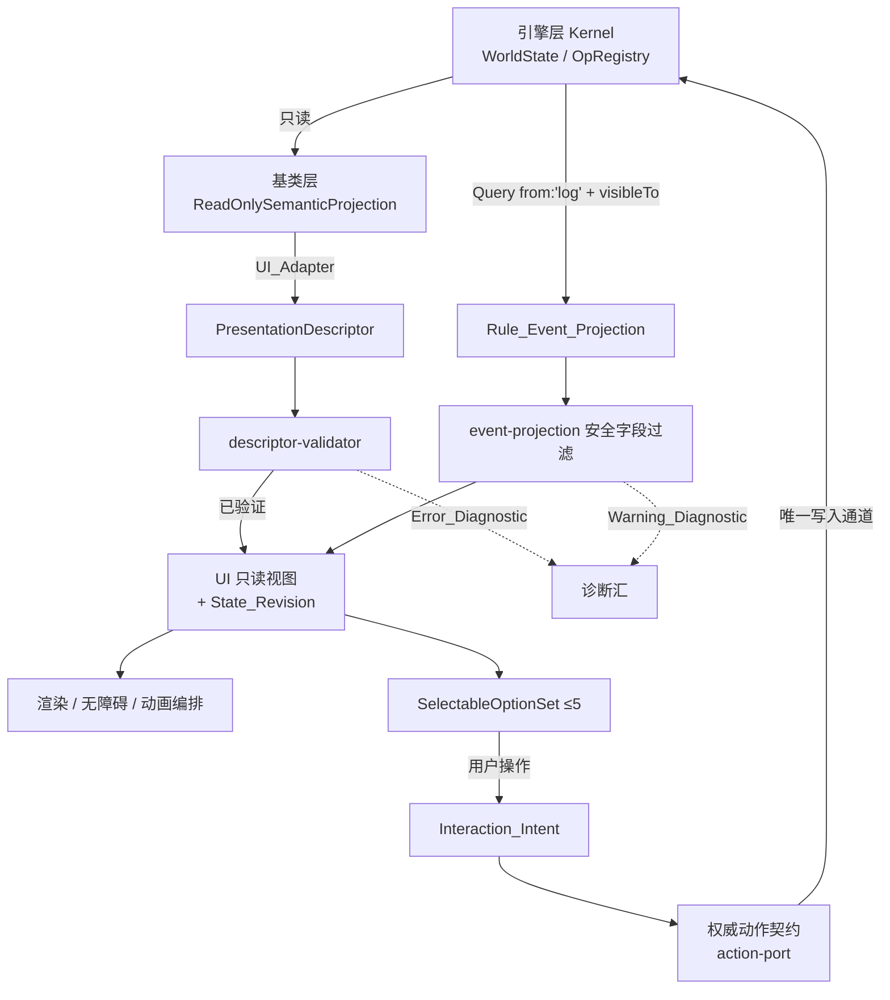

# Design Document

## Overview

本文档把 `.kiro/specs/wakeup-ui-animation/requirements.md` 的 18 条需求落成可实现、可验证的设计。

UI_Animation_System 的定位只有两件事：**把当前 Agent 有权看到的规则语义投影出来**，以及**把用户操作打包成待校验的交互意图交给权威动作契约**。它不持有可变 `WorldState`，不复制合法性判定，不用动画推进规则。任何语义状态变化最终都由引擎层 `OpRegistry.invoke` 完成。

本设计的全部上游断言都经过代码核对，核对结论记录在 §2。凡本文档自主判断、或对需求做了理解性补充的地方，均在文末「自主设计判断与人工复核清单」逐条列出并标注**待人工复核**。

### 层级归属

| 产物 | 归属 | 依据 |
|---|---|---|
| 可复用表现描述符 schema | 基类层 | Requirement 13.1；已实现于 `src/l2/model/projection.ts` |
| `Presentation_Profile`（布局、资源绑定、动效参数） | 表现资源层 | Requirement 1.3、13.3 |
| 投影消费、交互意图、演出编排、降级、诊断 | 表现资源层 | Requirement 1.3 |
| 规则语义、合法性、成本、随机、拓扑 | 引擎层 / 玩法层 | 本 Spec 不拥有 |

表现资源层**不是第四个架构层**：它不定义引擎层原语，不注册 Op，不新增 `Query` 算子，不拥有任何规则数值（Requirement 13.7）。它是基类层只读投影的消费方。

---

## Architecture

### 1.1 数据流向



关键性质：图中**没有任何一条箭头从 RENDER / 动画 指回 K**。演出侧到规则侧不存在通路，这是 Requirement 7 的结构性保证，而不是靠代码评审保证。

### 1.2 模块布局

所有代码位于 `src/ui/`，测试与源码同目录（`src/ui/**/__tests__/*.test.ts`）。

选择 `src/**` 的理由不是"别处不会被执行"，而是**它是当前唯一被三个工具同时覆盖的位置**。按 2026-08-08 核对的实际配置：

| 位置 | `vitest run` | `tsc --noEmit` | `eslint src` |
|---|---|---|---|
| `src/**` | 收集 | 检查 | 检查 |
| `test/properties/**` | 收集 | 检查 | **不检查** |
| `test/l2/**` | 收集 | **不检查** | **不检查** |
| `test/` 下其他路径 | **不收集** | **不检查** | **不检查** |

（`vitest.config.ts` 的 `include` 现为 `['src/**/*.test.ts', 'test/l2/**/*.test.ts', 'test/properties/**/*.test.ts']`；`tsconfig.json` 的 `include` 现为 `["src", "test/properties"]`；lint 脚本仍为 `eslint src --ext .ts`。）

因此把测试放在 `src/ui/**/__tests__/` **无需修改任何工具链配置**，且同时获得类型检查与静态检查覆盖。放到 `test/` 下任何位置都会至少丢失一项覆盖。

```
src/ui/
├── index.ts                        # 组合根 createUiSystem（只读查询 + 提交入口）
├── model/                          # 零逻辑数据形状
│   ├── revision.ts                 # State_Revision 复合令牌与全序比较
│   ├── view.ts                     # UiView 只读视图
│   ├── intent.ts                   # Interaction_Intent 形状（target 为判别联合）
│   ├── event-projection.ts         # Rule_Event_Projection 安全字段集与白名单投影
│   ├── option-set.ts               # SelectableOptionSet（≤5 不变量）
│   ├── profile.ts                  # Presentation_Profile schema
│   └── diagnostic.ts               # UI 诊断形状（复用 L2 码表）
├── ports/                          # 上游端口，只声明能力，不 import 具体实现
│   ├── projection-port.ts          # 绑定 createProjection / uiDescriptor
│   ├── action-port.ts              # 绑定 submitUiAction
│   ├── action-query-port.ts        # 绑定 Gateway.query / queryActions（强制注入 visibleTo）
│   ├── event-port.ts               # 绑定 Gateway.subscribe('after:${opName}')
│   ├── revision-port.ts            # sequence 段来源（上游暂缺）
│   ├── convergence.ts              # ConvergenceResult<T> 显式失败结果
│   └── pending-contracts.ts        # core / space-items / AI 待汇合端口
├── projection/                     # 投影消费与陈旧检测
│   ├── projection-cache.ts         # 深冻结断言 + 按 agentId+scopeId 分键缓存
│   ├── scope-filter.ts             # 唯一 Agent 过滤点（补 C-5 的上游缺口）
│   ├── staleness.ts
│   └── reconcile.ts                # reduceView：全量与增量共用的唯一归约
├── interaction/                    # 交互意图生命周期
│   ├── input-normalizer.ts
│   ├── intent-factory.ts
│   ├── pending-registry.ts
│   ├── submit.ts
│   ├── menu-faces.ts               # 付费面 / 零费面分区（D-042）
│   ├── end-turn-countdown.ts       # 回合末倒计时（D-042）
│   └── solo-cadence.ts             # 一人模式空闲计时与权威推进意图（D-064）
├── presentation/                   # 描述符校验、降级、无障碍、数值
│   ├── descriptor-validator.ts
│   ├── fallback.ts
│   ├── accessibility.ts
│   ├── unavailability-reason.ts    # 不可用原因安全化
│   ├── salience.ts                 # 三档显著性分层（D-031/D-033/D-032）
│   └── gameplay-value.ts           # GameplayValue / InternalMetric 类型隔离
├── animation/                      # 演出编排
│   ├── scheduler.ts
│   ├── ceremonial.ts
│   └── reduced-motion.ts
├── diagnostics/
│   └── sink.ts
├── profile/
│   ├── profile-loader.ts           # 走严格 JSON 解析链
│   └── wakeup-default.profile.json
└── __tests__/
    ├── architecture.test.ts        # 三组机械约束扫描
    ├── support/
    │   ├── arbitraries.ts          # fast-check 生成器
    │   └── in-memory-ports.ts      # 端口替身（含回放模式拒绝提交的替身）
    ├── properties/                 # 24 个属性测试，一属性一文件
    │   └── pNN-<slug>.test.ts
    ├── reverse/                    # 6 组反向边界用例
    │   ├── mutation-attempt.test.ts
    │   ├── bypass-disabled.test.ts
    │   ├── leak-channels.test.ts
    │   ├── presentation-params-inert.test.ts
    │   ├── profile-replaceable.test.ts
    │   └── multi-agent-visibility.test.ts
    └── mutation/
        └── README.md               # 变异自检清单与执行记录
```

三点布局约束：

1. `profile/` 采用「JSON 数据 + TS 校验器」的组合，与 `src/class/*/index.json` + `src/class/catalog-loader.ts` 的既有做法一致。
2. 端口替身放在 `__tests__/support/` 而**不是** `src/ui/testing/`：替身只服务测试，放进产品目录会让它进入产品范围的类型检查与 lint。这与内核 `src/core/kernel/testing/` 对外提供测试工具的定位不同——UI 层不对外提供测试工具。
3. 本布局是**权威清单**：tasks.md 创建的每个文件都必须出现在此处，新增文件需同时更新本节。

### 1.3 与既有渲染层目录的关系

`.eslintrc.cjs` 已有一条针对渲染层的边界规则，覆盖 `src/scene/**` 与 `src/components/**`，禁止它们 import `kernel/ops` 与 `kernel/state`（对应 meta-mechanism-kernel design §3.15、要求 40.5）。这两个目录目前**尚不存在**。

职责划分：

| 目录 | 职责 | 状态 |
|---|---|---|
| `src/ui/`（本 Spec） | 投影消费、交互意图、演出编排、降级、诊断——**纯逻辑，零渲染依赖** | 本 Spec 交付 |
| `src/scene/`、`src/components/` | 具体渲染与组件树，消费 `src/ui/` 的只读视图 | 不属本 Spec，尚未创建 |

因此 `src/ui/` 必须被加入那条 eslint 边界规则的 `files` 列表——否则本 Spec 的核心边界（不 import 写入接口）只由自建架构测试保障，而不由 lint 保障，与项目既有做法不一致。这是**唯一一处必要的配置改动**，作为 tasks.md 任务 0 单独立项。


---

## 2. 上游事实核对结论

本节是设计的事实基础。每条都经过代码核对，**未经核对的字段一律不得在本设计中被引用**。

### 2.1 已存在、可直接依赖

| 能力 | 代码位置 | 确切签名 / 字段 |
|---|---|---|
| 唯一写入通道 | `src/core/kernel/ops/registry.ts` | `OpRegistry.invoke<A,T>(name: string, args: A): Result<T>` |
| 调用结果 | `src/core/kernel/ops/result.ts` | `Result<T> = {ok:true,value:T} \| {ok:false,code:ErrCode,detail:string}` |
| 只读查询 | `src/core/kernel/expr/query-engine.ts` | `QueryEngine.run(state, q, deps): Ref[]`；`runValues(state, q, deps): Value[]` |
| 可见性过滤 | 同上 | `Query.visibleTo?: Expr`；**严格 `=== true` 才放行**，`null`/缺失路径/非布尔一律失败关闭 |
| 合法动作查询 | `src/core/kernel/actions/catalog.ts` | `ActionCatalog.queryActions(actor: Ref, mode: 'ui'\|'ai'): LegalAction[]` |
| 合法动作形状 | `src/core/kernel/actions/types.ts` | `LegalAction {action, bindings, cost: CostSpec[], reason?: string}` |
| Agent 权限 | `src/core/kernel/state/agent.ts` | `Agent {id, kind, controls, knowledgeScope, omniscient?, authority?, policy?, props}` |
| Decision / Intent | `src/core/kernel/state/world-state.ts` | `DecisionState.status: 'open'\|'resolved'\|'timeout'\|'void'`；`IntentState {hidden, status, ...}` |
| 认知只读访问 | `src/core/kernel/knowledge/knowledge-store.ts` | `getFacts(state, agentId)`、`knows(state, agentId, key)`、`getSeen(...)`，返回深冻结克隆 |
| 有界事件日志 | `src/core/kernel/state/world-state.ts` | `world.log: readonly LogEntry[]`；`LogEntry {seq, type, payload, phase}`；`world.logSeq` 单调且裁剪后不复用 |
| 快照 / 回放 / 检查点 | `src/core/kernel/persistence/persistence.ts` | `takeSnapshot(state,label?)`、`replay(records,deps)`、`CheckpointStore.checkpoint/restore/list/remove`、`rewind(store,targetName)` |
| 基类层只读投影 | `src/l2/model/projection.ts` | `ReadOnlySemanticProjection {scopeId, consumer, turn, definitions, entities, beliefSlices, visibility, semanticStateFingerprint}` |
| 表现描述符 | 同上 | `PresentationDescriptor {scopeId, rendererId?, resources, paidActions, attachedActions, provenanceLabels, warnings}` |
| 动作描述符 | 同上 | `ActionDescriptor {actionId, costCategory, interactionIntent?, attackShape?, posture?, available, unavailabilityReason?, accessibleLabel, assetRefs, targets}` |
| 授权范围 | 同上 | `AuthorizationScope {scopeId, consumer, agentId?, authorizedBeliefAgentIds, visibleEntityIds, visibleNodeIds, authorizedDefinitionFamilies?, authorizedResourceRoles}` |
| 语义枚举 | `src/l2/model/family-contracts.ts` | `INTERACTION_INTENTS`(4)、`RESOURCE_SEMANTIC_ROLES`(3)、`ACTION_COST_CATEGORIES`(2)。[2026-08-08 权威变更：`ATTACK_SHAPES`(3) 已删除，攻击形状判定为冗余设计，见 docs/L0_规范宪法.md 最新权威内容] |
| 写入桥 | `src/l2/kernel/kernel-contract.ts` | `KernelContract.invoke(opId, args, cause): KernelInvokeResult`；`hookIntegrationAvailable()`；`semanticStateFingerprint()` |
| 宪法常量 | `src/l2/model/constitution.ts` | `GAMEPLAY_VALUE_RANGE {min:1,max:5}`、`NODE_CONNECTION_BOUND = 5` |
| 诊断码表 | `src/l2/model/diagnostic-codes.ts` | 含 `PROJECTION_WRITE_REJECTED`、`PROJECTION_SCOPE_VIOLATION`、`PRESENTATION_FALLBACK_APPLIED`、`JSON_SEMANTIC_FIELD_MISSING`、`JSON_SEMANTIC_FIELD_DAMAGED`、`UI_UNKNOWN_RESOURCE_ROLE`、`UI_DESCRIPTOR_TARGET_UNRESOLVED`、`SCHEMA_GAMEPLAY_VALUE_OUT_OF_RANGE` 等 |
| **表现层只读通道** | `src/core/kernel/gateway.ts` | `PresentationGateway.subscribe(eventType, handler): GatewaySubscription`；`dispatch(type, payload)`（after-hook 接线桥）；`query(q: Query): Ref[]`；`queryActions(actor: Ref, mode = 'ui'): LegalAction[]`。事件名约定 `after:${opName}`。**导出面不含 `OpRegistry`/`Transaction`** |
| **UI 描述符适配器** | `src/l2/adapters/ui-adapter.ts` | `uiDescriptor(input: UiDescriptorInput): Result<PresentationDescriptor>`，`input = {active, runtimeState, query: UiQuery, scope: AuthorizationScope, availableActionIds?, actionIds}` |
| **UI 提交入口** | 同上 | `submitUiAction(input: UiSubmitInput): Result<OpResult>`，内部构造 `CallerContext{kind:'ui'}` 后转发统一 `submit` |
| **统一提交** | `src/l2/registry/action-submitter.ts` | `submit(input: SubmitInput): Result<OpResult>`，`SubmitInput = {active, kernel, request, caller}` |
| **只读投影构建** | `src/l2/registry/read-only-projection.ts` | `createProjection(active, runtimeState, scope)` |

### 2.2 不存在，因此必须保留为待汇合契约

| 需求引用的概念 | 核对结论 | 本设计的处理 |
|---|---|---|
| `State_Revision` | **内核中完全不存在**。全仓搜索 `revision`/`stateVersion`/`monotonic` 零命中 | 定义为复合令牌端口，见 §4.1 |
| ~~`after:*` 事件投影~~ | **本条为早前误判，已撤销。** `after:${opName}` 确实是内核的事件命名约定，见 `src/core/kernel/wire-hooks.ts:150-152` 与 meta-mechanism-kernel 要求 40.1。它与 `HookPhase` 的 `'after'` 是两个不同层面的概念（事件类型名 vs 分发阶段），早前把两者混为一谈 | 按真实约定消费，见 §4.2 |
| 描述符与投影的绑定 | `PresentationDescriptor` 只有 `scopeId`，**没有** fingerprint / revision 字段 | 由 UI 侧配对封装，见 §4.1 |
| 无障碍标签回退键 | `ActionDescriptor.accessibleLabel: string` 是**必填且无回退键字段** | 空串视为缺失，见 §11.2 |

### 2.3 发现的上游冲突（需人工裁决，本设计不单方面选边）

**C-1｜全屏仪式动画集合是三项还是四项 —— 已裁决为四项，冲突关闭。** 原冲突：`requirements.md` Requirement 6.4 曾写 "exactly the three approved action semantics"，而 `docs/访谈决策记录.md` 的 **D-032**（2026-08-07，晚于 D-026 的 2026-08-03，状态"已确认"）要求扩充为**四项**，加入"招架触发"。

裁决依据：Requirement 6.7 自身规定该集合的修订路径是"a new confirmed decision that supersedes D-026"，而 D-032 在形式上正是这样一个更晚的已确认决策；D-053 又已把招架批准为玩法层正式默认规则，使"招架触发"成为一个真实存在的动作语义。因此集合为**四项**：翻窗、跳窗、令其长眠、招架触发。Requirement 6.4 / 6.7 已同步改写，§9.2 的默认 profile 已装载四项。

保留的设计手法不变：仪式集合仍是**数据驱动 + 来源校验**，任何后续增减仍只改 profile 数据与其引用的决策编号，**不需要改代码**。招架触发的呈现另受 Requirement 6.14（仅"被近战攻击"分支播放，远程/不可招架伤害导致的失效必须静默）、Requirement 6.15 与 Requirement 3.13（Parry_Ready 为 `hidden` 层）约束。

**C-2｜`rewind` 语义不一致。** `meta-mechanism-kernel/requirements.md` 要求 37.4 描述 `rewind(n)` 为"将状态回退 n 个相位边界"，但实现 `persistence.ts` 的 `rewind(store, targetName)` 是**按名字 restore 检查点**，没有相位计数语义。本设计的回退处理只依赖"权威侧选定了一个更早状态并给出其修订令牌"这一行为，不依赖 `rewind(n)`。**待人工复核。**

**C-3｜L2 文档的 D-025 违规命名 —— 已修正，冲突关闭。** 原问题：`docs/表现系统/01_图形化与UI.md`「五条视觉定律 / 2」标题后带"（Among Us 风格）"字样；`docs/L1_引擎层/元机制内核Spec_v1.md` 的 `after:entity.place` 示例带"Among Us 式跳跃"。两处均已改为 §9.1 的技术描述性命名（**边缘发光交互语法** / **程序化跳跃位移**）。`docs/访谈决策记录.md` 中 D-024 / D-025 条目内的"Among Us"字样是该决策自身的历史记录，**应当保留**，不属违规。`docs/L_归档/` 与 `docs/_归档/` 下的历史草案同样不在修正范围。

**C-5｜`PresentationGateway` 没有按 Agent 过滤，与它自己的设计和需求不符（安全相关，优先级最高）。** meta-mechanism-kernel design §3.15 写明 `query` 的 "`visibleTo` 固定传该客户端 Agent"，要求 40.1 也要求事件通道服务于该客户端。但 `src/core/kernel/gateway.ts` 的实现：

- `query(q)` 把调用方传入的 `q` 原样交给 `QueryEngine.run`，并使用 `deps.baseCtx()`。**它不注入也不强制 `visibleTo`**——调用方省略 `visibleTo` 就会拿到未过滤的全集。
- `subscribe(eventType, handler)` / `dispatch(type, payload)` 把 `payload` 原样投递给全部订阅者，且支持 `'*'` 通配订阅。**事件通道完全没有 Agent 过滤。**

后果：Gateway 当前**不能**作为 Requirement 3.1/3.2 的可信过滤点。本设计的处置见 §6.1——UI 侧不直接消费 `Gateway.query`/`subscribe` 的原始结果，一律经 `AuthorizationScope` 收窄后使用，并把该收窄实现为**单一过滤点**。这是防御性处置，**不代表 Gateway 的缺口已被修复**；真正的修复应落在引擎层（让 Gateway 强制注入 `visibleTo`、并按订阅者 Agent 过滤 payload）。**待人工复核，建议作为引擎层缺陷单独立项。**

**C-6｜`ActionDescriptor.targets` 恒为空数组。** `src/l2/adapters/ui-adapter.ts` 的 `actionDescriptor()` 硬编码 `targets: []`，`TargetDescriptor` 从未被填充。因此 Requirement 4.2 的"选定绑定"与 Requirement 5.5 的"目标失效"在描述符层面暂无数据来源。本设计的目标绑定改由 `PresentationGateway.queryActions` 返回的 `LegalAction.bindings` 提供（该字段真实可用），描述符的 `targets` 仅作为将来汇合点。**待人工复核。**

**C-7｜无障碍标签缺失的处置，L2 实现与本 Spec 早前立场冲突，已按 L2 收敛。** `ui-adapter.ts` 在 `accessibleLabel` 缺失时回退为 `actionId` 并产出 `PRESENTATION_FALLBACK_APPLIED` 警告。本 Spec 早前（J-3）采取"无回退键即拒绝该呈现"的保守立场。二者的实质分歧在于"是否存在已声明的类型兼容回退"：`actionId` 是已验证语义字段，且是 `Visibility_Safe` 的稳定标识，因此它**构成** Requirement 9.3/9.4 意义上的合法回退。结论：按 L2 的"回退 + 警告"收敛，本 Spec 的"拒绝"路径收窄为"连 `actionId` 都不可用"这一残余情形。§11.2 与 J-3 已据此改写。

**C-4｜`semanticStateFingerprint` 只能判等，不能判序。** 它是内容指纹，无法回答"两个投影哪个更新"。而 Requirement 2.8 / 5.3 / 8.1 需要"被取代 / 更新的"这种**顺序**语义。单靠指纹无法实现。见 §4.1 的复合方案。**待人工复核。**

---

## Components and Interfaces

### 3. 上游端口

UI 一律通过端口消费上游，**不 import 任何上游具体实现**。这同时满足 Requirement 14.9（不依赖别的领域的私有可变存储）和"待汇合契约不得由本 Spec 单方面定名"。

### 3.0 端口与已实现上游的绑定关系

端口不是凭空发明的抽象层，而是对**已实现上游**的收窄包装。绑定关系固定如下（签名见 §2.1）：

| UI 端口 | 绑定的上游实现 | 收窄内容 |
|---|---|---|
| `EventPort` | `PresentationGateway.subscribe('after:*' / 具体 `after:${opName}`)` | 按 `AuthorizationScope` 过滤 payload，再走 §4.2 白名单。**因 C-5，过滤必须在此处做** |
| `ProjectionPort.fetchProjection` | `createProjection(active, runtimeState, scope)` | 深冻结断言 + 附加 `StateRevision` |
| `ProjectionPort.fetchDescriptor` | `uiDescriptor({active, runtimeState, query, scope, availableActionIds, actionIds})` | 描述符语义校验（§5.2） |
| `ActionQueryPort` | `PresentationGateway.queryActions(actor, 'ui')` | 提供 `LegalAction.bindings` 作为目标绑定来源（因 C-6，描述符 `targets` 恒空） |
| `ActionPort.submit` | `submitUiAction({active, kernel, request, scope, callerId})` | 三分支结果归一（`accepted`/`rejected`/`stale`） |
| `RevisionPort` | **无上游** | `sequence` 段仍缺，见 §4.1 与 §14.4 |

三条铁律：

1. UI 侧**不**直接 import `src/core/kernel/**` 或 `src/l2/**` 的实现模块。端口的具体绑定发生在组合根 `src/ui/index.ts` 的调用方（宿主），UI 内部只见端口接口。
2. `PresentationGateway` 的导出面已保证不含 `OpRegistry`/`Transaction`，但**这不等于 UI 可以直接用它**——因 C-5，它的读通道未按 Agent 过滤。
3. 唯一写入路径是 `ActionPort.submit` → `submitUiAction` → `submit` → `KernelContract.invoke` → `OpRegistry.invoke`。UI 目录内不出现其中任何一环的标识符。

### 3.1 投影端口

```ts
// src/ui/ports/projection-port.ts
export interface ProjectionPort {
  /** 取当前 Agent 授权范围内的完整只读投影。失败返回结构化拒绝，不抛异常。 */
  fetchProjection(request: ProjectionRequest): ProjectionOutcome;
  /** 取该 Agent 当前可选的合法动作描述符。 */
  fetchDescriptor(request: DescriptorRequest): DescriptorOutcome;
}

export interface ProjectionRequest {
  readonly agentId: string;
  /** 由权威运行时给出，UI 不自行构造授权范围。 */
  readonly scopeId: string;
}
```

`ProjectionOutcome` 携带三样东西：已验证只读视图、观察到的 `State_Revision`、本次产生的诊断。**它永不返回可变引用**：端口实现必须返回深冻结结构，UI 侧再做一次 `Object.isFrozen` 断言（§5.1）。

### 3.2 权威动作端口

```ts
// src/ui/ports/action-port.ts
export interface ActionPort {
  /**
   * 提交交互意图。与非 UI 调用方共用同一契约。
   * 实现必须在任何 Op 被调用之前重新校验：Agent 权限、动作可见性、
   * 当前合法性、目标、成本、Decision 状态、当前修订版本。
   */
  submit(intent: InteractionIntent): SubmissionOutcome;
}

export type SubmissionOutcome =
  | { readonly kind: 'accepted'; readonly committedRevision: StateRevision }
  | { readonly kind: 'rejected'; readonly rejection: StructuredRejection }
  | { readonly kind: 'stale'; readonly rejection: StructuredRejection };
```

三项设计约束：

1. UI 侧**没有** `invoke` 方法。`OpRegistry.invoke` 只能被 `ActionPort` 的实现（`src/l2` 侧）调用。`src/ui/**` 全目录禁止出现 `OpRegistry`、`invokeInline`、`prop.set` 等写入标识符，由架构测试机械检查（Correctness Properties 的 P10）。
2. `'stale'` 与 `'rejected'` **分开返回**。Requirement 5.6 要求陈旧拒绝触发重同步，普通拒绝不触发，两者不能混为一类。
3. `accepted` 只表示"权威侧已提交"，UI 必须等到观察到含该 `committedRevision` 的投影才认为操作完成（Requirement 4.7）。

### 3.3 事件端口与待汇合端口

`EventPort` 只提供"已按 Agent 过滤的规则事件增量"，原始 `Event` 不得进入表现层（Requirement 3.2）。

`pending-contracts.ts` 为 `core` / `space-items` / `AI` 各声明一个**能力端口**，只描述所需能力，不定名字段。三者任一不可用时，依赖它的功能被标记为不可用并产生集成诊断，**不做本地规则替代**（Requirement 14.5）。

---

## Data Models

### 4. 核心数据模型

### 4.1 State_Revision（复合令牌）

内核没有修订版本概念（§2.2），`semanticStateFingerprint` 只能判等不能判序（C-4）。而需求同时要求两种能力：

- **判等**：缓存投影是否仍对应同一语义状态（Requirement 2.8）
- **判序**：新到的投影是否比正在播放的动画所基于的状态更新（Requirement 8.1、8.6）

因此 `State_Revision` 定义为**两段复合令牌**：

```ts
// src/ui/model/revision.ts
export interface StateRevision {
  /** 顺序段：单调不减、裁剪后不复用。用于判序。 */
  readonly sequence: number;
  /** 等价段：语义状态内容指纹。用于判等。 */
  readonly fingerprint: string;
}

export const REVISION_ORDER = { NEWER: 1, SAME: 0, OLDER: -1 } as const;

/** 全序比较。sequence 相同但 fingerprint 不同 → 不可判定，按 UNCOMPARABLE 处理。 */
export function compareRevision(a: StateRevision, b: StateRevision): RevisionComparison;
```

映射到现有上游能力：`fingerprint` 取 `ReadOnlySemanticProjection.semanticStateFingerprint`（已存在）；`sequence` 的天然候选是内核 `world.logSeq`（已存在，单调且裁剪后不复用），但**上游尚未把它暴露到投影里**。因此 `sequence` 由 `RevisionPort` 提供，端口的具体绑定属于待汇合契约。

`sequence` 相同而 `fingerprint` 不同这一情形必须显式建模为 `UNCOMPARABLE`，而不是静默当作相等——静默相等会让 UI 把不同的语义状态当成同一个，这正是最危险的失效形态。遇到 `UNCOMPARABLE` 时按 Requirement 8.9 处理：请求全量投影，不猜测缺失的语义迁移。**此复合方案与 `UNCOMPARABLE` 的处置是本设计的自主判断，待人工复核。**

### 4.2 Rule_Event_Projection（安全字段集）

`after:${opName}` 是内核真实的事件命名约定（`wire-hooks.ts:150-152`），`PresentationGateway.subscribe` 是需求 40.1 指定的订阅入口。**主通道用它**；有界事件日志查询作为补全与重同步的辅助通道：

| 通道 | 机制 | 用途 | 是否自带 Agent 过滤 |
|---|---|---|---|
| **主通道**：Gateway 订阅 | `PresentationGateway.subscribe('after:${opName}')`，由 `dispatch` 从 after-hook 接线投递 | 增量演出 | **否**（C-5），必须由 UI 侧收窄 |
| 辅助通道：有界日志查询 | `QueryEngine.runValues(state, {from:'log', visibleTo: <该 Agent 谓词>}, deps)` | 重同步、补齐间隙 | 是，且严格 `=== true` 失败关闭 |

两条通道的取舍很关键。主通道是需求 40.1 指定的、也是唯一能拿到"刚发生了什么"的低延迟通道，但它**不过滤**；辅助通道过滤严格且失败关闭，但它是"查历史"，不是推送。因此设计上：

- 增量演出走主通道，**但每个事件在进入表现层之前必须经过 §6.1 的单一过滤点**。
- 一旦检测到修订间隙或乱序（§17），改用辅助通道拉取，并利用其内建的 `visibleTo` 过滤作为交叉校验。

`phase:'after'` 的只读性由 `HookDispatcher` 机械保证（嵌套保存点内执行后无条件 rollback），这是主通道不可能反向写状态的结构性原因。

安全字段集：

```ts
// src/ui/model/event-projection.ts
export interface RuleEventProjection {
  readonly sequence: number;            // 来自 LogEntry.seq，保证因果顺序
  readonly semanticType: string;        // 来自 LogEntry.type
  readonly observedAtRevision: StateRevision;
  readonly safePayload: Readonly<Record<string, SafeProjectedValue>>;
}
```

`safePayload` 采用**白名单**：只有在 profile 的安全字段集中显式登记过的键才会被投影出来。未登记的键一律丢弃并产生一条 `Warning_Diagnostic`。黑名单在此处不可接受——漏列一个键就是一次信息泄漏。**安全字段集的具体键名属于待汇合契约，本设计只锁定"白名单 + 未登记即丢弃"这一机制。**

### 4.3 Interaction_Intent

```ts
// src/ui/model/intent.ts
export interface InteractionIntent {
  readonly intentId: string;
  readonly agentId: string;
  /** 二者恰择其一：动作意图或 Decision 答复意图。 */
  readonly target: ActionIntentTarget | DecisionIntentTarget;
  readonly bindings: Readonly<Record<string, ProjectedBindingValue>>;
  /** 形成该意图时观察到的修订版本。权威侧据此判定陈旧。 */
  readonly observedRevision: StateRevision;
  /** 归一化后的交互来源，仅用于诊断，不参与合法性。 */
  readonly inputSource: InputSource;
}
```

四项设计约束：

1. `target` 是**判别联合**而不是两个可选字段。可选字段允许"两个都填"或"都不填"这两种无意义状态，判别联合从类型上排除它们。
2. `bindings` 的取值类型是 `ProjectedBindingValue`——只能是**投影里出现过的**标识或值。UI 不能凭空构造一个目标标识。
3. `observedRevision` 必填。没有它，权威侧无法执行 Requirement 4.5 的当前修订校验。
4. `inputSource` 明确标注"不参与合法性"。Requirement 4.9 要求键盘、指针、触摸、手柄、辅助自动化解析到**同一个** intent 形状；把来源放进 intent 只为诊断，一旦它进入合法性判定就是违规。

### 4.4 SelectableOptionSet（≤5 不变量）

这是 Requirement 10.10 的落点，也是一处**必须做真实工作**的地方，不能只写句约束。

核对到的事实：`ActionCatalog.queryActions(actor, 'ui')` 在 `'ui'` 模式下**完整展开**数值区间（`expandRange` 对 `mode === 'ui'` 返回整个区间），并且多个 `TargetSpec` 之间做笛卡尔积（`expandBindings`）。因此合法动作集轻易超过 5 项——一个 `min:1,max:5,step:1` 的区间目标单独就是 5 项。

设计：

```ts
// src/ui/model/option-set.ts
export interface SelectableOptionSet {
  /** 当前这一屏可选项，长度恒 ≤ 5。 */
  readonly visible: readonly SelectableOption[];
  /** 分级导航状态。UI 靠它做逐层展开，而不是把合法动作集裁掉。 */
  readonly navigation: OptionNavigation;
  /** 该 Set 覆盖的完整合法动作数量，作为 Internal_Metric 标注。 */
  readonly totalLegalOptions: InternalMetric<number>;
}
```

分级规则（确定性，不依赖布局）：

1. 先按 `ActionDescriptor.costCategory` 分为 `paid` / `attached` 两组——这与 D-042 的"付费菜单 / 零费菜单切换"一致，也与 `ACTION_COST_CATEGORIES` 只有两个取值一致。
2. 组内按 `interactionIntent` 分档（4 个取值，天然 ≤5）。
3. 档内若仍 > 5，按稳定标识排序后分页，每页 ≤5。
4. 导航控件本身**计入**当前屏的可选项预算。这是最容易出错的地方：如果"下一页"按钮不计数，实际同时可选项就是 6。

**铁律**：分级只改变"同时呈现多少"，绝不改变合法动作集本身（Requirement 10.10）。`totalLegalOptions` 始终等于上游返回的数量。

---

## 5. 只读性与描述符完整性（Requirement 2）

### 5.1 只读的三重保证

单靠 TypeScript 的 `readonly` 不够——它只在编译期生效，跨模块边界或经过 `any` 就失效。三重保证：

1. **类型层**：所有视图类型全字段 `readonly`，集合用 `readonly T[]`。
2. **运行时层**：投影进入 UI 边界时做深冻结断言。发现未冻结即拒绝该投影并发 `PROJECTION_WRITE_REJECTED`，而不是就地冻结——就地冻结会掩盖上游违约。
3. **架构层**：`src/ui/**` 禁止出现写入标识符，由架构测试机械检查。

任何试图取得可变语义状态引用的调用都返回结构化拒绝且不暴露引用（Requirement 2.6），复用 L2 已有码 `PROJECTION_WRITE_REJECTED`。

### 5.2 描述符校验

`descriptor-validator.ts` 对每个 `ActionDescriptor` / `ResourceDescriptor` / `TargetDescriptor` 逐字段判定，产出三种结果之一：**接受**、**语义拒绝**、**表现降级**。判定表见 §10。

关键规则（Requirement 2.4）：资源角色、交互意图、姿态、成本类别、可用性、不可用原因**只能来自显式字段**。校验器实现上禁止任何字段名匹配、颜色推断、文件名推断、标签推断。已有枚举提供了闭合取值域：

- `RESOURCE_SEMANTIC_ROLES = ['hp','stamina','ap']` → 取值不在表内即 `UI_UNKNOWN_RESOURCE_ROLE`
- `INTERACTION_INTENTS = ['traversal','precise-interaction','hostile-interaction','executable-target']`
- `ACTION_COST_CATEGORIES = ['paid','attached']`

> **2026-08-08 权威变更（本次会话裁决，已获项目所有者授权）**：`ATTACK_SHAPES = ['single-target','spread','area']` 已删除。攻击形状（三选一形状轴）判定为冗余设计，其表现层需求已被
> **武器属性**（散射/扫射/连发）完全覆盖，改为通过 `descriptor-validator.ts` 校验武器属性组合而非
> 独立的形状枚举字段。详见 `docs/L0_规范宪法.md`、`docs/L2_基类层/基类层定义.md` §4.3、
> `docs/表现系统/01_图形化与UI.md` 最新权威内容。

`posture` 在 L2 契约里是**开放字符串**（`readonly posture?: string`，注释明确"L2 不枚举具体姿态，原样透传"）。因此 UI 也不得枚举姿态取值，只能原样透传给 profile 做资源绑定；profile 缺该姿态的资源时走表现降级，**不是**语义拒绝。这一点很容易做错：把姿态当闭合枚举会导致基类层新增姿态时 UI 直接拒绝渲染。

### 5.3 渲染器可替换性

`PresentationDescriptor.rendererId` 已存在，其注释明确"更换它不得改变任何语义动作标识或验证结果"。设计上 `rendererId` 只进入诊断与回归对比，**不进入**任何判定分支（Requirement 2.7、13.6）。

---

## 6. Agent 可见性与防泄漏（Requirement 3）

### 6.1 单一过滤点

所有读取都绑定到 `Authorized_Agent` 与其当前 `visibleTo` 范围。设计上只有**一个**过滤点：端口边界的 `scope-filter`。UI 内部不再做第二次可见性判断——第二个过滤器意味着两套规则，迟早分叉。

因 C-5，这个过滤点承担的责任比原计划更重：**`PresentationGateway` 的读通道不过滤，过滤责任落在 UI 端口边界**。因此 `scope-filter` 必须同时处理两类输入：

| 输入 | 过滤依据 | 失败处置 |
|---|---|---|
| `Gateway.query(q)` 的结果 | 端口构造 `q` 时**强制注入** `visibleTo`；构造器不接受省略 `visibleTo` 的查询 | 缺 `visibleTo` 的查询在类型层不可构造 |
| `Gateway.subscribe` 投递的 `(type, payload)` | 按 `AuthorizationScope` 的 `visibleEntityIds` / `visibleNodeIds` / `authorizedBeliefAgentIds` 收窄，再走 §4.2 白名单 | 出现范围外标识 → 丢弃该事件 + `PROJECTION_SCOPE_VIOLATION` |

第一行的实现手法很重要：端口**不暴露** `query(q: Query)`，只暴露 `scopedQuery(spec)`，由端口内部补齐 `visibleTo`。这样"忘记传 visibleTo"这一失效形态在类型层就不存在，而不是靠代码评审。

`Agent.omniscient` 已存在于内核。全知视图**必须**来自上游 Agent 投影的显式授权；`omniscient` 由权威运行时提供，UI 侧没有任何本地开关能开启它（Requirement 3.9）。

### 6.2 侧信道清单

Requirement 3.3–3.5 列出的泄漏面在设计上逐一封堵：

| 侧信道 | 封堵方式 |
|---|---|
| HUD 条目、预览、目标标记、计数、顺序 | 只渲染投影中出现的标识；`totalLegalOptions` 取自投影而非本地推算 |
| 不可用原因 | 见 §6.3 |
| 动画选择与时序 | 仪式动画集合只依据 `actionId` 查 profile；不可见实体不进入演出队列 |
| 日志、调试面板、屏幕阅读器文本、字幕、工具提示、焦点标签、导出文本 | 全部消费同一份已过滤投影（Requirement 11.4）；诊断汇按受众过滤 |
| 素材名、资源路径、预加载时机、回退类型、音频、触觉 | profile 绑定发生在**已过滤投影之后**；素材标识在诊断中以不透明标识呈现（Requirement 12.10） |
| 多窗口缓存 | 缓存键含 `agentId` + `scopeId`，不同 Agent 不共享缓存（Requirement 3.8） |

### 6.3 不可用原因的安全化

`ActionDescriptor.unavailabilityReason` 与内核 `LegalAction.reason` 都是自由文本。自由文本可能携带越权信息（"目标在 3 号房间"）。

设计：UI **不直接渲染** `unavailabilityReason` 原文。profile 声明一组 `Visibility_Safe` 通用原因，投影层需给出原因到通用原因的映射键；无映射时回落到通用不可用文案（Requirement 3.6）。原文只进入需要显式上游授权的开发诊断面。**"原因映射键"这一字段目前不在 L2 契约中，属待汇合契约的补充需求，待人工复核。**

实体由可见转为不可见时，移除或替换其活动投影，并停止用隐藏世界真值更新它（Requirement 3.7）。实现上由投影差分驱动：新投影中不存在的稳定标识一律移除活动视图，除非当前 Knowledge 显式授权"记忆表示"（Requirement 15.6）。

### 6.4 显著性分层（Requirement 3.10–3.14）

D-031、D-033、D-032 分别确定了三种不同的"可见程度"，它们不是一个连续刻度，而是三个离散档：

| 档位 | 语义 | 默认 profile 实例 | 呈现方式 | 来源 |
|---|---|---|---|---|
| `public-persistent` | 完全公开，常驻呈现，无需操作即可获知 | 弱点属性 | 头顶图标常驻 | D-031 |
| `public-on-inspect` | 公开但不主动提示，需玩家主动检视 | `[瞄准中]` | 悬停时显示紫色点线指向其目标 | D-033（可见性）+ D-066（颜色） |
| `hidden` | 真隐藏，对所有者以外的观察者不存在 | `Parry_Ready` | 无任何呈现 | D-032 |

三条设计约束：

1. 分层**只能来自显式描述符字段**，不得从规则效果推断（Requirement 3.10）。这与 §5.2 的"不做字段名/颜色/标签启发式"是同一条纪律。
2. profile 声明的分层与规则层可见性分类矛盾时（例如把规则层判为隐藏的状态标成 `public-persistent`），**装载被拒绝**并产出 `SALIENCE_TIER_CONFLICT`（Requirement 3.14）。这一条很关键：分层是表现决策，但它不能凌驾于规则层的可见性判定之上——表现层只能在规则允许的范围内决定"多显眼"，不能决定"是否可见"。
3. `hidden` 档必须做到**对其他观察者逐项等同于该状态不存在**（Requirement 3.13、6.15）。不渲染"待机/准备"标识只是必要条件，还要求不产生任何顺序、计数、动画选择或时序差异——这正是 Property 7 的断言方式。

`public-on-inspect` 的"检视"是纯本地操作：悬停不产生 `Interaction_Intent`，不消耗任何资源，不改变语义状态（属 §7.2 的表现偏好范畴）。

---

## 7. 唯一写入通道（Requirement 4）

### 7.1 调用链

```
用户操作
  → input-normalizer（归一化为稳定交互标识）
  → intent-factory（绑定 agent / target / bindings / observedRevision）
  → pending-registry（登记待决，禁止同一控件重复产生意图）
  → ActionPort.submit
      → [基类层] 重新校验权限/可见性/合法性/目标/成本/Decision/修订
      → KernelContract.invoke
          → OpRegistry.invoke   ← 唯一写入通道
  → SubmissionOutcome
  → reconcile（等待含 committedRevision 的投影）
```

`src/ui/**` 内不存在任何直接改语义状态的路径：没有 `invoke`，不赋值语义字段，不推进随机流，不结算成本，不解算 Intent，不推进相位（Requirement 4.4）。

### 7.2 表现偏好的例外

Requirement 4.8 允许纯表现偏好不走交互意图。判定标准写成机械可判的白名单：偏好只能落在 profile 的**可替换字段集**内（布局、皮肤、动画参数、音量、减少动态、输入绑定呈现）。任何偏好都不得改变语义状态、动作可用性、随机结果或规则时序。

关键约束：**输入绑定的改变属于表现偏好，但不得引入来源特定的合法性**（Requirement 11.7）。改键只改"哪个物理输入映射到哪个稳定交互标识"，不改动作定义。

### 7.3 UI 禁用不是安全边界

Requirement 5.2 是本设计最需要防止误解的一条。禁用控件是**体验优化**，不是规则安全边界。

因此：即便禁用逻辑延迟、被绕过或完全不可用，任何到达 `ActionPort` 的意图**仍然要经过完整的当前状态复校**。设计上把这条做成端口契约的义务，并在验证阶段用"绕过 UI 禁用直接提交"的反向用例证明它（Correctness Properties 的 P11 后半句）。

---

## 8. 待决、重复提交与过期交互（Requirement 5）

### 8.1 待决登记表

```ts
// src/ui/interaction/pending-registry.ts
export interface PendingRegistry {
  /** 登记成功返回 intentId；该控件已有待决意图时返回 'already-pending'。 */
  tryRegister(controlId: string, intent: InteractionIntent): RegisterOutcome;
  settle(intentId: string, outcome: SubmissionOutcome): void;
  /** 修订变化时批量失效受影响的绑定。 */
  invalidateByRevision(current: StateRevision): readonly string[];
}
```

以 `controlId` 为键而不是以动作标识为键：Requirement 5.1 约束的是"同一个待决控件上的额外激活尝试"。同一动作可能同时出现在两个合法控件上（例如轮次栏与动作面板），用动作标识作键会误杀合法的第二个入口。

### 8.2 失效触发源

五个触发源，分别对应 Requirement 5.3–5.6：

| 触发源 | 处理 |
|---|---|
| `State_Revision` 变化 | 失效缓存的动作绑定，重新查询后才允许新提交 |
| Decision 已解决 / 超时 / 作废 / 关闭 / 不再可见 | 移除其控件，拒绝提交旧答复。判据是 `DecisionState.status !== 'open'` 或该 Decision 不在投影中 |
| 目标消失 / 身份改变 / 变为不可见 / 不再满足投影绑定 | 取消本地选择，要求新的合法动作结果 |
| 权威侧返回 `'stale'` | 先重同步到新鲜投影，再重新启用该交互 |
| 窗口挂起后恢复 | 先取得新鲜投影，之后才启用影响规则的输入（Requirement 8.8） |

### 8.3 绝不从表现推断成功

Requirement 5.7 明确列出四种不能当作成功信号的事件：按钮变灰、动画开始、音效播放、请求离开客户端。设计上唯一的成功判据是**观察到含 `committedRevision` 的投影**。`SubmissionOutcome.kind === 'accepted'` 也只是"权威侧已提交"，不等于 UI 可以显示最终态。

### 8.4 双菜单面与回合末倒计时（Requirement 5.9–5.14）

D-042 收敛的菜单结构落到 `costCategory` 这个已有的语义字段上，UI 不引入第二套分类：

| 面 | 内容判据 | 可用时机 |
|---|---|---|
| 付费面 | `costCategory === 'paid'` | 预算充足时；默认显示 |
| 零费面 | `costCategory === 'attached'` | **任何时候**，通过切换按钮进入 |

两条不变量（Property 14）：两面**交集为空、并集等于全部可用动作**。这直接来自 `ACTION_COST_CATEGORIES` 只有两个取值，因此分类是全覆盖且互斥的——不需要额外的归类规则。

关键约束（Requirement 5.10、5.11）：零费动作**不受回合末限制**。不得存在"只有预算耗尽后零费动作才可用"的路径。这是 D-042 相对早期方案 A 的实质修正，容易被实现成"AP 耗尽才显示零费面"，属于必须避免的错误。预算耗尽后的变化只是**付费面为空**，零费面与结束回合按键保留。

倒计时（Requirement 5.12–5.14）：

1. 倒计时是**纯呈现节奏**，秒数是 `InternalMetric`（J-5），不受 1—5 约束。
2. 倒计时期间动作合法性、成本与效果**保持不变**；倒计时可在任意时刻取消（反悔窗口）。
3. 倒计时自然结束时，通过与其他意图**完全相同**的权威通道提交"结束回合"意图（`ActionPort.submit`），**不得**把倒计时结束本身当作回合已结束。这一条是 Requirement 7 "不得用本地时钟推进规则"在回合末的具体落点：本地计时器只决定"何时提交意图"，不决定"回合是否结束"。

---

## 9. 项目视觉配置与已确认动画范围（Requirement 6）

### 9.1 技术描述性命名

D-025 与 Requirement 6.3 都禁止用第三方游戏名作为技术方案的规范名称。本设计采用的名称：

| 规范名称 | 指代 |
|---|---|
| 程序化跳跃位移 | 非逐帧的程序化变换位移动画 |
| 全屏分离式仪式动画 | 关键动作触发的全屏、前后景分离合成动画 |
| 边缘发光交互提示 | 悬停高亮 + 边缘发光的交互提示语法 |

第三处命名是为替换 `docs/表现系统/01_图形化与UI.md` 仍在使用的违规命名（C-3）而给出的规范名称。

### 9.2 默认 Presentation_Profile

`wakeup-default.profile.json` 承载 D-024 的视觉方向、D-026 + D-032 的仪式动画范围、D-031/D-032/D-033 的显著性分层、D-035/D-036 的轮次栏结构、D-042 的回合末倒计时、D-064 的节奏呈现三态与 D-066 的全局颜色语义。全部字段都是**可替换表现配置**，不是规则语义字段（Requirement 6.2、6.6）。

```json
{
  "version": "1.1.0",
  "visualDirection": {
    "interactionComponents": "pixel-art",
    "mapBackground": "sketch",
    "compositing": "separated-foreground-background",
    "authoritativeSource": "D-024"
  },
  "colorSemantics": {
    "damage-life-danger": "red",
    "technology-wakefulness-stamina-execution": "blue",
    "sense-attention-alert": "yellow",
    "ap-action-progress": "orange",
    "safe-positive-free-discount": "green",
    "relation-gateway-ranged": "purple",
    "melee-aggression-violence": "coral",
    "social-communication-economy": "cyan",
    "cooldown-delay": "gray",
    "neutral-material-base": "gray-white",
    "gradeHighlights": ["gold", "silver"],
    "authoritativeSource": "D-066"
  },
  "pacingPresentations": {
    "standard-combat": "dynamic-turn-order-bar",
    "solo-cadence": "static-player-status-bar",
    "minimal-ui": "hide-combat-hud",
    "authoritativeSource": "D-064"
  },
  "ceremonialActionSemantics": [
    { "actionSemanticId": "vault-window", "authoritativeSource": "D-026" },
    { "actionSemanticId": "jump-window", "authoritativeSource": "D-026" },
    { "actionSemanticId": "lay-to-rest", "authoritativeSource": "D-026" },
    { "actionSemanticId": "parry-trigger", "authoritativeSource": "D-032" }
  ],
  "salienceTiers": [
    { "stateSemanticId": "weakness", "tier": "public-persistent", "renderer": "above-head-icon", "authoritativeSource": "D-031" },
    { "stateSemanticId": "aiming", "tier": "public-on-inspect", "renderer": "purple-dotted-aim-line", "authoritativeSource": "D-033, D-066" },
    { "stateSemanticId": "parry-ready", "tier": "hidden", "renderer": null, "authoritativeSource": "D-032" }
  ],
  "turnOrderBar": {
    "edge": "left",
    "persistent": true,
    "entryFields": ["portrait", "name", "health", "stamina"],
    "spentEntryTreatment": "desaturate",
    "rollAnimationAnchor": "beside-entry",
    "authoritativeSource": "D-035, D-036"
  },
  "endTurnCountdown": { "seconds": 3, "cancellable": true, "authoritativeSource": "D-042" }
}
```

`profile-loader.ts` 强制两条校验：

1. `ceremonialActionSemantics` 每一项**必须**带 `authoritativeSource`，且该编号必须存在于已确认决策目录中。没有来源的仪式动画一律拒绝装载。这就是 Requirement 6.7 的"修改该集合需要新的已确认决策"的机械落点。
2. 集合是**闭合**的：不在集合内的动作语义一律不得获得全屏仪式呈现（Requirement 6.5、6.7）。

数据驱动带来的收益：C-1 的裁决（三项 → 四项）在本设计中只表现为该数组多一项条目与一个决策编号，**不需要改动任何代码**。将来若再有决策改动该集合，路径同样是"改 profile 数据 + 补决策编号"，装载器的来源校验保证它无法被静默改动。

### 9.3 仪式动画不携带规则语义

Requirement 6.8：不得从"某动作是否有全屏动画"推导合法性、成本、效果强度或完成时间。设计上仪式集合的查询方向是**单向**的——演出编排器读 profile 决定怎么播，规则侧从不读它。`animation/ceremonial.ts` 不 import 任何合法性或成本模块。

三个例外允许跳过仪式呈现（Requirement 6.7）：用户显式跳过、启用减少动态模式、Requirement 9 要求的资源失败回退。三者都只影响呈现，不影响最终语义状态。

### 9.4 全局颜色与节奏呈现（D-064 / D-066）

颜色配置保存**语义角色到颜色角色**的绑定，不保存具体色值。十个语义角色为闭合集合；金银是可叠加的高光通道，不进入主色互斥判定。

双重分类由 `resolvePrimaryColorRole` 处理：调用方必须给出当前对象的“下一项主要功能”角色，profile 只校验该角色已登记，不根据对象名称、标签或所在界面自行猜测。商店的主角色是 `social-communication-economy`，折扣是局部 `safe-positive-free-discount` 徽章；上锁门的主角色是 `relation-gateway-ranged`，AP 进度用橙色局部通道。

灰阶交互不以色相判断：`gray-white` 是中性材质基底；`gray` 表示冷却或延迟。可点击性由独立材质状态 `raised-highlighted` / `flat-unavailable` 表达，禁止从“灰色”直接推导不可点击。

轮次栏呈现配置为三态判别联合：

- `standard-combat`：消费权威行动轮并播放排序变化；
- `solo-cadence`：轮次栏静止为玩家状态栏，不在 UI 本地计算 AP 或推进回合；
- `minimal-ui`：隐藏轮次栏及战斗 HUD，仅允许无战斗活动使用。

一人模式计时器与回合末倒计时复用同一安全原则：本地时间到期只能创建待校验意图。AI/其他玩家导致的节奏升降来自权威投影，不由 UI 扫描实体列表自行判定；切换呈现状态不得清空投影缓存或重建对局。

---

## 10. 语义拒绝与非语义降级（Requirement 9）

这是本 Spec 最容易被做错的地方：优雅降级不得掩盖规则错误（Requirement 9.10）。

### 10.1 判定表

| 字段 | 分类 | 缺失 / 损坏时的处理 | 诊断码 |
|---|---|---|---|
| `actionId` | Semantic | 拒绝该描述符，撤除由它派生的全部交互 | `JSON_SEMANTIC_FIELD_MISSING` |
| 目标绑定 | Semantic | 同上 | `UI_DESCRIPTOR_TARGET_UNRESOLVED` |
| `role`（资源语义角色） | Semantic | 同上 | `UI_UNKNOWN_RESOURCE_ROLE` |
| `interactionIntent` / `attackShape` 取值越界 | Semantic | 同上 | `JSON_SEMANTIC_FIELD_DAMAGED` |
| `costCategory` | Semantic | 同上 | `JSON_SEMANTIC_FIELD_MISSING` |
| `available` | Semantic | 同上 | `JSON_SEMANTIC_FIELD_MISSING` |
| 可见性范围 / `scopeId` | Semantic | 拒绝整个投影 | `PROJECTION_SCOPE_VIOLATION` |
| `State_Revision` | Semantic | 拒绝整个投影 | `JSON_SEMANTIC_FIELD_MISSING` |
| 描述符版本不受支持 | Semantic | 拒绝受影响描述符，其余兼容投影仍渲染 | `JSON_SCHEMA_VERSION_UNSUPPORTED` |
| 图标 / 纹理 / 音效 / 触觉 / 动画片段 / 字体 | Presentation | 已声明的类型兼容回退 + 警告 | `PRESENTATION_FALLBACK_APPLIED` |
| `posture` 无对应资源 | Presentation | 同上（见 §5.2） | `PRESENTATION_FALLBACK_APPLIED` |
| `accessibleLabel` | 见 §11.2 | 分情形 | 分情形 |
| 玩法数值越界 / 非有限 | Semantic | 拒绝该数值呈现 | `SCHEMA_GAMEPLAY_VALUE_OUT_OF_RANGE` |

### 10.2 回退的四条约束

1. 回退**只能**从已验证语义字段派生，绝不从标签、图标、素材名、邻近字段、历史示例或默认玩法假设发明语义（Requirement 9.2）。
2. 回退保留可见语义角色与无障碍含义，不增加、不移除、不启用任何动作（Requirement 9.4）。
3. 原描述符的语义类型本身是隐藏的时候，回退必须用 `Visibility_Safe` 通用呈现，**不能**用类型特定回退（Requirement 9.5）——类型特定回退会暴露隐藏类型。
4. 找不到类型兼容且可见性安全的回退时：非必要资源可省略并保留语义文本或形状输出（警告）；但若该回退是让**交互控件或规则显著状态可访问**所必需的，则拒绝该呈现并发 `Error_Diagnostic`，底层规则状态保持不变（Requirement 9.9）。

第 4 条的分界是整个降级机制的关键：**"看不见图标"可以降级，"读屏用户完全无法感知这个控件"必须拒绝。**

动画回退时仍必须呈现已提交的最终语义状态，即使完全没有动效（Requirement 9.6）。音频或触觉回退不可用而该反馈承载必需信息时，保留等价的视觉与无障碍文本通道（Requirement 9.7）。

---

## 11. 数值分域与可访问性（Requirement 10、11）

### 11.1 玩家可见数值与内部度量

两者用**不同类型**隔离，而不是靠命名约定（Requirement 10.6）：

```ts
// src/ui/presentation/gameplay-value.ts
/** 玩家可见玩法数值。构造函数是唯一入口，越界即拒绝。 */
export interface GameplayValue { readonly __brand: 'GameplayValue'; readonly value: 1|2|3|4|5; }
/** 内部度量。必须带单位与用途标注，不能被当作玩法数值渲染。 */
export interface InternalMetric<T> { readonly __brand: 'InternalMetric'; readonly value: T; readonly unit: string; }
```

`GameplayValue` 的取值类型直接写成 `1|2|3|4|5` 字面量联合——越界值在类型层就无法构造，运行时构造器再对非有限值和缺少归属分类的值做拒绝（Requirement 10.2），复用 `SCHEMA_GAMEPLAY_VALUE_OUT_OF_RANGE`。范围常量取 `src/l2/model/constitution.ts` 的 `GAMEPLAY_VALUE_RANGE`，不重新裁决。

禁止的转换（Requirement 10.3）：不得把 1—5 乘、除、插值或转换为百分比、小数评分、大标度评级或其他伪精确数值。允许的呈现（Requirement 10.4）：离散形状、填充段、定性标签——这与 08 文档轮次栏用 `❤️❤️❤️⬜⬜` 的分段呈现一致。

成本、时长、容量、阈值**只从当前已验证投影读取，不在本地重算**（Requirement 10.5）。

资源尺寸、帧数、帧率、动画时长、延迟、内存、实体数量、回合编号、性能统计一律是 `InternalMetric`，不得作为玩法数值描述符暴露（Requirement 10.7）。注意 `ReadOnlySemanticProjection.turn` 与 `AiBehaviorContract.neutralFallbackEvaluation` 在 L2 侧已被明确标注为 `Internal_Metric`，UI 侧沿用该分类。

内部度量出现在已授权开发面时必须带视觉与语义上的"诊断 / 技术信息"标注，且仍受 Agent 可见性过滤（Requirement 10.8）。无障碍文本、字幕、工具提示与导出文本遵守与视觉标签**完全相同**的数值约束（Requirement 10.9）。

### 11.2 无障碍标签的缺失判定

L2 契约里 `accessibleLabel: string` 是必填且没有回退键字段（§2.2）。因此需要一个明确的"缺失"判据：**空串或纯空白视为缺失**。

判定分三种情形：

| 情形 | 处理 |
|---|---|
| 标签有效 | 直接使用 |
| 标签缺失，但可派生 `Visibility_Safe` 的类型兼容回退 | 使用回退 + `PRESENTATION_FALLBACK_APPLIED` 警告 |
| 标签缺失且连回退都不可用，而该呈现是交互控件或规则显著状态 | 拒绝该呈现 + `Error_Diagnostic`，底层规则状态不变（Requirement 9.9、11.1） |

第二种情形现在是**可达且默认**的路径：`src/l2/adapters/ui-adapter.ts` 已实现"缺 `accessibleLabel` → 回退为 `actionId` + `PRESENTATION_FALLBACK_APPLIED`"。`actionId` 是已验证语义字段、且是 `Visibility_Safe` 的稳定标识，因此它构成 Requirement 9.3/9.4 意义上的合法回退（详见 C-7）。

因此第三种情形收窄为残余情形：连稳定标识都取不到（描述符本身已被语义拒绝）。此时按 Requirement 9.9 拒绝，且不得为了让控件可见而把语义拒绝降级为警告（Requirement 9.10）。

补充判据：UI 侧仍把 `accessibleLabel` 的**空串或纯空白**视为缺失（L2 契约中该字段必填、无"缺失"表示法），从而触发上表第二行。**待人工复核。**

### 11.3 感知与输入等价

| 需求 | 设计 |
|---|---|
| 11.2、11.3 | 颜色语义仍配合已经存在的图标、文字、轮廓和材质差异以服务低心智识别；MVP **不建立**逐色纹理矩阵、专用色盲调色或无色完全等价门禁。完整色盲模式为 Post-MVP 专题（D-066） |
| 11.4 | 读屏与字幕输出消费**同一份** `Visibility_Safe` 投影，不走第二条数据路径 |
| 11.5 | 减少动态模式保留动作可用性、最终态反馈、事件顺序含义与必需播报，只替换或移除非必要动效 |
| 11.6 | 键盘、指针、触摸、手柄、开关控制、辅助自动化经 `input-normalizer` 解析到**同一组稳定交互标识**与同一个 intent 形状 |
| 11.8 | 两个输入绑定冲突时报告确定性冲突并要求显式解决，**不静默丢弃**某个绑定 |
| 11.9 | 焦点因动作消失或 Decision 关闭而变化时，移到可见、有效、确定的位置，且不播报隐藏的替代项 |
| 11.10 | 动画、音频、触觉失败时，每个规则显著结果仍保留无障碍等价物 |
| 11.11 | 替代文本、ARIA 元数据、字幕轨、振动模式、减少动态替代物中都不得编码隐藏状态 |

---

## 12. 日志、诊断与调试面板安全（Requirement 12）

### 12.1 用户可见诊断的单一出口

UI 侧**不自造诊断**。所有诊断都是引擎层 `Diagnostic` 结构，经 Agent 过滤后进入表现层。UI 只做两件事：选择呈现哪些、以及怎么呈现。

```ts
// src/ui/diagnostics/diagnostic-surface.ts
export type DiagnosticSurface = 'user' | 'authorized-dev';

/** 已过滤诊断。未过滤的原始 Diagnostic 不允许进入本类型。 */
export interface FilteredDiagnostic {
  readonly __brand: 'FilteredDiagnostic';
  readonly code: string;
  readonly severity: 'fatal' | 'error' | 'warn' | 'info';
  /** 已本地化、已 Visibility_Safe 化的展示文本。 */
  readonly displayText: string;
  /** 允许出现在哪些面上。'user' 面永远是 'authorized-dev' 面的子集。 */
  readonly allowedSurfaces: readonly DiagnosticSurface[];
}
```

两条机械约束：

1. `FilteredDiagnostic` 的构造入口只有一个（`filterDiagnosticForAgent`），它要求传入 `Authorized_Agent`。没有 Agent 就无法构造，因此"忘记过滤"在类型层不可达。
2. 调试面板、开发面、遥测面消费的是**同一个** `FilteredDiagnostic` 流，不是第二条通向世界真相的路径。调试面可以显示更多**字段**（`InternalMetric`、`code`、`at`），但不能显示更多**实体**。

### 12.2 调试面板不是可见性豁免

Requirement 12 的核心陷阱：把调试面板当成"反正只有开发者看"的豁免区。设计上明确否定——本地调试开关**不授予**全知视角（Requirement 3.9），全知视角必须由上游 Agent 投影显式授权。原因是同一份构建会被玩家运行，本地开关是客户端可翻转的。

| 面 | 可见实体范围 | 可见字段范围 | 授权来源 |
|---|---|---|---|
| 用户面 | Agent `visibleTo` 范围 | 玩法数值 + 已本地化文本 | 无需额外授权 |
| 已授权开发面 | **同样是** Agent `visibleTo` 范围 | 追加 `InternalMetric`、`code`、`at`、`phase`，且带"诊断/技术信息"标注 | 本地开关即可 |
| 全知面 | 全部实体 | 全部字段 | **必须**由上游 Agent 投影显式授权 |

### 12.3 导出与剪贴板

导出、截图元数据、剪贴板、遥测走与视觉标签**完全相同**的 `Visibility_Safe` 约束（Requirement 3.4）。实现上导出函数只接受 `FilteredDiagnostic` 与已验证投影，不接受原始投影结构——`JSON.stringify(rawProjection)` 一类的写法由架构测试禁止（P10）。

---

## 13. 层级归属与配置边界（Requirement 13）

### 13.1 三类产物的归属判定

| 产物 | 归属 | 判据 |
|---|---|---|
| 描述符 schema、语义标识、无障碍字段 | 基类层 | 可复用、不含具体玩法数值 |
| 布局、坐标、资源路径、动效时长、颜色值、倒计时秒数 | 表现资源层（`Presentation_Profile`） | 可替换且不影响语义状态 |
| 合法性、成本、效果、随机、拓扑、可见性判定 | 引擎层 / 玩法层 | 本 Spec 只读消费 |

### 13.2 profile 不得承载规则语义

`profile-loader.ts` 在装载时拒绝三类字段（Requirement 13.4、13.5）：

1. 任何以规则语义命名的字段（`damage`、`apCost`、`hitBonus`、`dc`…）——即使值正确也拒绝，因为它会成为第二处真相来源。
2. 任何声称"覆盖"合法性或可见性的字段（`forceVisible`、`alwaysEnabled`…）。
3. 任何玩家可见数值的字面量。玩家可见数值只能来自已验证投影（Requirement 10.5）。

倒计时秒数（D-042）与图层距离参数（D-051）是**表现参数**而非玩法数值：它们不改变动作合法性、成本或效果，只改变呈现节奏与绘制位置。这与"1—5 约束"不冲突，因为它们是 `InternalMetric`，不作为玩法数值渲染（Requirement 10.7）。

### 13.3 表现资源层不是第四层

它不定义引擎层原语、不注册 Op、不新增 `Query` 算子、不拥有规则数值（Requirement 13.7）。架构测试检查 `src/ui/**` 不出现 `OpRegistry`、`registerOp`、`defineQuery`、`prop.set`、`invokeInline`（P10）。

---

## 14. 跨 Spec 只读依赖与汇合失败（Requirement 14）

### 14.1 依赖方向是单向的

UI 依赖 `core-mechanics`、`space-items`、`AI` 三个领域的**只读投影**，但**不 import 它们的任何具体实现**（§3）。三者的字段级描述符仍是 `Pending_Convergence_Contract`（§2.2），因此端口用**结构化最小假设**声明：UI 只假设"存在稳定语义标识 + 存在无障碍标签 + 存在成本分类"，不假设具体字段名。

### 14.2 汇合失败必须是显式失败

```ts
// src/ui/ports/convergence.ts
export type ConvergenceResult<T> =
  | { readonly ok: true; readonly value: T }
  | { readonly ok: false; readonly code: 'PENDING_CONVERGENCE_CONTRACT'; readonly missing: readonly string[] };
```

当某个领域尚未提供 UI 所需的描述符字段时，端口返回 `ok:false` 并列出缺失字段名，**不返回猜测值、不返回空映射、不用默认值兜底**（Requirement 14.5）。上层收到 `PENDING_CONVERGENCE_CONTRACT` 时省略该交互并发诊断——与描述符缺字段的处理一致（Requirement 2.5）。

### 14.3 不得单方面定名

UI 不为待汇合字段"先起个名字用着"。理由：一旦 UI 侧先定名，后续跨 Spec 审查会被迫接受 UI 的命名，等于让表现层反向决定基类层契约。缺失就显式缺失，这是 Requirement 1 的来源优先级在实现层的体现。

### 14.4 待汇合契约清单

本设计只声明**所需形状**，字段名、枚举与版本由后续跨 Spec 一致性审查统一：

状态按 2026-08-08 复核（`src/l2/adapters/`、`src/l2/registry/`、`src/l2/resolution/` 与 `src/core/kernel/gateway.ts` 已由并行工作落地，故多项已解除）：

| # | 待汇合项 | 状态 |
|---|---|---|
| 1 | `State_Revision` 的单调序号段绑定（候选：内核 `world.logSeq`，已存在但未暴露到投影/Gateway） | **仍缺** |
| 2 | `Rule_Event_Projection` 的安全字段白名单具体键名 | **仍缺** |
| 3 | 不可用原因到 `Visibility_Safe` 通用原因的映射键（`unavailabilityReason` 目前是适配器生成的自由文本） | **仍缺** |
| 4 | `PresentationDescriptor` 与投影修订的绑定字段（当前只有 `scopeId`） | **仍缺** |
| 5 | `ActionDescriptor.targets` 的真实填充（当前硬编码 `[]`，见 C-6） | **仍缺**，已用 `LegalAction.bindings` 绕行 |
| 6 | `PresentationGateway` 的 Agent 过滤（见 C-5） | **仍缺**，已在 UI 端口边界防御性收窄 |
| 7 | `core` / `space-items` / `AI` 三方的字段级只读描述符 | **仍缺** |
| 8 | ~~`UI_Adapter` 与统一提交实现~~ | **已解除**：`uiDescriptor`、`submitUiAction`、`submit`、`createProjection` 均已实现 |
| 9 | ~~`accessibleLabel` 回退键~~ | **已解除**：适配器已实现 `actionId` 回退（见 C-7） |

任一项不可用时，依赖它的功能标记为不可用并产生结构化集成诊断，**不做本地规则替代**。

---

## 15. 首帧、全量重绘与增量演出一致性（Requirement 15）

### 15.1 两条通道，一个收敛点

| 通道 | 用途 | 触发 |
|---|---|---|
| 全量投影 | 首帧、读档、重连、渲染器重建、回退 | `ProjectionPort.snapshot(agent)` |
| 增量事件 | 局内演出编排 | `Rule_Event_Projection` 订阅 |

两条通道**都带 `State_Revision`**，收敛规则唯一：**以修订令牌较新者为准**（§4.1 的复合令牌提供顺序语义，解决 C-4 指出的"指纹只能判等"问题）。

### 15.2 增量事件不是状态来源

增量事件只驱动**演出**，不驱动**状态**。UI 的可信状态永远是最近一次已验证全量投影加上其修订令牌；事件用来决定"播什么动画、什么顺序"。因此丢事件的后果是**少一段动画**，不是状态错误——重连后一次全量拉取即恢复正确显示（Requirement 15.4）。

### 15.3 顺序与并发

事件按其 `State_Revision` 排序播放。若收到修订令牌早于当前投影的事件，丢弃并记 `info` 诊断（迟到事件），不回退显示。若收到令牌晚于当前投影的事件，缓冲等待对应投影到达，超过 `profile.eventBufferTimeout` 则丢弃缓冲并触发一次全量重拉（Requirement 15.6）。

---

## 16. 动画与规则结果解耦（Requirement 7）

§9.3 已说明仪式动画不携带规则语义。本节补全 Requirement 7 余下的机械约束。

### 16.1 依赖方向单向

演出编排器 `animation/scheduler.ts` 只 import 只读视图与 profile；规则侧从不 import 它。两条机械约束由架构测试覆盖（P10）：

- `src/ui/animation/**` 禁止 import `ActionPort`、`intent-factory`、`submit`、`KernelContract`。
- 动画完成回调、时间线标记、帧事件、音频事件、粒子事件的类型签名返回 `void` 且**不接收任何可提交端口**——从类型上就无法从回调里调 Op（Requirement 7.3）。

由此直接得到 Requirement 7.4：权威运行时在全部表现资源不可用时仍能完成规则结算，因为规则侧不存在指向演出侧的依赖。

### 16.2 演出队列保留权威因果顺序

多个已提交事件需要呈现时，排序键取 `Rule_Event_Projection` 的修订令牌与 `LogEntry.seq`（单调、裁剪后不复用），**不使用本地时钟或到达顺序**（Requirement 7.5）。

允许显式合并多个事件的动效，但合并不得改变或隐藏其最终语义结果——合并只作用于动效呈现，最终态一律从投影渲染。跳过动画时立即呈现等价的最终语义状态与必需的无障碍播报（Requirement 7.7）。

多窗口动画进度不同不影响收敛：所有窗口仍收敛到同一已提交语义状态投影（Requirement 7.6）。

### 16.3 装饰性变化不碰随机流

不得为装饰性变化消耗或推进权威随机流（Requirement 7.9）。装饰性变化若存在，其来源是 profile 内**由稳定标识确定性派生**（例如稳定标识哈希），与 `src/core/kernel/random/` 的命名流完全隔离。因此它不影响规则回放，也不编码隐藏信息。

---

## 17. 异步、回放、回退与多窗口（Requirement 8）

§4.1 提供修订令牌，§15 提供首帧与增量通道。本节把 Requirement 8 的九项情形归到同一机制：**以 `State_Revision` 收敛，而不是以本地演出进度收敛。**

| 情形 | 处理 | 依据 |
|---|---|---|
| 动画播放中到达更新的已提交投影 | 取消 / 重定向 / 快进 / 替换过时动画，收敛到更新修订 | 8.1 |
| 载入快照或客户端重连 | 从完整只读投影渲染完整首帧，不需要先前动画历史 | 8.2 |
| 回放日志 | 从重放的已提交投影或事件投影派生呈现；**不得**从录制的视觉回调提交新交互意图 | 8.3 |
| 回退或恢复到更早状态 | 丢弃更晚的本地视觉状态、待决预览与被取代修订关联的纯表现缓存 | 8.4 |
| 回放速度变化或跳过 | 重放的规则结果、随机结果与事件顺序保持不变 | 8.5 |
| 本地资源在其来源修订被取代后才就绪 | 除当前描述符仍引用该资源，否则不得附加到当前投影 | 8.6 |
| 多窗口同 Agent 同修订 | 渲染语义等价的动作可用性、Decision 状态与可见事实；允许布局/焦点/动画进度不同 | 8.7 |
| 窗口挂起后恢复 | 先取得新鲜投影，之后才启用影响规则的输入 | 8.8 |
| 事件增量不完整、乱序或报告修订间隙 | 请求全量投影，**不猜测**缺失的语义迁移 | 8.9 |

第 6 行是异步资源最常见的错误来源：资源加载是异步的，加载完成时世界可能已经变了。判据必须是"当前描述符是否仍引用它"，而不是"我当初为什么要加载它"。

第 3 行是回放安全的关键：回放期间视觉回调若能提交意图，回放就会改写历史。设计上回放模式下 `ActionPort` 被替换为拒绝一切提交的实现，这是机械约束而非约定。

---

## Correctness Properties

*正确性属性是"在系统所有合法执行路径上都必须为真"的行为特征。每条属性用"对于任意…"的全称语句表达，可直接转写为 fast-check 属性测试。*

本章属性来自对全部 16 项需求的逐条可测性分析。UI 层属性的被测目标是**投影 → 视图 → 意图**这条纯函数链，不需要真实渲染器：渲染器通过 §3 的端口注入，测试用内存实现替换。

### Property 1: 投影层不暴露可变引用

*对于任意*已验证只读投影或已验证描述符，对其任意深度的任意字段执行写入尝试都应失败（`Object.isFrozen` 为真或写入抛出），且该尝试不应改变任何上游语义状态。

**Validates: Requirements 2.6, 2.1**

### Property 2: 描述符缺字段必然导致交互省略

*对于任意*缺少必填语义字段、字段类型不兼容、或版本超出支持范围的描述符，投影层都应拒绝该描述符、省略由它派生的每一个交互入口，并产出一条 `Error_Diagnostic`；不应出现"部分渲染"的中间态。

**Validates: Requirements 2.5, 9.9**

### Property 3: 玩家可见数值恒在 1—5 的整数域

*对于任意*进入渲染或无障碍输出的玩家可见玩法数值，其值都应是 1 到 5 之间的整数；不应出现 0、6、小数、百分比、NaN 或无穷值，且不应存在把它转换为百分比或小数评分的路径。

**Validates: Requirements 10.1, 10.2, 10.3, 10.4**

### Property 4: 内部度量不被当作玩法数值渲染

*对于任意* `InternalMetric`（资源尺寸、帧率、动画时长、延迟、内存、实体数量、回合编号、性能统计、`projection.turn`、`neutralFallbackEvaluation`），它都不应出现在玩法数值描述符位置；出现在已授权开发面时应带"诊断/技术信息"标注，并仍受 Agent 可见性过滤。

**Validates: Requirements 10.7, 10.8**

### Property 5: 任意呈现通道都不泄漏隐藏信息

*对于任意*两个世界状态，若它们对给定 Agent 的 `visibleTo` 投影相等而隐藏部分不同，则该 Agent 的全部呈现输出——HUD 条目、目标标记、动画选择、播放顺序、计数、不可用原因、日志、读屏文本、字幕、工具提示、焦点标签、资源路径、预加载时机、回退类型、音频、触觉、导出文本——都应逐项相等。

**Validates: Requirements 3.3, 3.4, 3.5, 12.3**

### Property 6: 显著性分层由描述符决定且与规则可见性一致

*对于任意*带 `Salience_Tier` 的状态，其分层都应来自显式描述符字段而非从规则效果推断；且若 profile 声明的分层与规则层可见性分类矛盾（如把规则层判为隐藏的状态标为 `public-persistent`），装载应被拒绝并产出 `Error_Diagnostic`。

**Validates: Requirements 3.10, 3.14**

### Property 7: 隐藏状态不产生任何可观察呈现

*对于任意*处于 `hidden` 层的状态（默认 profile 中为 `Parry_Ready`），对其所有者以外的每一个观察者，其呈现输出都应与该状态不存在时逐项相等；且该状态因远程伤害或不可招架伤害而失效时，不应产出任何动画、提示或音频。

**Validates: Requirements 3.13, 6.14, 6.15**

### Property 8: 仪式动画集合闭合且每项有来源

*对于任意*已装载 `Presentation_Profile`，其 `ceremonialActionSemantics` 的每一项都应带 `authoritativeSource` 且该编号存在于已确认决策目录中；不在该集合内的动作语义都不应获得全屏仪式呈现。默认 profile 的集合应恰好是翻窗、跳窗、令其长眠、招架触发四项。

**Validates: Requirements 6.4, 6.5, 6.7**

### Property 9: 动画不影响语义状态

*对于任意*动作提交序列，分别在"正常播放动画""用户跳过动画""启用减少动态模式""资源加载失败触发回退"四种呈现条件下执行，最终语义状态都应逐字段相等，且提交给权威通道的意图序列也应相等。

**Validates: Requirements 6.8, 7.1, 7.2, 9.10**

### Property 10: UI 目录不含写入标识符

*对于* `src/ui/**` 下的每一个源文件，其标识符集合都不应包含 `OpRegistry`、`registerOp`、`defineQuery`、`invokeInline`、`prop.set`，也不应 import 任何 `src/l2/**` 或引擎层具体实现模块。

**Validates: Requirements 4.1, 13.7, 14.9**

### Property 11: 待决控件不产生第二个意图

*对于任意*待决交互控件，在其权威确认到达之前的任意多次激活尝试，都应恰好产生一个 `Interaction_Intent`；且即使禁用被绕过，到达权威契约的每个意图都仍应经过完整的当前状态重校验。

**Validates: Requirements 5.1, 5.2**

### Property 12: 过期状态必被检出

*对于任意*在 `State_Revision` 变化后提交的、基于旧修订的意图，权威侧都应返回 `'stale'` 而非 `'rejected'`，UI 都应在重新启用该交互前收敛到新的只读投影;`'rejected'` 不应触发重同步。

**Validates: Requirements 5.3, 5.6, 2.8**

### Property 13: 成功只由已提交投影确认

*对于任意*动作提交，UI 都不应从按钮禁用、动画开始、音频播放或请求离开客户端推导成功；只有观察到包含该 `committedRevision` 的投影才应视为完成。

**Validates: Requirements 5.7, 4.7**

### Property 14: 两个菜单面互斥且零费动作不受回合末限制

*对于任意*动作集合，付费面与零费面的交集都应为空、并集都应等于全部可用动作；且零费动作在预算未耗尽时也应可执行——不应存在"只有预算耗尽后零费动作才可用"的路径。

**Validates: Requirements 5.9, 5.10, 5.11**

### Property 15: 表现计时器不改变规则语义

*对于任意*回合末倒计时或一人模式空闲计时的时长取值、任意时刻的取消/重置以及自然到期，动作合法性、成本与效果都应保持不变；到期都只能通过与其他意图相同的权威通道提交相应请求，不应把计时结束本身当作回合已结束或已流逝。

**Validates: Requirements 5.12, 5.13, 5.14, 6.24, 7.10**

### Property 16: 轮次栏保持全员在列

*对于任意*回合内的任意行动预算消耗序列，轮次栏的条目集合都应与参与者集合相等且顺序稳定；预算耗尽的条目应保留在列并仅获得低显著性处理，不应被移除、加叉或加横幅；回合资格都应来自投影而非视觉处理。

**Validates: Requirements 6.11, 6.12**

### Property 17: 可选项集合不超过 5

*对于任意*生成的 `SelectableOptionSet`，其选项数都应不超过 5；超出时应折叠为分组或分页，而不应静默截断或丢弃选项。

**Validates: Requirements 11.7, 2.4**

### Property 18: 无障碍等价物在呈现失败时仍存在

*对于任意*动画、音频或触觉失败的情形，每一个规则显著结果都应仍有无障碍等价物；且替代文本、ARIA 元数据、字幕轨、振动模式与减少动态替代物中都不应编码隐藏状态。

**Validates: Requirements 11.10, 11.11**

### Property 19: 无障碍标签缺失导致拒绝而非静默放行

*对于任意* `accessibleLabel` 为空串或纯空白的交互控件或规则显著状态呈现，在没有已声明回退键的情况下，都应拒绝该呈现并产出 `Error_Diagnostic`，且底层规则状态应保持不变。

**Validates: Requirements 11.1, 9.9**

### Property 20: 语义拒绝不被降级掩盖

*对于任意*语义字段错误，系统都应产出 `Error_Diagnostic` 并省略相应交互；不应存在把语义错误转为 `PRESENTATION_FALLBACK_APPLIED` 警告后继续渲染该交互的路径。反之，纯资源失败都不应产出语义拒绝。

**Validates: Requirements 9.1, 9.10**

### Property 21: 全量与增量收敛到同一视图

*对于任意*事件序列，"仅用全量投影渲染"与"用全量投影加增量事件渲染"两条路径在同一修订令牌下都应产生逐项相等的视图；丢弃任意子集的增量事件都不应改变最终视图，只应减少中间动画。

**Validates: Requirements 15.1, 15.4, 8.1**

### Property 22: 多窗口独立过滤

*对于任意*两个代表不同 Agent 的窗口，每个窗口的投影都应独立过滤且不共享 Agent 作用域缓存；两窗口对同一 Agent 提交竞争意图时，每个提交都应独立校验，且两窗口最终都应收敛到同一已提交投影。

**Validates: Requirements 3.8, 5.8, 8.4**

### Property 23: 待汇合契约缺失是显式失败

*对于任意*尚未汇合的领域描述符字段，端口都应返回 `ok:false` 且 `code` 为 `PENDING_CONVERGENCE_CONTRACT` 并列出缺失字段名；都不应返回猜测值、空映射或默认值，也不应由 UI 侧为该字段定名。

**Validates: Requirements 14.5, 1.4**

### Property 24: 全知视角不由本地开关获得

*对于任意*本地调试设置组合，在没有上游 Agent 投影显式授权的情况下，可见实体集合都应等于该 Agent 的 `visibleTo` 范围；已授权开发面都应只增加可见**字段**而不增加可见**实体**。

**Validates: Requirements 3.9, 12.2**

---

## Error Handling

### 错误模型：复用引擎层，不新增

UI 层**没有**自己的错误模型。运行期失败是引擎层 `Result<T>` 的 `{ ok:false, code, detail }`；诊断是引擎层 `Diagnostic`。UI 不定义异常类、不返回布尔失败、不返回裸字符串原因。

### UI 侧诊断码

以下码是 UI 层**用法**，其结构仍是引擎层 `Diagnostic`：

| 诊断码 | 严重度 | 触发条件 | 后果 |
|---|---|---|---|
| `DESCRIPTOR_SEMANTIC_FIELD_MISSING` | error | 必填语义字段缺失、类型不兼容或版本超范围 | 拒绝该描述符，省略其派生的全部交互 |
| `PROJECTION_WRITE_REJECTED` | error | 消费方尝试取得可变语义状态引用 | 返回结构化拒绝，不暴露引用 |
| `PROJECTION_NOT_FROZEN` | error | 投影进入 UI 边界时深冻结断言失败 | 拒绝该投影（不就地冻结，避免掩盖上游违约） |
| `SALIENCE_TIER_CONFLICT` | error | profile 声明的显著性分层与规则层可见性矛盾 | 拒绝该 profile 条目 |
| `CEREMONIAL_SOURCE_MISSING` | error | 仪式动画项缺 `authoritativeSource` 或编号不存在 | 拒绝装载该项 |
| `PROFILE_RULE_SEMANTIC_FIELD` | error | profile 出现规则语义字段或玩家可见数值字面量 | 拒绝装载整个 profile |
| `GAMEPLAY_VALUE_OUT_OF_RANGE` | error | 玩家可见数值越出 1—5 整数域 | 拒绝该数值呈现 |
| `ACCESSIBLE_LABEL_MISSING` | error | 交互控件或规则显著状态缺无障碍标签且无有效回退 | 拒绝该呈现 |
| `PENDING_CONVERGENCE_CONTRACT` | error | 领域描述符字段尚未汇合 | 省略该交互，列出缺失字段名 |
| `INPUT_BINDING_CONFLICT` | error | 两个输入绑定冲突 | 报告确定性冲突并要求显式解决，不静默丢弃 |
| `PRESENTATION_FALLBACK_APPLIED` | warn | 纯表现资源加载失败并成功回退 | 继续渲染，记录回退类型 |
| `EVENT_ARRIVED_STALE` | info | 增量事件的修订令牌早于当前投影 | 丢弃该事件，不回退显示 |
| `EVENT_BUFFER_TIMEOUT` | warn | 缓冲的超前事件等待超时 | 丢弃缓冲，触发一次全量重拉 |

### 分界线：语义拒绝 vs 表现降级

唯一判据是**失败的那个字段是不是语义字段**：

- 语义字段错误 → `error` 级 + 省略交互。**不允许**降级继续渲染。
- 纯表现资源错误（贴图、骨骼、音频、字体缺失）→ `warn` 级 + 回退呈现。**不允许**升级为语义拒绝。

两个方向都要测（Property 20）：既不能用降级掩盖规则错误，也不能因为一张贴图缺失就禁用一个合法动作。

### 严重度与恢复

`fatal` 不由 UI 产生——UI 无法破坏引擎层不变量。UI 最重的诊断是 `error`，其后果始终是"省略某个呈现或交互"，永不改变语义状态。任何 UI 诊断都不触发回滚，因为 UI 从未写入。

---

## Testing Strategy

### 工具与硬性要求

- 测试运行器：**Vitest**（`npm test` → `vitest run`）。
- 测试位置：全部位于 `src/ui/**/__tests__/`，理由与三工具覆盖矩阵见 §1.2。属性测试集中在 `src/ui/__tests__/properties/`。
- 属性测试库：**fast-check**（`^3.19.0`，已在 `devDependencies`）。**不自行实现属性测试框架。**
- **属性测试是必交付项**：`Correctness Properties` 的 24 条属性各对应**恰好一个**属性测试，缺一条即视为该需求未实现。
- 每个属性测试**至少 100 次生成运行**（`{ numRuns: 100 }` 或更高）。
- 标注注释格式固定：

```typescript
// Feature: wakeup-ui-animation, Property 5: 任意呈现通道都不泄漏隐藏信息
it('可见投影相等而隐藏部分不同时，全部呈现输出逐项相等', () => {
  fc.assert(
    fc.property(arbAgent(), arbHiddenVariantPair(), (agent, [worldA, worldB]) => {
      const a = renderAll(projectFor(agent, worldA));
      const b = renderAll(projectFor(agent, worldB));
      expect(a).toStrictEqual(b);
    }),
    { numRuns: 100 },
  );
});
```

### 生成器设计：避免测试空转

UI 层属性测试最容易空转的地方是**生成器造不出差异**。四条硬性要求：

1. **`arbHiddenVariantPair`必须真的只在隐藏部分不同**。生成器先造一个共享的可见基底，再对隐藏部分施加**保证非空**的变异（至少一个实体的隐藏字段改变）。若变异后两个世界的隐藏部分相等，该用例应被 `fc.pre` 过滤掉而不是静默通过——否则 Property 5 会变成重言式。
2. **实体 ID 池必须相交且可碰撞**。跨窗口、跨 Agent 的属性（P22）若两侧用各自的 UUID 池，永远不会命中"同一实体不同可见性"这一真正要测的情形。ID 从**固定小池**（如 8 个）中取，让碰撞成为常态。
3. **`arbReachableProjection` 不能凭空构造**。投影必须由"从合法初始状态出发、施加一串合法动作"生成，否则会测到不可达状态，产生假阳性。
4. **变异测试自检**：对 §1.2 的每个 UI 模块注入已知缺陷（删掉一次可见性过滤、把 `Object.freeze` 去掉、把 `'stale'` 与 `'rejected'` 合并、把仪式集合改成开放），确认对应属性测试**确实失败**。任何注入缺陷后仍全绿的属性测试都视为空转，必须重写。

### 分层测试

| 层 | 手段 | 覆盖 |
|---|---|---|
| 架构测试 | 源文件标识符与 import 扫描 | P10（`src/ui/**` 无写入标识符、无 `src/l2/**` import） |
| 属性测试 | fast-check，端口注入内存实现 | P1—P9、P11—P24 |
| profile 装载测试 | 用例表驱动 | `CEREMONIAL_SOURCE_MISSING`、`PROFILE_RULE_SEMANTIC_FIELD`、`SALIENCE_TIER_CONFLICT` 各自的拒绝路径 |
| 无障碍等价测试 | 快照对比视觉输出与读屏输出的信息集合 | P18、P19；两者信息集合必须相等 |

渲染器**不进入**属性测试。测试替换 `RendererPort` 为记录调用序列的内存实现，断言的是"编排器发出了什么指令"，不是"像素长什么样"。这样属性测试无需浏览器环境，也不受资源缺失影响。

### Requirement 16 逐条落点

Requirement 16 全部 13 条都是对**验证计划本身**的要求，因此它没有对应的正确性属性，而是由本章逐条兑现：

| 验收标准 | 落点 | 覆盖手段 |
|---|---|---|
| 16.1 直接改语义状态被结构化拒绝且状态不变 | P1 | 属性测试 |
| 16.2 动画启用/跳过/减少/失败四态规则结果一致 | P9 | 属性测试（四态作为生成维度） |
| 16.3 十类通道的隐藏信息提取尝试 | P5, P24 | 属性测试；通道清单来自 §6.2 |
| 16.4 逐个删除或损坏必填语义字段 | P2 | 属性测试（生成器逐字段置空/换型） |
| 16.5 逐个损坏有回退的表现字段；以及无标签无回退时拒绝 | P20, P19 | 属性测试 + profile 装载用例表 |
| 16.6 玩法数值边界 1 与 5、越界值、非有限值、伪精确转换 | P3 | 属性测试（边界值显式加入生成器） |
| 16.7 待决输入、重复激活、陈旧绑定、过期 Decision、目标失效、提交期状态变化 | P11, P12, P13 | 属性测试 |
| 16.8 异步资源完成、动画中断、回放、回退、跳过、重连、修订缺口、多窗口收敛 | P21, P22 | 属性测试（事件丢弃与令牌缺口作为生成维度） |
| 16.9 至少两个知识范围不同的非全知 Agent + 一个显式授权的全知 Agent | P5, P22, P24 | 属性测试（Agent 生成器固定产出该三元组） |
| 16.10 屏幕阅读器、重映射输入、减少动态三类等价性；完整无色等价 Post-MVP | P18, P19 | 无障碍等价测试（当前不含逐色纹理/无色矩阵） |
| 16.11 布局值、动效时长、资源路径、帧率、性能目标不得改变描述符语义或权威结果 | P9, P15 | 属性测试（表现参数作为生成维度，断言语义不变） |
| 16.12 玩法专属 HUD 组合与具体资源可替换而描述符契约不变 | P8 + profile 装载测试 | 换 profile 后重跑全部属性测试，断言全绿 |
| 16.13 无法产出可观察通过/失败的需求应在进入设计前修订或移除 | 需求评审门禁 | 本表即该门禁的执行记录：13 条全部有可观察落点，无一条需要移除 |

16.12 的兑现方式值得单独说明：**换一份 profile 重跑整套属性测试**。若任何属性测试因换 profile 而失败，说明该属性实际依赖了可替换表现配置，属于设计缺陷而非测试缺陷——必须改设计，不是改测试。

---

## 需求追踪表

| Requirement | 设计落点 | 属性 |
|---|---|---|
| 1 来源优先级与层级归属 | Overview「层级归属」、§13.1 | P10, P23 |
| 2 只读投影与描述符完整性 | §5、§4 | P1, P2, P17 |
| 3 Agent 可见性与防泄漏 | §6、§6.4、§12.2 | P5, P6, P7, P22, P24 |
| 4 交互意图与唯一写入通道 | §7、§3.2 | P10, P13 |
| 5 输入禁用、重复提交与过期交互 | §8、§8.4、§4.3 | P11, P12, P13, P14, P15 |
| 6 项目视觉配置、颜色与节奏呈现 | §9、§9.4 | P8, P9, P15, P16 |
| 7 动画与规则结果解耦 | §9.3、§16 | P9, P10 |
| 8 异步、回放、回退与多窗口 | §4.1、§15、§17 | P21, P22 |
| 9 语义拒绝与非语义降级 | §10 | P2, P19, P20 |
| 10 玩家可见数值与内部指标隔离 | §11.1 | P3, P4 |
| 11 可访问性与输入等价 | §11.2、§11.3 | P17, P18, P19 |
| 12 日志、诊断与调试面板安全 | §12 | P5, P24 |
| 13 基类层描述与玩法层表现配置边界 | §13 | P10 |
| 14 跨 Spec 只读依赖与汇合失败 | §14 | P23 |
| 15 首帧、全量重绘与增量演出一致性 | §15 | P21 |
| 16 可验证性与反向边界测试 | Testing Strategy「Requirement 16 逐条落点」 | 无专属属性（13 条全部是对验证计划的要求，由该表逐条映射到 P1—P24 与用例表） |

---

## 自主设计判断与人工复核清单

以下是本设计在需求之外作出的判断，或对需求的理解性补充。**均标注待人工复核。**

| 编号 | 判断 | 理由 | 风险 |
|---|---|---|---|
| J-1 | `State_Revision` 定义为复合令牌（内容指纹 + 单调序号） | 内核无此概念（§2.1），而 Requirement 2.8 / 5.3 / 8.1 需要顺序语义，单靠指纹只能判等（C-4） | 需引擎层提供单调序号；若引擎层拒绝，本设计需改为由权威侧显式返回令牌 |
| J-2 | `accessibleLabel` 空串或纯空白视为缺失 | L2 契约中该字段必填且无"缺失"表示法，需要一个明确判据 | 判据仍成立；缺失后走 L2 已实现的 `actionId` 回退 |
| J-3 | **已修正**：缺标签走「回退 + 警告」，不再一律拒绝 | 早前立场基于"无回退键"的过期认知。`ui-adapter.ts` 已实现 `actionId` 回退，而 `actionId` 是已验证且 `Visibility_Safe` 的稳定标识，构成合法回退（C-7） | 拒绝路径收窄为"连稳定标识都不可用"的残余情形 |
| J-4 | 显著性分层收敛为恰好三档 | D-031/D-032/D-033 分别对应常驻公开、检视公开、真隐藏三种形态，未出现第四种 | 若后续出现"仅队友可见"一类需求，需扩档而非复用现有档 |
| J-5 | 倒计时秒数、图层距离参数归类为 `InternalMetric` | 它们不改变合法性、成本或效果，只改变呈现节奏与绘制位置，因此不受 1—5 约束 | 若某玩法把倒计时长度做成可被玩家操作的资源，该归类需重判 |
| J-6 | 增量事件只驱动演出，不驱动状态 | 使丢事件的后果退化为"少一段动画"，可由一次全量拉取恢复 | 要求每个演出都能从全量投影重建，动画不得依赖事件独有信息 |
| J-7 | 事件缓冲超时后触发全量重拉 | 超前事件长期等不到对应投影意味着投影通道已落后，重拉比继续等待更快收敛 | 超时值需实测；过短会导致重拉风暴 |
| J-8 | §2 保留为独立章节，未并入 Architecture | 它是上游事实核对结论与冲突登记，是审查证据而非架构设计；合并会削弱其可审计性 | 与两个兄弟 Spec 的章节序略有差异 |
| J-9 | 代码置于 `src/ui/`，定性为**表现资源层**而非第四架构层 | Requirement 1.3 已把表现资源列为一种归属；该目录不注册 Op、不定义引擎原语、不持有规则数值 | 若后续认为应并入 `src/l2` 或 `src/play`，需迁移目录 |
| J-10 | **已修正**：主通道改为 `PresentationGateway.subscribe('after:${opName}')`，`Query{from:'log'}` 降为重同步辅助通道 | 早前判断"`after:*` 不是内核事实"是**错的**——`wire-hooks.ts:150-152` 确实按 `after:${opName}` 分发，要求 40.1 亦如此规定。已撤销该误判 | 主通道不自带 Agent 过滤（C-5），过滤责任明确落在 §6.1 的单一过滤点 |
| J-23 | UI 端口不暴露 `query(q)`，只暴露 `scopedQuery(spec)` 并由端口补齐 `visibleTo` | 因 C-5，Gateway 不强制 `visibleTo`；让"忘记传 visibleTo"在类型层不可构造，比靠评审可靠 | 端口需覆盖 UI 实际需要的全部查询形态，否则会出现绕过端口直接用 Gateway 的动机 |
| J-24 | 目标绑定取 `LegalAction.bindings`，不等 `ActionDescriptor.targets` | `targets` 当前硬编码 `[]`（C-6），而 `bindings` 真实可用 | `targets` 将来填充后需决定二者主从关系，避免两个绑定来源 |
| J-25 | `src/ui/**` 需加入 `.eslintrc.cjs` 的渲染层边界规则 | 项目已用 lint 强制 `src/scene`/`src/components` 不 import `kernel/ops`；本 Spec 的同类边界不应只靠自建测试 | 这是本 Spec 唯一必要的配置改动（tasks.md 任务 0） |
| J-11 | `safePayload` 采用白名单，未登记键一律丢弃 | 黑名单漏列一个键就是一次信息泄漏 | 白名单需随基类层字段演进维护，漏登记表现为"少显示信息"而非泄漏 |
| J-12 | 待决登记以 `controlId` 为键，而非动作标识 | Requirement 5.1 约束的是"同一待决控件上的额外激活"；同一动作可合法出现在两个入口（轮次栏与动作面板） | 需要为每个控件提供稳定标识 |
| J-13 | 分级导航控件**计入**同时可选项预算 | 需求未明示，但若"下一页"不计数，实际同时可选项就是 6，违反 Requirement 10.10 | 每屏实际动作可选项减少为 4 |
| J-14 | 分级顺序定为 `costCategory` → `interactionIntent` → 稳定标识分页 | 与 D-042 的付费/零费菜单切换一致；两个枚举取值数分别为 2 与 4，天然 ≤5 | 若基类层扩充 `INTERACTION_INTENTS` 超过 5 项，该层需再分页 |
| J-15 | `posture` 按开放字符串处理，缺资源走表现降级而非语义拒绝 | L2 契约注释明确"L2 不枚举具体姿态，原样透传" | 把姿态当闭合枚举会导致基类层新增姿态时 UI 直接拒绝渲染 |
| J-16 | 不可用原因不直接渲染原文，需投影层提供安全原因映射键 | `unavailabilityReason` 与内核 `LegalAction.reason` 都是自由文本，可能携带越权信息 | 该字段不在 L2 契约中，已登记为待汇合项（§14.4 第 3 项） |
| J-17 | `GameplayValue` 取值类型写成 `1\|2\|3\|4\|5` 字面量联合 | 使越界值在类型层即不可构造，运行时构造器再拦非有限值与缺归属分类值 | 若将来出现合法的 0 或 6，需同时改类型与宪法常量 |
| J-18 | 装饰性变化由稳定标识确定性派生，与命名随机流隔离 | Requirement 7.9 只要求"隔离且不编码隐藏信息"，未指定实现 | 派生源必须是已可见的稳定标识，不得取隐藏字段 |
| J-19 | 回放模式下 `ActionPort` 替换为拒绝一切提交的实现 | Requirement 8.3 要求回放不得提交新意图；用机械约束替代约定 | 回放期间所有交互入口不可用，属预期行为 |
| J-20 | 复用 L2 诊断码表，不向内核 `ERR_CODES` 新增码 | 内核码经 `Result<T>.code` 原样透传；L2 已有 `PRESENTATION_FALLBACK_APPLIED`、`PROJECTION_WRITE_REJECTED`、`UI_UNKNOWN_RESOURCE_ROLE` 等所需码 | 若需新 UI 码，应加在 L2 码表并走跨 Spec 审查 |
| J-21 | 仪式动画集合做成数据驱动 + 来源编号校验 | C-1 已裁决为四项；数据驱动使今后对该集合的任何改动都必须携带决策编号，无法被静默修改 | 装载器必须校验决策编号存在，否则该机制退化为无约束配置 |
| J-22 | 「程序化跳跃位移」「全屏分离式仪式动画」「边缘发光交互提示」三个规范名称 | D-025 与 Requirement 6.3 只要求改名，未指定新名 | 第三个名称用于替换 08 文档仍在使用的违规命名（C-3） |
